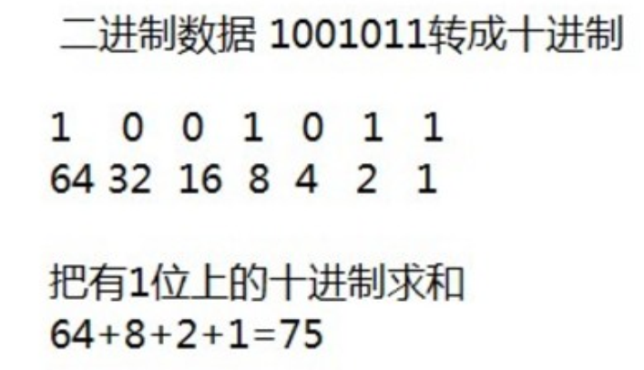
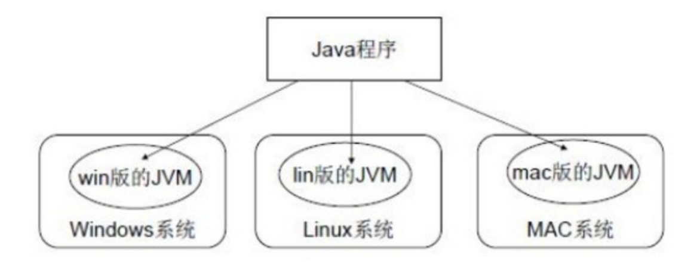
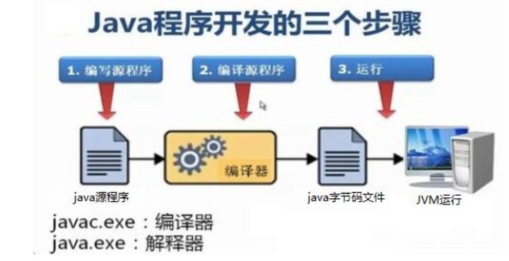

## 1、前言；

> Java语言是美国Sun公司（Stanford University Network），在1995年推出的高级的编程语言。所谓编程语言，是计算机的语言，人们可以使用编程语言对计算机下达命令，让计算机完成人们需要的功能。

###### Java语言发展历史;

- 1995年Sun公司发布Java1.0版本
- 1997年发布Java 1.1版本
- 1998年发布Java 1.2版本
- 2000年发布Java 1.3版本
- 2002年发布Java 1.4版本
- 2004年发布Java 1.5版本
- 2006年发布Java 1.6版本
- 2009年Oracle甲骨文公司收购Sun公司，并于2011发布Java 1.7版本
- 2014年发布Java 1.8版本
- 2017年发布Java 9.0版本

###### Java语言能做什么;

Java语言主要应用在互联网程序的开发领域。常见的互联网程序比如天猫、京东、物流系统、网银系统等，以及服务器后台处理大数据的存储、查询、数据挖掘等也有很多应用。

###### 计算机基础知识;

1. 二进制;

   计算机中的数据不同于人们生活中的数据，人们生活采用十进制数，而计算机中全部采用二进制数表示，它只包含
   0、1两个数，逢二进一。每一个0或者每一个1，叫做一个bit（比特）。

2. 十进制和二进制数据之间的转换计算;

   - 十进制数据转成二进制数据：使用除以2获取余数的方式;

     

   - 二进制数据转成十进制数据：使用8421编码的方式;

     

3. 字节:  是我们常见的计算机中最小存储单元。计算机存储任何的数据，都是以字节的形式存储，右键点击文件属性，
   我们可以查看文件的字节大小。

   - 8个bit（二进制位） 0000-0000表示为1个字节，写成1 byte或者1 B。
   - 8 bit = 1 B
   - 1024 B =1 KB
   - 1024 KB =1 MB
   - 1024 MB =1 GB
   - 1024 GB = 1 TB

4. 常用DOS命令:  DOS是一个早期的操作系统，现在已经被Windows系统取代，对于我们开发人员，目前需要在DOS中完成一些事情，因此就需要掌握一些必要的命令。

   1. 进入DOS操作窗口：按下Windows+R键盘，打开运行窗口，输入cmd回车，进入到DOS的操作窗口(常说的黑窗口)。

   2. 常用命令；

      | 命令             | 操作符号    |
      | ---------------- | ----------- |
      | 盘符切换命令     | c:          |
      | 查看当前文件夹   | dir         |
      | 进入文件夹命令   | cd filename |
      | 退出文件夹命令   | cd ..       |
      | 退出到磁盘根目录 | cd\         |
      | 清屏             | cls         |

   

## 2、Java语言开发环境搭建

### 2、1 Java虚拟机——JVM；

> JVM（Java Virtual Machine ）：Java虚拟机，简称JVM，是运行所有Java程序的假想计算机，是Java程序的运行环境，是Java 最具吸引力的特性之一。我们编写的Java代码，都运行在 JVM 之上。
> 跨平台：任何软件的运行，都必须要运行在操作系统之上，而我们用Java编写的软件可以运行在任何的操作系统上，这个特性称为Java语言的跨平台特性。该特性是由JVM实现的，我们编写的程序运行在JVM上，而JVM运行在操作系统上。



> 如图所示，Java的虚拟机本身不具备跨平台功能的，每个操作系统下都有不同版本的虚拟机.

### 2.2 JRE 和 JDK;

- JRE (Java Runtime Environment) ：是Java程序的运行时环境，包含 JVM 和运行时所需要的 核心类库 。

- JDK (Java Development Kit)：是Java程序开发工具包，包含 JRE 和开发人员使用的工具。

  > 如果运行一个已有的Java程序，那么只需安装 JRE 即可。
  > 如果开发一个全新的Java程序，那么必须安装 JDK 。
  >
  > JDK > JRE > JVM

- [下载：](https://www.oracle.com/java/technologies/java-readme.html)

### 2.4 JAVA_HOME环境变量的配置；

> 配置环境变量作用：开发Java程序需要使用JDK中提供的工具，工具在JDK9安装目录的 bin 目录下；在命令行下使用这些工具，就要先进入到JDK的bin目录下，这个过程就会非常的麻烦。不进入JDK的 bin 目录，这些工具就不能使用，会报错。为了开发方便，我们想在任意的目录下都可以使用JDK的开发工具，则必须要配置环境变量，配置环境变量的意义在于告诉操作系统，我们使用的JDK开发工具在哪个目录下。

**配置环境变量步骤**；

1. 计算机鼠标右键,选择 **属性**；
2. 选择 **高级系统设置**；
3. 高级选项卡，点击 **环境变量**；
4. 在系统环境变量中，点击**新建** ，创建新的环境变量；
5. 变量名输入 JAVA_HOME ，变量值输入JDK9的安装目录：D:\java9.04；
6. 选中 `Path` 环境变量， 双击 或者 点击**编辑**;
7. 在变量值的最前面，键入 %JAVA_HOME%\bin; 分号必须要写，必须是英文格式。
8. 环境变量配置完成，重新开启DOS命令行，在任意目录下输入 javac 命令，运行成功。

## 3、HelloWorld入门程序；

### 3、1 程序开发步骤说明；

> 开发环境已经搭建完毕，可以开发我们第一个Java程序了。Java程序开发三步骤：编写、编译、运行。



### 3、2 编写Java源程序；

1.  新建文本文件，文件名修改为 HelloWorld.java ，其中文件名为 `HelloWorld` ，后缀名必须为 `.java` 。

2. 用记事本打开,并键入以下代码；

  ```java
  public class HelloWorld {
  	public static void main(String[] args) {
  		System.out.println("Hello World!");
  	}
  }
  ```

  > 第一个 HelloWord 源程序就编写完成了，但是这个文件是程序员编写的，JVM是看不懂的，也就不能运行，因此我们必须将编写好的 Java源文件编译成JVM可以看懂的 字节码文件 。

### 3、3  编译Java源文件；

> 在cmd命令行中，进入Java源文件的目录，使用 javac 命令进行编译。

```bash
javac HelloWorld.java
```

编译成功后，命令行没有任何提示。打开目录，发现产生了一个新的文件 HelloWorld.class ，该文件就是编译后的文件，是Java的可运行文件，称为字节码文件，有了字节码文件，就可以运行程序了。

> Java源文件的编译工具是 javac.exe ，在JDK安装目录的bin目录下。但是由于配置了环境变量，可以再任意目录下使用。

### 3、4 运行Java程序；

> 在cmd命令行中，进入Java源文件的目录，使用 java 命令进行运行。

```bash
java HelloWorld # 注意不能写.class文件后缀
```

> Java程序 .class文件 的运行工具 java.exe ，在JDK安装目录的bin目录下。但是由于配置了环境变量，可以再任意目录下使用。

### 3、5 入门程序说明；

- 编译：是指将我们编写的Java源文件翻译成JVM认识的class文件，在这个过程中， javac 编译器会检查我们所写的程序是否有错误，有错误就会提示出来，如果没有错误就会编译成功。
- 运行：是指将 class文件，交给JVM去运行，此时JVM就会去执行我们编写的程序了。
- **main**方法：称为主方法。写法是**固定格式**不可以更改。main方法是程序的入口点或起始点，无论我们编写多
  少程序，JVM在运行的时候，都会从main方法这里开始执行。

### 3、6 添加注释comment；

- 注释：就是对代码的解释和说明。其目的是让人们能够更加轻松地了解代码。为代码添加注释，是十分必须
  要的，它不影响程序的编译和运行。
- Java中有单行注释和多行注释。
  - 单行注释以 `//` 开头，换行结束。
  - 多行注释以 /\*开头 以*/结束。

### 3、7 关键字keywords；

- 关键字：是指在程序中，Java已经定义好的单词，具有特殊含义。
  HelloWorld案例中，出现的关键字有 public 、 class 、 static 、 void 等，这些单词已经被Java定义好，全部都是小写字母。

### 3、8 标识符；

- 标识符：是指在程序中，我们自己定义内容。比如类的名字、方法的名字和变量的名字等等，都是标识符。
  HelloWorld案例中，出现的标识符有类名字 HelloWorld 。
- 命名规则： 硬性要求
  - 标识符可以包含 英文字母26个(区分大小写) 、 0-9数字 、 $（美元符号） 和 _（下划线） 。
  - 标识符不能以**数字**开头。
  - 标识符不能是**关键字**。
- 命名规范： 软性建议
  - 类名规范：首字母大写，后面每个单词首字母大写（大驼峰式）。
  - 方法名规范： 首字母小写，后面每个单词首字母大写（小驼峰式）。
  - 变量名规范：全部小写。

## 4、常量；

> 常量：是指在Java程序中固定不变的数据。

| 类型       | 含义                                   | 数据举例                    |
| ---------- | -------------------------------------- | --------------------------- |
| 整数常量   | 所有的整数                             | 0 ，1 ，567， -9            |
| 小数常量   | 所有的小数                             | 0.0， -0.1， 2.55           |
| 字符常量   | 单引号引起来,只能写一个字符,必须有内容 | 'a' ， ' '， '好'           |
| 字符串常量 | 双引号引起来,可以写多个字符,也可以不写 | "A" ，"Hello" ，"你好" ，"" |
| 布尔常量   | 只有两个值                             | true，false                 |
| 空常量     | 只有一个值                             | null                        |

## 5、变量和数据类型；

> 变量：常量是固定不变的数据，那么在程序中可以变化的量称为变量。
>
> Java中要求一个变量每次只能保存一个数据，必须要明确保存的**数据类型**。

### 5、1 数据类型；

- Java的数据类型分为两大类：

  - 基本数据类型：包括 整数 、 浮点数 、 字符 、 布尔 。
  - 引用数据类型：包括 类 、 数组 、 接口 。

- **基本数据类型**；

  | 数据类型     | 关键字         | 内存占用 | 取值范围               |
  | ------------ | -------------- | -------- | ---------------------- |
  | 字节型       | byte           | 1个字节  | -128~127               |
  | 短整型       | short          | 2个字节  | -32768~32767           |
  | 整型         | int（默认）    | 4个字节  | -231次方~2的31次方-1   |
  | 长整型       | long           | 8个字节  | -2的63次方~2的63次方-1 |
  | 单精度浮点数 | float           | 4个字节  | 1.4013E-45~3.4028E+38  |
  | 双精度浮点数 | double（默认） | 8个字节  | 1.4013E-45~3.4028E+38  |
  | 字符型       | char           | 2个字节  | 0-65535                |
  | 布尔类型     | boolean        | 1个字节  | true false             |

  > Java中的默认类型：整数类型是 int 、浮点类型是 double 。

### 5、2  变量的定义；

> 变量定义的格式包括三个要素： 数据类型 、 变量名 、 数据值 。

示例：

```java
public class Variable {
    public static void main(String[] args){
        //定义字节型变量
        byte b = 100;
        System.out.println(b);
        //定义短整型变量
        short s = 1000;
        System.out.println(s);
        //定义整型变量
        int i = 123456;
        System.out.println(i);
        //定义长整型变量
        long l = 12345678900L;
        System.out.println(l);
        //定义单精度浮点型变量
        float f = 5.5F;
        System.out.println(f);
        //定义双精度浮点型变量
        double d = 8.5;
        System.out.println(d);
        //定义布尔型变量
        boolean bool = false;
        System.out.println(bool);
        //定义字符型变量
        char c = 'A';
        System.out.println(c);
    }
}
```

> long类型：建议数据后加L表示。
>
> float类型：建议数据后加F表示。
>
> 变量名称：在同一个大括号范围内，变量的名字不可以相同。
>
> 变量赋值：定义的变量，不赋值不能使用。