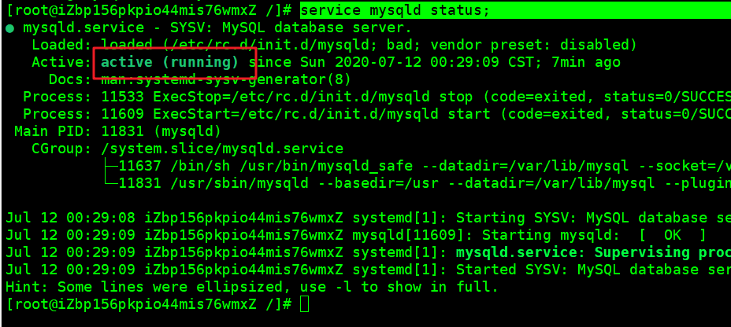

> Error: ER_NOT_SUPPORTED_AUTH_MODE: Client does not support authentication pr

- 错误原因；

  -  原因8.0mysql引入了caching_sha2_password模块作为默认身份验证插件，nodejs还没有跟进 

- 解决；

  -  ALTER USER 'root'@'localhost' IDENTIFIED WITH mysql_native_password BY '自己的密码'; 

- 启动mysql;

  ```bash
  service mysqld start;
  ```

  

- 关闭mysql

  ```bash
  service mysqld stop 
  ```

  

- 查看Mysql的运行状态；

  ```bash
service mysqld status;
  ```
  
  
  
  


