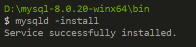
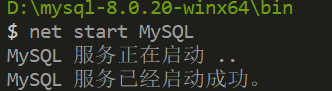
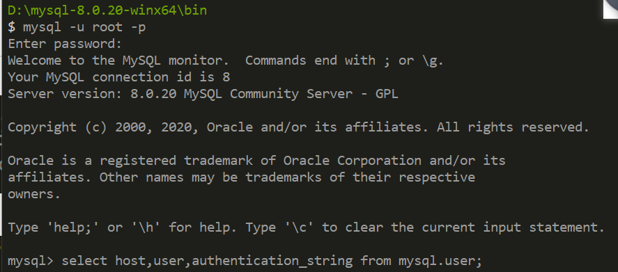
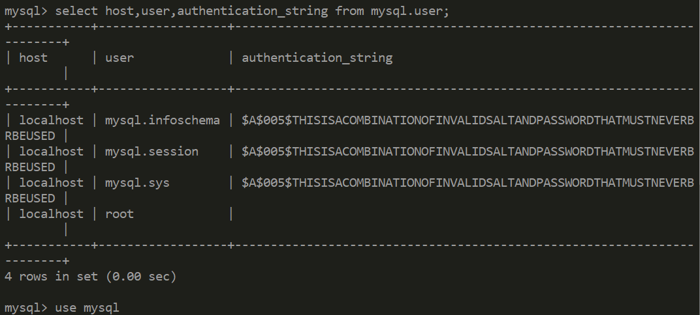
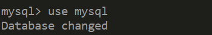
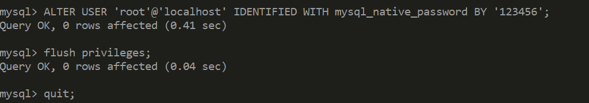
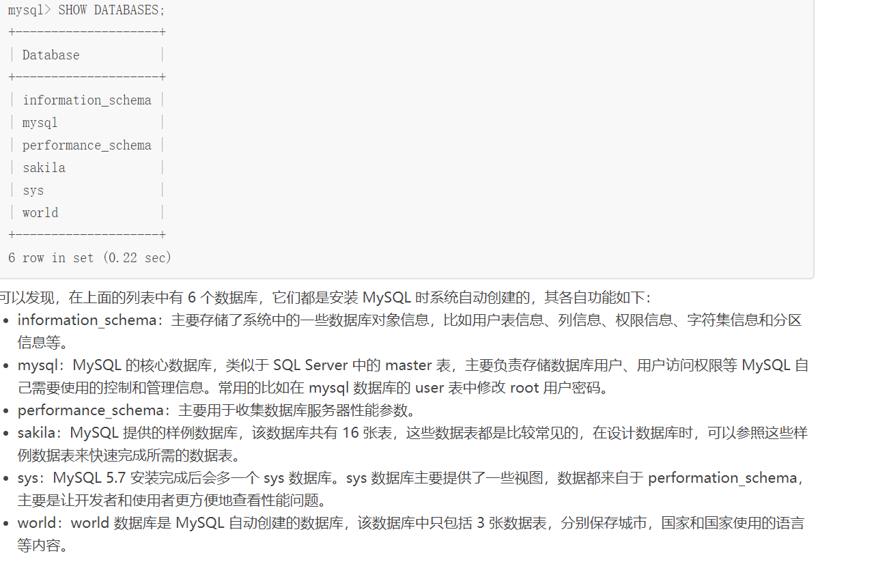

## 1；下载官网的安装包;

[mysql-8.0.20-winx64.zip]( https://dev.mysql.com/downloads/mysql/ )

- 直接解压不需要安装；

## 2、添加环境变量；


## 3、初始化` data `目录；

> 在 管理员身份下打开 cmd

```
mysqld --initialize-insecure --user=mysql  
```

- 在D:\mysql\mysql-8.0.12-winx64  目录下生成data目录;

## 4、安装`mysql`;



1. 启动；

   

## 5、登录`mysql`;

> 首次登录不用输入密码直接回车即可；



- 查询用户密码；
- 

- 设置用户密码；
- 

## 6、修改用户密码；



## 7、退出重新登录；




