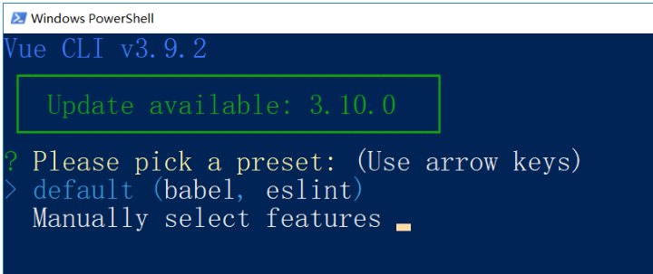
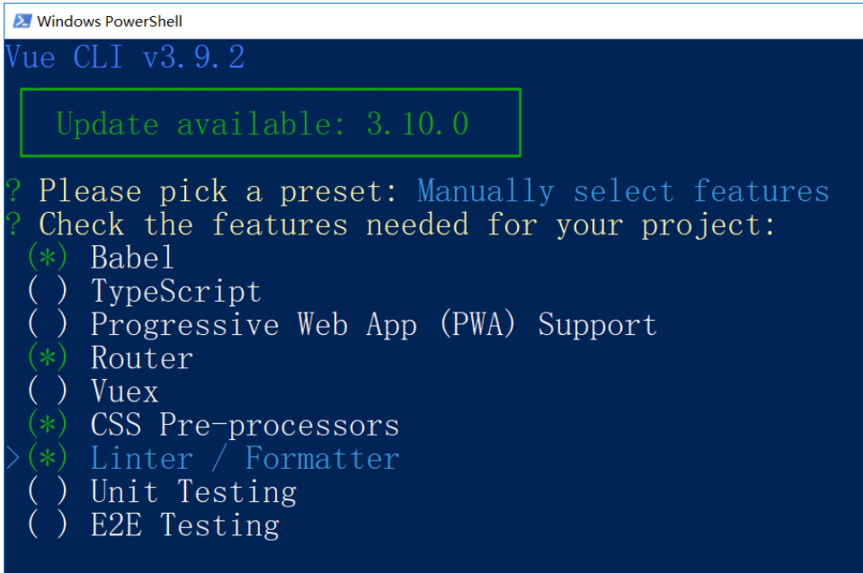
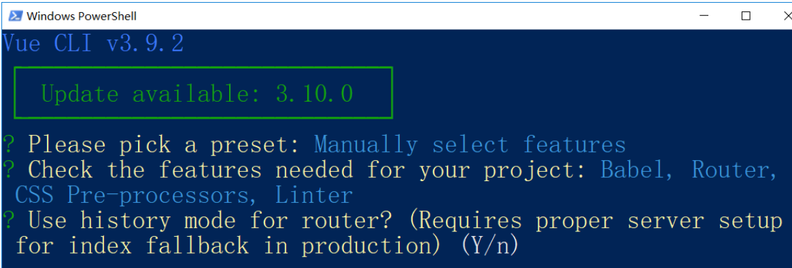
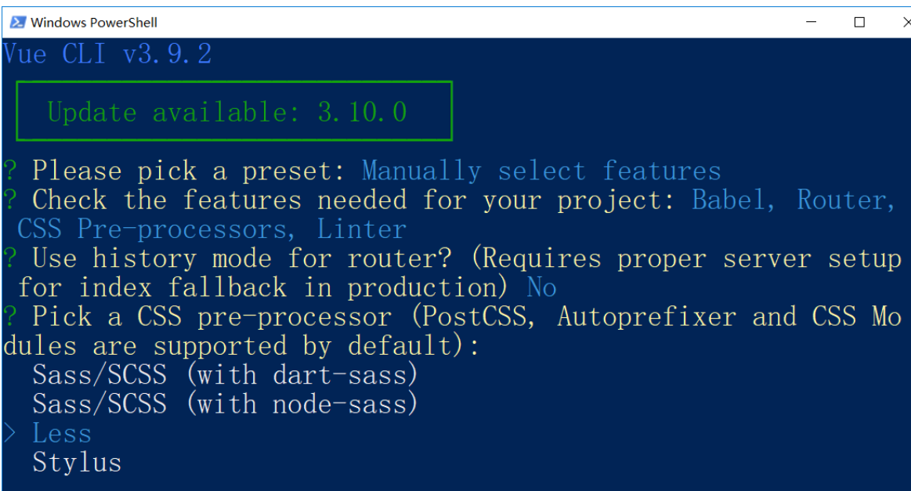
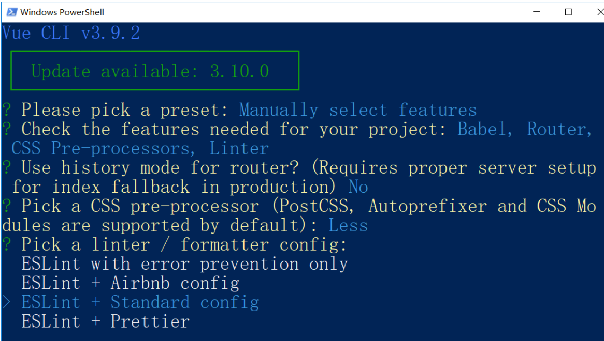
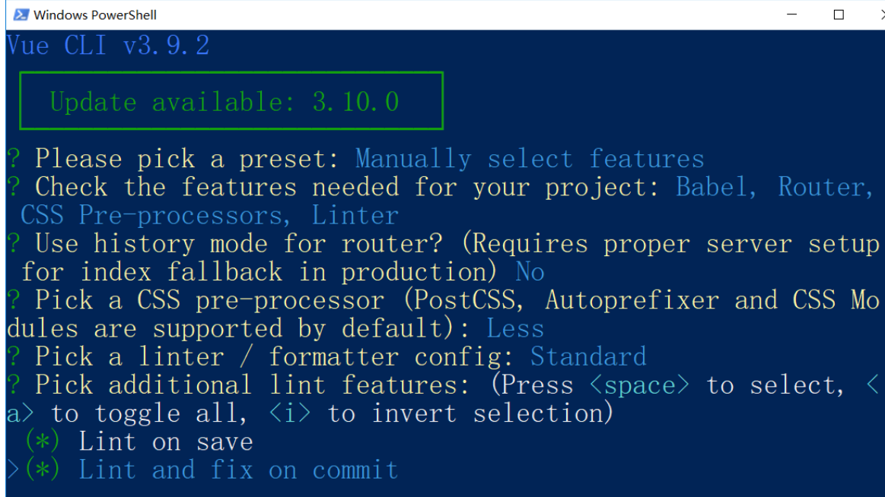
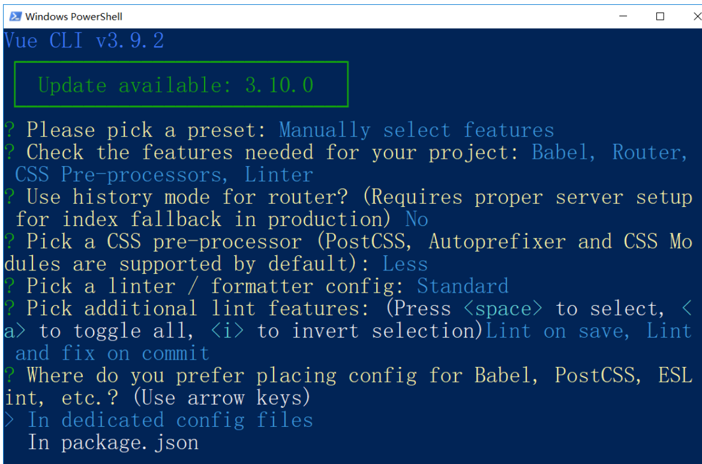
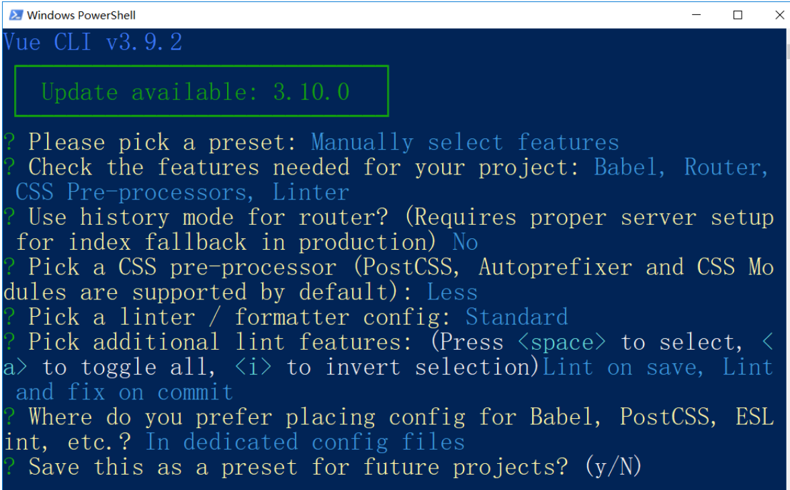
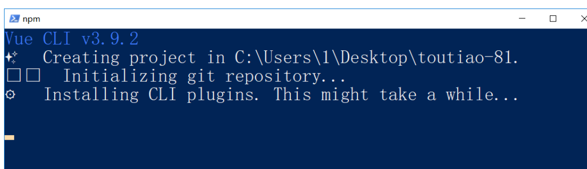

>* 介绍: **`vue-cli`**是一个**`辅助开发工具`**=> **`代码编译`** + **`样式`** + 语法校验 + 输出设置 + 其他 ...
>
>* 作用: 可以为开发者提供一个**`标准的项目开发结构`** 和配置 
>
>* vue-cli 一个**`命令行`**工具,最新版本也支持**`图形化`**操作,可快速搭建大型网页应用

## `vue-cli`安装

>vue-cli本质上是一个npm包,也需要通过npm去安装下载
>
>```bash 
>npm i -g @vue/cli  // 全局安装脚手架  默认安装的最新版本 4.0+
>```
>
>查看版本
>
>```bash
>vue -V  // 查看脚手架版本号
>or 
>vue --version // 和上面等价 
>```
>
>`注意`: 默认安装的4.0+ 版本,但是企业很多还在用2.0+版本 怎么破?
>
>执行以下命令就可以 2.0 和 3.0 /4.0兼得
>
>* **`2.0和3.0/4.0创建项目的命令是不一样的`**
>
>```bash
>npm install -g @vue/cli-init  // 安装桥接工具 将2.0的功能补齐到目前的脚手架上
>```
>
>**注意**: vue生成的模板有难有易 
>
>* 简单业务 => 简易模板 
>
>* 复杂业务 => 内容丰富模板
>

## `vue-cli2.0`创建项目

>创建项目: 采用` cli 2.0`的特性 (生成简易模板)
>
>```bash
>#  heroes 创建的项目名称
>$ vue  init webpack-simple heroes //  webpack-simple 为模板名称 固定写法
>
># 切换到当前目录
>$ cd  heroes 
>
># 安装依赖
>$ npm install  
>
># 在开发模式下 启动运行项目
>$ npm run dev
>```
>

### 项目目录解释

>**`目标`**对`2.0`项目目录生成的模板文件进行识别认识
>
>.bablelrc=>存放 babel编译的配置信息 () => es6 => es5 
>
>.editorconfig => 存放编辑器的配置信息
>
>.gitignore => git忽略文件
>
>index.html => 单页应用的html
>
>package.json => 用于存放依赖信息 及 其他项目信息
>
>README.md => 项目介绍信息 github上的页面信息
>
>webpack.config.js => wepack工具的配置文件 => webpack是一个前端工程化的工具  编译代码 -压缩代码- 处理代码,其他....
>
>webpack => 代码编译,打包 压缩
>
>build.js =>  不是人写的 => webpack 打包而来 => webpack中可以配置文件的**`入口`** ,可以配置文件的**`出口`**
>
>webpack 文件的出口 =>buildjs =>  配置信息  =>  webpack.config.js
>
>entry => 整个项目的入口文件=> main.js
>
>output => 整个项目的出口文件 => filename => build.js  =>  build.js 启动项目时  并不是物理文件,而是内存中一个文件流

## `VueCli4.0`配置项目

```bash
# 4.0/3.0下创建项目
$ vue create heroes   # create(创建) 为关键字

# 切换到当前目录
$ cd  heroes 

# 在开发模式下 启动运行项目
$ npm run serve
```

> **注意**: 
>
> 3.0 +创建项目时有两种模式, 一种**`默认模式`**, 一种选择模式,
>
> **默认模式**:一种标准的模板;
>
> **选择模式**:可以根据自己的需求选择需要的工具和模式;

### 个性化配置;

1. 初始化一个项目(4.0)

   ```
   $ vue create toutiao-81 
   ```

2. 选择模式：简易(默认)或个性化；
   

3. 选择个性化进入下一步；
   

   使用键盘上下箭头进行移动，使用空格切换选中与否。

   `Babel`：将 ECMAScript  6 转 ECMAScript 5用的一个工具

   `Router`：Vue Router 路由

   `CSS Pre-processors`：CSS预处理器（SASS、Less、Stylus。。。。）

   `Linter / Formatter`：代码校验和格式化

4. 勾选好以后，回车进入下一步。
   

   选择路由模式

   路由路径有两种模式：

   - hash锚点模式：`http://协议:端口号/path路径/#/路由路径`
     - 简单，兼容好
   - history模式：`http://协议:端口号/路由路径`
     - url简洁
     - 兼容差，需要额外的服务器配置

5. 输入 `n` ,使用默认的路由模式。 回车进入下一步。
   

   选择 CSS 预处理器

6. 使用 Less 预处理器。回车下一步；
   

   选择代码格式校验风格；

7. 这里我们选择 `ESLint + Standard config` 模式。进入下一步；
   

   选择代码格式校验方式

   `Lint on save`：每当代码文件保存的时候进行格式校验。

   `Lint and fix on commit`：当执行 git commit 代码提交的时候进行校验和尝试自动修复校验失败的语法格式，如果校验失败并且自动修复也失败，就无法完成代码提交。你需要手动解决了代码格式问题然后重新提交，这样就确保版本历史中的代码一定没有代码格式问题。

8. 选择完毕进入下一步；
   

   VueCLI 会在项目中生成一些工具的配置文件。配置文件可以存储在两个地方：

   `In dedicated config files`：生成独立的配置文件，推荐，维护方便

   `In package.json` 混到 package.json 文件中，不推荐，维护麻烦

   这里我们选择第1种，将这些工具的配置文件保存到独立的配置文件中，方便查看和修改。

9. 选择完毕进入下一步；
   

   你可以把你刚才那些选择配置项保存为一个模板，下次使用 `vue create` 创建项目的时候它会提示你是否可以使用这个选择模板直接创建你的项目。

   如果你需要，就输入 `y`，然后它会让你给这个模板起个名字，下次就可以直接使用；

   如果不需要，就输入 `n`，继续下一步。

   这里我们不需要，输入 `n` 继续下一步。

10. 进入下一步；开始安装；
    

### 项目目录介绍

```
│  .browserslistrc 该文件会被 Babel 和 Autoprefix 用来根据浏览器的版本确定需要转译的 JavaScript 特性和 CSS 浏览器前缀
│  .editorconfig 编辑器配置文件，编辑器会根据该文件选择编辑格式
│  .eslintrc.js ESLint配置文件
│  .gitignore Git忽略配置文件
│  babel.config.js Babel转码工具配置文件
│  package-lock.json 包管理工具的锁定文件
│  package.json	包说明文件
│  postcss.config.js	postcss配置文件
│  README.md 说明文档
│  
├─node_modules 第三方包
├─public 公共资源目录
│      favicon.ico
│      index.html
│      
└─src 源码目录
    │  App.vue 根组件
    │  main.js 入口模块
    │  router.js 路由模块
    │  
    ├─assets 静态资源目录
    │      logo.png
    │      
    ├─components 非路由组件目录
    │      HelloWorld.vue
    │      
    └─views 路由组件目录
            About.vue
            Home.vue
```

