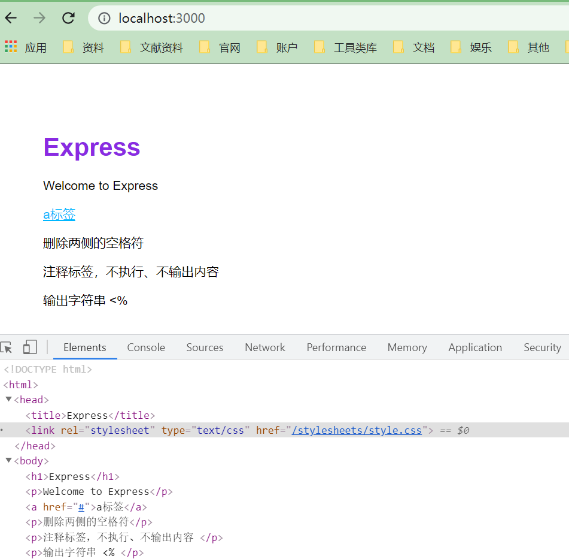
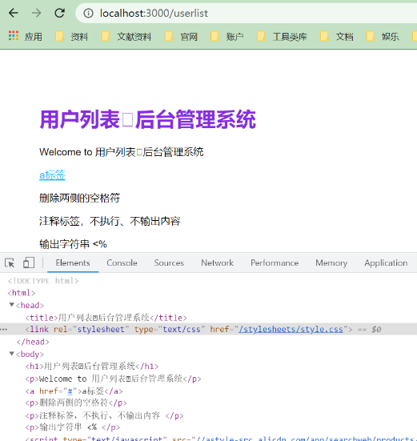

> 模板引擎（Template Engine）是一个从页面模板根据一定的规则生成 HTML 的工具。  功能是将页面模板和要显示的数据结合起来生成 HTML 页面。它既可以运行在服务器端又可以运行在客户端，大多数时候它都在服务器端直接被解析为 HTML，解析
> 完成后再传输给客户端，因此客户端甚至无法判断页面是否是模板引擎生成的 。

## 使用模板引擎  

> 基于 JavaScript 的模板引擎有许多种实现，我们推荐使用 ejs （Embedded JavaScript），因为它十分简单，而且与 Express 集成良好。由于它是标准 JavaScript 实现的，因此它不仅可以运行在服务器端，还可以运行在浏览器中。

**在`app.js`中使用模板引擎：**

```javascript
app.set('views', path.join(__dirname, 'views'));
app.set('view engine', 'ejs');
```

> 以上内容表明要使用的模板引擎是 ejs，页面模板在 views 子目录下。在 routes/index.js 的`router.get`函数中通过如下语句调用模板引擎：  

```javascript
res.render('index', { title: 'Express' });
```

> `res.render` 的功能是调用模板引擎，并将其产生的页面直接返回给客户端。它接受两个参数，第一个是模板的名称，即 views 目录下的模板文件名，不包含文件的扩展名；第二个参数是传递给模板的数据，用于模板翻译。`index.ejs`内容如下：  

```ejs
<!DOCTYPE html>
<html>
  <head>
    <title><%= title %></title>
    <link rel='stylesheet' href='/stylesheets/style.css' />
  </head>
  <body>
    <h1><%= title %></h1>
    <p>Welcome to <%= title %></p>
  </body>
</html>
```

> 上面代码其中有两处 <%= title %>，用于模板变量显示，它们在模板翻译时会被替换成 Express，因为 `res.render` 传递了 `{ title: 'Express' }`。  

**ejs 的标签系统非常简单，它只有以下3种标签。**  

- `<% code %>`： JavaScript 代码。
- `<%= code %>`：显示替换过 HTML 特殊字符的内容。
- `<%- code %>`：显示原始 HTML 内容。  
- `<%# code %>`：注释标签，不执行、不输出内容。
- `<%% `：输出字符串 '<%'

## 页面布局  

> 如果你也在看《nodejs 开发指南》那么你也会遇到我这个问题，《nodejs 开发指南》的作者使用的是`express@2.5.8`，而`layout.js`布局文件在`express@3.0`中就已经被移除[官方文档](https://github.com/expressjs/express/wiki/Migrating-from-2.x-to-3.x)，所以在4.x中就不存在layout.js文件了。那么我们要怎么布局呢？这里我推荐`express-ejs-layouts`或`nunjucks`;

**为什么要使用布局模板：**

- 描述了整个页面的框架结构，每个单独的页面都继承自这个框架，替换掉 <%- body %> 部分；
- 保持整个网站的一致风格， HTML 页面的<head>部分以及页眉页脚中的大量内容是重复的，因此我们可以把它们放在 layout.ejs 中；

**这里我使用`express-ejs-layouts`**

- 下载：

  ```bash
  npm install express-ejs-layouts
  ```

- 使用：

  ```javascript
  ...
  + var expressLayouts = require('express-ejs-layouts');
  
  app.set('views', path.join(__dirname, 'views'));
  app.set('view engine', 'ejs');
  + app.use(expressLayouts);
  ```

- 新建`layout.ejs`文件，内容如下：

  ```ejs
  <!DOCTYPE html>
  <html>
  <head>
      <title><%= title %></title>
      <link rel="stylesheet" type="text/css" href="/stylesheets/style.css">
  </head>
  <body>
      <%- body %>
  </body>
  </html>
  ```

- `index.ejs`文件修改为：

  ```ejs
  <h1><%= title %></h1>
  <p>Welcome to <%= title %></p>
  <a href="#">a标签</a>
  <p>删除两侧的空格符 <%_ title _%></p>
  <p>注释标签，不执行、不输出内容 <%# title %></p>
  <p>输出字符串 <%% </p>
  ```

- 启动服务，并访问 http://localhost:3000/

  

  > 由上图我们可以看到h1标签的字体颜色发生了改变，说明我们使用成功；

另一种情况是，一个网站可能需要不止一种页面布局，例如网站分前台展示和后台管理系统，两者的页面结构有很大的区别，一套页面布局不能满足需求。这时我们可以在页面模板翻译时指定页面布局，即设置 layout 属性，例如：  

```javascript
router.get('/', function(req, res, next) {
    res.render('index', { 
        title: '用户列表后台管理系统',
        layout: 'userlist'
     });
});
```

- 新建`routes/userlist.js`文件，内容如下：

  ```javascript
  var express = require('express');
  var router = express.Router();
  
  router.get('/', function(req, res, next) {
      res.render('index', { 
          title: '用户列表后台管理系统',
          layout: 'userlist'
       });
  });
  
  module.exports = router;
  ```

- 新建`views/userlist.ejs`文件，内容如下：

  ```ejs
  <!DOCTYPE html>
  <html>
  <head>
      <title><%= title %></title>
      <link rel="stylesheet" type="text/css" href="/stylesheets/style.css">
  </head>
  <body>
      <%- body %>
  </body>
  </html>
  ```

- 修改`app.js`添加如下代码:

  ```javascript
  var userlistRouter = require('./routes/userlist');
  app.use('/userlist', userlistRouter);
  ```

- 重启服务，浏览器访问：http://localhost:3000/userlist

  

  > 上述代码会在翻译 userlist 页面模板时套用 userlist.ejs 作为页面布局 ;

