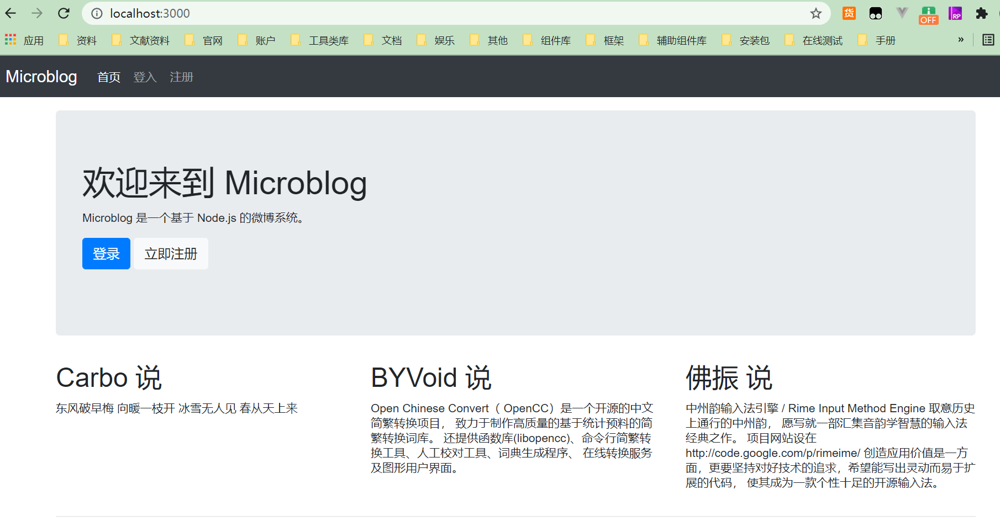

> 这里主要是对前面的知识的简单实践，现在让我们动手开始创建一个微博网站吧。项目使用的是`express@4.16.1`。

## 功能分析

> 开发中的一个大忌就是没有想清楚要做什么就开始动手，因此我们准备在动手实践之前先规划一下网站的功能。首先，微博应该以用户为中心，因此需要有用户的注册和登录功能。微博网站最核心的功能是信息的发表，这个功能涉及许多方面，包括数据库访问、前端显示等。一个完整的微博系统应该支持信息的评论、转发、圈点用户等功能，但出于学习目的，我们不能一一实现所有功能，只是实现一个微博社交网站的雏形 ；

## 路由规划

> 在完成功能设计以后，下一个要做的事情就是路由规划了。路由规划，或者说控制器规划是整个网站的骨架部分，因为它处于整个架构的枢纽位置，相当于各个接口之间的粘合剂，所以应该优先考虑。  

**根据功能设计，我们把路由按照以下方案规划。**

- /：首页
- /u/[user]：用户的主页
- /post：发表信息
- /reg：用户注册
- /login：用户登录
- /logout：用户登出

**打开 routes/index.js，部分修改为：**  

```javascript
/* GET home page. */
router.get('/', function(req, res, next) {
  res.render('index', { title: '晚上好' });
});

router.get('/u/:user', function(req, res, next) {
  res.end('开始1')
});

router.post('/post', function(req, res, next) {
  res.end('开始2')
});

router.get('/reg', function(req, res, next) {
  res.set('Content-Type', 'text/plain')
  res.send('开始3')
});

router.post('/reg', function(req, res, next) {
  res.end('开始4')
});

router.get('/login', function(req, res, next) {
  res.end('开始5')
});

router.post('/login', function(req, res, next) {
  res.end('开始6')
});

router.get('/logout', function(req, res, next) {
  res.end('开始7')
});
```

其中 /post、 /login 和 /reg 由于要接受表单信息，因此使用 app.post 注册路由。 /login和 /reg 还要显示用户注册时要填写的表单，所以要以 app.get 注册。 

## 界面设计

> 开发网站的时候必须时刻意识到网站是为用户开发的，因而用户界面是非常重要的。TwitterBootstrap 是由 Twitter 的设计师和工程师发起的开源项目，它提供了一套与 Twitter 风格一致的简洁、优雅的 Web UI，包含了完全由 HTML、 CSS、 JavaScript 实现的用户交互工具。可以让你轻松地使用Twitter Bootstrap 制作出优美的界面。

## 使用 Bootstrap

> 现在我们就用 Bootstrap 开始设计我们的界面。从https://v4.bootcss.com/下载bootstrap.zip，解压后可以看到以下文件：  

```bash
PS C:\Users\wangy\Desktop\bootstrap-4.6.0-dist> treee
bootstrap-4.6.0-dist
├── css
│   ├── bootstrap-grid.css
│   ├── bootstrap-grid.css.map
│   ├── bootstrap-grid.min.css
│   ├── bootstrap-grid.min.css.map
│   ├── bootstrap-reboot.css
│   ├── bootstrap-reboot.css.map
│   ├── bootstrap-reboot.min.css
│   ├── bootstrap-reboot.min.css.map
│   ├── bootstrap.css
│   ├── bootstrap.css.map
│   ├── bootstrap.min.css
│   └── bootstrap.min.css.map
└── js
    ├── bootstrap.bundle.js
    ├── bootstrap.bundle.js.map
    ├── bootstrap.bundle.min.js
    ├── bootstrap.bundle.min.js.map
    ├── bootstrap.js
    ├── bootstrap.js.map
    ├── bootstrap.min.js
    └── bootstrap.min.js.map
```

> 其中所有的 JavaScript 和 CSS 文件都提供了开发版和产品版，前者是原始的代码，后者经过压缩，文件名中带有 min。将 bootstrap.css复制到 public/stylesheets 中，将 bootstrap.js 复制到 public/javascripts 目录中，然后从http://jquery.com/下载一份最新版的 jquery.js 也放入 public/javascripts 目录中。接下来，修改 views/layout.ejs：  

```ejs
<!DOCTYPE html>
<html lang="en">
<head>
    <meta charset="UTF-8">
    <meta http-equiv="X-UA-Compatible" content="IE=edge">
    <link rel="stylesheet" type="text/css" href="stylesheets/bootstrap.min.css">
    <link rel="stylesheet" type="text/css" href="stylesheets/style.css">
</head>

<body>
    <div class="navbar fixed-top navbar-expand-lg navbar-dark bg-dark">
        <a class="navbar-brand" href="/">Microblog</a>
        <div class="collapse navbar-collapse">
            <ul class="navbar-nav">
                <li class="nav-item active">
                    <a class="nav-link" href="/">首页</a>
                </li>
                <li class="nav-item">
                    <a class="nav-link" href="/login">登入</a>
                </li>
                <li class="nav-item">
                    <a class="nav-link" href="/reg">注册</a>
                </li>
            </ul>
        </div>
    </div>
    <div class="container">
        <%- body %>
        <hr />
        <footer>
            <p><a href="http://www.byvoid.com/" target="_blank">BYVoid</a> 2012</p>
        </footer>
    </div>
</body>
<script src="javascripts/jquery-3.6.0.min.js"></script>
<script src="javascripts/bootstrap.min.js"></script>
</html>
```

> 上面代码是使用 Bootstrap部件实现的一个简单页面框架，整个页面分为顶部工具栏、正文和页脚三部分，其中正文和页脚包含在名为 container 的 div 标签中。最后我们设计首页，修改 views/index.ejs：  

```ejs
<div class="jumbotron bd-example">
    <h1>欢迎来到 Microblog</h1>
    <p>Microblog 是一个基于 Node.js 的微博系统。 </p>
    <p>
        <button type="button" class="btn btn-primary" href="/login">登录</button >
        <button type="button" class="btn btn-light" href="/reg">立即注册</button >
    </p>
</div>
<div class="row">
    <div class="col-4">
        <h2>Carbo 说</h2>
        <p>东风破早梅 向暖一枝开 冰雪无人见 春从天上来</p>
    </div>
    <div class="col-4">
        <h2>BYVoid 说</h2>
        <p>
            Open Chinese Convert（ OpenCC）是一个开源的中文简繁转换项目，
            致力于制作高质量的基于统计预料的简繁转换词库。
            还提供函数库(libopencc)、命令行简繁转换工具、人工校对工具、词典生成程序、
            在线转换服务及图形用户界面。 </p>
    </div>
    <div class="col-4">
        <h2>佛振 说</h2>
        <p>中州韵输入法引擎 / Rime Input Method Engine 取意历史上通行的中州韵，
            愿写就一部汇集音韵学智慧的输入法经典之作。
            项目网站设在 http://code.google.com/p/rimeime/
            创造应用价值是一方面，更要坚持对好技术的追求，希望能写出灵动而易于扩展的代码，
            使其成为一款个性十足的开源输入法。 </p>
    </div>
</div>
```

> 到此为止，简单的UI界面设计完毕！



::: tip

nodejs开发指南的作者使用的是bootstrap@2.x版本的，而我这里的演示是4.6版本的，版本的升级也就意味着功能的变动，不过这里主要是类名的变动，稍微改动下就可以了。

:::
