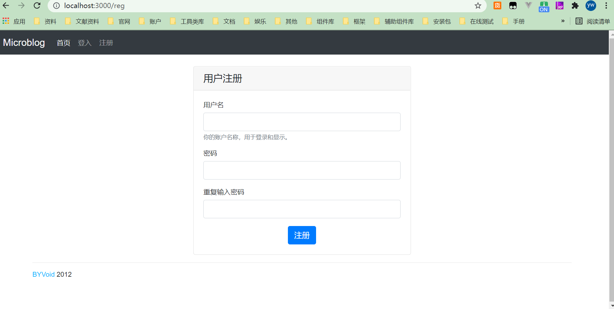
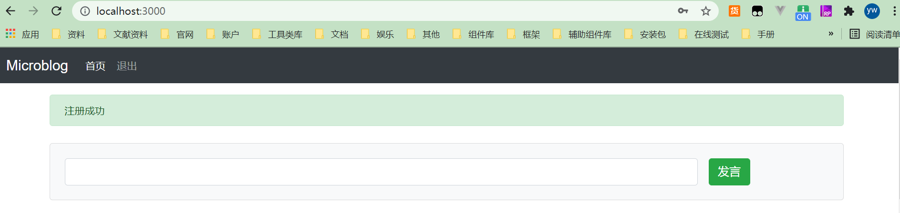
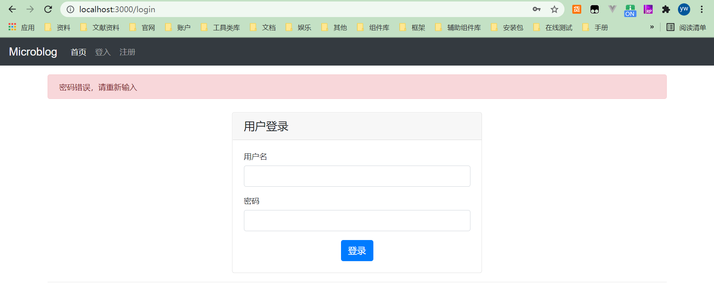
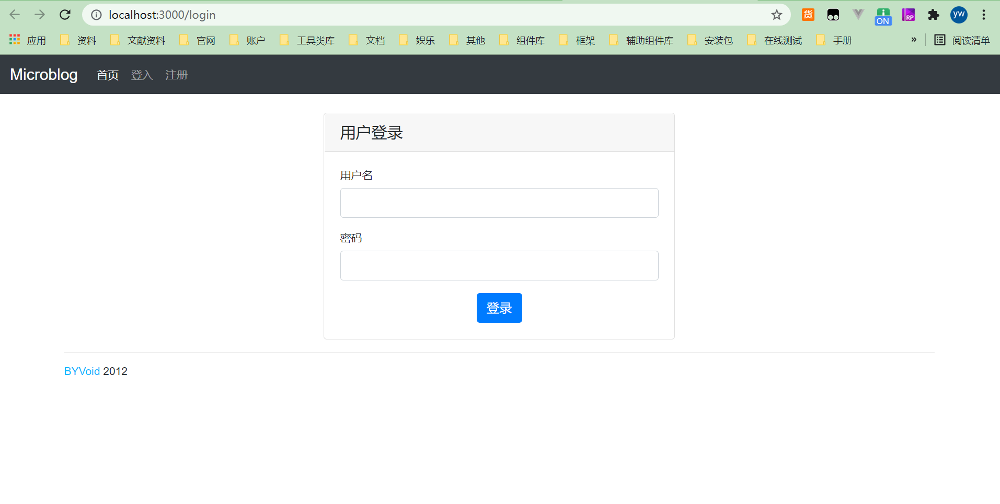

> 这一节我们要实现用户会话的功能，包括用户注册和登录状态的维护。为了实现这些功能，我们需要引入会话机制来记录
> 用户状态，还要访问数据库来保存和读取用户信息。  

## 访问数据库

> 我们选用 MongoDB 作为网站的数据库系统，它是一个开源的 NoSQL 数据库，相比MySQL 那样的关系型数据库，它更为轻巧、灵活，非常适合在数据规模很大、事务性不强的场合下使用。  

### NoSQL

> NoSQL 是 1998 年被提出的，它曾经是一个轻量、开源、不提供SQL功能的关系数据库。但现在 NoSQL 被认为是 Not Only SQL 的简称，主要指非关系型、分布式、不提供 ACID的数据库系统。  

### MongoDB

> MongoDB 是一个对象数据库，它没有表、行等概念，也没有固定的模式和结构，所有的数据以文档的形式存储。所谓文档就是一个关联数组式的对象，它的内部由属性组成，一个属性对应的值可能是一个数、字符串、日期、数组，甚至是一个嵌套的文档。下面是一个MongoDB 文档的示例：

```json
{ 
    "_id" : ObjectId( "4f7fe8432b4a1077a7c551e8" ),
    "uid" : 2004,
    "username" : "byvoid",
    "net9" : { "nickname" : "BYVoid",
    "surname" : "Kuo",
    "givenname" : "Carbo",
    "fullname" : "Carbo Kuo",
    "emails" : [ "byvoid@byvoid.com", "byvoid.kcp@gmail.com" ],
    "website" : "http://www.byvoid.com",
    "address" : "Zijing 2#, Tsinghua University" }
}
```

> 上面文档中 uid 是一个整数属性， username 是字符串属性， _id 是文档对象的标识符，格式为特定的 ObjectId。 net9 是一个嵌套的文档，其内部结构与一般文档无异。  

::: tip

MongoDB 的数据格式就是 JSON，准确地说， MongoDB 的数据格式是 BSON （Binary JSON），它是 JSON 的一个扩展。  

:::

### 连接数据库

> 首先确保已在本地安装好了 MongoDB，如果没有，请去https://www.runoob.com/mongodb/mongodb-window-install.html查看如何安装。  

在项目中安装mongodb包

```bash
npm install mongodb
```

```json
{
  "name": "qwer",
  "version": "0.0.0",
  "private": true,
  "scripts": {
    "start": "SET DEBUG=qwer:* && nodemon ./bin/www"
  },
  "dependencies": {
    "cookie-parser": "~1.4.4",
    "debug": "~2.6.9",
    "ejs": "~2.6.1",
    "express": "~4.16.1",
    "express-ejs-layouts": "^2.5.1",
    "http-errors": "~1.6.3",
    "mongodb": "^4.0.0",
    "morgan": "~1.9.1"
  }
}
```

**项目根目录下新建`config.js`文件：**

```javascript
module.exports = {
    cookieSecret: 'microblogbyvoid',
    db: 'microblog',
};
```

> db 是数据库的名称。 cookieSecret 用于 Cookie 加密与数据库无关，我们留作后用。  

**项目根目录中创建`models/db.js`，并添加以下内容：

```javascript
const MongoClient = require("mongodb").MongoClient;
const config = require('../config');
const url = `mongodb://localhost:27017`;

module.exports = {
    db: null,
    open() {
        if (this.db) {
            return Promise.resolve(this.db);
        }
        return new Promise(function (resolve, reject) {
            MongoClient.connect(url, (err, client) => {
                if (err) {
                    return reject(new Error(err));
                }
                this.db = client.db(config.db);
                console.log('连接数据库 microblog 成功')
                resolve(this.db);
            })
        })
    },
    close() {
        if (this.db) {
            this.db.close();
        }
    }
}
```

> 创建并到处数据库连接;

## 会话支持

> 后面会用到会话中间件，默认情况下是把用户信息存储在内存中，但我们既然已经有了 MongoDB，不妨把会话信息存储在数据库中，便于持久维护。  

**下载：`connect-mongo`**

```bash
npm install connect-mongo express-session
```

使用：

```javascript
const session = require('express-session');
const MongoStore = require('connect-mongo');
app.use(express.session({
  secret: config.cookieSecret,
  store: MongoStore.create({
    db: config.db
  })
}))
```

>  使用`express-session` 会话支持，设置它的 store 参数为 MongoStore 实例，把会话信息存储到数据库中，以避免丢失  

### 注册和登入  

> 准备好了数据库访问和会话存储的相关信息，接下来开始实现网站的第一个功能，用户注册和登入。  

#### 注册页面

首先来设计用户注册页面的表单，创建 `views/reg.ejs` 文件，内容是：  

```ejs
<div class="d-flex justify-content-center mt-4">
    <div class="card" style="width: 28rem;">
        <div class="card-header h5">   
            用户注册
        </div>
        <div class="card-body">
            <form method="post">
                <div class="form-group">
                    <label for="username">用户名</label>
                    <input type="text" class="form-control" name="username">
                    <small class="form-text text-muted">你的账户名称，用于登录和显示。</small>
                </div>
                <div class="form-group">
                    <label for="password">密码</label>
                    <input type="password" class="form-control" name="password">
                </div>
                <div class="form-group">
                    <label for="password">重复输入密码</label>
                    <input type="password" class="form-control" name="passwordRepeat">
                </div>
                <div class="d-flex justify-content-center">
                    <button type="submit" class="btn btn-primary">注册</button>
                </div>
            </form>
        </div>
    </div>
</div>
```

**修改`routes/index.js`，添加以下内容：**  

```javascript
// 注册
router.get('/reg', (req, res) => {
  res.render('reg', {
    title: '用户注册'
  });
});
```

#### 浏览器访问




### 注册响应

在 `routes/index.js` 中添加 `/reg `的 `POST` 响应函数：  

```javascript
router.post('/reg', (req, res) => {
  const { passwordRepeat, password, username } = req.body;
  if (!username.trim()) {
    req.flash('error', '请输入用户名');
    return res.redirect('/reg');
  }
  //检验用户两次输入的密码是否一致
  if (passwordRepeat !== password) {
    req.flash('error', '两次输入的密码不一致');
    return res.redirect('/reg');
  }
  const newUser = new User({
    name: username,
    password,
  });

  //检查用户名是否已经存在
  User.find({ name: newUser.name }).then(result => {
    // 用户不存在则注册
    if (!result) {
      newUser.save().then(() => {
        req.session.user = newUser;
        req.flash('success', '注册成功');
        res.redirect('/');
      });
    } else {
      req.flash('error', 'Username already exists.');
      res.redirect('/reg');
    }
  }).catch((err) => {
    req.flash('error', err);
    res.redirect('/reg');
  });
});
```

> 1. req.body：POST 请求信息解析过后的对象（请求体）；
> 2. req.flash：由`connect-flash`提供的存储消息的会话的特殊区域，通过它保存的变量只会在用户当前
>    和下一次的请求中被访问，之后会被清除，通过它我们可以很方便地实现页面的通知
>    和错误信息显示功能。  
> 3. res.redirect：重定向功能，通知浏览器转向相应页面。  
> 4. User：我们设计的用户对象，在后面会详细介绍，这里先假设它的接口都是可用的，使用前需要通过 const User = require('../models/user.js') 引用。  
> 5. User.get：通过用户名获取已知用户；
> 6. req.session.user = newUser ：向会话对象写入了当前用户的信息，通过它判断用户是否已经登录。  

::: tip

4.x版本不在原生支持`req.flash()`，你需要自己安装`connect-flash`，并在`app.js`中引用；

```javascript
const flash = require('connect-flash');
app.use(flash());
```

:::

## 用户模型

> 与视图和控制器不同，模型是真正与数据打交道的工具，没有模型，网站就只是一个外壳，不能发挥真实的作用，因此它是框架中最根本的部分。  前面的User 是一个描述数据的对象，即 MVC架构中的模型。

在 models 目录中创建 user.js 的文件，内容如下：  

```javascript
const crypto = require('crypto');
const mongodb = require('./db');

class User {
    constructor(user) {
        let pw = crypto.createHash("md5").update(user.password).digest('hex');
        this.name = user.name;
        this.password = pw;
    }

    // 注册用户
    save() {
        return new Promise((resolve) => {
            const _user = {
                name: this.name,
                password: this.password
            };
            mongodb.open().then(db => {
                // 读取 users 集合
                const userCollection = db.collection('users');
                userCollection.insertOne(_user, (err, result) => {
                    if (err) throw new Error(err);
                    console.log('保存用户成功：' + JSON.stringify(_user));
                    mongodb.close();
                    resolve(result)
                })
            })
        })
    }

    // 查找用户
    static find(name) {
        return new Promise((resolve) => {
            mongodb.open().then(db => {
                const userCollection = db.collection('users');
                userCollection.findOne(name,(err, result) => {
                    if (err) throw new Error(err);
                    console.log('找到用户：' + JSON.stringify(result));
                    mongodb.close();
                    resolve(result);
                })
            })
        })
    }
}

module.exports = User;
```

> 以上代码实现了两个接口，save 和 get， 前者是对象实例的方法，用于将用户对象的数据保存到数据库中，后者是对象静态函数的方法，用于从数据库中查找指定的用户。  

::: tip

crypto：Node.js 的一个核心模块，功能是加密并生成各种散列。

:::

## 视图交互

> 为了实现不同登录状态下页面呈现不同内容的功能，我们需要创建动态视图助手，通过它我们才能在视图中访问会话中的用户数据。同时为了显示错误和成功的信息，也要在动态视图助手中增加响应的函数。  

打开 app.js，添加以下代码：  

```javascript
app.use((req, res, next) => {
  res.locals.user = req.session.user;
  console.log(res.locals.user, '中间件');
  let err = req.flash('error');
  let succ = req.flash('success');
  !err.length && (err = null)
  !succ.length && (succ = null)
  res.locals.error = err;
  res.locals.success = succ;
  next();
})
```

修改 layout.ejs中的导航栏部分：  

```html
<ul class="navbar-nav">
    <li class="nav-item active">
        <a class="nav-link" href="/">首页</a>
    </li>
    <% if (!user) { %>
    <li class="nav-item">
        <a class="nav-link" href="/login">登入</a>
    </li>
    <li class="nav-item">
        <a class="nav-link" href="/reg">注册</a>
    </li>
    <% } else { %>
    <li class="nav-item">
        <a class="nav-link" href="/logout">退出</a>
    </li>
    <% } %>
</ul>
```

上面功能是为已登入用户和未登入用户显示不同的信息。在 container 中，<%- body %>之前加入：  

```html
<% if (success) { %>
    <div class="alert alert-success mt-3">
        <%= success %>
    </div>
<% } %>
<% if (error) { %>
    <div class="alert alert-danger mt-3">
        <%= error %>
    </div>
<% } %>
```

> 它的主要功能是页面通知。  如下图所示：





## 登入和退出

> 完成用户注册的功能以后，这里就需要实现用户登入和登出了。把下面的代码加到 routes/index.js 中：  

```javascript
// 登录
router.get('/login', (req, res) => {
  res.render('login', {
    title: '用户登入',
  });
});
router.post('/login', (req, res) => {
  const { username, password } = req.body;
  if (!username.trim()) {
    req.session.user = null;
    req.flash('error', '请输入用户名');
    return res.redirect('/login');
  }
  //生成口令的散列值
  const md5 = crypto.createHash('md5');
  const passwordMd5 = md5.update(password).digest('hex');
  User.find({ name: username }).then((result) => {
    if (!result) {
      req.flash('error', '用户不存在');
      return res.redirect('/login');
    } else {
      if (result.password !== passwordMd5) {
        req.flash('error', '密码错误，请重新输入');
        return res.redirect('/login');
      }
      req.session.user = result;
      req.flash('success', '登入成功');
      res.redirect('/');
    }
  });
});
// 退出
router.get('/logout', (req, res) => {
  req.session.user = null;
  req.flash('success', '退出成功');
  res.redirect('/');
});
```

创建 views/login.ejs，内容如下：  

```ejs
<div class="d-flex justify-content-center mt-4">
    <div class="card" style="width: 28rem;">
        <div class="card-header h5">   
            用户登录
        </div>
        <div class="card-body">
            <form method="post">
                <div class="form-group">
                    <label for="username">用户名</label>
                    <input type="text" class="form-control" name="username">
                </div>
                <div class="form-group">
                    <label for="password">密码</label>
                    <input type="password" class="form-control" name="password">
                </div>
                <div class="d-flex justify-content-center">
                    <button type="submit" class="btn btn-primary">登录</button>
                </div>
            </form>
        </div>
    </div>
</div>
```

在浏览器中访问http://localhost:3000/login，你将会看到以下所示的页面。  



## 页面权限控制

> 退出功能应该只对已登入的用户开放，注册和登入页面则应该阻止已登入的用户访问。最简单的方法是在每个页面的路由响应函数内检查用户是否已经登录，但这会带来很多重复的代码，违反了 DRY 原则。因此，我们利用路由中间件来实现这个功能。  

app.js 内容如下：  

```javascript
app.use((req, res, next) => {
  if (!req.session.user && (req.url !== '/login' && req.url !== '/reg' && req.url !== '/' ) ) {
    req.flash('error', '未登入');
    return res.redirect('/login');
  }
  if ((req.url === '/login' || req.url === '/reg') && req.session.user) {
    req.flash('error', '已登入');
    return res.redirect('/');
  }
  next();
})
```


