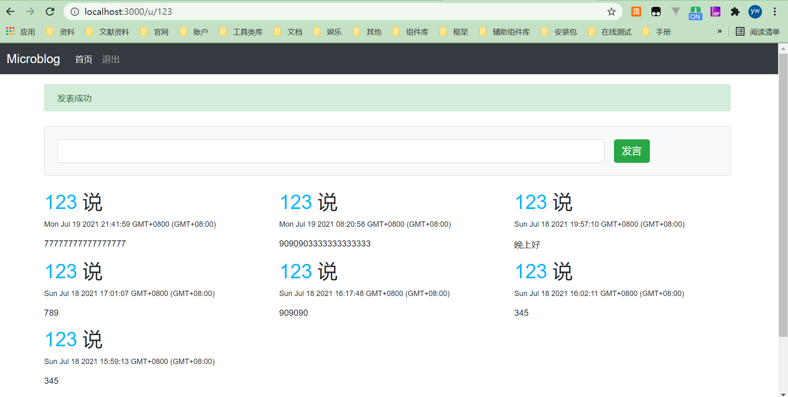
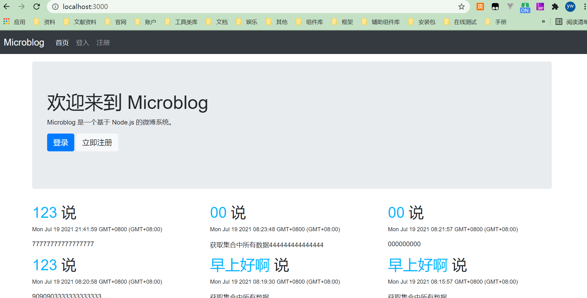
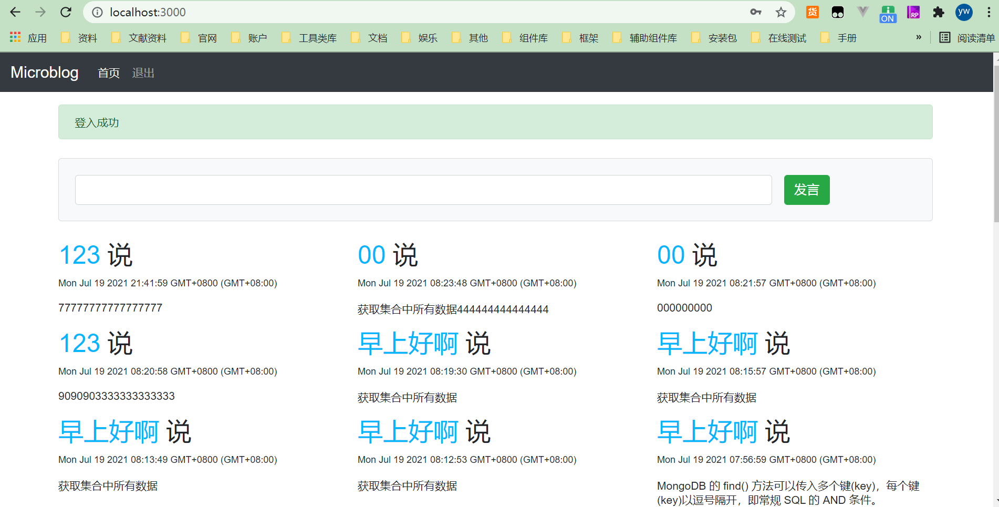

> 网站已经具备了用户注册、登入、页面权限控制的功能，这些功能为网站最核心的部分——发表微博做好了准备。在这个小节里，我们将会实现发表微博的功能，完成整个网站的设计。  

## 微博模型

> 仿照用户模型，将微博模型命名为 Post 对象，它拥有与User 相似的接口，分别是get 和 save。get 的功能是从数据库中获取微博，可以按指定用户获取，也可以获取全部的内容。save是 Post 对象实例的方法，用于将对象的变动保存到数据库。

创建 models/post.js，写入以下内容：  

```javascript
const mongodb = require('./db');
class Post {
    constructor(username, post, time) {
        this.user = username;
        this.post = post;
        if (time) {
            this.time = time;
        } else {
            this.time = new Date();
        }
    }

    save() {
        return new Promise((resolve, reject) => {
            // 存入 Mongodb 的文档
            const post = {
                user: this.user,
                post: this.post,
                time: this.time,
            };
            mongodb.open().then((db) => {
                // 读取 posts 集合
                const postsCollection = db.collection('posts');
                console.log(post);
                postsCollection.insertOne(post, (err, posts) => {
                    if (err) throw new Error(err);
                    console.log('保存成功：' + JSON.stringify(post));
                    mongodb.close();
                    resolve(posts)
                });
            });
        })
    }

    static find(name) {
        return new Promise((resolve, reject) => {
            mongodb.open().then(function (db) {
                // 读取 posts 集合
                const query = {};
                if (name) {
                    query.user = name
                }
                const postsCollection = db.collection('posts');
                postsCollection.find(query, { sort: { _id: -1 } }).toArray(function (err, docs) {
                    if (err) {
                        mongodb.close();
                        return reject(err)
                    }
                    // 封装 posts 为 Post 对象
                    const posts = [];
                    docs.forEach(function (doc, index) {
                        posts.push(new Post(doc.user, doc.post, doc.time));
                    });
                    mongodb.close();
                    resolve(posts)
                });
            });
        })
    }
}

module.exports = Post;
```

## 发表微博

**在 routes/index.js 中添加下面的代码：**  

```javascript
// 发言
router.post('/post', (req, res) => {
  const { name } = req.session.user;
  const post = new Post(name, req.body.post);
  post.save().then(() => {
    req.flash('success', '发表成功');
    res.redirect(`/u/${name}`);
  }).catch((err) => {
    req.flash('error', err);
    return res.redirect('/');
  });
});
```

> 通过 req.session.user 获取当前用户信息，从 req.body.post 获取用户发表的内容，建立 Post 对象，调用 save() 方法存储信息，最后将用户重定向到用户页面。  

## 用户页面

**用户页面的功能是展示用户发表的所有内容，在routes/index.js中加入以下代码：**  

```javascript
// 获取登录用户的所有发言数据
router.get('/u/:user', (req, res) => {
  const { user } = req.params;
  User.find({ name: user }).then((result) => {
    if (result) {
      Post.find(result.name).then((posts) => {
        res.render('user', {
          title: result.name,
          posts: posts,
        });
      }).catch(err => {
        req.flash('error', err);
        return res.redirect('/');
      });
    } else {
      req.flash('error', '用户不存在');
      return res.redirect('/');
    }
  }).catch(() => {
    req.flash('error', '用户不存在');
    return res.redirect('/');
  });
});
```

它的功能从数据库中获取该用户的微博，通过 posts 属性传递给 user 视图。 views/user.ejs 的内容如下：  

```ejs
<% if (user) { %>
    <%- include('say') %>
<% } %>
<%- include('posts', { posts: posts }) %>
```

根据 DRY 原则，把重复用到的部分都提取出来，分别放入 say.ejs 和 posts.ejs。 say.ejs的功能是显示一个发表微博的表单，它的内容如下：  

```ejs
<div class="card bg-light mt-4 mb-4">
    <div class="card-body">
        <form method="post" action="/post">
            <div class="form-grou row">
                <div class="col-sm-10">
                    <input type="text" class="form-control" name="post">
                </div>
                <button type="submit" class="btn btn-success">发言</button>
            </div>
        </form>
    </div>
</div>
```

posts.ejs 的目的是按照行列显示传入的 posts 的所有内容：  

```ejs
<% posts.forEach(function(post, index) { %>
    <% if (index % 3 === 0) { %>
        <div class="row">
    <% } %>
        <div class="col-4">
            <h2><a href="/u/<%= post.user %>"><%= post.user %></a> 说</h2>
            <p><small><%= post.time %></small></p>
            <p><%= post.post %></p>
        </div>
    <% if (index % 3 === 2) { %>
        </div>
    <% } %>
<% }) %>
<% if (posts.length % 3 !== 0) { %>
    </div><!-- end row -->
<%} %>
```

完成上述工作后，重启服务器。在用户的页面上发表几个微博，然后可以看到用户页面的效果如图所示。  



## 首页

> 最后一步是实现首页的内容。我们计划在首页显示所有用户发表的微博，按时间从新到旧的顺序。  

在 routes/index.js 中添加下面代码：  

```javascript
// 首页
router.get('/', (req, res) => {
  Post.find(null).then((posts) => {
    res.render('index', {
      title: '首页',
      posts,
    });
  })
});
```

它的功能是读取所有用户的微博，传递给页面 posts 属性。接下来修改首页的模板index.ejs：  

```ejs
<% if (!user) { %> 
    <div class="jumbotron bd-example">
        <h1>欢迎来到 Microblog</h1>
        <p>Microblog 是一个基于 Node.js 的微博系统。 </p>
        <p>
            <a class="btn btn-primary" href="/login" role="button">登录</a>
            <a class="btn btn-light" href="/reg" role="button">立即注册</a>
        </p>
    </div>
<% } else { %>
    <%- include('say') %>
<% } %>
<%- include('posts', { posts: posts }) %>
```

下面看看首页的效果吧，分别是用户登入之前和登入以后看到的首页效果。  





## 下一步

> 到此为止，微博网站的基本功能就完成了。这个网站仅仅是微博的一个雏形，距离真正的微博还有很大的距离。例如，我们没有对注册信息进行完整的验证，如用户名的规则，密码的长短等。作为社交工具，最重要的用户关注、转帖、评论、圈点用户这些功能都没有实现。  

