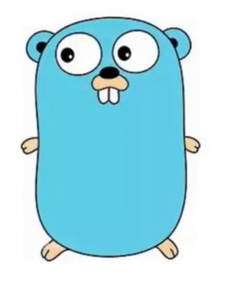

> 2007年，谷歌工程师Rob Pick，Ken Thompson和Robert Grisemer开始设计一门全新的语言，这是Go语言的最初原型。

开发团队：

罗伯特.格瑞史莫（Robert Griesemer），罗勃派克（Rob Pick）及肯.汤普森（Ken Thompson）于2007年9月开始设计Go，稍后Lan Lance Taylor、Russ Cox加入下项目。

> - 肯.汤普森（Ken Thompson）: unix 主要设计者，C语言的主要发明者。
> - 罗勃派克（Rob Pick）：unix 主要开发者之一，UTF-8发明者
> - 罗伯特.格瑞史莫（Robert Griesemer）：谷歌浏览器Js引擎设计者。

发布版本：

- 2009年11月，Google将Go语言以开放源代码的方式向全球发布。
- 2015年8月，Go1.5版本发布，本次更新中移除了最后残余的c代码。
- 2017年2月，Go语言Go 1.8版本发布。
- 2017年8月，Go语言Go 1.9版本发布。
- 2018年2月，Go语言Go 1.10版本发布。
- ...
- 2020年8月，Go语言Go 1.15版本发布。
- ...

吉祥物：金花鼠

