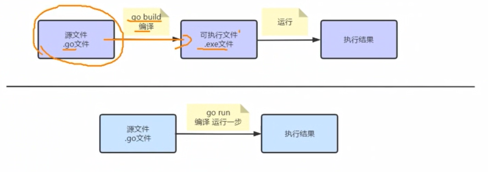

> 他通过前面的快速入门，我们知道输出一个结果可以有两种方式，那么这两种有什么区别呢？这里简单分析下执行流程。

## 区别

1. 在编译时，编译器会将程序运行依赖的库文件包含在可执行文件中，所以，可执行文件变大了很多。
2. 如果我们先编译生成了可执行文件，那么我们可以将该可执行文件拷贝到没有go开发环境的机器上，仍然可以运行。
3. 如果我们是直接go run go源代码，那么如果要在另一个机器上这么运行，也需要go开发环境，否则无法执行。