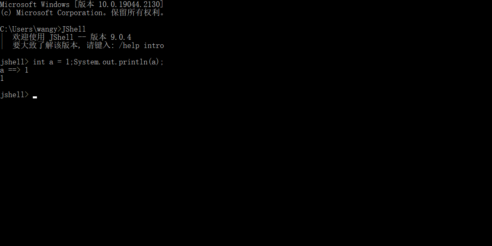

## 数据类型转换

> Java程序中要求参与的计算的数据，必须要保证数据类型的一致性，如果数据类型不一致将发生类型的转换。

### 自动转换

> 将 取值范围小的类型 自动提升为 取值范围大的类型 

```java
// 示例一
public static void main(String[] args) {
    int i = 1;
    byte b = 2;
    //int类型和byte类型运算，结果是int类型
    int j = b + i;
    System.out.println(j);
}

// 示例二
public static void main(String[] args) {
    int i = 1;
    double d = 2.5;
    //int类型和double类型运算，结果是double类型
    //int类型会提升为double类型
    double e = d+i;
    System.out.println(e);
}
// 同理，当一个 int 类型变量和一个 double 变量运算时， int 类型将会自动提升为 double 类型进行运算。
```

> byte 类型内存占有1个字节，在和 int 类型运算时会提升为 int 类型 ，自动补充3个字节，因此计算后的结果还是 int 类型。
>

::: info

转换规则：范围小的类型向范围大的类型提升，byte、short、char 运算时直接提升为 int；

byte、short、char‐‐>int‐‐>long‐‐>float‐‐>double

:::

### 强制转换

> 将 取值范围大的类型 强制转换成 取值范围小的类型  

转化格式：

```reStructuredText
数据类型 变量名 = （数据类型）被转数据值；
```

```java
// double类型数据强制转成int类型，直接去掉小数点。
int i = (int)1.5;
```

```java
// 当一个 short 类型与 1 相加，我们知道会类型提升，但是还想给结果赋值给short类型变量，就需要强制转换。
public class Demo {
    public static void main(String[] args) {
        // short类型变量，内存中2个字节
        short s = 1;
        /**
         * s和1做运算的时候，1是int类型，s会被提升为int类型
         * s+1后的结果是int类型，将结果在赋值给short类型时发生错误
         * short内存2个字节，int类型4个字节
         * 必须将int强制转成short才能完成赋值
         */
        s = s + 1;//编译失败
        s = (short) (s + 1);//编译成功
    }
}
```

::: info

1. 自动转换是Java自动执行的，而强制转换需要我们自己手动执行。 
2. 浮点转成整数，直接取消小数点，可能造成数据损失精度 。
3. int 强制转成 short 砍掉2个字节，可能造成数据丢失。 
4. 布尔类型不能发生数据类型转化。

:::

### ASCII编码表

> 将人类的文字和一个十进制数进行对应起来组成一张表格，将所有的英文字母，数字，符号都和十进制进行了对应，因此产生了世界上第一张编码表ASCII（American Standard Code for Information Interchange 美国标准信息交换码）。 

```java
public class Demo {
    public static void main(String[] args) {
        //字符类型变量
        char c = 'a';
        int i = 1;
        //字符类型和int类型计算
        System.out.println(c + i);//输出结果是98
    }
}
```

> 在char类型和int类型计算的过程中，char类型的字符先查询编码表，得到97，再和1求和，结果为98。char类型提升为了int类型。char类型内存2个字节，int类型内存4个字节。 

## 运算符

### 算数运算符

| 运算符   | 描述                         |
| -------- | ---------------------------- |
| +        | 加法运算，字符串连接运算     |
| -        | 减法运算                     |
| *        | 乘法运算                     |
| /        | 除法运算                     |
| %        | 取模运算，两个数字相除取余数 |
| ++ 、 -- | 自增自减运算                 |

> Java中，整数使用以上运算符，无论怎么计算，也不会得到小数。 

```java
public class Demo {
    public static void main(String[] args) {
        int i = 1234;
        System.out.println(i / 1000 * 1000);//计算结果是1000
    }
}
```

#### `++`运算符

> ++ 运算，变量自己增长1。

1. 独立运算

   - 变量在独立运算时， 前++ 和 后++ 没有区别 。
   - 变量 前++ ：例如 ++i 。
   - 变量 后++ ：例如 i++ 。 

2. 混合运算

   - 和其他变量放在一起， 前++ 和 后++ 就产生了不同。

   - 变量 前++ ：变量a自己加1，将加1后的结果赋值给b，也就是说a先计算。a和b的结果都是2 。

     ```java
     int a = 1;
     int b = ++a;
     System.out.println(a);// 计算结果是2
     System.out.println(b);// 计算结果是2
     ```

   - 变量 后++ ：变量a先把自己的值1，赋值给变量b，此时变量b的值就是1，变量a自己再加1。a的结果是2，b的结果是1。 

     ```java
     int a = 1;
     int b = a++;
     System.out.println(a);// 计算结果是2
     System.out.println(b);// 计算结果是1
     ```

#### `+`运算符

`+`符号在遇到字符串的时候，表示连接、拼接的含义。

```java
System.out.println("5+5="+5+5);// 输出5+5=55
```

### 赋值运算符

> 赋值运算符，就是将符号右边的值，赋给左边的变量。 

| 运算符 | 描述   |
| ------ | ------ |
| =      | 等于号 |
| +=     | 加等于 |
| -=     | 减等于 |
| *=     | 乘等于 |
| /=     | 除等于 |
| %=     | 取模等 |

```java
int i = 5;
i+=5;// 计算方式 i=i+5 变量i先加5，再赋值变量i
System.out.println(i); // 输出结果是10
```

### 比较运算符

| 运算符 | 描述                                                         |
| ------ | ------------------------------------------------------------ |
| ==     | 比较符号两边数据是否相等，相等结果是true。                   |
| <      | 比较符号左边的数据是否小于右边的数据，如果小于结果是true。   |
| >      | 比较符号左边的数据是否大于右边的数据，如果大于结果是true。   |
| <=     | 比较符号左边的数据是否小于或者等于右边的数据，如果小于结果是true。 |
| >=     | 比较符号左边的数据是否大于或者等于右边的数据，如果小于结果是true。 |
| ！=    | 不等于符号 ，如果符号两边的数据不相等，结果是true。          |

> 比较运算符，是两个数据之间进行比较的运算，运算结果都是布尔值 true 或者 false 。 

```java
public class Demo {
    public static void main(String[] args) {
        System.out.println(1 == 1); // true
        System.out.println(1 < 2); // true
        System.out.println(3 > 4); // false
        System.out.println(3 <= 4); // true
        System.out.println(3 >= 4); // false
        System.out.println(3 != 4); // true
    }
}
```

### 逻辑运算符

> 是用来连接两个布尔类型结果的运算符，运算结果都是布尔值 true 或者 false 

| 运算符      | 描述                                                         |
| ----------- | ------------------------------------------------------------ |
| && 短路与   | 1. 两边都是true，结果是true 2.  一边是false，结果是false 短路特点：符号左边是false，右边不再运算 |
| \|\| 短路或 | 1. 两边都是false，结果是false 2. 一边是true，结果是true 短路特点： 符号左边是true，右边不再运算 |
| ！ 取反     | 1. ! true 结果是false 2. ! false结果是true                   |

```java
public class Demo {
    public static void main(String[] args) {
        System.out.println(true && true);//true
        System.out.println(true && false);//false
        System.out.println(false && true);//false，右边不计算
        System.out.println(false || false);//falase
        System.out.println(false || true);//true
        System.out.println(true || false);//true，右边不计算
        System.out.println(!false);//true
    }
}
```

### 三元运算符

```reStructuredText
数据类型 变量名 = 布尔类型表达式 ？结果1 ：结果2;
```

```java
public class Demo {
    public static void main(String[] args) {
        int i = (1 == 2 ? 100 : 200);
        System.out.println(i);//200
        int j = (3 <= 4 ? 500 : 600);
        System.out.println(j);//500
    }
}
```

## 方法

> 就是将一个功能抽取出来，把代码单独定义在一个大括号内，形成一个单独的功能。

### 定义

定义格式： 

```html
修饰符 返回值类型 方法名 （参数列表）｛
	代码...
	return 结果;
｝
```

格式解释： 

- 修饰符： 目前固定写法 public static 。 
- 返回值类型： 目前固定写法 void ，其他返回值类型在后面的课程讲解。
- 方法名：为我们定义的方法起名，满足标识符的规范，用来调用方法。
- 参数列表： 目前无参数， 带有参数的方法在后面的课程讲解。
- return：方法结束。因为返回值类型是void，方法大括号内的return可以不写。 

示例：

```java
public static void methodName() {
	System.out.println("这是一个方法");
}
```

### 调用

> 方法在定义完毕后，我们可以在主方法main中来调用我们自己定义好的方法。在主方法中，直接写要调用的方法名字就可以调用了。 

```java
public class Demo {
    public static void main(String[] args) {
        //调用定义的方法method
        method();
    }

    //定义方法，被main方法调用
    public static void method() {
        System.out.println("自己定义的方法，需要被main调用运行");
    }
}
```

### 两个明确

> 需求：定义方法实现两个整数的求和计算。

- 明确返回值类型：方法计算的是整数的求和，结果也必然是个整数，返回值类型定义为int类型。 
- 明确参数列表：计算哪两个整数的和，并不清楚，但可以确定是整数，参数列表可以定义两个int类型的
  变量，由调用者调用方法时传递。

```java
public class HelloWorld {
    public static void main(String[] args) {
        // 调用方法getSum，传递两个整数
        // 并接收方法计算后的结果，返回值
        int sum = getSum(5, 6);
        System.out.println(sum);
    }

    /**
     * 计算两个整数和的方法
     * 参数：不确定数据求和，定义int参数
     * @param a
     * @param b
     * @return int
     */
    public static int getSum(int a, int b) {
        return a + b;
    }
}
```

::: info

1. 方法必须定义在`类`中方法外 。

   ```java
   public class Demo {
       public static void main(String[] args) {
       }
   
       // 正确写法，类中，main方法外面可以定义方法
       public static void method() {
       }
   }
   ```

2. 方法不能定义在另一个方法的里面。

   ```java
   public class Demo {
       public static void main(String[] args) {
           //错误写法，一个方法不能定义在另一方法内部
           public static void method () {
           }
       }
   }
   ```

3. 返回值类型，必须要和 return 语句返回的类型相同，否则编译失败 。 

:::

### 方法重载 

> 指在同一个类中，允许存在一个以上的同名方法，只要它们的参数列表不同即可，与修饰符和返回值类型无关。 

- 参数列表：个数不同，数据类型不同，顺序不同。
- 重载方法调用：`JVM`通过方法的参数列表，调用不同的方法。 

```java
package com.itheima.demo;

public class HelloWorld {
    public static void main(String[] args) {
        //定义不同数据类型的变量
        byte a = 10;
        byte b = 20;
        short c = 10;
        short d = 20;
        int e = 10;
        int f = 10;
        // 调用
        System.out.println(compare(a, b));
        System.out.println(compare(c, d));
        System.out.println(compare(e, f));
    }

    // 两个byte类型的
    public static boolean compare(byte a, byte b) {
        System.out.println("byte");
        return a == b;
    }

    // 两个short类型的
    public static boolean compare(short a, short b) {
        System.out.println("short");
        return a == b;
    }

    // 两个int类型的
    public static boolean compare(int a, int b) {
        System.out.println("int");
        return a == b;
    }
}
```

## `JShell`脚本工具

> `JShell`脚本工具是`JDK9`的新特性。

启动JShell工具，在DOS命令行直接输入JShell命令。 



特点：无需写类和方法，直接写方法中的代码即可，同时无需编译和运行，直接回车即可。