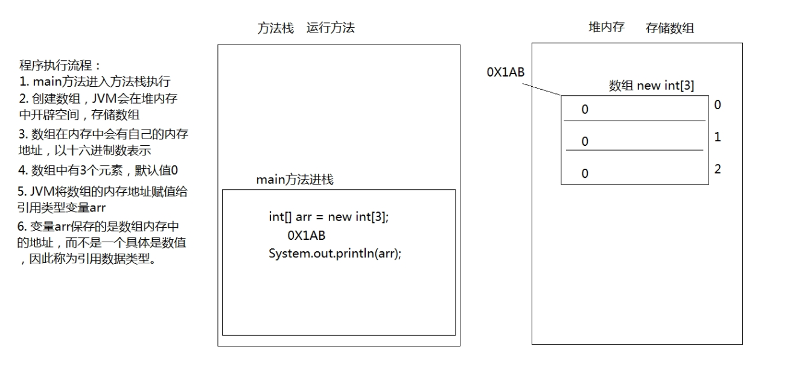
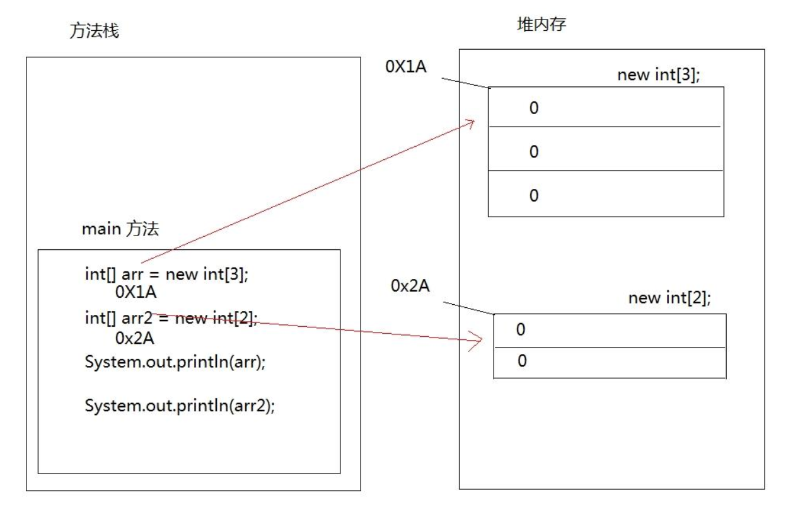
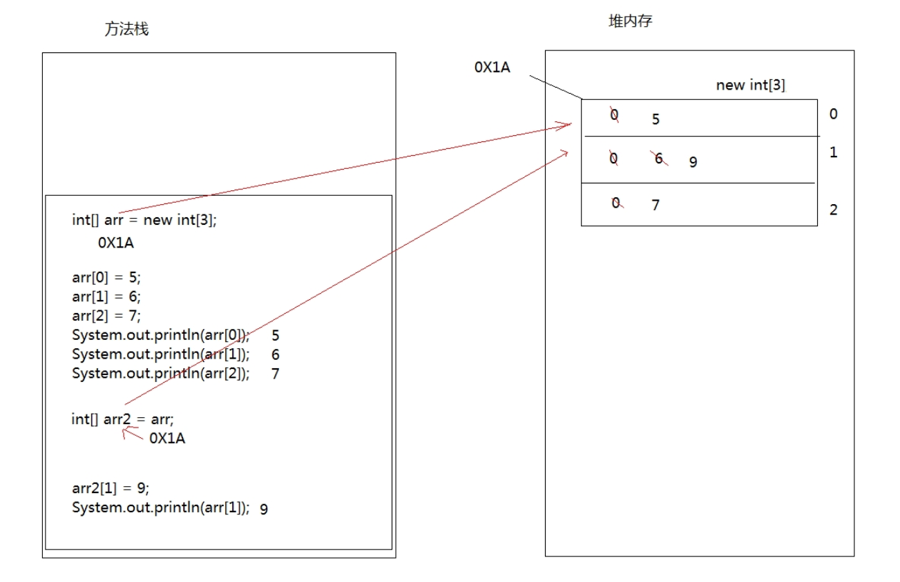

> 数组就是存储数据长度固定的容器，保证多个数据的数据类型要一致。 

## 数组定义和访问

### 方式一

格式：

```html
数组存储的数据类型[] 数组名字 = new 数组存储的数据类型[长度];
```

数组定义格式详解：

- 数组存储的数据类型： 创建的数组容器可以存储什么数据类型。
- [] : 表示数组。
- 数组名字：为定义的数组起个变量名，满足标识符规范，可以使用名字操作数组。
- new：关键字，创建数组使用的关键字。
- 数组存储的数据类型： 创建的数组容器可以存储什么数据类型。
- [长度]：数组的长度，表示数组容器中可以存储多少个元素。
- 注意：数组有定长特性，长度一旦指定，不可更改。 

```java
// 定义可以存储3个整数的数组容器
int[] arr = new int[3];
```

### 方式二

格式： 

```html
数据类型[] 数组名 = new 数据类型[]{元素1,元素2,元素3...};
```

```java
// 定义存储1，2，3，4，5整数的数组容器。
int[] arr = new int[]{1,2,3,4,5};
```

### 方式三

格式： 

```html
数据类型[] 数组名 = {元素1,元素2,元素3...};
```

```java
// 定义存储1，2，3，4，5整数的数组容器
int[] arr = {1,2,3,4,5};
```

### 数组的访问

格式： 

```html
数组名[索引]
```

参数解释：

- 索引： 每一个存储到数组的元素，都会自动的拥有一个编号，从0开始，这个自动编号称为数组索引
  (index)，可以通过数组的索引访问到数组中的元素。 

```java
public class HelloWorld {
    public static void main(String[] args) {
        int[] arr = new int[]{1, 2, 3, 4, 5};
        // 打印数组的属性，输出结果是5
        System.out.println(arr.length); // 5
        // 为0索引元素赋值为6
        arr[0] = 6;
        // 获取数组0索引上的元素
        int i = arr[0];
        System.out.println(i); // 6
        // 直接输出数组0索引元素
        System.out.println(arr[0]); // 6
    }
}
```

> 每个数组都具有长度，而且是固定的，Java中赋予了数组的一个属性，可以获取到数组的长度，语句为： `数组名.length`，属性length的执行结果是数组的长度，int类型结果。由次可以推断出，数组的最大索引值为 `数组名.length-1 `。 

## 数组原理内存图

### Java虚拟机的内存划分

> Java虚拟机要运行程序，必须要对内存进行空间的分配和管理。 为了提高运算效率，就对空间进行了不同区域的划分，因为每一片区域都有特定的处理数据方式和内存管理方式。 

| 区域名称   | 作用                                                       |
| ---------- | ---------------------------------------------------------- |
| 寄存器     | 给CPU使用，和我们开发无关。                                |
| 本地方法栈 | JVM在使用操作系统功能的时候使用，和我们开发无关。          |
| 方法区     | 存储可以运行的class文件。                                  |
| 堆内存     | 存储对象或者数组，new来创建的，都存储在堆内存。            |
| 方法栈     | 方法运行时使用的内存，比如main方法运行，进入方法栈中执行。 |

### 数组在内存中的存储

#### 一个数组内存图

```java
public class HelloWorld {
    public static void main(String[] args) {
        int[] arr = new int[3];
        System.out.println(arr);// [I@5f150435
    }
}
```

> 以上方法执行，输出的结果是`[I@5f150435`，这个是什么呢？是数组在内存中的地址。new出来的内容，都是在堆内存中存储的，而方法中的变量arr保存的是数组的地址。 



#### 两个数组内存图

```java
public class HelloWorld {
    public static void main(String[] args) {
        int[] arr = new int[3];
        int[] arr2 = new int[2];
        System.out.println(arr); // [I@71e7a66b
        System.out.println(arr2); // [I@2ac1fdc4
    }
}
```



#### 两个变量指向一个数组

```java
public class HelloWorld {
    public static void main(String[] args) {
        // 定义数组，存储3个元素
        int[] arr = new int[3];
        // 数组索引进行赋值
        arr[0] = 5;
        arr[1] = 6;
        arr[2] = 7;
        // 输出3个索引上的元素值
        System.out.println(arr[0]);
        System.out.println(arr[1]);
        System.out.println(arr[2]);
        // 定义数组变量arr2，将arr的地址赋值给arr2
        int[] arr2 = arr;
        arr2[1] = 9;
        System.out.println(arr[1]);
        System.out.println(arr); // [I@71e7a66b
        System.out.println(arr2); // [I@71e7a66b
    }
}
```



## 数组的常见操作

### 数组越界异常

```java
public class HelloWorld {
    public static void main(String[] args) {
        int[] arr = {1,2,3};
        System.out.println(arr[3]);
    }
}
```

> 创建数组，赋值3个元素，数组的索引就是0，1，2，没有3索引，因此我们不能访问数组中不存在的索引，程序运行后，将会抛出 `ArrayIndexOutOfBoundsException` 数组越界异常。 

### 数组空指针异常

```java
public class HelloWorld {
    public static void main(String[] args) {
        int[] arr = {1,2,3};
        arr = null;
        System.out.println(arr[0]);
    }
}
```

> `arr = null` 这行代码，意味着变量arr将不会在保存数组的内存地址，也就不允许再操作数组了，因此运行的时候会抛出 `NullPointerException` 空指针异常。

### 数组遍历

> 将数组中的每个元素分别获取出来。

```java
public class HelloWorld {
    public static void main(String[] args) {
        int[] arr = { 1, 2, 3, 4, 5 };
        for (int i = 0; i < arr.length; i++) {
            System.out.println(arr[i]);
        }
    }
}
```

### 数组获取最大值元素

```java
public class HelloWorld {
    public static void main(String[] args) {
        int[] arr = {5, 15, 2000, 10000, 100, 4000};
        // 定义变量，保存数组中0索引的元素
        int max = arr[0];
        // 遍历数组，取出每个元素
        for (int i = 0; i < arr.length; i++) {
            // 遍历到的元素和变量max比较
            // 如果数组元素大于max
            if (arr[i] > max) {
                //max记录住大值
                max = arr[i];
            }
        }
        System.out.println("数组最大值是： " + max);
    }
}
```

### 数组反转

```java
public class HelloWorld {
    public static void main(String[] args) {
        int[] arr = {1, 2, 3, 4, 5};
        
        for (int i = 0; i < arr.length; i++) {

            if (arr.length - 1 - i <= i) break;

            // 利用第三方变量完成数组中的元素交换
            int temp = arr[i];
            arr[i] = arr[arr.length - 1 - i];
            arr[arr.length - 1 - i] = temp;
        }

        for (int i = 0; i < arr.length; i++) {
            System.out.println(arr[i]);
        }
    }
}
```

## 数组作为参数和返回值

### 作为参数

> 数组作为方法参数传递，传递的参数是数组内存的地址。

```java
public class HelloWorld {
    public static void main(String[] args) {
        int[] arr = {1, 3, 5, 7, 9};
        //调用方法，传递数组
        printArray(arr);
    }

    public static void printArray(int[] arr) {
        for (int i = 0; i < arr.length; i++) {
            System.out.println(arr[i]);
        }
    }
}
```

### 作为返回值

> 数组作为方法的返回值，返回的是数组的内存地址。

```java
public class HelloWorld {
    public static void main(String[] args) {
        // 接收到的是数组的内存地址
        int[] arr = getArray();
        for (int i = 0; i < arr.length; i++) {
            System.out.println(arr[i]);
        }
    }

    public static int[] getArray() {
        int[] arr = { 1, 3, 5, 7, 9 };
        // 返回数组的地址，返回到调用者
        return arr;
    }
}
```

::: info

方法的参数为`基本类型`时,传递的是数据值. 方法的参数为`引用类型`时,传递的是地址值；

:::

