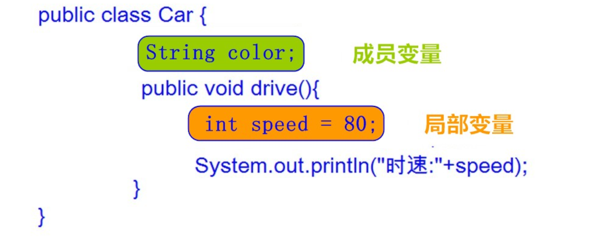

## 类

### 类的定义格式 

```java
public class Student {
    //成员变量
    //成员方法
}
```

示例：

```java
class Student {
    // 成员变量
    String name; //姓名
    int age; //年龄

    // 成员方法
    public void study() {
        System.out.println("好好学习，天天向上");
    }

    //吃饭的方法
    public void eat() {
        System.out.println("学习饿了要吃饭");
    }
}
```

### 对象的使用

使用格式 ：

```html
类名 对象名 = new 类名();
```

访问类中的成员: 

```html
对象名.成员变量；
对象名.成员方法()；
```

示例：

```java
public class Demo01 {
    public static void main(String [] args) {
        // 创建对象
        Student s = new Student();

        // 访问对象成员
        System.out.println(s.name);
        System.out.println(s.age);

        // 给成员变量赋值
        s.name = "孙悟空";

        System.out.println(s.name);

        // 调用成员方法
        s.study();
        s.eat();
    }
}

```

::: info

通常情况下，一个类并不能直接使用，需要根据类创建一个对象才能使用。

导包：`import 包名称.类名称`;对于和当前类属于同一个包的情况，可以省略导包语句不写。

:::

### 成员变量的默认值

|          | 数据类型                       | 默认值   |
| -------- | ------------------------------ | -------- |
| 基本类型 | 整数（byte，short，int，long） | 0        |
|          | 浮点数（float，double）        | 0.0      |
|          | 字符（char）                   | '\u0000' |
|          | 布尔（boolean）                | false    |
| 引用类型 | 数组，类，接口                 | null     |

### 成员变量和局部变量的区别

变量根据定义位置的不同，我们给变量起了不同的名字。如下图所示： 



## 封装

> 封装可以被认为是一个保护屏障，防止该类的代码和数据被其他类随意访问。要访问该类的数据，必须通过指定的方式。适当的封装可以让代码更容易理解与维护，也加强了代码的安全性。 

### 封装的步骤

1. 使用 `private` 关键字来修饰成员变量。
2. 对需要访问的成员变量，提供对应的一对 `getXxx` 方法 、`setXxx ` 方法。 

### private关键字

1. private是一个权限修饰符，代表最小权限。
2. 可以修饰成员变量和成员方法。
3. 被private修饰后的成员变量和成员方法，只在本类中才能访问。 

private的使用格式：

```html
private 数据类型 变量名；
```

示例：

```java
package com.itheima.demo;

class Student {
    // 成员变量
    private String name; //姓名
    private int age; //年龄

    public void setName(String name) {
        this.name = name;
    }

    public void setAge(int age) {
        this.age = age;
    }
    
    // 成员方法
    public String getName() {
        return name;
    }

    //吃饭的方法
    public int getAge() {
        return age;
    }
}
```

```java
package com.itheima.demo;

public class Demo01 {
    public static void main(String [] args) {
        // 创建对象
        Student s = new Student();

        // 调用成员方法
        System.out.println(s.getName());
        System.out.println(s.getAge());
    }
}
```