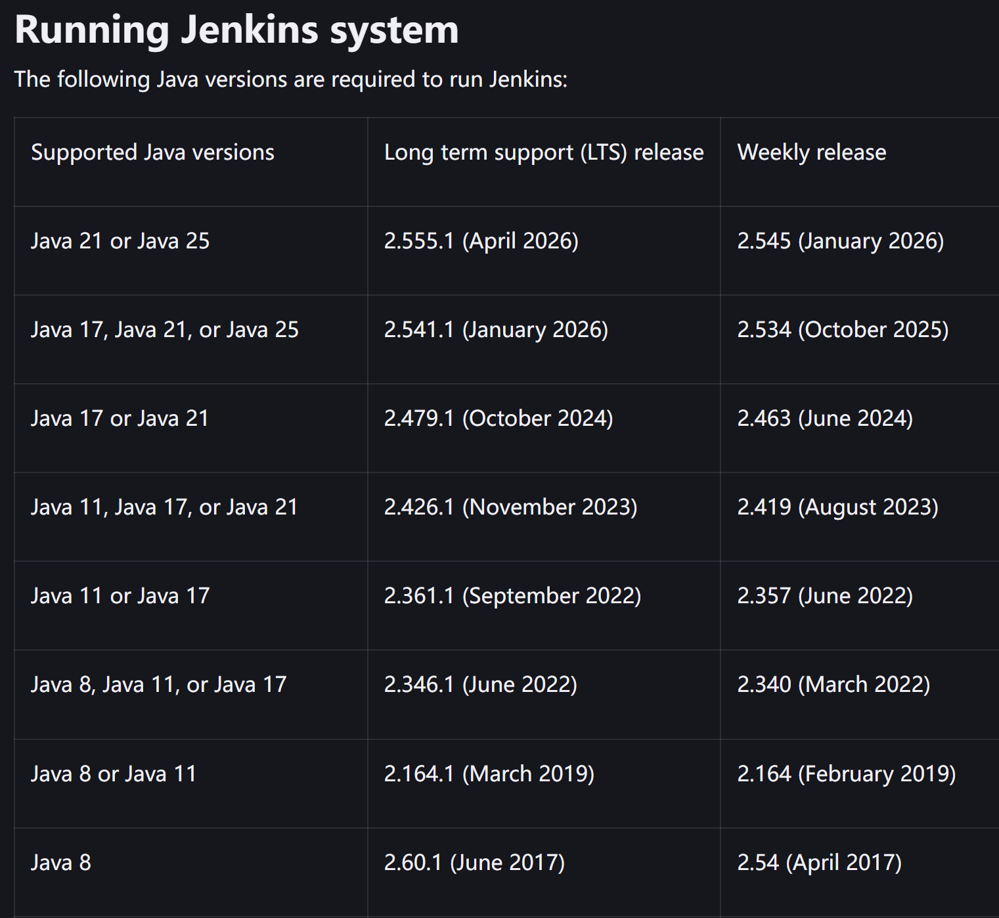

# 安装Jenkins

> jenkins  强烈建议使用新版本，因为很多插件不支持老版本jenkins了；安装很是繁琐

## 环境准备

```sh
[root@iZbp1hlsx5sfj6qam4ic9wZ ~]# cat /etc/os-release
NAME="CentOS Linux"
VERSION="7 (Core)"
ID="centos"
ID_LIKE="rhel fedora"
VERSION_ID="7"
PRETTY_NAME="CentOS Linux 7 (Core)"
ANSI_COLOR="0;31"
CPE_NAME="cpe:/o:centos:centos:7"
HOME_URL="https://www.centos.org/"
BUG_REPORT_URL="https://bugs.centos.org/"

CENTOS_MANTISBT_PROJECT="CentOS-7"
CENTOS_MANTISBT_PROJECT_VERSION="7"
REDHAT_SUPPORT_PRODUCT="centos"
REDHAT_SUPPORT_PRODUCT_VERSION="7"

[root@iZbp1hlsx5sfj6qam4ic9wZ ~]# nginx -version
nginx version: nginx/1.26.1
[root@iZbp1hlsx5sfj6qam4ic9wZ ~]# mysql --version
mysql  Ver 8.0.24 for Linux on x86_64 (Source distribution)
[root@iZbp1hlsx5sfj6qam4ic9wZ ~]# php --version
PHP 8.0.26 (cli) (built: Jan 16 2026 10:31:31) ( NTS )
Copyright (c) The PHP Group
Zend Engine v4.0.26, Copyright (c) Zend Technologies
```

## 安装JDK21

[java下载链接]([Java Downloads | Oracle 中国](https://www.oracle.com/cn/java/technologies/downloads/#java21))

```sh
wget https://download.oracle.com/java/21/latest/jdk-21_linux-x64_bin.tar.gz
```

**创建安装目录**

```sh
# 在 /usr/local/ 目录下创建 jdk 文件夹
mkdir /usr/local/jdk

cd /usr/local/jdk/
```

**上传并解压 JDK 安装包**

```sh
# 上传下载好的 JDK 安装包到 /usr/local/jdk/目录 并解压安装包
sudo tar -xvf jdk-17_linux-x64_bin.tar.gz
```

**配置环境变量**

编辑 */etc/profile* 文件，添加以下内容：

```sh
# 打开 /etc/profile 文件

vim /etc/profile

# 在文件末尾添加以下内容

export JAVA_HOME=/usr/local/jdk/jdk-17.0.10 # jdk-17.0.10 你实际解压出来的文件目录

export PATH=$JAVA_HOME/bin:$PATH

# 保存并退出编辑模式

:wq
```

**加载配置文件**

```sh
# 使配置文件生效
source /etc/profile
```

**验证安装**

```sh
# 检查 Java 版本

java -version

[root@iZbp1hlsx5sfj6qam4ic9wZ ~]# vim /etc/profile
[root@iZbp1hlsx5sfj6qam4ic9wZ ~]# source /etc/profile
[root@iZbp1hlsx5sfj6qam4ic9wZ ~]# java -version
java version "1.8.0_341"
Java(TM) SE Runtime Environment (build 1.8.0_341-b10)
Java HotSpot(TM) 64-Bit Server VM (build 25.341-b10, mixed mode)
```

注意JAVA与jenkins的版本需要匹配



## 安装Jenkins

[War Jenkins Packages](https://get.jenkins.io/war-stable/)

```sh
# 下载jenkins包
wget https://get.jenkins.io/war-stable/2.555.1/jenkins.war
# 运行jenkins 并设置端口号1179
nohup /home/jdk-21.0.11/bin/java -jar ./jenkins2.555.1/jenkins.war --httpPort=1179 >> nohup.out 2>&1 &

# 本机访问 127.0.0.1:1179
```

