## jenkins结合git实现自动化部署；

> 本人使用的是阿里云服务器，jenkins的安装我就不在阐述，这个网上有很多教程(其实是不想在重新安装一遍，嘻嘻🤭)；下面主要记录下创建一个项目结合git用于自动化构建。

## 1、创建一个项目；

- 登录你的jenkins服务；

- 点击新建任务创建一个项目；

  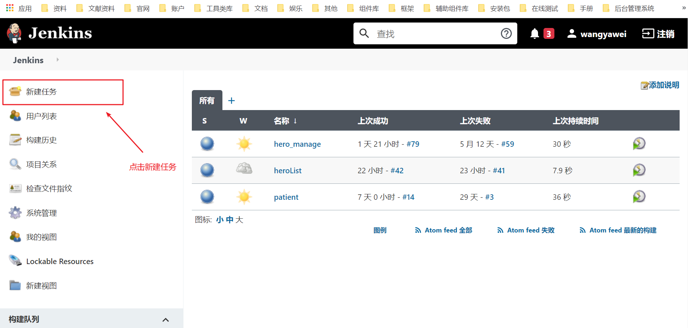

  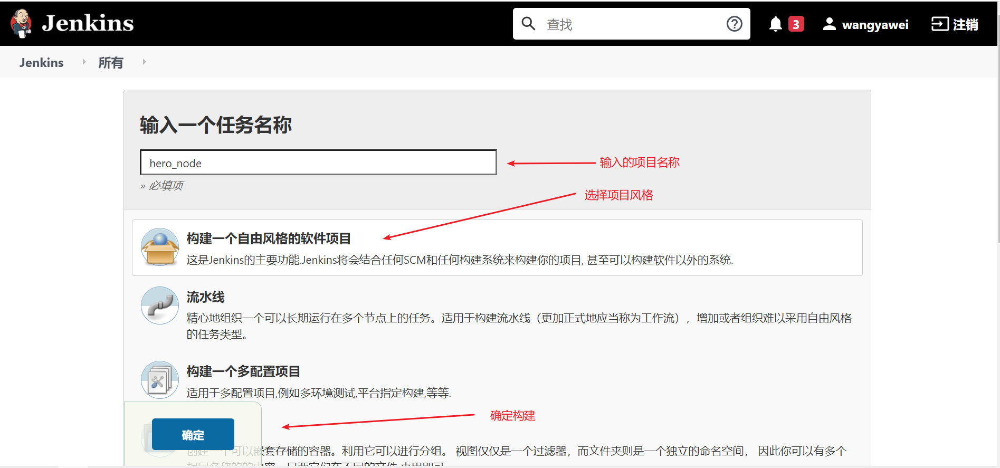

- jenkins的基本配置；

- **general项；**填写描述信息；

  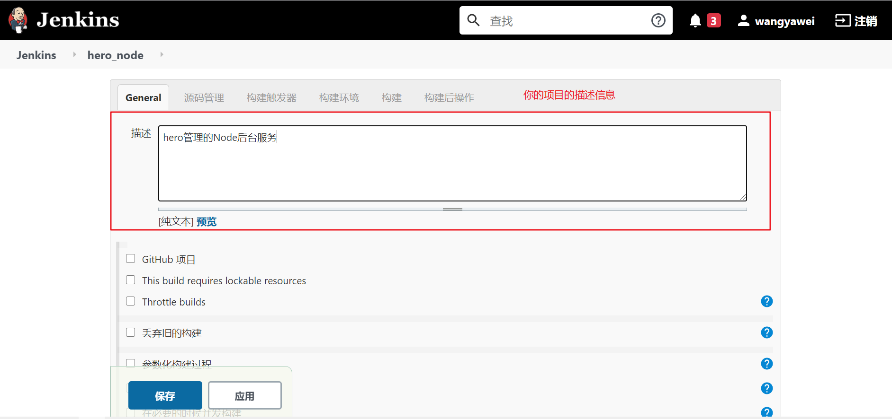
  
- 源码管理项；

  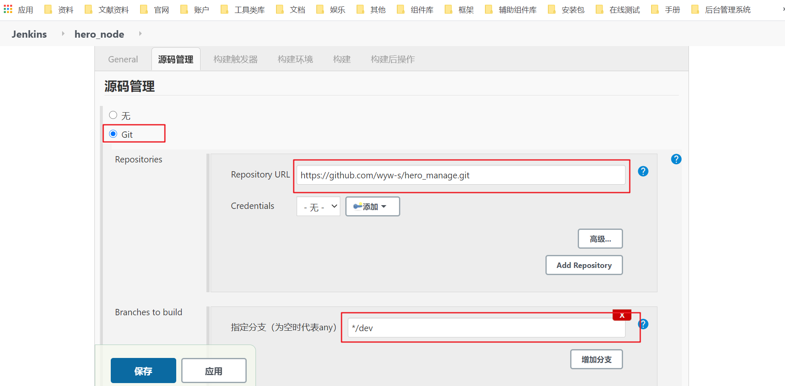
  
  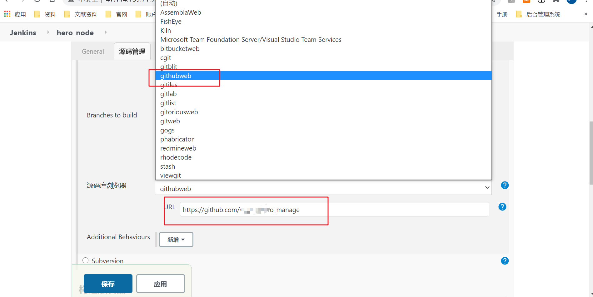
  
- 构建触发器；

  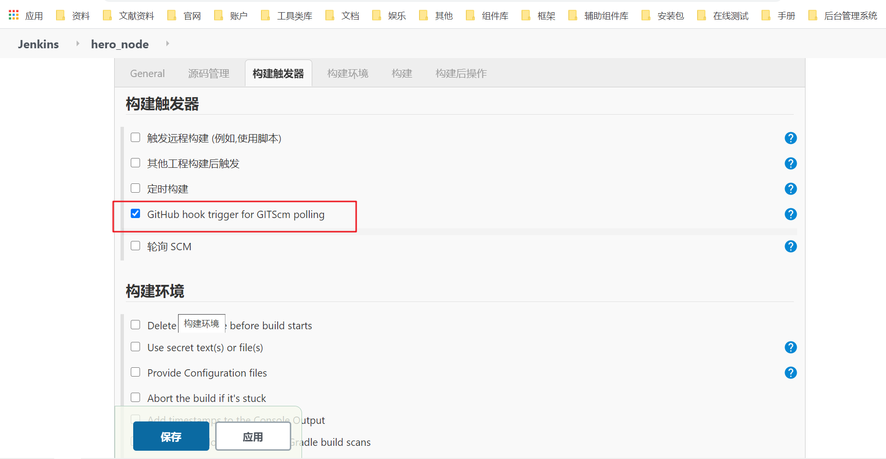

- 构建环境；

  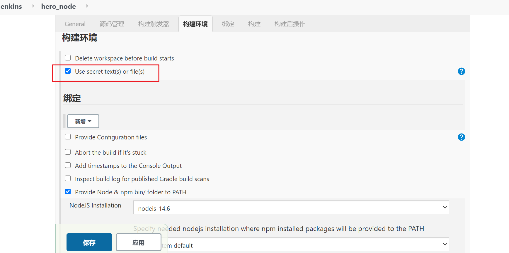

- 绑定;

  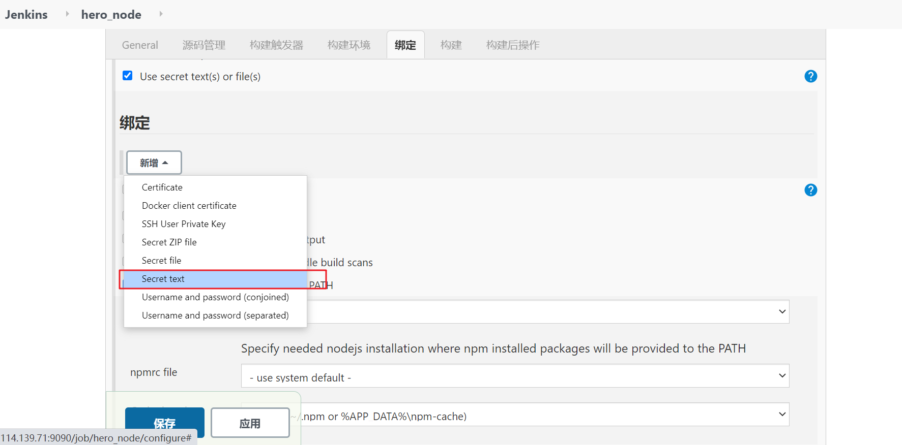

  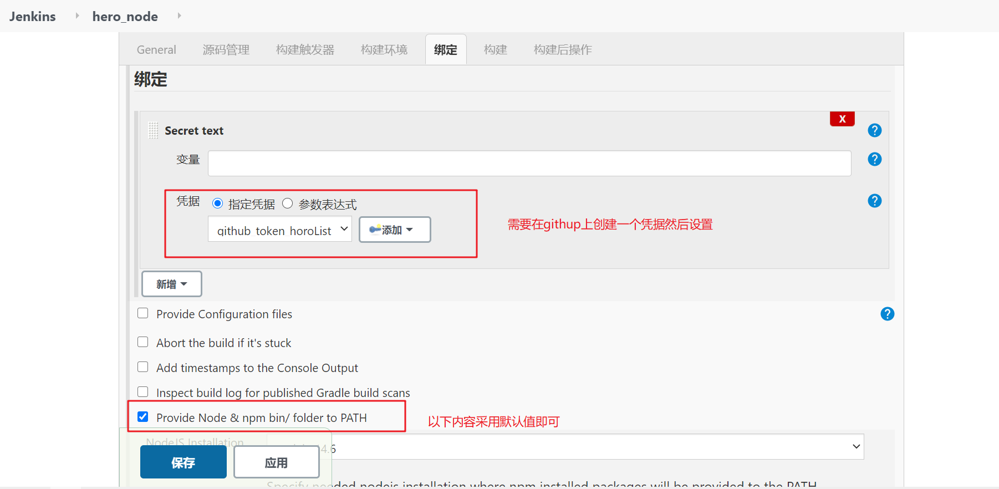

- 构建;

  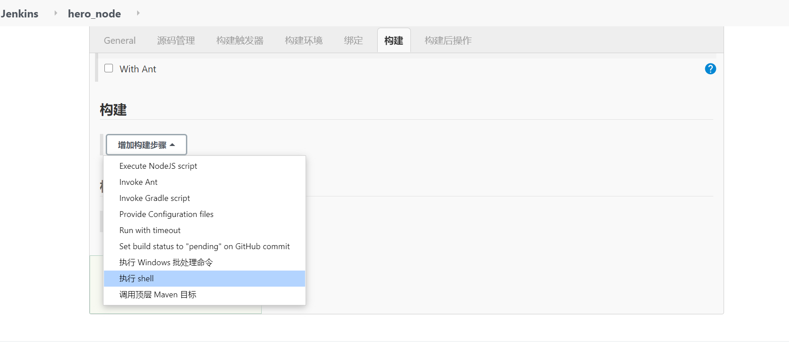

  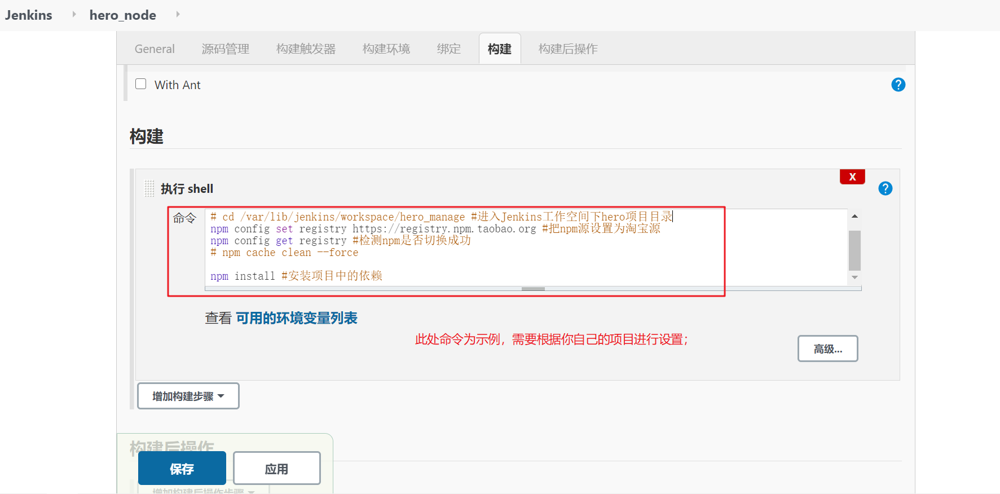

### githup设置个人访问令牌；

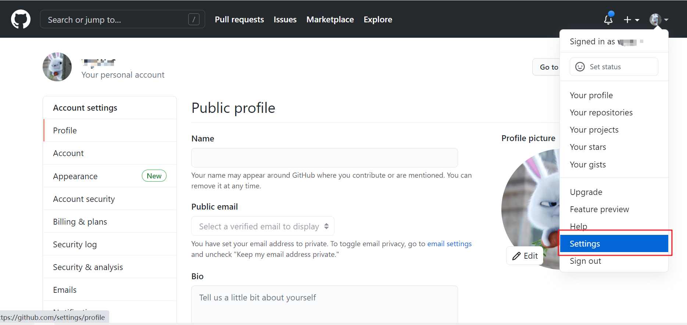

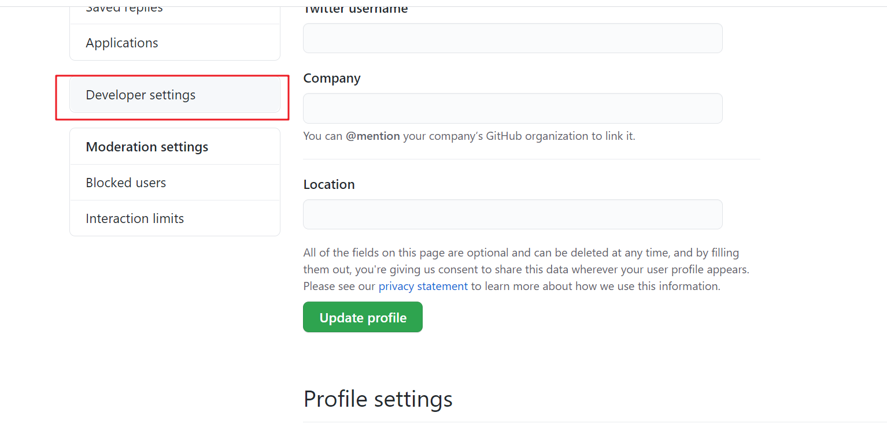

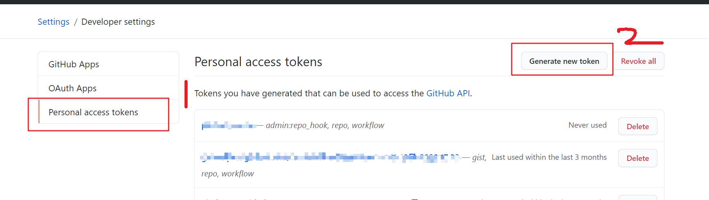

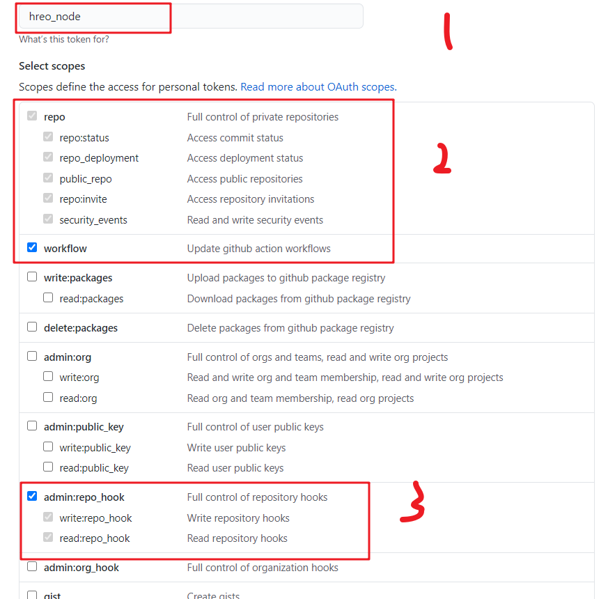

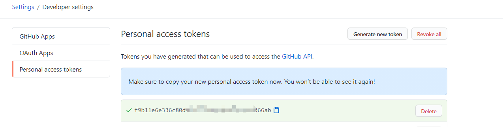

​	

**在构建选项卡那一步添加凭据ID为你在githup上创建的个人用户凭证；**

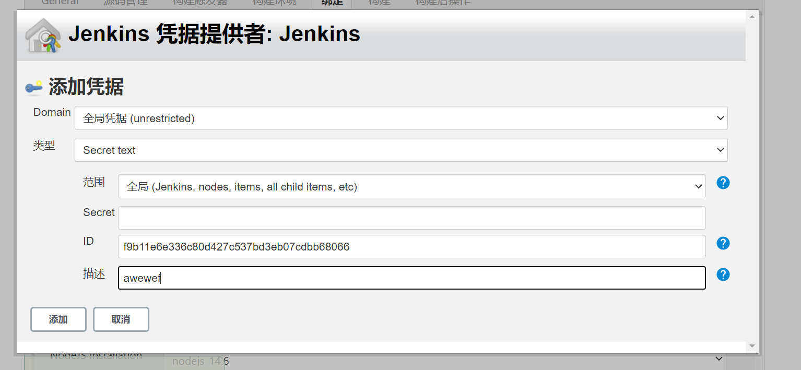

以上就是这些配置了，主要是构建时的命令需要根据的项目书写一下；

最后点击立即构建；