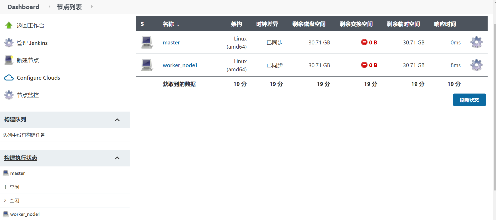
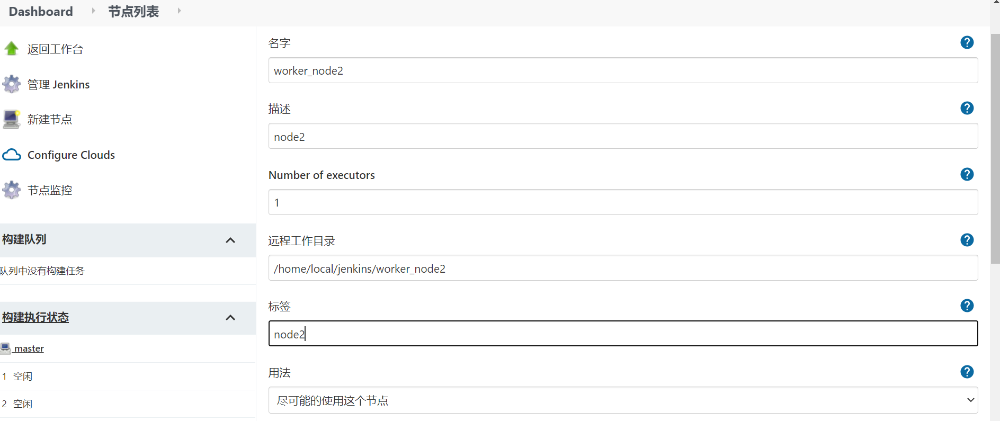
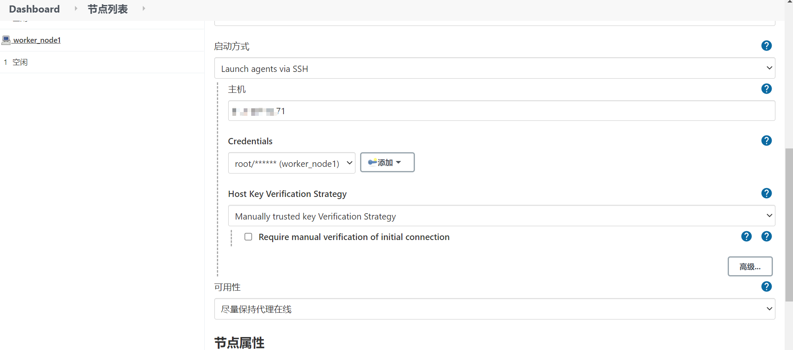
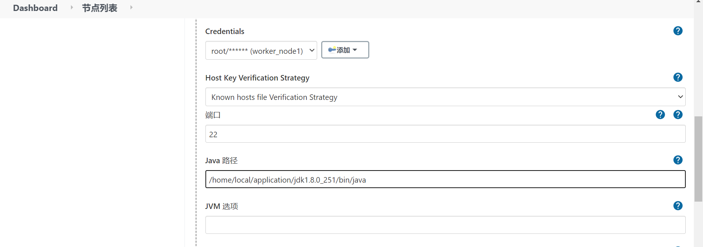

> 在jenkins 2x中，节点是一个基础概念，代表了任何可以执行jenkins任务的系统。节点中包含主节点和代理节点。此外，节点也可以是一个容器，比如docker;

## 主节点；

> 主节点是一个jenkins实例的主要控制系统。它能够完全访问所有的jenkins配置选项和任务列表。如果没有指定其他系统，它也是默认的任务执行节点

缺点：凡是在主节点上执行的任务，都有权限访问所有的数据，配置和操作，这会构成潜在的安全风险。同样值得注意的是，在主系统上不应该执行包含潜在阻塞的操作，因为主系统需要持续响应和管理各类操作过程。所以不推荐在主节点上执行任务。

## 代理节点

> 1. 在早先版本的Jenkins中，代理节点被称为从节点（slave），其代表了所有非主节点的系统。这类系统由主系统管理，按需分配或指定执行特定的任务。例如，我们可以分配不同的代理节点针对不同的操作系统构建任务，或者可以分配多个代理节点并发地运行测试任务。
> 2. 为了减少系统负载，降低安全风险，通常在子系统上只会安装一个轻量级的Jenkins客户端应用来处理任务，这个客户端应用对资源访问是受限的。
> 3. 随着代理节点和节点之间关系的演进，代理节点在节点上运行。在脚本式流水线中，“节点”特指一个运行代理节点的系统，而在声明式流水线中，其指代一个特定的代理节点来分配节点。
> 4. 根据节点和代理节点在声明式语法和脚本式语法中的使用方式，我们可以得出这两个概念之间的差异。
>    node用于脚本式流水线，从技术层面上看它是一个步骤，代表可以用于流水线中执行活动的资源。它在一个运行代理节点的节点上面分配一个执行器，并进一步在定义的代码块上运行代码。

根据节点和代理节点在声明式语法和脚本式语法中的使用方式，我们可以得出这两个概念之间的差异:

1. node用于脚本式流水线;

   > 从技术层面上看它是一个步骤，代表可以用于流水线中执行活动的资源。它在一个运行代理节点的节点上面分配一个执行器，并进一步在定义的代码块上运行代码。

   ```javascript
   // 脚本式流水线
   node('worker') {
     // 获取源码
     stage('Source') {
       // 从git仓库获取代码
     }
   }
   ```

2. agent用于声明式流水线；

   > 而相对于声明式流水线中的agent，它作为一个指令用来分配节点，除非使用了特殊用法agent none。下面是一个简单的agent声明的示例

   ```javascript
   // 声明式流水线；
   pipeline {
   	agent {label: 'worker'}
   	stages {
   		stage('Source') {
   			// 获取代码
   		}
   	}
   }
   ```

> 只需要记住一点：
>
> 1. node用于脚本式流水线；
> 2. agent用于声明式流水线；

## 创建节点；

> 任务可以在主节点示例或者从节点示例上执行。在jenkins 2.x的术语中，这些实例被统一成通用术语“节点”。

1. 登录jenkins，访问系统管理界面；

2. 单击【节点管理】；下图为节点管理页面；

   

3. 点击新建节点；并填写表单；

   - 节点名称：自定义；
   - 选择固定节点；
   - 点击确定；

4. 进入新建节点表单页面；

   - 主机为：你的服务器ip
   - 凭证：为你的服务器登录用户名和密码；

   

   

5. 点击确定便会在你的节点管理页面出现新建的节点；

6. 手动配置Java路径

   > 因为有一个节点代表一个jenkins示例，需要执行一个任务，而jenkins运行需要依赖jvm；所以如果你的节点不含有java则你需要安装java或手动配置java路径；在启动方式右下角点击【高级按钮】

   

> 注意，在界面底部有环境变量和工具路径两个复选框。勾选这些复选框可以为该节点定义特殊变量和工具。只有当你希望使用与主节点不同的配置时，才会用到这些复选框。

## 节点标签；

> 在标签配置中可以指定多个标签。标签名中如果包含空格，可以通过双引号来标注。

标签可以满足系统和用户的不同需求，比如可以用于以下场景。

- 识别一个特定的节点（通过一个专有标签）。
- 对一类节点进行分组（通过分配相同的标签）。
- 识别节点的特征，方便使用（通过一个有意义的标签，比如“Windows”或者“West Coast”）。

标签可以被流水线直接引用，以定义代码执行的位置。一旦节点准备就绪，我们就可以专注于创建流水线了