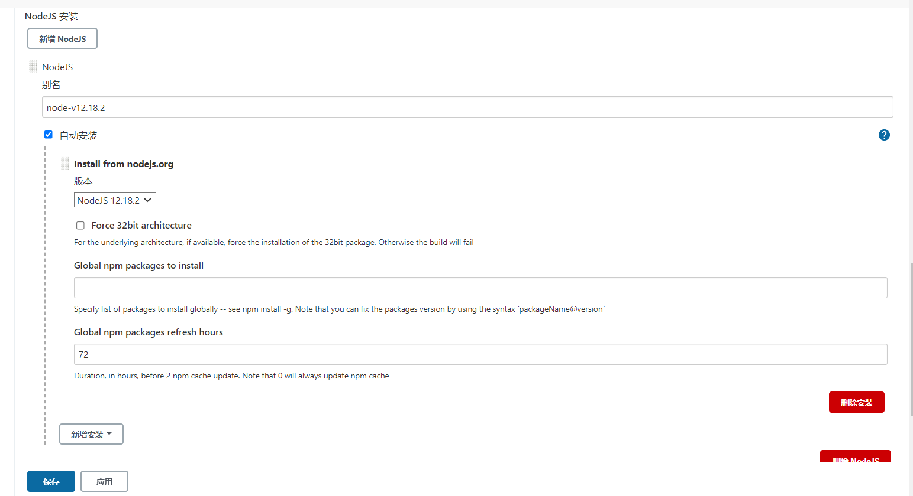

> 部署web应用的话，nodejs则会经常使用，但是在jenkins脚本式流水线中node则需要另外配置；

1. jenkins版本：2.291

2. 配置安装指定版本的Nodejs；

   - 点击【系统设置】找到【全局工具配置】；

   - 找到nodejs配置选项；配置完成单击确认；

     

3. 配置；

   ```javascript
   node {
   	stage('git clone') {
   		sh 'echo git clone';
   	}
   	stage('nodejs') {
   	   sh 'echo nodejs'
       // 这里括号里面的内容为上面你配置的Nodejs的别名；
   	   nodejs('node-v12.18.2') {
          	  // 这种方式都可以执行
   	        sh("node -v && npm -v")
   	        sh 'node -v'
   	    }
   	}
   }
   ```

   

