> 传统的（基于Web的）Jenkins自由风格类型任务包含一个构建后操作部分，在那里用户可以添加一些在构建结束后一定发生的行为，不管构建的状态是成功、失败或者被中止。我们可以在脚本式和声明式流水线中复制这种功能。脚本式流水线依靠编程结构来仿效这个功能，而声明式流水线使用内置的功能实现。
>
> 我的jenkins版本：2.291

## 构建后发送通知

> 在项目部署结束后，我们总希望可以得到一些通知例如：构建状态、构建日志等，所以项目构建完成后发送一些通知，是常见的需求

### 安装插件;

1. 进入：系统管理->插件管理；

2. 搜索插件：`Email Extension`；

3. 选中然后安装【建议安装完成重启一下jenkins服务】；

   

### 系统配置；

1. 进入：系统管理-> 系统配置

2. 找到：`Extended E-mail Notification`这一项；

   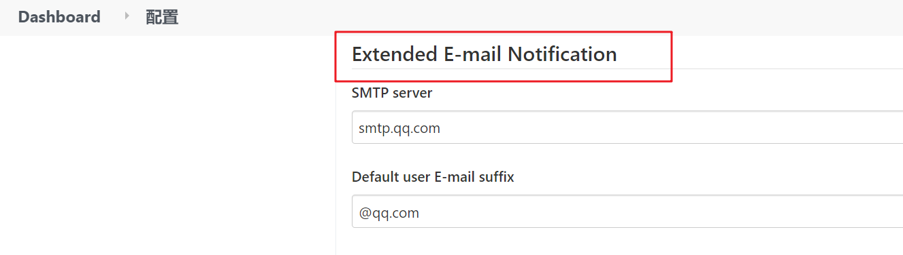

3. 填写表单；

   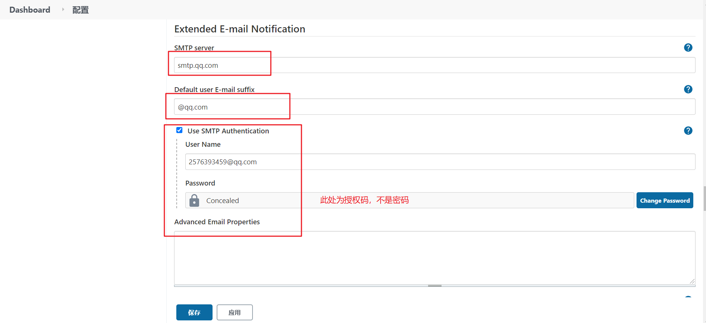

   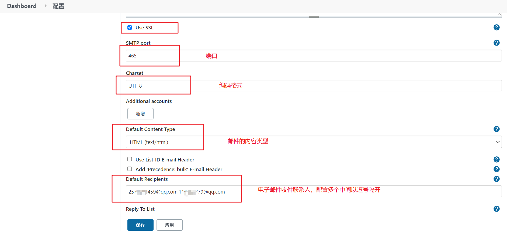

   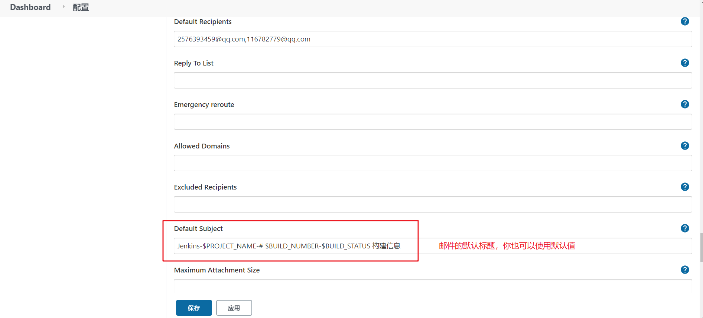

   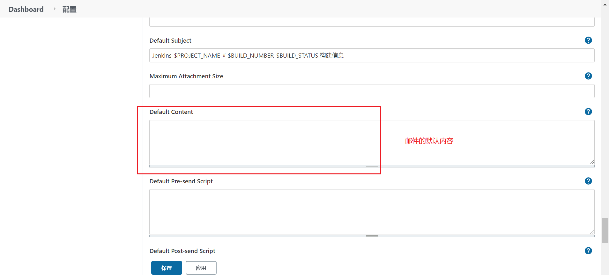

   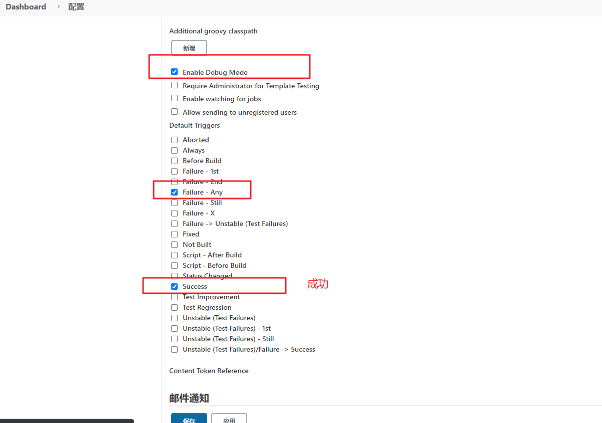

4. 邮件主体模板: 上图中的默认内容部分，可以直接使用以下模板；

   ```html
   <!DOCTYPE html>
       <html>
       <head>
       <meta charset="UTF-8">
       <title>${PROJECT_NAME}-第${BUILD_NUMBER}次构建日志</title>
       </head>
   
       <body leftmargin="8" marginwidth="0" topmargin="8" marginheight="4"
           offset="0">
           <table width="95%" cellpadding="0" cellspacing="0"
               style="font-size: 11pt; font-family: Tahoma, Arial, Helvetica, sans-serif">
               <tr>
                   <td>(本邮件是程序自动下发的，请勿回复！)</td>
               </tr>
               <tr>
                   <td><br />
                   <b><font color="#0B610B">构建信息($BUILD_STATUS)</font></b>
                   <hr size="2" width="100%" align="center" /></td>
               </tr>
               <tr>
                   <td>
                       <ul>
                           <li>项目名称 ： ${PROJECT_NAME}</li>
                           <li>构建编号 ： 第${BUILD_NUMBER}次构建</li>
                           <li>触发原因 ： ${CAUSE}</li>
                           <li>项目地址 ： <a href="${PROJECT_URL}">${PROJECT_URL}</a></li>
                           <li>构建日志 ： <a href="${BUILD_URL}console">${BUILD_URL}console</a></li>
                           <li>工作目录 ： <a href="${BUILD_URL}ws">${BUILD_URL}ws</a></li>
                           <li>Allure Report ： <a href="${BUILD_URL}allure">${BUILD_URL}allure</a></li>
                       </ul>
                   </td>
               </tr>
               <tr>
                   <td><b><font color="#0B610B">构建日志(最后100行):</font></b>
                   <hr size="2" width="100%" align="center" /></td>
               </tr>
               <tr>
                   <td><textarea cols="80" rows="30" readonly="readonly"
                           style="font-family: Courier New">${BUILD_LOG, maxLines=100}</textarea>
                   </td>
               </tr>
           </table>
       </body>
       </html>
   ```

   > 可以直接粘贴复制使用；

### 邮箱开启SMTP;

1. 电脑端登录你的qq邮箱网页版；

2. 顶部找到：设置->账户；

3. 开启SMTP;点击开启，会自动生成授权码，

   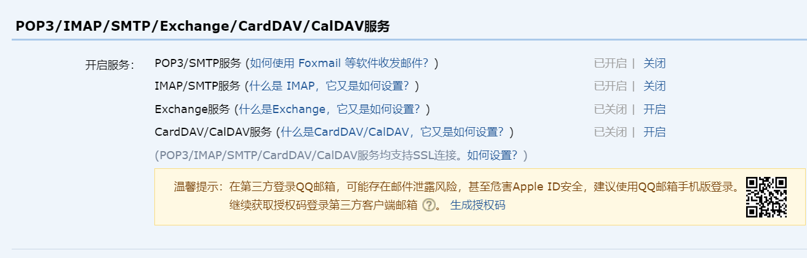

**配置结束**

## 自由风格的项目

> 这种风格的项目有一个构建后操作的选项卡，我们可以在里面配置我们的电子邮件；

### 构建后操作，填写表单；

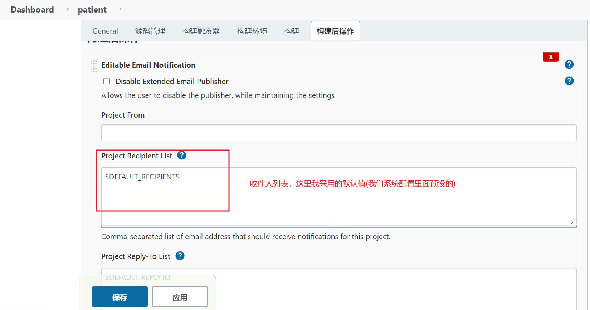

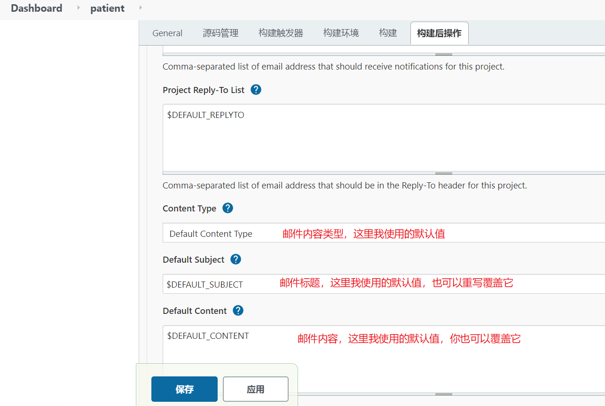


### 触发器；

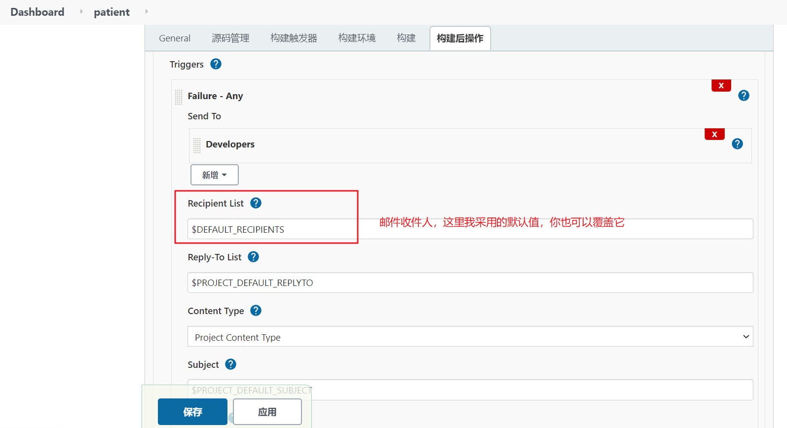

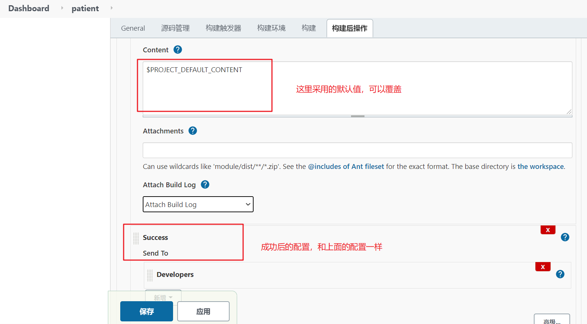

> 其他表单直接默认值，不修改即可，如有需要也可以自定义配置；

### 构建项目；

构建日志;

```shell
Checking if email needs to be generated
Email was triggered for: Success
Sending email for trigger: Success
messageContentType = text/html; charset=UTF-8
Request made to attach build log
  Collecting change authors...
    build: 47
Adding recipients from trigger recipient list
Analyzing: 2576xxx459@qq.com,116xxx2779@qq.com
Looking for: 257xxxx3459@qq.com
	starting at: 0
	firstFoundIdx: 0
	firstFoundIdx-substring: 25763xxx59@qq.com,116xxxx79@qq.com
	=> found type: 0
......
Looking for: 11xxx2779@qq.com
	starting at: 18
	firstFoundIdx: 18
	firstFoundIdx-substring: 116xxx2779@qq.com
	=> found type: 0
Successfully created MimeMessage
Sending email to: 257xxx93459@qq.com 116xx2779@qq.com
Finished: SUCCESS
```

邮件内容；

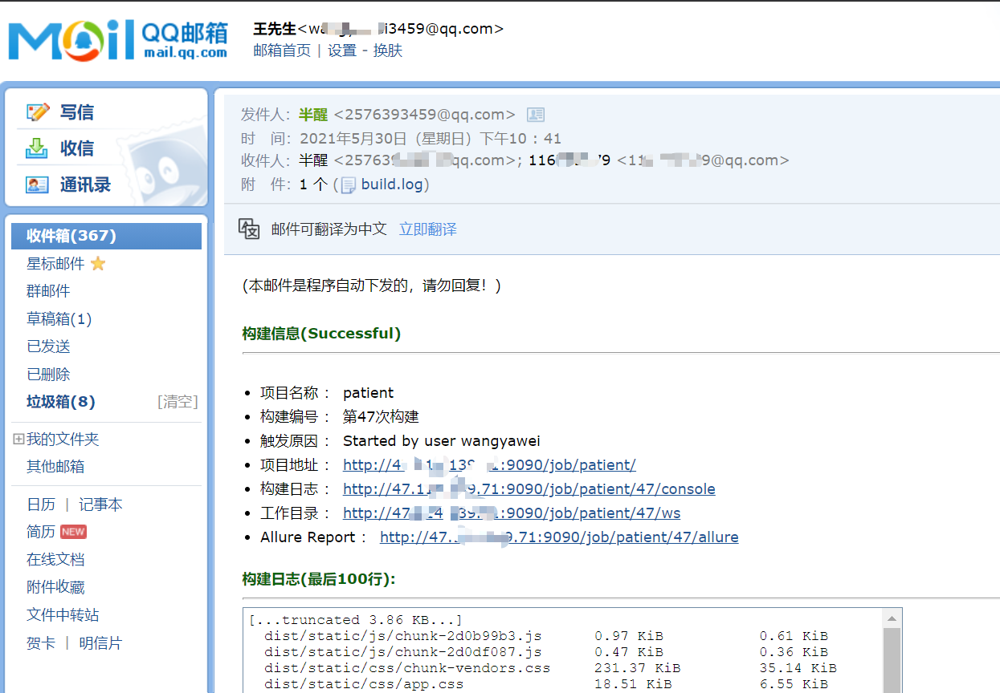

## 流水线项目

> 这里我使用的是脚本式流水线；以下的配置前提是你已经有一个流水线项目，并且完成了前面最基础的配置；

1. 新建一个阶段：'email'

   ```javascript
   node {
   	stage('email') {
   	    emailext attachLog: true, body: 'jenkins构建成功', to: '123@qq.com', subject: 'jenkins构建信息';
   	}
   }
   ```

   ##### 参数解释：

   1. attachLog：表示发送邮件的时候会把日志作为附件，一起发送；
   2. body：发送的邮件的主体内容；例：jenkins构建成功；
   3. to：要发送的联系人邮件地址；例：12345@qq.com;
   4. subject: 邮件的主题；例：jenkins构建信息；

2. 简单流程；

   ```javascript
   node {
   	stage('git clone') {
   		git credentialsId: '16fc630b-8061-40f8-9dda-0723a2d79xxx', url: 'https://github.com/xxw-s/documents.git';
   		sh 'pwd';
   		sh 'ls'
   	}
   	stage('email') {
   	    emailext attachLog: true, body: 'jenkins构建成功', to: '123@qq.com', subject: 'jenkins构建信息';
   	}
   }
   ```

3. 日志；

   ```shell
   ......
   Looking for: 2576393459@qq.com
   	starting at: 0
   	firstFoundIdx: 0
   	firstFoundIdx-substring: 257xxx459@qq.com
   	=> found type: 0
   Adding recipients from trigger recipient list
   Successfully created MimeMessage
   Sending email to: 2576xxx9@qq.com
   [Pipeline] }
   [Pipeline] // stage
   [Pipeline] }
   [Pipeline] // node
   [Pipeline] End of Pipeline
   Finished: SUCCESS
   ```

4. 邮件内容；

   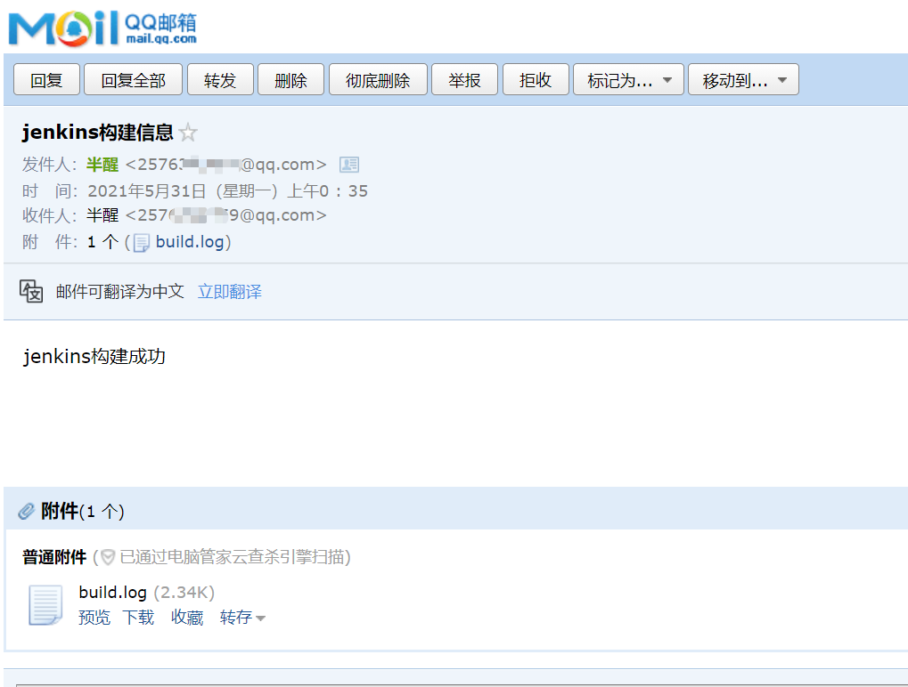
   
5. 使用全局配置的默认值；

   ```javascript
   node {
   	stage('git clone') {
   		git credentialsId: '16fc630b-8061-40f8-9dda-0723a2d7xxx', url: 'https://github.com/xxx-s/documents.git';
   		sh 'pwd';
   		sh 'ls'
   	}
   	stage('email') {
   	    emailext attachLog: true, body: '''$DEFAULT_CONTENT''', to: '''$DEFAULT_RECIPIENTS''', subject: '''$DEFAULT_SUBJECT''';
   	}
   }
   ```

   > 这里我使用了三重双引号，这是Groovy的特征，其中三重双引号用于封装多行消息，可以直接插入带有变量的字符串；
   >
   > body、to、subject，这三处我使用的是默认值(全局配置里预先配置好的)；当然你也可以使用这是插件提供的；

## 错误处理；

> 脚本式流水线没有内置支持构建后处理。在脚本式流水线中，当我们还没有内置功能时，通常依靠Groovy程序结构来提供此功能。这也意味着在这种情况下，我们会使用try-catch-finally机制。然而，Jenkins DSL包含了另一个步骤，可以作为try-catch-finally功能的快捷方式：catchError。这个catchError步骤对多种场景都有用，此处对于构建后用例非常适用。

1. 使用`try catch finally`；

   ```javascript
   node {
   	try {
   	    stage('git clone') {
       		git credentialsId: '16fc630b-8061-40f8-9dda-0723a2d7xxx2', url: 'https://github.com/wxx-s/documents.git';
       		sh 'pwd';
       		sh 'ls'
       	}
   	}
   	catch (err) {
   		// 捕获错误
   		echo '错误${err}'
   	} 
   	finally {
       // 无论结果如何都执行；
   		stage('email') {
   	    	emailext attachLog: true, body: '''$DEFAULT_CONTENT''', to: '''$DEFAULT_RECIPIENTS''', subject: '''$DEFAULT_SUBJECT''';
   		}
   	}
   }
   ```

2. 简写方式：`catchError`;

   ```javascript
   node {
   	catchError {
   	    stage('git clone') {
       		git credentialsId: '16fc630b-8061-40f8-9dda-0723a2d79xxx', url: 'https://github.com/xxw-s/documents.git';
       		sh 'pwd';
       		sh 'ls'
       	}
   	}
   	// 无论结果如何都执行；
      stage('email') {
        emailext attachLog: true, body: '''$DEFAULT_CONTENT''', to: '''$DEFAULT_RECIPIENTS''', subject: '''$DEFAULT_SUBJECT''';
     }
   }
   ```

## 整体配置

> 这是个人的博客项目的流水线的整体配置；如要使用，请预先完成前面的插件配置；

```javascript
node {
    properties([
        pipelineTriggers([githubPush(), pollSCM('')])
    ])
	catchError {
	    stage('git clone') {
    		git credentialsId: '16fc630b-8061-40f8-9dda-0723a2d7xxx', url: 'https://github.com/xxxw-s/documents.git';
    		sh 'pwd';
    		sh 'ls'
    	}
    	stage('npm install') {
    	   nodejs('node-v12.18.2') {
    	       sh 'node -v && npm -v';
    	       sh 'npm install';
    	    }
    	}
    	stage('npm build') {
    	   nodejs('node-v12.18.2') {
    	       sh 'npm run docs:build';
    	    }
    	}
    	stage('deploy') {
    	   nodejs('node-v12.18.2') {
    	       sh('''
    	       cd ./docs/.vuepress/dist;
    	       tar -zcvf docs.tar.gz *;
    	       mv docs.tar.gz /home/local/webview/documents;
    	       cd /home/local/webview/documents;
    	       tar -zxvf docs.tar.gz;
    	       rm -rf docs.tar.gz
    	       pwd;
    	       ls;
    	       ''')
    	    }
    	}
	}
	stage('email') {
	    emailext attachLog: true, body: '''$DEFAULT_CONTENT''', to: '''$DEFAULT_RECIPIENTS''', subject: '''$DEFAULT_SUBJECT''';
	}
}
```

