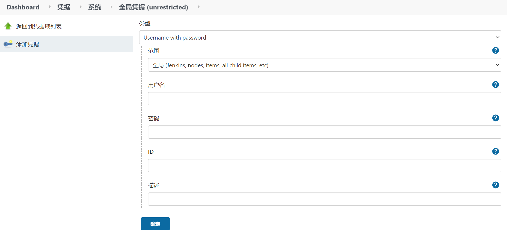

> 以下操作默认你已新建节点并打上了 worker1的标签；

1. 语法方式1：原始写法

   ```javascript
   node('worker1') {
   	stage('Source') {
   		// 从Git仓库中获取代码
   		git([credentialsId: '16fc630b-8061-40f8-9dda-0723a2d794c2', url: 'https://github.com/wyw-s/documents.git']);
   	}
   }
   ```

2. 语法方式2: 映射语法：

   ```javascript
   node('worker1') {
   	stage('Source') {
   		// 从Git仓库中获取代码 并指定凭据
   		git credentialsId: '16fc630b-8061-40f8-9dda-0723a2d794c2', url: 'https://github.com/wyw-s/documents.git';
   	}
   }
   ```

3. 语法方式3 简写方式:

   ```javascript
   node('worker1') {
   	stage('Source') {
   		// 从Git仓库中获取代码
         // 如果只有一个必选参数，同时只传递一个值，那么参数名称可以被省略，从而实现简写；
   		git 'https://github.com/wyw-s/documents.git';
   	}
   }
   ```

1. 添加凭据的表单；
   - 类型选择 `Username with password`;
   - 用户名：githup 登录账户；
   - 密码： githup 登录密码；
   - ID：不填写的话，jenkins会自动生成；

