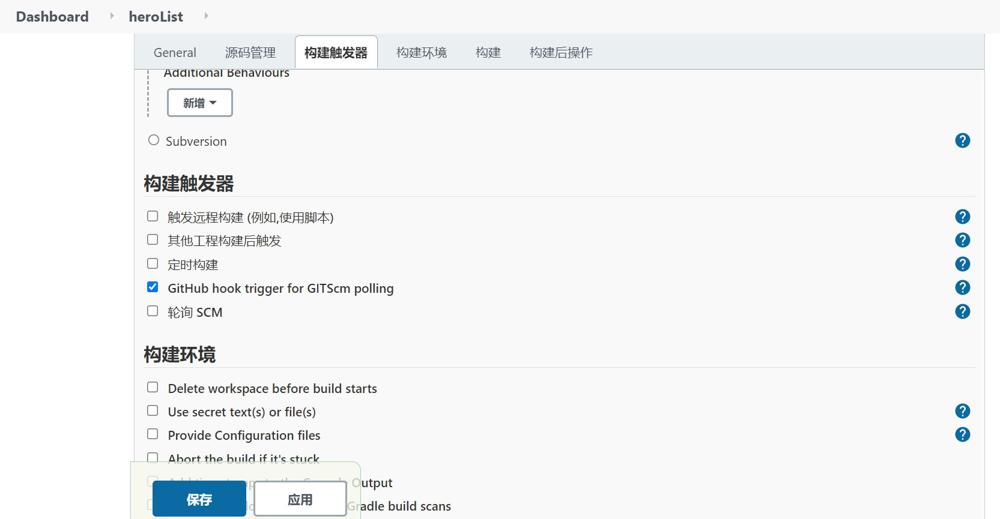
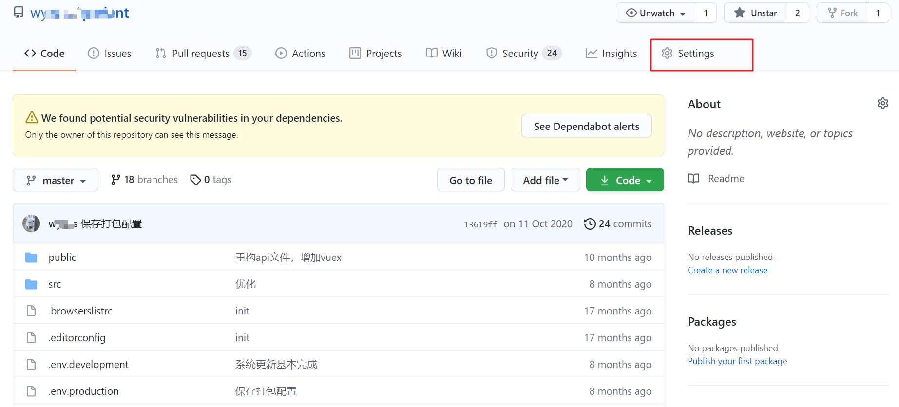
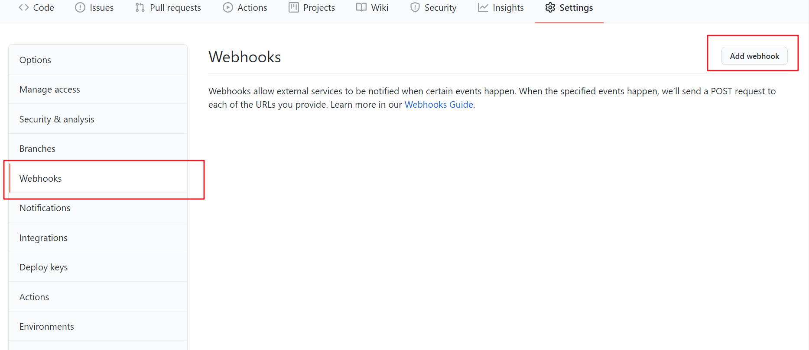
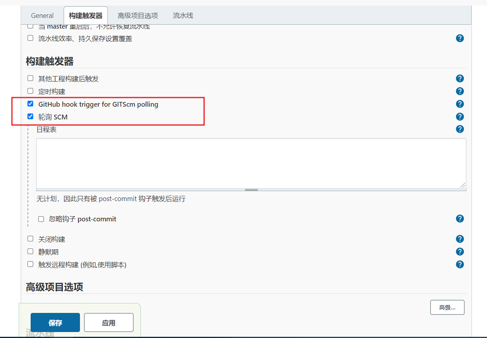

> 对于程序员来说，子githup提交项目是一件非常平常的事情，有些时候我们也会把我们的项目部署到服务器上，在结合jenkins，我们就可以在Push到githup时触发jenkins构建我们的项目，这样就可以实现自动化部署；

## 自由风格的软件项目

1. 项目类型：**自由风格的软件项目**；

2. 在你的项目配置中勾选：`GitHub hook trigger for GITScm polling`

   

3. 登录你的githup；

4. 找到你部署的项目，点击：`Settings`按钮；

   

5. 找到`WebHooks`,点击`Add webhook`;

   

6. 填写表单；填写完成点击 `Add webhookk`按钮；

   

7. 在本地`git push`你的项目，jenkins则会自动构建；

::: warning

以上示例默认你已经有一个`jenkins`项目并且已经可以执行手动构建;

:::

## 流水线类型项目

> 语法：脚本式流水线

1. 在你的项目配置中勾选：`GitHub hook trigger for GITScm polling`

2. **勾选：轮询SCM；**

   

3. 后面步骤与**自由风格的软件项目**介绍相同；

## 使用脚本式语法

> 使用：properties 配置属性；并添加 githubPush()。pollSCM 用于设置轮询的可有可无；

```javascript
node {
  // 重点：
  properties([
    pipelineTriggers([githubPush(), pollSCM('')])
  ])
  
	stage('git clone') {
		git credentialsId: '16fc630b-8061-40f8-9dda-0723a2d7xxxx2', url: 'https://github.com/xxxw-s/documents.git';
		sh 'pwd';
		sh 'ls'
	}
}
```

