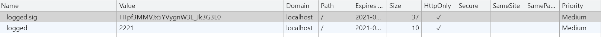

> cookie是web应用维持少量数据的一种手段，通过cookie，服务端可以标识用户以及用户身份。由于cookie存放在浏览器端，存在篡改风险，因此web应用一般会在存放数据的时候同时存放一个签名cookie，以保证cookie内容不被篡改。

**koa中需要配置cookie签名密钥才能使用cookie功能，否则会报错；**

```javascript
const Koa = require('koa');
const app = new Koa();
app.keys = ['qwer']
```

## 写入cookie：

```javascript
const Koa = require('koa');
const app = new Koa();

app.keys = ['qwer']

app.use(async (ctx) => {
    ctx.cookies.set('logged', 2221, {
        signed: true,
        httpOnly: true,
        maxAge: 3600 * 24 * 1000
    });
    ctx.body = JSON.stringify(ctx, null, 4)
})

app.listen(3000);
```

访问：http://localhost:3000，浏览器查看cookie，结果如下：



> 可以看到除了我们设置的“logged”之外，多了个“logged.sig”，这就是用来签名的Cookie。服务端读取“logged”时，还会同时读取“logged.sig”，一旦发现签名不匹配，则读取到的cookie值为“undefined”。

## 读取cookie

```javascript
const Koa = require('koa');
const app = new Koa();

app.keys = ['qwer']

app.use(async (ctx) => {
    const loggged = ctx.cookies.get('logged', { signed: true })
    ctx.body = loggged
})

app.listen(3000);
```

访问：http://localhost:3000，浏览器显示 2221

::: tip

ctx.cookie.get()建议传递signed选项来验证签名，否则cookie将有篡改风险；

:::

## cookie解析中间件

> 与上面的中间件不同，本节编写的中间件解析完请求cookie之后，需要将其挂载到ctx.state中，然后在路由中间件使用。

```javascript
const Koa = require('koa');
const app = new Koa();

app.use((ctx, next) => {
    const headerCookie = ctx.headers.cookie;
    ctx.state.cookie = {};
    if (headerCookie) {
        const cookies = headerCookie.split(';');
        cookies.forEach((cookie) => {
            const parts = cookie.split('=');
            ctx.state.cookie[parts[0]] = parts[1];
        })
    }
    next();
})

app.use((ctx) => {
    ctx.body = ctx.state.cookie;
})

app.listen(3000);
```

访问：http://localhost:3000，浏览器显示:

```bash
{"logged":"2221"," logged.sig":"wrwaefesrg"}
```

::: tip

建议将中间件中处理完的自定义数据挂载到ctx.state下。

:::
