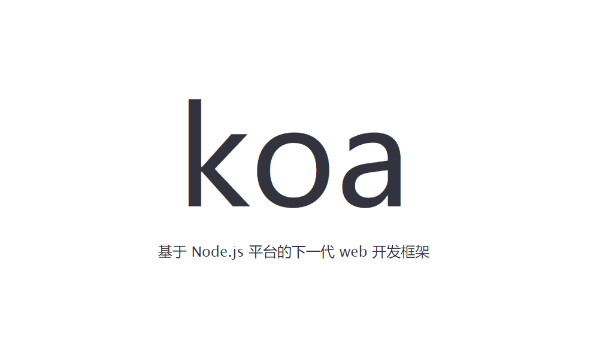

> Koa是Express背后的团队设计的一个新的web框架，其目标是为web应用程序和api提供一个更小、更富表现力、更健壮的基础。 通过利用异步函数，Koa允许您放弃回调并极大地增加错误处理。 Koa在其核心中没有捆绑任何中间件，它提供了一套优雅的方法，使编写服务器变得快速和愉快。  

由于Koa核心不捆绑任何中间件，因此koa核心是“纯净的”，这极大的方便了用户的扩展。此外，koa使用了Peomise、async/await语法来进行移步编程，而express是基于事件和回调的。

**koa框架和express框架的主要差别在于异步编程和中间件方面，其他特性是相似的。**

- Express框架使用回调来进行异步处理，这也是Node.js标准的做法。但是基于回调的异步编程模型在多个异步操作之间有顺序依赖时，会产生回调地狱（Callback Hell），也就是多层callback嵌套问题，代码不利于维护。
- Koa框架使用了ES2017最新的async/await语法来进行异步编程，从根本上解决了传统Node.js异步编程风格存在的问题，但是需要将异步调用包装为Promise。

::: tip

由于Koa进行异步调用时强制使用async/await，因此需要将异步回调方法转换为Promise，如果每个回调方法都需要自己包装的话，工作量还是有点大，这一问题目前最好的解决方案—Bluebird。

:::

