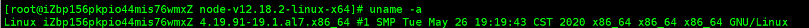
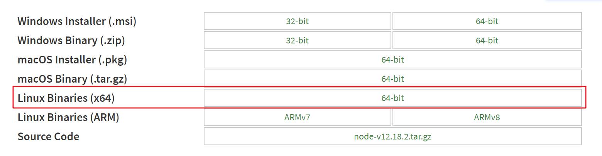
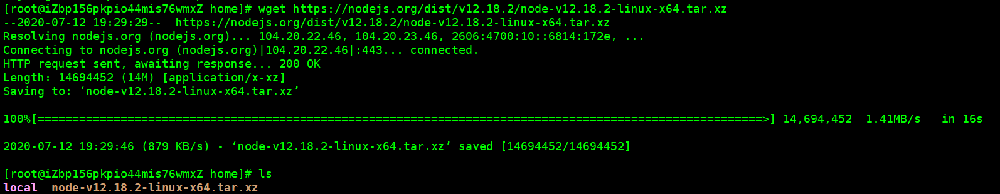
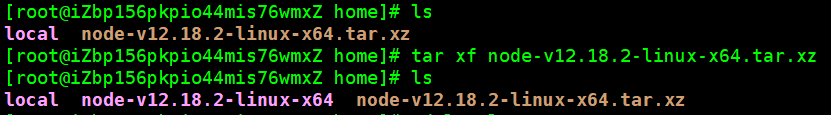
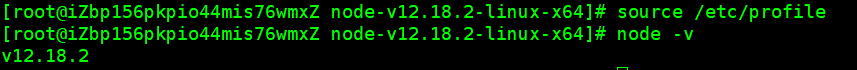

## 1、下载安装包；

- 系统环境；

  ```
  命令：uname -a
  ```

  

- [安装包](https://nodejs.org/dist/v12.18.2/node-v12.18.2-linux-x64.tar.xz)

  

- 下载；

  ```
  命令：wget https://nodejs.org/dist/v12.18.2/node-v12.18.2-linux-x64.tar.xz
  ```

  

## 2、解压；

```
命令：tar xf node-v12.18.2-linux-x64.tar.xz 
```



## 3、添加环境变量；

```
命令：vim /etc/profile
```


- 立即生效；

  ```
  命令：source /etc/profile
  ```

  

-  安装成功！ 
