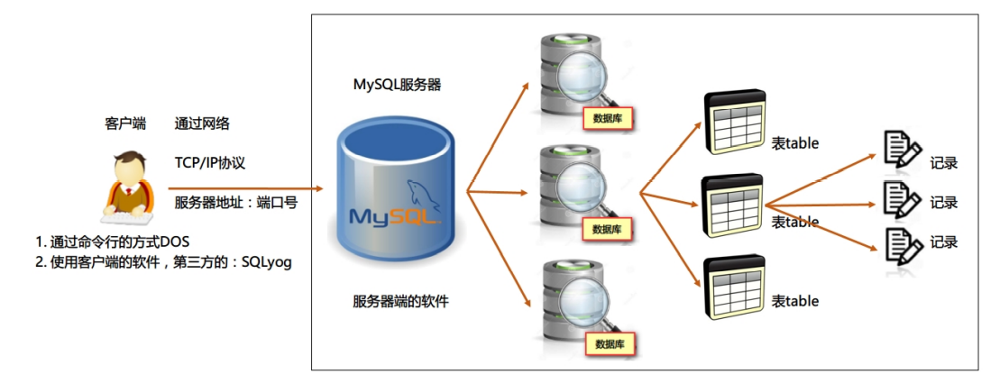
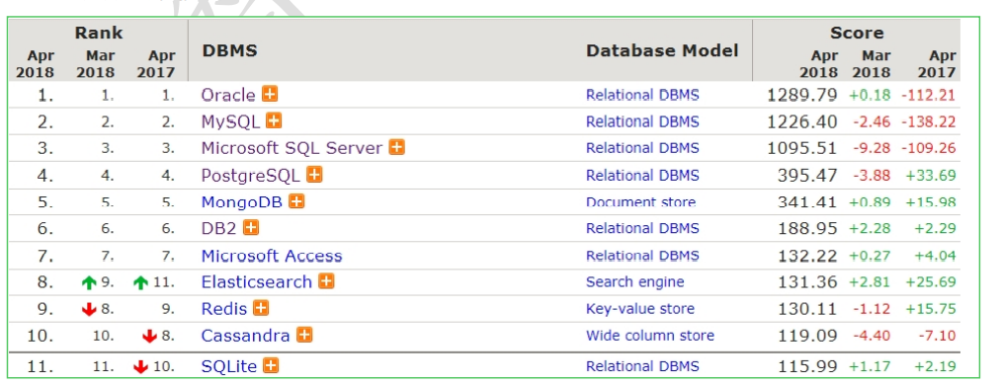

## 数据库概述

### 什么是数据库

- 用于存储和管理数据的仓库。
- 本质上是一个文件系统，还是以文件的方式存在服务器的电脑上的。 
- 所有的关系型数据库都可以使用通用的 SQL 语句进行管理 DBMS DataBase Management System。

> 数据库: DataBase 简称： DB

### 数据库的特点

- 持久化存储数据。
- 方便存储和管理数据。
- 使用了统一的方式(SQL)操作数据库。

**数据的存储方式**：

| 储存位置 | 优点                                                         | 缺点                         |
| -------- | ------------------------------------------------------------ | ---------------------------- |
| 内存     | 速度快                                                       | 不能永久保存，数据是临时状态 |
| 文件     | 数据可以永久保存                                             | 查询某个数据数据操作不方便   |
| 数据库   | 1、持久化存储数据。 2、方便存储和管理数据。 3、使用了统一的方式(SQL)操作数据库 | 1、暂用资源 2、需要购买 |

## 数据库管理系统

> 数据库管理系统（DataBase Management System，DBMS）：指一种操作和管理数据库的大型软件，用于建 立、使用和维护数据库，对数据库进行统一管理和控制，以保证数据库的安全性和完整性。用户通过数据库管理 系统访问数据库中表内的数据。

数据库管理程序(DBMS)可以管理多个数据库，一般开发人员会针对每一个应用创建一个数据库。为保存应用 中实体的数据，一般会在数据库创建多个表，以保存程序中实体 User 的数据。

数据库管理系统、数据库和表的关系如图所示：

> 结论：
>
> - 一个数据库服务器包含多个库
> - 一个数据库包含多张表
> - 一张表包含多条记录

## 常见数据库排行榜

1. **MySQL：**开源免费的数据库，小型的数据库，已经被 Oracle 收购了。MySQL6.x 版本也开始收费。后来 Sun 公司收购了 MySQL，而 Sun 公司又被 Oracle 收购。
2. **Oracle：**收费的大型数据库，Oracle 公司的产品。
3. **DB2 ：**IBM 公司的数据库产品,收费的。常应用在银行系统中。
4. **SQL Server：**MicroSoft 公司收费的中型的数据库。C#、.net 等语言常使用。
5. **SQLite:** 嵌入式的小型数据库，应用在手机端，如：Android。

## 为什么选择 MySQL

1. 免费。
2. 功能强大。

