安装过程分成两个部分： 

1) 文件解压和复制过程，默认的安装目录： c:\Program Files\MySQL\MySQL Server 5.0
2) 安装好以后必须对 MySQL 服务器进行配置。

> 在 mysql 中管理员的名字：root

## 数据库的安装（msi）

下载安装包：[传送门](https://downloads.mysql.com/archives/community/)

### 步骤一

打开下载的 mysql 安装文件双击解压缩，运行“mysql-5.5.40-win64.msi”。

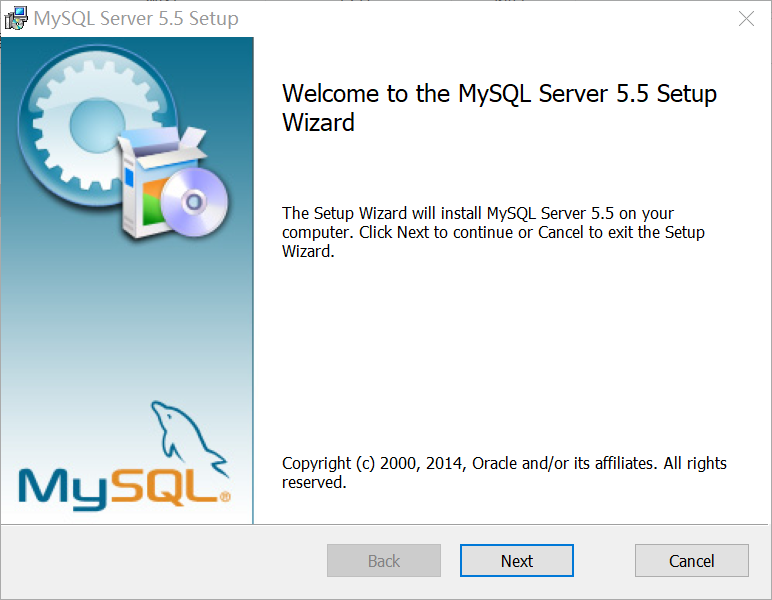

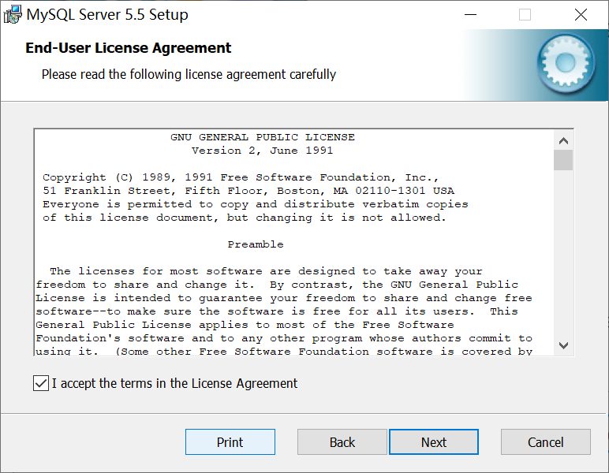

### 步骤二

选择安装类型：

1. 有“Typical（默认）
2. “Complete（完全）
3. “Custom（用户自定义）

选择“Custom”， 按“next”键继续

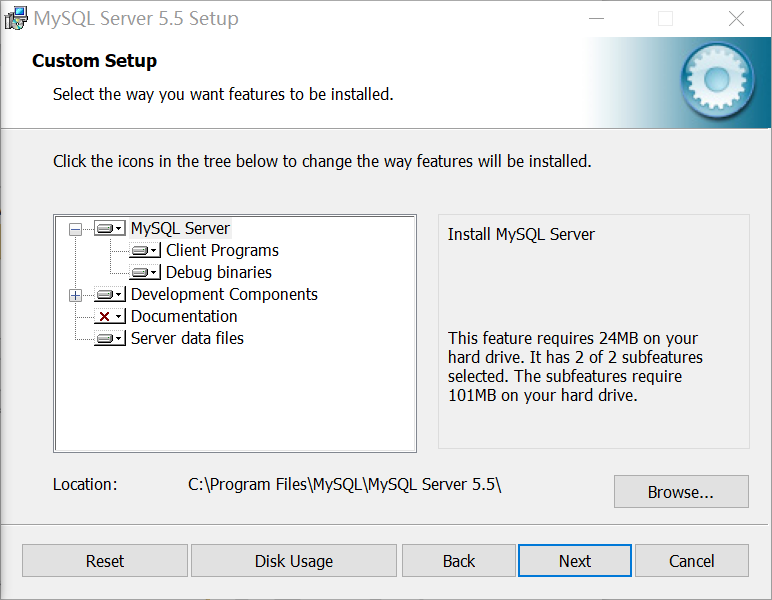

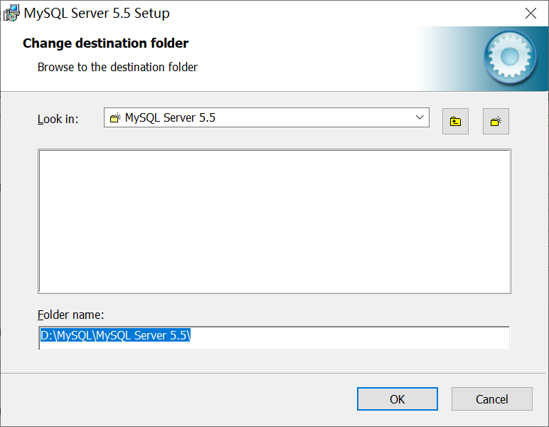


直到出现下面的界面, 则完成 MYSQL 的安装：出现如下界面将进入 mysql 配置向导


### 步骤三

数据库安装好了还需要对数据库进行配置才能使用 MYSQL 的配置，点击下一步。

选择配置方式：

- “Detailed Configuration（手动精确配置）”、
- “Standard Configuration（标准配置）”，

1. 我们选择“Detailed Configuration”，方便熟悉配置过程。

   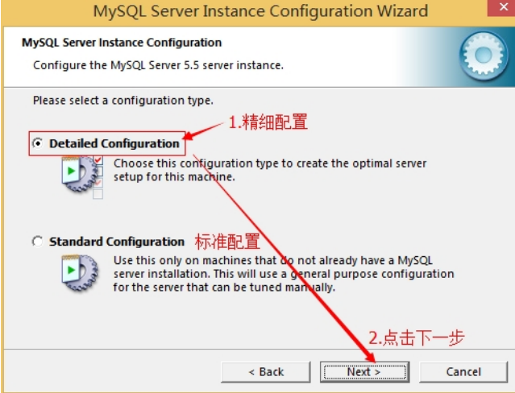

### 步骤四

   选择服务器类型：

   - Developer Machine（开发测试类，mysql 占用很少资源）
   - Server Machine（服务 器类型，mysql 占用较多资源）
   - Dedicated MySQL Server Machine（专门的数据库服务器，mysql 占 用所有可用资源）

   

### 步骤五

选择mysql数据库的大致用途，

- “Multifunctional Database（通用多功能型，好）”、
- “Transactional Database Only（服务器类型，专注于事务处理，一般）”、
- “Non-Transactional Database Only（非事务 处理型，较简单，主要做一些监控、记数用，对 MyISAM 数据类型的支持仅限于 non-transactional），按“Next” 继续。

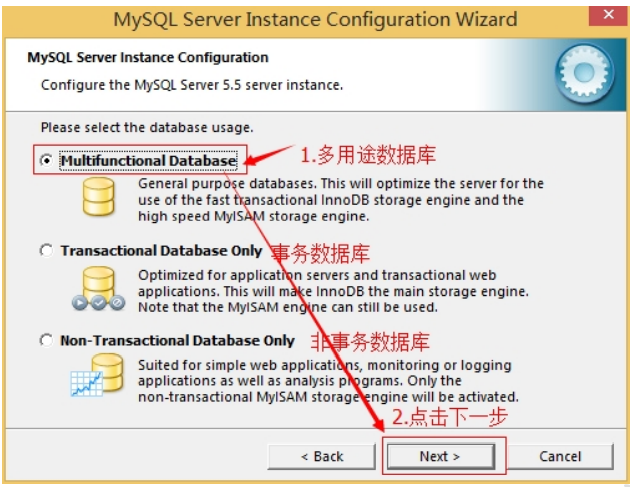

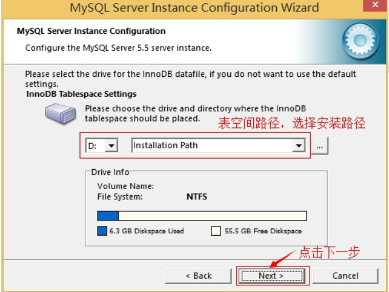

### 步骤六

选择网站并发连接数，同时连接的数目，

1. “Decision Support(DSS)/OLAP（20个左右）“Online ”、
2.  Transaction Processing(OLTP)（500 个左右）”、
3. “Manual Setting（手动设置，自己输一个数）”。

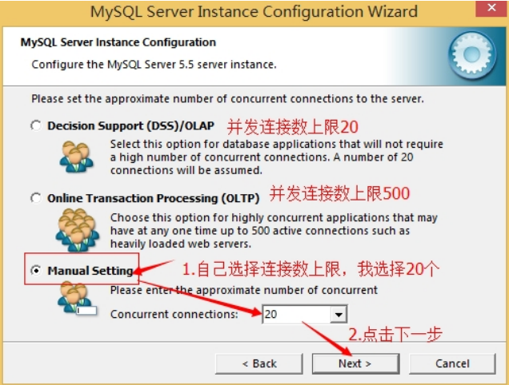

2. 是否启用 TCP/IP 连接，设定端口，如果不启用，就只能在自己的机器上访问 mysql 数据库了，在这个页 面上，您还可以选择“启用标准模式”（Enable Strict Mode），这样 MySQL 就不会允许细小的语法错误。 如果是新手，建议您取消标准模式以减少麻烦。但熟悉 MySQL 以后，尽量使用标准模式，因为它可以降 低有害数据进入数据库的可能性。按“Next”继续

   

3. 就是对 mysql 默认数据库语言编码进行设置（重要），一般选 UTF-8，按 “Next”继续。

   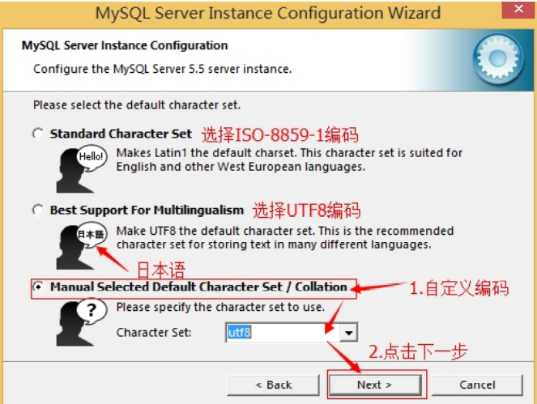

4. 选择是否将 mysql 安装为 windows 服务，还可以指定 Service Name（服务标识名称），是否将 mysql 的 bin 目录加入到 Windows PATH（加入后，就可以直接使用 bin 下的文件，而不用指出目录名，比如连接， “mysql.exe -uusername -ppassword;”就可以了，不用指出 mysql.exe 的完整地址，很方便），我这里全部 打上了勾，Service Name 不变。按“Next”继续。

   

5. 询问是否要修改默认 root 用户（超级管理）的密码。“Enable root access from remote machines（是否允 许 root 用户在其它的机器上登陆，如果要安全，就不要勾上，如果要方便，就勾上它）”。最后“Create An Anonymous Account（新建一个匿名用户，匿名用户可以连接数据库，不能操作数据，包括查询）”，一般就不用勾了，设置完毕，按“Next”继续。

   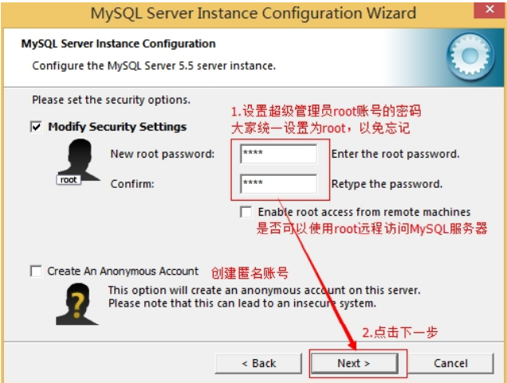

6. 确认设置无误，按“Execute”使设置生效，即完成 MYSQL 的安装和配置。

   

   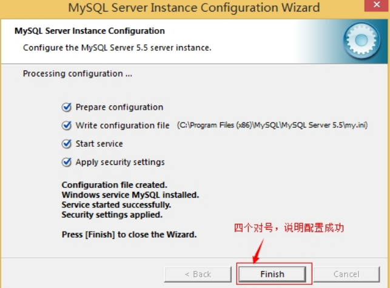

### 数据库的卸载（msi）

1. 停止 window 的 MySQL 服务。 找到“控制面板”-> “管理工具”-> “服务”，停止 MySQL 后台服务。

   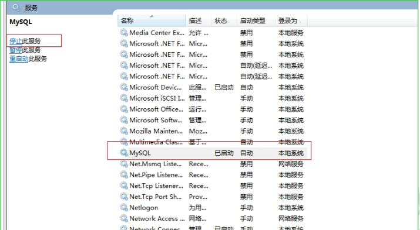

2. 卸载 MySQL 安装程序。找到“控制面板”-> "程序和功能"，卸载 MySQL 程序。

   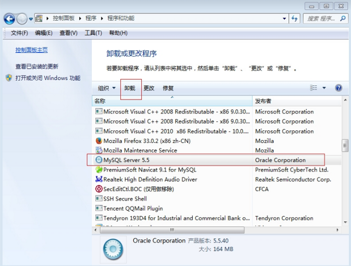

3. 删除 MySQL 安装目录下的所有文件。

4. 删除 c 盘 ProgramDate 目录中关于 MySQL 的目录。路径为：C:\ProgramData\MySQL(是隐藏文件,需要显示 出来)

## 数据库的安装（zip）

直接解压不需要安装；[mysql-8.0.20-winx64.zip]( https://dev.mysql.com/downloads/mysql/ )

### 添加环境变量


### 初始化`data`目录

> 在 管理员身份下打开 cmd

```
mysqld --initialize-insecure --user=mysql  
```

- 在D:\mysql\mysql-8.0.12-winx64  目录下生成data目录;

### 安装`mysql`


## 启动与登录

MySQL 服务器启动方式有两种：

1. 通过服务的方式自动启动 。
2. 手动启动的方式。

### Windows 服务方式启动

1. 【此电脑】-【管理】。
2. 【服务和应用程序】-【服务】找到mysql服务-【启动/停止】

### DOS 命令方式启动

1. 【win】+ r，输入cmd

2. ```bash
   C:\WINDOWS\system32>net start mysql
   MySQL 服务正在启动 .
   MySQL 服务已经启动成功。
   
   C:\WINDOWS\system32>net stop mysql
   MySQL 服务正在停止.
   MySQL 服务已成功停止。
   
   C:\WINDOWS\system32>
   ```

### 控制台连接数据库

MySQL 是一个需要账户名密码登录的数据库。它提供了一个默认的 root 账号，使用安装时设置的密码即可登录。

```bash
mysql -u 用户名 -p 密码
```
#### 方式一

```bash
# 直接输入账户名和密码
C:\WINDOWS\system32>mysql -uroot -proot
Welcome to the MySQL monitor.  Commands end with ; or \g.
Your MySQL connection id is 1
Server version: 5.5.40 MySQL Community Server (GPL)

Copyright (c) 2000, 2014, Oracle and/or its affiliates. All rights reserved.

Oracle is a registered trademark of Oracle Corporation and/or its
affiliates. Other names may be trademarks of their respective
owners.

Type 'help;' or '\h' for help. Type '\c' to clear the current input statement.

mysql>
```

#### **方式二**

```bash
# 后输入密码方式
C:\WINDOWS\system32>mysql -uroot -p
Enter password: ****
Welcome to the MySQL monitor.  Commands end with ; or \g.
Your MySQL connection id is 2
Server version: 5.5.40 MySQL Community Server (GPL)

Copyright (c) 2000, 2014, Oracle and/or its affiliates. All rights reserved.

Oracle is a registered trademark of Oracle Corporation and/or its
affiliates. Other names may be trademarks of their respective
owners.

Type 'help;' or '\h' for help. Type '\c' to clear the current input statement.

mysql>
```

#### 方式三

```bash
C:\WINDOWS\system32>mysql -h127.0.0.1 -uroot -proot
Welcome to the MySQL monitor.  Commands end with ; or \g.
Your MySQL connection id is 3
Server version: 5.5.40 MySQL Community Server (GPL)

Copyright (c) 2000, 2014, Oracle and/or its affiliates. All rights reserved.

Oracle is a registered trademark of Oracle Corporation and/or its
affiliates. Other names may be trademarks of their respective
owners.

Type 'help;' or '\h' for help. Type '\c' to clear the current input statement.

mysql>
```

#### 方式四

```bash
C:\WINDOWS\system32>mysql --host=127.0.0.1 --user=root --password=root
Welcome to the MySQL monitor.  Commands end with ; or \g.
Your MySQL connection id is 4
Server version: 5.5.40 MySQL Community Server (GPL)

Copyright (c) 2000, 2014, Oracle and/or its affiliates. All rights reserved.

Oracle is a registered trademark of Oracle Corporation and/or its
affiliates. Other names may be trademarks of their respective
owners.

Type 'help;' or '\h' for help. Type '\c' to clear the current input statement.

mysql>
```

### 修改用户密码

```mysql
ALTER USER '用户名'@'localhost' IDENTIFIED WITH mysql_native_password BY '新密码';

flush privileges;   --刷新MySQL的系统权限相关表
```


## 退出 MySQL

```bash
C:\WINDOWS\system32>mysql --host=127.0.0.1 --user=root --password=root
Welcome to the MySQL monitor.  Commands end with ; or \g.
Your MySQL connection id is 4
Server version: 5.5.40 MySQL Community Server (GPL)

Copyright (c) 2000, 2014, Oracle and/or its affiliates. All rights reserved.

Oracle is a registered trademark of Oracle Corporation and/or its
affiliates. Other names may be trademarks of their respective
owners.

Type 'help;' or '\h' for help. Type '\c' to clear the current input statement.

mysql> exit
Bye

C:\WINDOWS\system32>
```

## MySQL目录结构

| MySQL目录结构 | 描述                                 |
| ------------- | ------------------------------------ |
| bin           | 所有Mysql的可执行文件，如：mysql.exe |
| data          | 系统必须的数据库所在目录             |
| my.ini        | mysql的配置文件，一般不建议去修改    |

## 注意事项

设置完毕，按“Finish”后有一个比较常见的错误，就是不能“Start service”，一般出现在以前有安装 mysql 的服务器上，解决的办法，先保证以前安装的 mysql 服务器彻底卸载掉了；不行的话，检查是否按上面一步所说， 之前的密码是否有修改，照上面的操作；如果依然不行，将 mysql 安装目录下的 data 文件夹备份，然后删除，在 安装完成后，将安装生成的 data 文件夹删除，备份的 data 文件夹移回来，再重启 mysql 服务就可以了，这种情况 下，可能需要将数据库检查一下，然后修复一次，防止数据出错。


> 解决方法：卸载 MySQL,重装 MySQL