安装过程分成两个部分： 

1) 文件解压和复制过程，默认的安装目录： c:\Program Files\MySQL\MySQL Server 5.0
2) 安装好以后必须对 MySQL 服务器进行配置。

> 在 mysql 中管理员的名字：root

## 数据库的安装（msi）

下载安装包：

- [传送门1](https://downloads.mysql.com/archives/community/) **推荐**
- [传送门2](https://downloads.mysql.com/archives/installer/)

### 步骤一

打开下载的 mysql 安装文件双击解压缩，运行“mysql-5.5.40-win64.msi”。

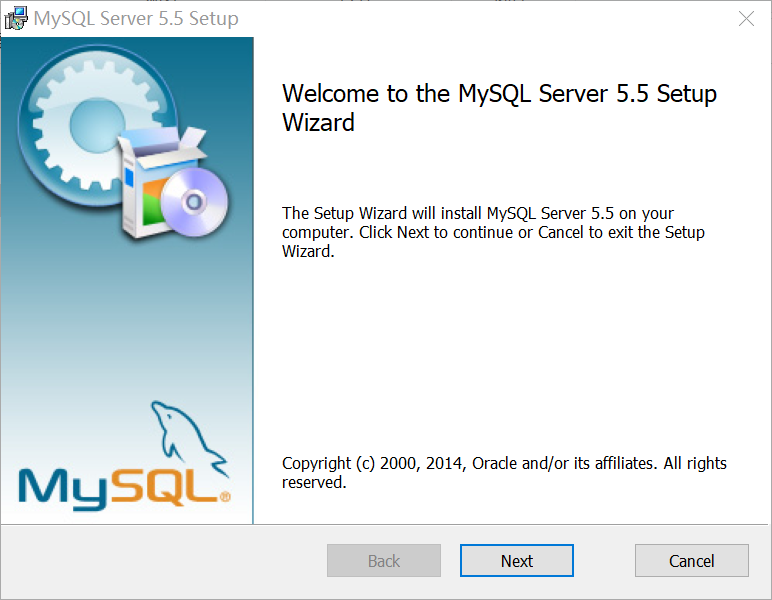

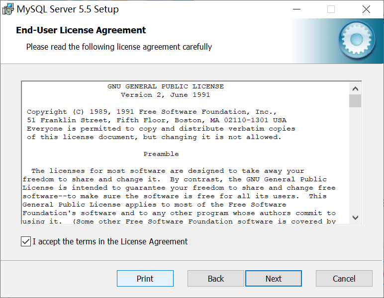

### 步骤二

选择安装类型：

1. 有“Typical（默认）
2. “Complete（完全）
3. “Custom（用户自定义）

选择“Custom”， 按“next”键继续

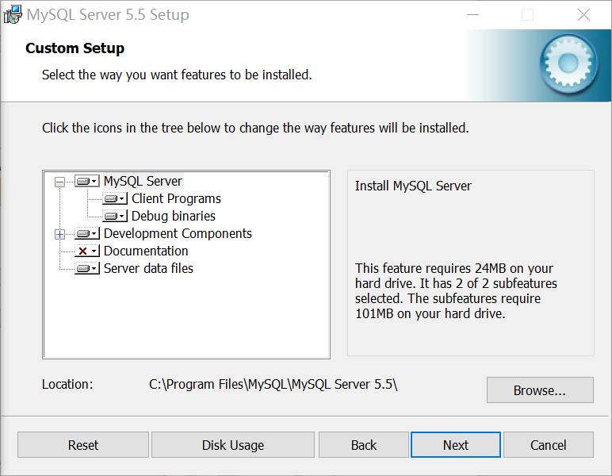

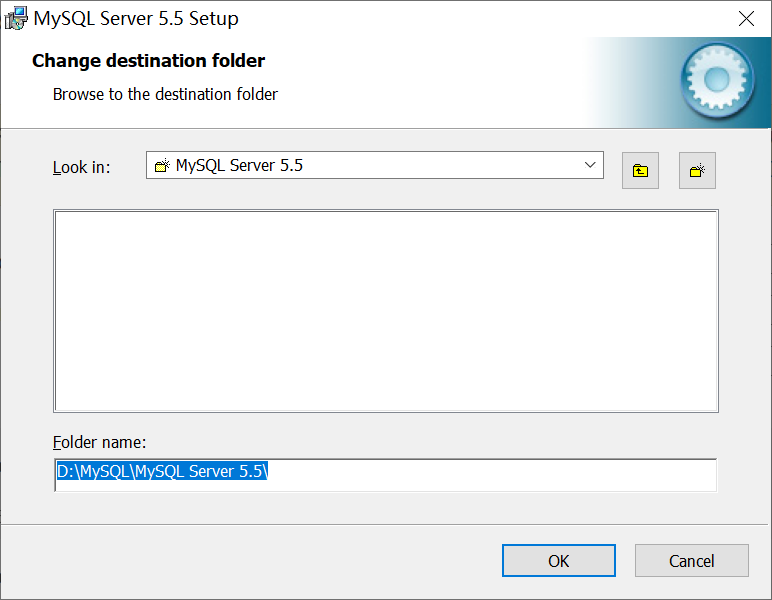

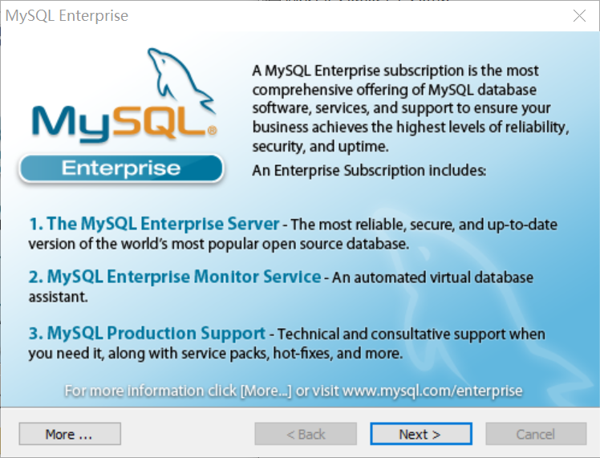

直到出现下面的界面, 则完成 MYSQL 的安装：出现如下界面将进入 mysql 配置向导

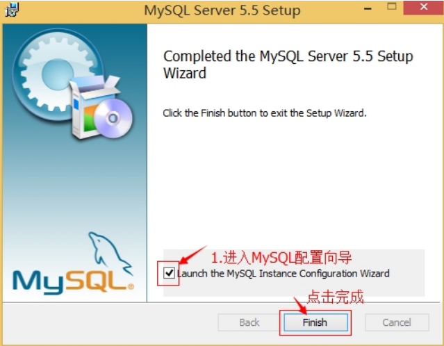

### 步骤三

数据库安装好了还需要对数据库进行配置才能使用 MYSQL 的配置，点击下一步。

选择配置方式：

- “Detailed Configuration（手动精确配置）”、
- “Standard Configuration（标准配置）”，

1. 我们选择“Detailed Configuration”，方便熟悉配置过程。

   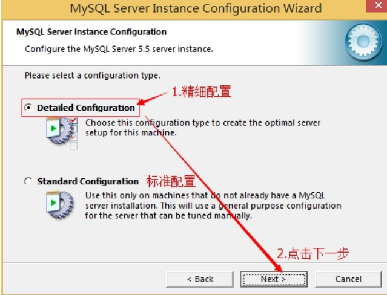

### 步骤四

   选择服务器类型：

   - Developer Machine（开发测试类，mysql 占用很少资源）
   - Server Machine（服务 器类型，mysql 占用较多资源）
   - Dedicated MySQL Server Machine（专门的数据库服务器，mysql 占 用所有可用资源）

   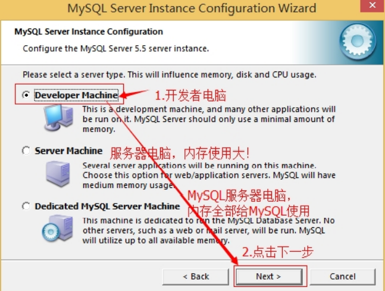

### 步骤五

选择mysql数据库的大致用途，

- “Multifunctional Database（通用多功能型，好）”、
- “Transactional Database Only（服务器类型，专注于事务处理，一般）”、
- “Non-Transactional Database Only（非事务 处理型，较简单，主要做一些监控、记数用，对 MyISAM 数据类型的支持仅限于 non-transactional），按“Next” 继续。

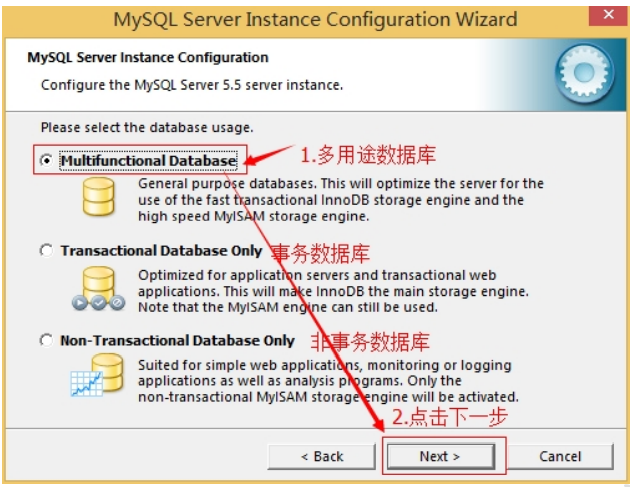

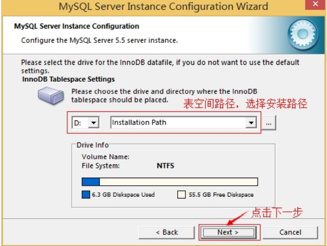

### 步骤六

选择网站并发连接数，同时连接的数目，

1. “Decision Support(DSS)/OLAP（20个左右）“Online ”、
2.  Transaction Processing(OLTP)（500 个左右）”、
3. “Manual Setting（手动设置，自己输一个数）”。

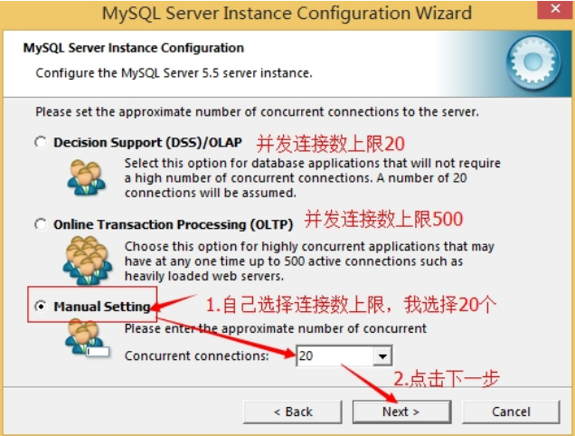

2. 是否启用 TCP/IP 连接，设定端口，如果不启用，就只能在自己的机器上访问 mysql 数据库了，在这个页 面上，您还可以选择“启用标准模式”（Enable Strict Mode），这样 MySQL 就不会允许细小的语法错误。 如果是新手，建议您取消标准模式以减少麻烦。但熟悉 MySQL 以后，尽量使用标准模式，因为它可以降 低有害数据进入数据库的可能性。按“Next”继续

   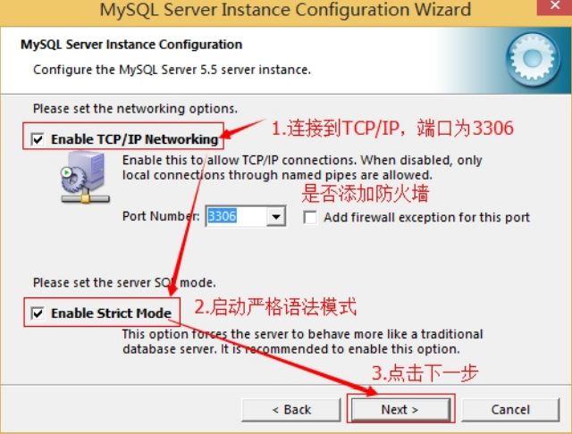

3. 就是对 mysql 默认数据库语言编码进行设置（重要），一般选 UTF-8，按 “Next”继续。

   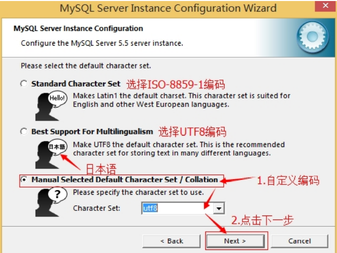

4. 选择是否将 mysql 安装为 windows 服务，还可以指定 Service Name（服务标识名称），是否将 mysql 的 bin 目录加入到 Windows PATH（加入后，就可以直接使用 bin 下的文件，而不用指出目录名，比如连接， “mysql.exe -uusername -ppassword;”就可以了，不用指出 mysql.exe 的完整地址，很方便），我这里全部 打上了勾，Service Name 不变。按“Next”继续。

   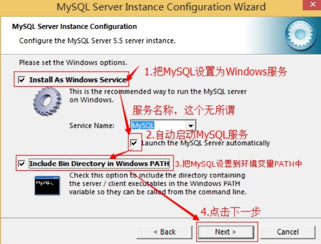

5. 询问是否要修改默认 root 用户（超级管理）的密码。“Enable root access from remote machines（是否允 许 root 用户在其它的机器上登陆，如果要安全，就不要勾上，如果要方便，就勾上它）”。最后“Create An Anonymous Account（新建一个匿名用户，匿名用户可以连接数据库，不能操作数据，包括查询）”，一般就不用勾了，设置完毕，按“Next”继续。

   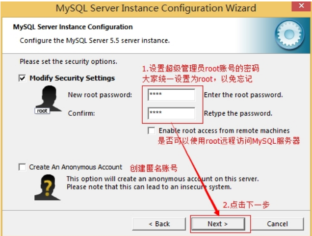

6. 确认设置无误，按“Execute”使设置生效，即完成 MYSQL 的安装和配置。

   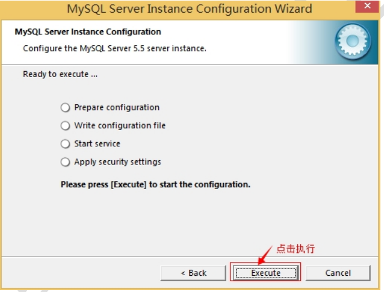

   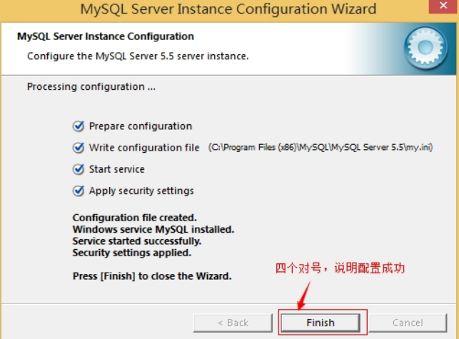

### 数据库的卸载（msi）

1. 停止 window 的 MySQL 服务。 找到“控制面板”-> “管理工具”-> “服务”，停止 MySQL 后台服务。

   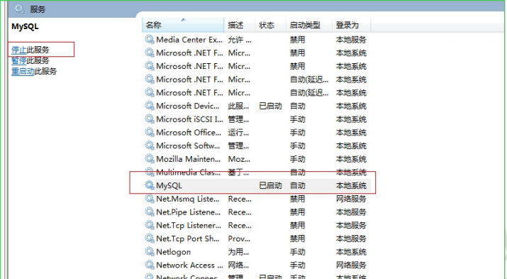

2. 卸载 MySQL 安装程序。找到“控制面板”-> "程序和功能"，卸载 MySQL 程序。

   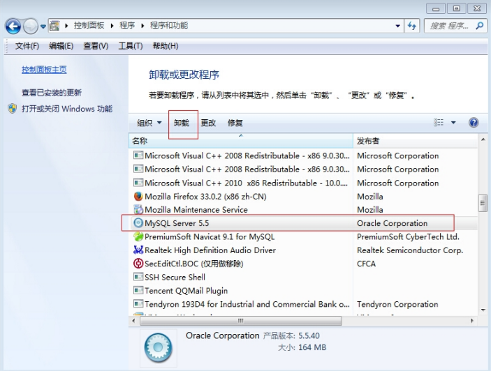

3. 删除 MySQL 安装目录下的所有文件。

4. 删除 c 盘 ProgramDate 目录中关于 MySQL 的目录。路径为：C:\ProgramData\MySQL(是隐藏文件,需要显示 出来)

## 数据库的安装（zip）【推荐】

**直接解压**不需要安装；[mysql-8.0.20-winx64.zip]( https://dev.mysql.com/downloads/mysql/ ) 此种安装的好处是不需要繁琐的配置；

### 添加环境变量

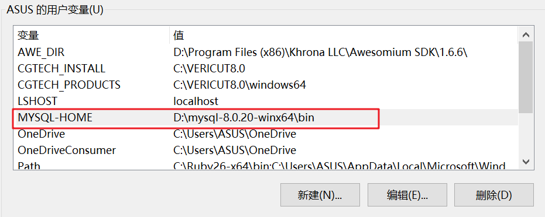

### 初始化`data`目录

> 管理员身份下打开 cmd; cd 到你的mysql安装包的bin目录下，比如我的目录：`D:\mysql\mysql-8.0.12-winx64\bin` ；

```
# 执行此命令
mysqld --initialize-insecure --user=mysql  
```

- 在D:\mysql\mysql-8.0.12-winx64  目录下生成data目录;

### 安装`mysql`

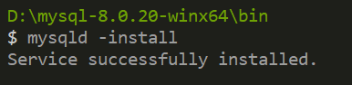

## MySQL目录结构

| MySQL目录结构 | 描述                                 |
| ------------- | ------------------------------------ |
| bin           | 所有Mysql的可执行文件，如：mysql.exe |
| data          | 系统必须的数据库所在目录             |
| my.ini        | mysql的配置文件，一般不建议去修改    |

## 启动与登录

MySQL 服务器启动方式有两种：

1. 通过服务的方式自动启动 。
2. 手动启动的方式。

### 服务方式启动

1. 【此电脑】-【管理】。
2. 【服务和应用程序】-【服务】找到mysql服务-【启动/停止】

### 手动启动

1. 【win】+ r，输入cmd

2. ```bash
   C:\WINDOWS\system32>net start mysql
   MySQL 服务正在启动 .
   MySQL 服务已经启动成功。
   
   C:\WINDOWS\system32>net stop mysql
   MySQL 服务正在停止.
   MySQL 服务已成功停止。
   
   C:\WINDOWS\system32>
   ```

### 登录

MySQL 是一个需要账户名密码登录的数据库。它提供了一个默认的 root 账号，使用安装时设置的密码即可登录。

> 直接解压的方式安装后，是可以不输入密码直接使用 `root` 账户登录的；

```bash
mysql -u 用户名 -p 密码
```

#### 初始密码

```bash
# 查看初始密码-我的初始密码为：fUyVBrWv40p
less /var/log/mysqld.log

2023-06-10T07:52:29.545860Z 0 [System] [MY-013169] [Server] /usr/sbin/mysqld (mysqld 8.0.33) initializing of server in progress as process 26293
2023-06-10T07:52:29.565876Z 1 [System] [MY-013576] [InnoDB] InnoDB initialization has started.
2023-06-10T07:52:30.560654Z 1 [System] [MY-013577] [InnoDB] InnoDB initialization has ended.
2023-06-10T07:52:33.531074Z 6 [Note] [MY-010454] [Server] A temporary password is generated for root@localhost: fUyVBrWv40p
2023-06-10T07:52:39.225188Z 0 [System] [MY-010116] [Server] /usr/sbin/mysqld (mysqld 8.0.33) starting as process 26346
2023-06-10T07:52:39.239867Z 1 [System] [MY-013576] [InnoDB] InnoDB initialization has started.
2023-06-10T07:52:39.382042Z 1 [System] [MY-013577] [InnoDB] InnoDB initialization has ended.
2023-06-10T07:52:39.708080Z 0 [Warning] [MY-010068] [Server] CA certificate ca.pem is self signed.
2023-06-10T07:52:39.708236Z 0 [System] [MY-013602] [Server] Channel mysql_main configured to support TLS. Encrypted connections are now supported for this channel.
2023-06-10T07:52:39.754660Z 0 [System] [MY-011323] [Server] X Plugin ready for connections. Bind-address: '::' port: 33060, socket: /var/run/mysqld/mysqlx.sock
2023-06-10T07:52:39.754698Z 0 [System] [MY-010931] [Server] /usr/sbin/mysqld: ready for connections. Version: '8.0.33'  socket: '/var/lib/mysql/mysql.sock'  port: 3306  MySQL Community Server - GPL.
```

#### 方式一

```bash
# 直接输入账户名和密码
C:\WINDOWS\system32>mysql -uroot -proot
Welcome to the MySQL monitor.  Commands end with ; or \g.
Your MySQL connection id is 1
Server version: 5.5.40 MySQL Community Server (GPL)

Copyright (c) 2000, 2014, Oracle and/or its affiliates. All rights reserved.

Oracle is a registered trademark of Oracle Corporation and/or its
affiliates. Other names may be trademarks of their respective
owners.

Type 'help;' or '\h' for help. Type '\c' to clear the current input statement.

mysql>
```

#### **方式二**

```bash
# 后输入密码方式
C:\WINDOWS\system32>mysql -uroot -p
Enter password: ****
Welcome to the MySQL monitor.  Commands end with ; or \g.
Your MySQL connection id is 2
Server version: 5.5.40 MySQL Community Server (GPL)

Copyright (c) 2000, 2014, Oracle and/or its affiliates. All rights reserved.

Oracle is a registered trademark of Oracle Corporation and/or its
affiliates. Other names may be trademarks of their respective
owners.

Type 'help;' or '\h' for help. Type '\c' to clear the current input statement.

mysql>
```

#### 方式三

```bash
C:\WINDOWS\system32>mysql -h127.0.0.1 -uroot -proot
Welcome to the MySQL monitor.  Commands end with ; or \g.
Your MySQL connection id is 3
Server version: 5.5.40 MySQL Community Server (GPL)

Copyright (c) 2000, 2014, Oracle and/or its affiliates. All rights reserved.

Oracle is a registered trademark of Oracle Corporation and/or its
affiliates. Other names may be trademarks of their respective
owners.

Type 'help;' or '\h' for help. Type '\c' to clear the current input statement.

mysql>
```

#### 方式四

```bash
C:\WINDOWS\system32>mysql --host=127.0.0.1 --user=root --password=root
Welcome to the MySQL monitor.  Commands end with ; or \g.
Your MySQL connection id is 4
Server version: 5.5.40 MySQL Community Server (GPL)

Copyright (c) 2000, 2014, Oracle and/or its affiliates. All rights reserved.

Oracle is a registered trademark of Oracle Corporation and/or its
affiliates. Other names may be trademarks of their respective
owners.

Type 'help;' or '\h' for help. Type '\c' to clear the current input statement.

mysql>
```

## 退出 MySQL

```bash
C:\WINDOWS\system32>mysql --host=127.0.0.1 --user=root --password=root
Welcome to the MySQL monitor.  Commands end with ; or \g.
Your MySQL connection id is 4
Server version: 5.5.40 MySQL Community Server (GPL)

Copyright (c) 2000, 2014, Oracle and/or its affiliates. All rights reserved.

Oracle is a registered trademark of Oracle Corporation and/or its
affiliates. Other names may be trademarks of their respective
owners.

Type 'help;' or '\h' for help. Type '\c' to clear the current input statement.

# exit 或 quit 用退出mysql
mysql> exit
Bye
```

## 忘记密码

### 步骤一

进入mysql的安装路径下的bin文件下；

### 步骤二

停止你的Mysql服务；

```bash
# net stop mysql

D:\mysql-8.0.20-winx64\bin
$ net stop mysql
MySQL 服务正在停止.
MySQL 服务已成功停止。
```

### 步骤三

输入以下命令；

```bash
# mysqld --console --skip-grant-tables --shared-memory

D:\mysql-8.0.20-winx64\bin
$ mysqld --console --skip-grant-tables --shared-memory # 1
2021-03-13T13:00:39.507312Z 0 [System] [MY-010116] [Server] D:\mysql-8.0.20-winx64\bin\mysqld.exe (mysqld 8.0.20) starting as process 15836
2021-03-13T13:00:39.632181Z 1 [System] [MY-013576] [InnoDB] InnoDB initialization has started.
2021-03-13T13:00:41.077270Z 1 [System] [MY-013577] [InnoDB] InnoDB initialization has ended.
2021-03-13T13:00:41.422998Z 0 [Warning] [MY-011311] [Server] Plugin mysqlx reported: 'All I/O interfaces are disabled, X Protocol won't be accessible'
2021-03-13T13:00:41.745906Z 0 [Warning] [MY-010068] [Server] CA certificate ca.pem is self signed.
2021-03-13T13:00:41.839456Z 0 [System] [MY-010931] [Server] D:\mysql-8.0.20-winx64\bin\mysqld.exe: ready for connections. Version: '8.0.20'  socket: ''  port: 0  MySQL Community Server - GPL.

```

> 注意窗口不要关闭，然后再打开一个新的窗口，

### 步骤四

登录；

```bash
# 注意不要输入密码，直接回车，然后输入以下命令，
mysql -u root -p

D:\mysql-8.0.20-winx64\bin
$ mysql -u root -p  # 1
Enter password:
Welcome to the MySQL monitor.  Commands end with ; or \g.
Your MySQL connection id is 7
Server version: 8.0.20 MySQL Community Server - GPL

Copyright (c) 2000, 2020, Oracle and/or its affiliates. All rights reserved.

Oracle is a registered trademark of Oracle Corporation and/or its
affiliates. Other names may be trademarks of their respective
owners.

Type 'help;' or '\h' for help. Type '\c' to clear the current input statement.

mysql> use mysql  # 2
Database changed
mysql> update user set authentication_string='' where user='root'; Query OK, 1 row affected (0.14 sec)  # 3
Rows matched: 1  Changed: 1  Warnings: 0

mysql> quit  # 4
Bye
```

### 步骤五

关闭1、2窗口；然后再新开一个窗口；

### 步骤六

执行以下命令；

```bash
D:\mysql-8.0.20-winx64\bin
$ net start mysql  # 1
MySQL 服务正在启动 ..
MySQL 服务已经启动成功。

D:\mysql-8.0.20-winx64\bin
$ mysql -u root -p  # 2
Enter password:
Welcome to the MySQL monitor.  Commands end with ; or \g.
Your MySQL connection id is 8
Server version: 8.0.20 MySQL Community Server - GPL

Copyright (c) 2000, 2020, Oracle and/or its affiliates. All rights reserved.

Oracle is a registered trademark of Oracle Corporation and/or its
affiliates. Other names may be trademarks of their respective
owners.

Type 'help;' or '\h' for help. Type '\c' to clear the current input statement.

mysql> ALTER USER 'root'@'localhost' IDENTIFIED BY 'root2020';  # 3
Query OK, 0 rows affected (0.08 sec)

mysql> quit  # 4
Bye


```

> 此时密码修改为  `root2020`

### 步骤七

使用密码登录；

```bash
D:\mysql-8.0.20-winx64\bin
$ mysql -u root -p
Enter password: ********
Welcome to the MySQL monitor.  Commands end with ; or \g.
Your MySQL connection id is 9
Server version: 8.0.20 MySQL Community Server - GPL

Copyright (c) 2000, 2020, Oracle and/or its affiliates. All rights reserved.

Oracle is a registered trademark of Oracle Corporation and/or its
affiliates. Other names may be trademarks of their respective
owners.

Type 'help;' or '\h' for help. Type '\c' to clear the current input statement.

mysql>

```

[原文地址](https://blog.csdn.net/qq382495414/article/details/107253577/)

## 修改用户密码

```bash
mysqladmin -u root -p password

# or

ALTER USER '用户名'@'localhost' IDENTIFIED WITH mysql_native_password BY '新密码';

flush privileges;   --刷新MySQL的系统权限相关表
```

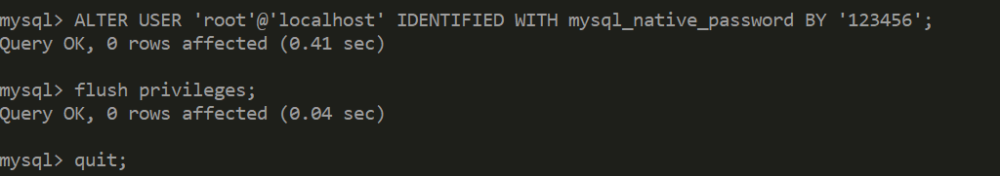

## 注意事项

设置完毕，按“Finish”后有一个比较常见的错误，就是不能“Start service”，一般出现在以前有安装 mysql 的服务器上，解决的办法，先保证以前安装的 mysql 服务器彻底卸载掉了；不行的话，检查是否按上面一步所说， 之前的密码是否有修改，照上面的操作；如果依然不行，将 mysql 安装目录下的 data 文件夹备份，然后删除，在 安装完成后，将安装生成的 data 文件夹删除，备份的 data 文件夹移回来，再重启 mysql 服务就可以了，这种情况 下，可能需要将数据库检查一下，然后修复一次，防止数据出错。

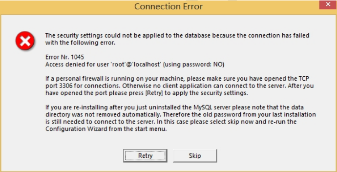

> 解决方法：卸载 MySQL,重装 MySQL
