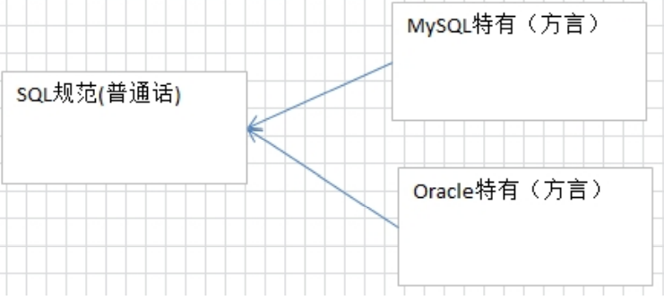
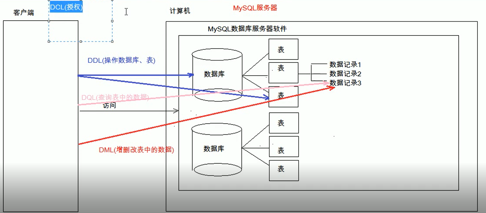

> 概念：Structured Query Language 结构化查询语言

SQL 作用：

- 是一种所有关系型数据库的查询规范，不同的数据库都支持。
- 通用的数据库操作语言，可以用在不同的数据库中。 
- 不同的数据库 SQL 语句有一些区别。

## SQL 语句分类

1. Data Definition Language (DDL 数据定义语言) 如：建库，建表 
   - 关键字：create, drop,alter 等

2) Data Manipulation Language(DML 数据操纵语言)，如：对表中的记录操作增删改 
   - 关键字：insert, delete, update 等
3) Data Query Language(DQL 数据查询语言)，如：对表中的查询操作 
   - 关键字：select, where 等
4) Data Control Language(DCL 数据控制语言)，如：对用户权限的设置
   - 关键字：GRANT， REVOKE 等

## MySQL的语法

- 每条语句以分号结尾，如果在 SQLyog 中不是必须加的。 

- SQL 中不区分大小写，关键字中认为大写和小写是一样的 。**关键字建议使用大写**。

- 3 种注释：

  | 注释的语法 | 说明                    |
  | ---------- | ----------------------- |
  | -- 空格    | 单行注释                |
  | /**/       | 多行注释                |
  | #          | 这是mysql特有的注释方式 |

  
