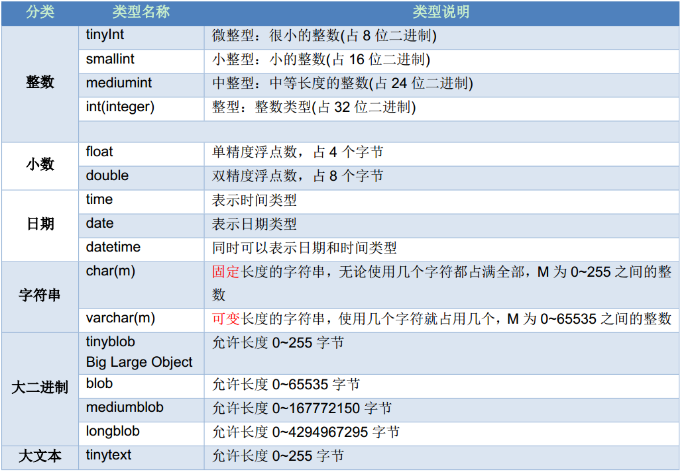
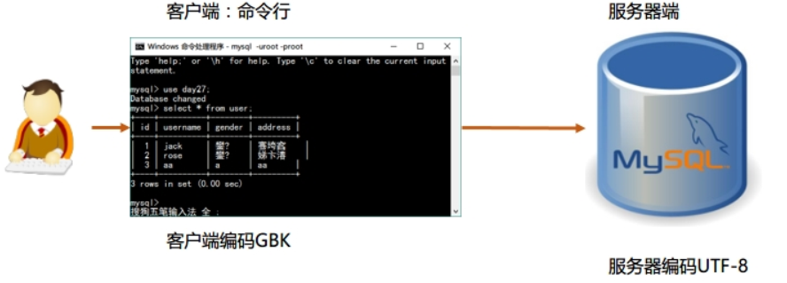

操作数据库简称：CRUD

- C(Create): 创建。
- R(Retrieve)：查询。
- U(Update): 修改。
- D(Delete): 删除。

## DDL 操作数据库

### 创建数据库

创建的几种方式：

- 创建数据库

  ```mysql
  CREATE DATABASE 数据库名;
  ```

- 判断数据库是否已经存在，不存在则创建数据库

  ```mysql
  CREATE DATABASE IF NOT EXISTS 数据库名;
  ```

- 创建数据库并指定字符集

  ```mysql
  CREATE DATABASE 数据库名 CHARACTER SET 字符集;
  ```

```mysql
# 创建数据库

mysql> create database db1;
Query OK, 1 row affected (0.01 sec)

# 查看数据库
mysql> show databases;
+--------------------+
| Database           |
+--------------------+
| information_schema |
| db1                |
| mysql              |
| performance_schema |
| test               |
+--------------------+
5 rows in set (0.00 sec)

# 查看创建的数据库
mysql> show create  database db1;
+----------+--------------------------------------------------------------+
| Database | Create Database                                              |
+----------+--------------------------------------------------------------+
| db1      | CREATE DATABASE `db1` /*!40100 DEFAULT CHARACTER SET utf8 */ |
+----------+--------------------------------------------------------------+
1 row in set (0.00 sec)

# 在创建之前判断数据库是否存在，如果存在则不创建，不存在则创建。
mysql> create database if not exists db2;
Query OK, 1 row affected (0.00 sec)

mysql> show databases;
+--------------------+
| Database           |
+--------------------+
| information_schema |
| db1                |
| db2                |
| mysql              |
| performance_schema |
| test               |
+--------------------+
6 rows in set (0.00 sec)

# 创建数据库并指定字符集
mysql> create database db3 character set gbk;
Query OK, 1 row affected (0.00 sec)

mysql> show create database db3;
+----------+-------------------------------------------------------------+
| Database | Create Database                                             |
+----------+-------------------------------------------------------------+
| db3      | CREATE DATABASE `db3` /*!40100 DEFAULT CHARACTER SET gbk */ |
+----------+-------------------------------------------------------------+
1 row in set (0.00 sec)

# 创建db4数据库，判断是否存在，并制定字符集为gbk；
mysql> create database if not exists db4 character set gbk;
Query OK, 1 row affected (0.00 sec)

mysql> show create database db4;
+----------+-------------------------------------------------------------+
| Database | Create Database                                             |
+----------+-------------------------------------------------------------+
| db4      | CREATE DATABASE `db4` /*!40100 DEFAULT CHARACTER SET gbk */ |
+----------+-------------------------------------------------------------+
1 row in set (0.00 sec)

mysql>
```

### 查看数据库

> 按 `tab` 键可以自动补全关键字

```mysql
-- 查看所有的数据库
mysql> show databases;
+--------------------+
| Database           |
+--------------------+
| information_schema | -- 描述Mysql中的一些信息，其中存在的表，并不是真正的表。
| mysql              | -- mysql的核心数据库
| performance_schema | -- 对性能提升做一些操作的数据库
| test               |
+--------------------+
4 rows in set (0.00 sec)

-- 查询某个数据库的字符集:查询某个数据库的创建语句
mysql> show create database test;
+----------+---------------------------------------------------------------+
| Database | Create Database                                               |
+----------+---------------------------------------------------------------+
| test     | CREATE DATABASE `test` /*!40100 DEFAULT CHARACTER SET utf8 */ |
+----------+---------------------------------------------------------------+
1 row in set (0.00 sec)

mysql>
```

### 修改数据库

- 修改数据库默认的字符集

  ```mysql
  ALTER DATABASE 数据库名 DEFAULT CHARACTER SET 字符集;
  ```

```mysql
mysql> create database db3 character set gbk;
Query OK, 1 row affected (0.00 sec)

mysql> show create database db3;
+----------+-------------------------------------------------------------+
| Database | Create Database                                             |
+----------+-------------------------------------------------------------+
| db3      | CREATE DATABASE `db3` /*!40100 DEFAULT CHARACTER SET gbk */ |
+----------+-------------------------------------------------------------+
1 row in set (0.00 sec)

mysql> alter database db3 character set utf8;
Query OK, 1 row affected (0.00 sec)

-- 修改数据库的字符集
mysql> show create database db3;
+----------+--------------------------------------------------------------+
| Database | Create Database                                              |
+----------+--------------------------------------------------------------+
| db3      | CREATE DATABASE `db3` /*!40100 DEFAULT CHARACTER SET utf8 */ |
+----------+--------------------------------------------------------------+
1 row in set (0.00 sec)

mysql>
```

### 删除数据库

- 删除数据库

  ```mysql
  DROP DATABASE 数据库名;
  ```

- 判断数据库是否存在，存在则删除数据库

  ```MYSQL
  DROP DATABASE IF EXISTS 数据库名;
  ```

```mysql
mysql> show databases;
+--------------------+
| Database           |
+--------------------+
| information_schema |
| db1                |
| db2                |
| db3                |
| db4                |
| mysql              |
| performance_schema |
| test               |
+--------------------+
8 rows in set (0.00 sec)

-- 删除数据库db4
mysql> drop database db4;
Query OK, 0 rows affected (0.01 sec)

mysql> show databases;
+--------------------+
| Database           |
+--------------------+
| information_schema |
| db1                |
| db2                |
| db3                |
| mysql              |
| performance_schema |
| test               |
+--------------------+
7 rows in set (0.00 sec)

mysql>
```

### 使用数据库

- 查看正在使用的数据库

  ```mysql
  SELECT DATABASE(); 使用的一个 mysql 中的全局函数
  ```

- 使用/切换数据库

  ```mysql
  USE 数据库名;
  ```

```mysql

-- 使用数据库db1
mysql> use db1;
Database changed

-- 查看正在使用的数据库
mysql> select database();
+------------+
| database() |
+------------+
| db1        |
+------------+
1 row in set (0.00 sec)

mysql>
```

## DDL 操作表结构

> 前提先使用某个数据库

创建表有以下几个步骤：

-  C(Create): 创建。
-  R(Retrieve)：查询。
-  U(Update): 修改。
-  D(Delete): 删除。

### 创建表

```mysql
-- 语法
CREATE TABLE 表名 (
    字段名 1 字段类型 1,
    字段名 2 字段类型 2
);
```

关键字说明：

- CREATE：创建。
- TABLE：表。

```mysql
-- 使用db2数据库；
mysql> use db2;
Database changed

-- 创建一个学生的表；
mysql> create table student(
    ->     id int,
    ->     name varchar(32),
    ->     age int ,
    ->     score double(4,1),
    ->     birthday date,
    ->     insert_time timestamp
    -> );
Query OK, 0 rows affected (0.01 sec)

-- 查看创建的表
mysql> show tables;
+---------------+
| Tables_in_db2 |
+---------------+
| student       |
+---------------+
1 row in set (0.00 sec)

-- 复制一张student的表
mysql> create table stu like student;
Query OK, 0 rows affected (0.02 sec)

mysql> show tables;
+---------------+
| Tables_in_db2 |
+---------------+
| stu           |
| student       |
+---------------+
2 rows in set (0.00 sec)

mysql>
```

### 查看表

- 查询某个数据库中所有的表名称；

  ```mysql
  show tables;
  ```

- 查询表结构

  ```mysql
  desc 表名;
  ```

```mysql
-- 使用 mysql 数据库
mysql> use mysql;
Database changed

-- 查看mysql中的所有表
mysql> show tables;
+---------------------------+
| Tables_in_mysql           |
+---------------------------+
... 省略
| host                      |
... 省略
| user                      |
+---------------------------+
24 rows in set (0.00 sec)

-- 查看 host 表结构
mysql> desc host;
+-----------------------+---------------+------+-----+---------+-------+
| Field                 | Type          | Null | Key | Default | Extra |
+-----------------------+---------------+------+-----+---------+-------+
| Host                  | char(60)      | NO   | PRI |         |       |
| Db                    | char(64)      | NO   | PRI |         |       |
| Select_priv           | enum('N','Y') | NO   |     | N       |       |
| Insert_priv           | enum('N','Y') | NO   |     | N       |       |
| Update_priv           | enum('N','Y') | NO   |     | N       |       |
| Delete_priv           | enum('N','Y') | NO   |     | N       |       |
| Create_priv           | enum('N','Y') | NO   |     | N       |       |
| Drop_priv             | enum('N','Y') | NO   |     | N       |       |
| Grant_priv            | enum('N','Y') | NO   |     | N       |       |
| References_priv       | enum('N','Y') | NO   |     | N       |       |
| Index_priv            | enum('N','Y') | NO   |     | N       |       |
| Alter_priv            | enum('N','Y') | NO   |     | N       |       |
| Create_tmp_table_priv | enum('N','Y') | NO   |     | N       |       |
| Lock_tables_priv      | enum('N','Y') | NO   |     | N       |       |
| Create_view_priv      | enum('N','Y') | NO   |     | N       |       |
| Show_view_priv        | enum('N','Y') | NO   |     | N       |       |
| Create_routine_priv   | enum('N','Y') | NO   |     | N       |       |
| Alter_routine_priv    | enum('N','Y') | NO   |     | N       |       |
| Execute_priv          | enum('N','Y') | NO   |     | N       |       |
| Trigger_priv          | enum('N','Y') | NO   |     | N       |       |
+-----------------------+---------------+------+-----+---------+-------+
20 rows in set (0.01 sec)

mysql>
```

### 删除表

- 删除表;

  ```mysql
  drop table 表名;
  ```

- 判断表，是否存在如果存在则删除

  ```mysql
  drop table  if exists 表名 ;
  ```

```mysql
mysql> show tables;
+---------------+
| Tables_in_db2 |
+---------------+
| stu           |
| student       |
+---------------+
2 rows in set (0.00 sec)

-- 删除 stu 的表
mysql> drop table stu;
Query OK, 0 rows affected (0.01 sec)

mysql> show tables;
+---------------+
| Tables_in_db2 |
+---------------+
| student       |
+---------------+
1 row in set (0.00 sec)

-- 判断表是否存在，如果存在则删除
mysql> drop table if exists stu;
Query OK, 0 rows affected, 1 warning (0.00 sec)

mysql>
```

### 修改表

#### 修改表名

```mysql
alter table 表名 rename to 新的表名;
```

```mysql
-- 修改表名
mysql> show tables;
+---------------+
| Tables_in_db2 |
+---------------+
| student       |
+---------------+
1 row in set (0.00 sec)

mysql> alter table student rename to stu;
Query OK, 0 rows affected (0.01 sec)

mysql> show tables;
+---------------+
| Tables_in_db2 |
+---------------+
| stu           |
+---------------+
1 row in set (0.00 sec)
```

#### 修改表的字符集

```mysql
alter table 表名 character set 字符集名称;
```

```mysql
-- 修改表的字符集
mysql> show create table stu;
+-------+----------------------------------------------------------------------------------------------------------------------------------------------------------------------------------------------------------------------------------------------------------------------------------------------------------------------+
| Table | Create Table                                                                                                                                                                                                                                                                                                         |
+-------+----------------------------------------------------------------------------------------------------------------------------------------------------------------------------------------------------------------------------------------------------------------------------------------------------------------------+
| stu   | CREATE TABLE `stu` (
  `id` int(11) DEFAULT NULL,
  `name` varchar(32) DEFAULT NULL,
  `age` int(11) DEFAULT NULL,
  `score` double(4,1) DEFAULT NULL,
  `birthday` date DEFAULT NULL,
  `insert_time` timestamp NOT NULL DEFAULT CURRENT_TIMESTAMP ON UPDATE CURRENT_TIMESTAMP
) ENGINE=InnoDB DEFAULT CHARSET=utf8 | -- 此时的字符集是utf8
+-------+----------------------------------------------------------------------------------------------------------------------------------------------------------------------------------------------------------------------------------------------------------------------------------------------------------------------+
1 row in set (0.00 sec)

-- 修改字符集为gbk
mysql> alter table stu character set gbk;
Query OK, 0 rows affected (0.04 sec)
Records: 0  Duplicates: 0  Warnings: 0

mysql> show create table stu;
+-------+----------------------------------------------------------------------------------------------------------------------------------------------------------------------------------------------------------------------------------------------------------------------------------------------------------------------------------------+
| Table | Create Table                                                                                                                                                                                                                                                                                                                           |
+-------+----------------------------------------------------------------------------------------------------------------------------------------------------------------------------------------------------------------------------------------------------------------------------------------------------------------------------------------+
| stu   | CREATE TABLE `stu` (
  `id` int(11) DEFAULT NULL,
  `name` varchar(32) CHARACTER SET utf8 DEFAULT NULL,
  `age` int(11) DEFAULT NULL,
  `score` double(4,1) DEFAULT NULL,
  `birthday` date DEFAULT NULL,
  `insert_time` timestamp NOT NULL DEFAULT CURRENT_TIMESTAMP ON UPDATE CURRENT_TIMESTAMP
) ENGINE=InnoDB DEFAULT CHARSET=gbk | -- 此时的字符集是gbk
+-------+----------------------------------------------------------------------------------------------------------------------------------------------------------------------------------------------------------------------------------------------------------------------------------------------------------------------------------------+
1 row in set (0.00 sec)

mysql>
```

#### 添加一列

```mysql
alter table 表名 add 列名 数据类型;
```

```mysql
mysql> alter table stu add gender varchar(10);
Query OK, 0 rows affected (0.02 sec)
Records: 0  Duplicates: 0  Warnings: 0

mysql> desc stu;
+-------------+-------------+------+-----+-------------------+-----------------------------+
| Field       | Type        | Null | Key | Default           | Extra                       |
+-------------+-------------+------+-----+-------------------+-----------------------------+
| id          | int(11)     | YES  |     | NULL              |                             |
| name        | varchar(32) | YES  |     | NULL              |                             |
| age         | int(11)     | YES  |     | NULL              |                             |
| score       | double(4,1) | YES  |     | NULL              |                             |
| birthday    | date        | YES  |     | NULL              |                             |
| insert_time | timestamp   | NO   |     | CURRENT_TIMESTAMP | on update CURRENT_TIMESTAMP |
| gender      | varchar(10) | YES  |     | NULL              |                             |
+-------------+-------------+------+-----+-------------------+-----------------------------+
7 rows in set (0.01 sec)

mysql>
```

#### 修改列名称类型

```mysql
alter table 表名 change 列名 新列别 新数据类型;
alter table 表名 modify 列名 新数据类型;
```

```mysql
-- 修改表的列，将 gender 修改为 sex 并把类型改为 20；
mysql> alter table stu change gender sex varchar(20);
Query OK, 0 rows affected (0.02 sec)
Records: 0  Duplicates: 0  Warnings: 0

mysql> desc stu;
+-------------+-------------+------+-----+-------------------+-----------------------------+
| Field       | Type        | Null | Key | Default           | Extra                       |
+-------------+-------------+------+-----+-------------------+-----------------------------+
| id          | int(11)     | YES  |     | NULL              |                             |
| name        | varchar(32) | YES  |     | NULL              |                             |
| age         | int(11)     | YES  |     | NULL              |                             |
| score       | double(4,1) | YES  |     | NULL              |                             |
| birthday    | date        | YES  |     | NULL              |                             |
| insert_time | timestamp   | NO   |     | CURRENT_TIMESTAMP | on update CURRENT_TIMESTAMP |
| sex         | varchar(20) | YES  |     | NULL              |                             |
+-------------+-------------+------+-----+-------------------+-----------------------------+
7 rows in set (0.03 sec)

-- 只修改列类型；
mysql> alter table stu modify sex varchar(10);
Query OK, 0 rows affected (0.03 sec)
Records: 0  Duplicates: 0  Warnings: 0

mysql> desc stu;
+-------------+-------------+------+-----+-------------------+-----------------------------+
| Field       | Type        | Null | Key | Default           | Extra                       |
+-------------+-------------+------+-----+-------------------+-----------------------------+
| id          | int(11)     | YES  |     | NULL              |                             |
| name        | varchar(32) | YES  |     | NULL              |                             |
| age         | int(11)     | YES  |     | NULL              |                             |
| score       | double(4,1) | YES  |     | NULL              |                             |
| birthday    | date        | YES  |     | NULL              |                             |
| insert_time | timestamp   | NO   |     | CURRENT_TIMESTAMP | on update CURRENT_TIMESTAMP |
| sex         | varchar(10) | YES  |     | NULL              |                             |
+-------------+-------------+------+-----+-------------------+-----------------------------+
7 rows in set (0.01 sec)

mysql>
```

#### 删除列

```mysql
alter table 表名 drop 列名;
```

```mysql
mysql> alter table stu drop sex;
Query OK, 0 rows affected (0.02 sec)
Records: 0  Duplicates: 0  Warnings: 0

mysql> desc stu;
+-------------+-------------+------+-----+-------------------+-----------------------------+
| Field       | Type        | Null | Key | Default           | Extra                       |
+-------------+-------------+------+-----+-------------------+-----------------------------+
| id          | int(11)     | YES  |     | NULL              |                             |
| name        | varchar(32) | YES  |     | NULL              |                             |
| age         | int(11)     | YES  |     | NULL              |                             |
| score       | double(4,1) | YES  |     | NULL              |                             |
| birthday    | date        | YES  |     | NULL              |                             |
| insert_time | timestamp   | NO   |     | CURRENT_TIMESTAMP | on update CURRENT_TIMESTAMP |
+-------------+-------------+------+-----+-------------------+-----------------------------+
6 rows in set (0.01 sec)

mysql>
```

## DML 操作表中的数据

> 用于对表中的记录进行增删改操作

### 添加数据

语法：

```mysql
INSERT [INTO] 表名 [字段名] VALUES (字段值)
```

参数解释：

- INSERT INTO 表名：表示往哪张表中添加数据

- (字段名 1, 字段名 2, …)：要给哪些字段设置值 
- VALUES (值 1, 值 2, …)：设置具体的值

#### 插入全部字段

```mysql
-- 所有的字段名都写出来
INSERT INTO 表名 (字段名 1, 字段名 2, 字段名 3…) VALUES (值 1, 值 2, 值 3);

-- 不写字段名
INSERT INTO 表名 VALUES (值 1, 值 2, 值 3…);
```

```mysql
-- 插入所有的列，向学生表中
mysql> select * from stu;
Empty set (0.00 sec)

mysql> INSERT INTO stu (id, name, age, score, birthday) VALUES (10, '张三', 200, 20, null);
ERROR 1366 (HY000): Incorrect string value: '\xD5\xC5\xC8\xFD' for column 'name' at row 1
mysql> INSERT INTO stu (id, name, age, score, birthday) VALUES (10, 'zhangsan', 200, 20, null);
Query OK, 1 row affected (0.01 sec)

mysql> select * from stu;
+------+----------+------+-------+----------+---------------------+
| id   | name     | age  | score | birthday | insert_time         |
+------+----------+------+-------+----------+---------------------+
|   10 | zhangsan |  200 |  20.0 | NULL     | 2022-01-22 19:58:01 |
+------+----------+------+-------+----------+---------------------+
1 row in set (0.00 sec)

-- 不写字段名
mysql> INSERT INTO stu VALUES (11, 'lisi', 200, 20, null, null);
Query OK, 1 row affected (0.01 sec)

mysql> select * from stu;
+------+----------+------+-------+----------+---------------------+
| id   | name     | age  | score | birthday | insert_time         |
+------+----------+------+-------+----------+---------------------+
|   10 | zhangsan |  200 |  20.0 | NULL     | 2022-01-22 19:58:01 |
|   11 | lisi     |  200 |  20.0 | NULL     | 2022-01-22 20:03:18 |
+------+----------+------+-------+----------+---------------------+
2 rows in set (0.00 sec)

mysql>
```

::: info

1. 列名和值要一一对应，类型要一致。
2. 如果表名后不定义列名，则默认给所有列添加值。不能缺少列，否则报错。
3. 除了数字类型，其他类型需要使用引号(单双都可以)引起来。
4. 没有添加数据的字段会使用 NULL。
5. 数据的大小应在列的规定范围内，例如：不能将一个长度为 80 的字符串加入到长度为 40 的列中。
6. 字符和日期型数据应包含在单引号中。MySQL 中也可以使用双引号做为分隔符。

:::

#### 插入部分数据

```mysql
INSERT INTO 表名 (字段名 1, 字段名 2, ...) VALUES (值 1, 值 2, ...);
```

```mysql
-- 插入部分数据
mysql> INSERT INTO stu (id, name, age)  VALUES (12, 'lisi', 200);
Query OK, 1 row affected (0.01 sec)

mysql> select * from stu;
+------+----------+------+-------+----------+---------------------+
| id   | name     | age  | score | birthday | insert_time         |
+------+----------+------+-------+----------+---------------------+
|   10 | zhangsan |  200 |  20.0 | NULL     | 2022-01-22 19:58:01 |
|   11 | lisi     |  200 |  20.0 | NULL     | 2022-01-22 20:03:18 |
|   12 | lisi     |  200 |  NULL | NULL     | 2022-01-22 20:15:43 |
+------+----------+------+-------+----------+---------------------+
3 rows in set (0.00 sec)

mysql>
```

### 删除数据

```mysql
DELETE FROM 表名 [WHERE 条件表达式]
```

::: warning

- 如果没有指定 WHERE 子句，MySQL 表中的所有记录将被删除。 
- 你可以在 WHERE 子句中指定任何条件

:::

```mysql
-- 删除表中id = 10的数据；
mysql> DELETE FROM stu WHERE id = 10;
Query OK, 1 row affected (0.01 sec)

mysql> select * from stu;
+------+------+------+-------+----------+---------------------+
| id   | name | age  | score | birthday | insert_time         |
+------+------+------+-------+----------+---------------------+
|   11 | lisi |  200 |  20.0 | NULL     | 2022-01-22 20:03:18 |
|   12 | lisi |  200 |  NULL | NULL     | 2022-01-22 20:15:43 |
+------+------+------+-------+----------+---------------------+
3 rows in set (0.00 sec)

mysql>

-- 如果没有指定条件，则删除所有数据
mysql> DELETE FROM stu;
Query OK, 0 rows affected (0.00 sec)

mysql> select * from stu;
Empty set (0.00 sec)

mysql>
```

::: info

1. 如果不加条件，则删除表中所有记录。
2. 如果要删除所有记录:
   - delete from 表名; -- 不推荐使用。有多少条记录就会执行多少次删除操作。
   - TRUNCATE TABLE 表名; -- 推荐使用，效率更高 先删除表，然后再创建一张一样的表。

:::

### 更新数据

```mysql
UPDATE 表名 SET 列名=值 [WHERE 条件表达式]

-- 不带条件修改数据
UPDATE 表名 SET 字段名=值; -- 修改所有的行

-- 带条件修改数据
UPDATE 表名 SET 字段名=值 WHERE 字段名=值;
```

参数说明：

- PDATE:  需要更新的表名。
- SET:  修改的列值。
- WHERE: 符合条件的记录才更新 

你可以同时更新一个或多个字段也可以在 WHERE 子句中指定任何条件。

```mysql
-- 不带条件修改数据
mysql> UPDATE stu SET age = 2;
Query OK, 2 rows affected (0.00 sec)
Rows matched: 2  Changed: 2  Warnings: 0

mysql> select * from stu;
+------+------+------+-------+----------+---------------------+
| id   | name | age  | score | birthday | insert_time         |
+------+------+------+-------+----------+---------------------+
|   12 | lisi |    2 |  NULL | NULL     | 2022-01-22 20:35:44 |
|   13 | lisi |    2 |  NULL | NULL     | 2022-01-22 20:35:44 |
+------+------+------+-------+----------+---------------------+
2 rows in set (0.00 sec)

-- 带条件修改数据
mysql> UPDATE stu SET age = 200 WHERE id = 13;
Query OK, 1 row affected (0.01 sec)
Rows matched: 1  Changed: 1  Warnings: 0

mysql> select * from stu;
+------+------+------+-------+----------+---------------------+
| id   | name | age  | score | birthday | insert_time         |
+------+------+------+-------+----------+---------------------+
|   12 | lisi |    2 |  NULL | NULL     | 2022-01-22 20:35:44 |
|   13 | lisi |  200 |  NULL | NULL     | 2022-01-22 20:37:15 |
+------+------+------+-------+----------+---------------------+
2 rows in set (0.00 sec)

mysql>
```

::: warning

如果不加任何条件，则会将表中所有记录全部修改。

:::

### 蠕虫复制

> 将一张已经存在的表中的数据复制到另一张表中就是蠕虫复制；

```mysql
-- 将表名 2 中的所有的列复制到表名 1 中
INSERT INTO 表名 1 SELECT * FROM 表名 2;

-- 只复制部分列
INSERT INTO 表名 1(列 1, 列 2) SELECT 列 1, 列 2 FROM student;
```

```mysql
-- 将表名 stu 中的所有的列复制到表 stu1 中
mysql> select * from stu1;
Empty set (0.00 sec)

mysql> INSERT INTO stu1 SELECT * FROM stu;
Query OK, 2 rows affected (0.01 sec)
Records: 2  Duplicates: 0  Warnings: 0

mysql> select * from stu1;
+------+------+------+-------+----------+---------------------+
| id   | name | age  | score | birthday | insert_time         |
+------+------+------+-------+----------+---------------------+
|   12 | lisi |    2 |  NULL | NULL     | 2022-01-22 20:35:44 |
|   13 | lisi |  200 |  NULL | NULL     | 2022-01-22 20:37:15 |
+------+------+------+-------+----------+---------------------+
2 rows in set (0.00 sec)

mysql>
```

## DQL 查询表数据

> 查询不会对数据库中的数据进行修改.只是一种显示数据的方式

语法：

```mysql
select 字段列表 from 表名列表 where 条件列表 group by 分组字段 having 分组之后的条件 order by 排序 limit 分页限定
```

准备数据，新创建一个学生的表，包含如下列：

```mysql
CREATE TABLE student
(
    id      int,          -- 编号
    name    varchar(20),  -- 姓名
    age     int,          -- 年龄
    sex     varchar(5),   -- 性别
    address varchar(100), -- 地址
    math    int,          -- 数学
    english int           -- 英语
);
INSERT INTO student(id, NAME, age, sex, address, math, english)
VALUES (1, '马云', 55, '男', '杭州', 66, 78),
       (2, '马化腾', 45, '女', '深圳', 98, 87),
       (3, '马景涛', 55, '男', '香港', 56, 77),
       (4, '柳岩', 20, '女', '湖南', 76, 65),
       (5, '柳青', 20, '男', '湖南', 86, NULL),
       (6, '刘德华', 57, '男', '香港', 99, 99),
       (7, '马德', 22, '女', '香港', 99, 99),
       (8, '德玛西亚', 18, '男', '南京', 56, 65);
```

### 简单查询

语法：

```mysql
SELECT 列名 FROM 表名 [WHERE 条件表达式]
```

参数说明：

- SELECT 命令可以读取一行或者多行记录。 
- 你可以使用星号（*）来代替其他字段，SELECT 语句会返回表的所有字段数据
- 你可以使用 WHERE 语句来包含任何条件。

```mysql
-- 查询表所有行和列的数据
SELECT * FROM 表名; -- *表示所有列

-- 查询指定列
SELECT 字段名 1, 字段名 2, 字段名 3, ... FROM 表名;
```

```mysql
-- 查询所有的学生
mysql> select * from student;
+------+----------+------+------+---------+------+---------+
| id   | name     | age  | sex  | address | math | english |
+------+----------+------+------+---------+------+---------+
|    1 | 马云         |   55 | 男     | 杭州        |   66 |      78 |
|    2 | 马化腾        |   45 | 女    | 深圳        |   98 |      87 |
|    3 | 马景涛        |   55 | 男     | 香港        |   56 |      77 |
|    4 | 柳岩         |   20 | 女    | 湖南        |   76 |      65 |
|    5 | 柳青         |   20 | 男     | 湖南        |   86 |    NULL |
|    6 | 刘德华        |   57 | 男     | 香港        |   99 |      99 |
|    7 | 马德         |   22 | 女    | 香港        |   99 |      99 |
|    8 | 德玛西亚         |   18 | 男     | 南京       |   56 |      65 |
+------+----------+------+------+---------+------+---------+
8 rows in set (0.01 sec)

mysql>

-- 查询指定列
mysql> select name,age from student;
+----------+------+
| name     | age  |
+----------+------+
| 马云         |   55 |
| 马化腾        |   45 |
| 马景涛        |   55 |
| 柳岩         |   20 |
| 柳青         |   20 |
| 刘德华        |   57 |
| 马德         |   22 |
| 德玛西亚         |   18 |
+----------+------+
8 rows in set (0.00 sec)

mysql>
```

### 清除重复值

```mysql
-- 查询指定列并且结果不出现重复数据
SELECT DISTINCT 字段名 FROM 表名;
```

```mysql
mysql> SELECT DISTINCT address FROM student;
+---------+
| address |
+---------+
| 杭州        |
| 深圳        |
| 香港        |
| 湖南        |
| 南京       |
+---------+
5 rows in set (0.00 sec)

mysql>
```

### 查询结果参与运算

```mysql
-- 查询并计算 math + english的和
mysql> select name,math,english,math + english from student;
+----------+------+---------+----------------+
| name     | math | english | math + english |
+----------+------+---------+----------------+
| 马云         |   66 |      78 |            144 |
| 马化腾        |   98 |      87 |            185 |
| 马景涛        |   56 |      77 |            133 |
| 柳岩         |   76 |      65 |            141 |
| 柳青         |   86 |    NULL |           NULL |
| 刘德华        |   99 |      99 |            198 |
| 马德         |   99 |      99 |            198 |
| 德玛西亚         |   56 |      65 |            121 |
+----------+------+---------+----------------+
8 rows in set (0.00 sec)

mysql>

-- 参与计算的值如果含有null，则默认为 0 
mysql> select name,math,english,math + IFNULL(english, 0) from student;
+----------+------+---------+---------------------------+
| name     | math | english | math + IFNULL(english, 0) |
+----------+------+---------+---------------------------+
| 马云         |   66 |      78 |                       144 |
| 马化腾        |   98 |      87 |                       185 |
| 马景涛        |   56 |      77 |                       133 |
| 柳岩         |   76 |      65 |                       141 |
| 柳青         |   86 |    NULL |                        86 |
| 刘德华        |   99 |      99 |                       198 |
| 马德         |   99 |      99 |                       198 |
| 德玛西亚         |   56 |      65 |                       121 |
+----------+------+---------+---------------------------+
8 rows in set (0.00 sec)

mysql>
```

> IFNULL 可以判断是否为null，如果为null则替换为 0

### 指定列的别名进行查询

> 使用别名的好处： 显示的时候使用新的名字，并不修改表的结构。

```mysql
-- 对列指定别名
SELECT 字段名 1 AS 别名, 字段名 2 AS 别名... FROM 表名;

-- 对列和表同时指定别名
SELECT 字段名 1 AS 别名, 字段名 2 AS 别名... FROM 表名 AS 表别名;
```

```mysql
mysql> select name AS 姓名,math AS 数学,english AS 英语,math + IFNULL(english, 0) AS 总分 from student;
+----------+------+------+------+
| 姓名         | 数学    | 英语    | 总分    |
+----------+------+------+------+
| 马云         |   66 |   78 |  144 |
| 马化腾        |   98 |   87 |  185 |
| 马景涛        |   56 |   77 |  133 |
| 柳岩         |   76 |   65 |  141 |
| 柳青         |   86 | NULL |   86 |
| 刘德华        |   99 |   99 |  198 |
| 马德         |   99 |   99 |  198 |
| 德玛西亚         |   56 |   65 |  121 |
+----------+------+------+------+
8 rows in set (0.00 sec)

mysql>
```

::: info

表使用别名的原因：用于多表查询操作

:::

### 条件查询

- where子句后跟条件

- 运算符

  | 比较运算符               | 说明                                                         |
  | ------------------------ | ------------------------------------------------------------ |
  | >、 <、 <=、 >=、 =、 <> | <>在 SQL 中表示不等于，在 mysql 中也可以使用!= 没有==        |
  | BETWEEN...AND            | 在一个范围之内，如： between 100 and 200 相当于条件在 100 到 200 之间，包头又包尾 |
  | IN(集合)                 | 集合表示多个值，使用逗号分隔                                 |
  | LIKE '张%'               | 模糊查询。通配符：`_`  `%`                                   |
  | IS NULL                  | 查询某一列为 NULL 的值，注：不能写=NULL                      |

  | 逻辑运算符 | 说明                                    |
  | ---------- | --------------------------------------- |
  | and 或 &&  | 与， SQL 中建议使用前者，后者并不通用。 |
  | or 或 \|\| | 或                                      |
  | not 或 !   | 非                                      |

  | 通配符 | 说明               |
  | ------ | ------------------ |
  | %      | 匹配任意多个字符串 |
  | _      | 匹配一个字符       |

1. 查询年龄大于20的；

   ```mysql
   mysql> SELECT * FROM student WHERE age > 20;
   +------+--------+------+------+---------+------+---------+
   | id   | name   | age  | sex  | address | math | english |
   +------+--------+------+------+---------+------+---------+
   |    1 | 马云       |   55 | 男     | 杭州        |   66 |      78 |
   |    2 | 马化腾      |   45 | 女    | 深圳        |   98 |      87 |
   |    3 | 马景涛      |   55 | 男     | 香港        |   56 |      77 |
   |    6 | 刘德华      |   57 | 男     | 香港        |   99 |      99 |
   |    7 | 马德       |   22 | 女    | 香港        |   99 |      99 |
   +------+--------+------+------+---------+------+---------+
   5 rows in set (0.00 sec)
   
   mysql>
   
   -- 查询年龄大于等于20 小于等于30 以下三种方式都可以使用
   SELECT * FROM student WHERE age >= 20 && age <= 30;
   SELECT * FROM student WHERE age >= 20 AND age <= 30;
   SELECT * FROM student WHERE age BETWEEN 20 AND 30;
   
   -- 查询年龄22岁，18岁，25岁的信息
   SELECT * FROM student WHERE age = 22 OR age = 18 OR age = 25;
   SELECT * FROM student WHERE age IN (22, 18, 25);
   
   -- 查询英语成绩为Null
   SELECT * FROM student WHERE english = NULL; -- 不对的，null值不能使用 = (!=) 判断
   SELECT * FROM student WHERE english IS NULL;
   
   -- 查询英语成绩不为 Null
   SELECT * FROM student WHERE english IS NOT NULL;
   ```

2. 模糊查询

   ```mysql
   -- -- 查询姓马的有哪些？like
   mysql> SELECT * FROM student WHERE name LIKE '马%';
   +------+--------+------+------+---------+------+---------+
   | id   | name   | age  | sex  | address | math | english |
   +------+--------+------+------+---------+------+---------+
   |    1 | 马云       |   55 | 男     | 杭州        |   66 |      78 |
   |    2 | 马化腾      |   45 | 女    | 深圳        |   98 |      87 |
   |    3 | 马景涛      |   55 | 男     | 香港        |   56 |      77 |
   |    7 | 马德       |   22 | 女    | 香港        |   99 |      99 |
   +------+--------+------+------+---------+------+---------+
   4 rows in set (0.00 sec)
   
   mysql>
   
   -- 查询姓名第二个字是化的人
   SELECT * FROM student WHERE name LIKE '_化%';
   
   -- 查询姓名是3个字的人
   SELECT * FROM student WHERE name LIKE '___';
   
   -- 查询姓名中包含马的人;
   SELECT * FROM student WHERE name LIKE '%马%';
   ```

### 排序查询

```mysql
ORDER BY 子句

ORDER BY 排序字段1 排序方式1

-- ASC 升序 默认的排序方式
-- DESC 降序 
```

```mysql
-- 数学成绩升序排列
mysql> SELECT * FROM student ORDER BY math ASC;
+------+----------+------+------+---------+------+---------+
| id   | name     | age  | sex  | address | math | english |
+------+----------+------+------+---------+------+---------+
|    3 | 马景涛        |   55 | 男     | 香港        |   56 |      77 |
|    8 | 德玛西亚         |   18 | 男     | 南京       |   56 |      65 |
|    1 | 马云         |   55 | 男     | 杭州        |   66 |      78 |
|    4 | 柳岩         |   20 | 女    | 湖南        |   76 |      65 |
|    5 | 柳青         |   20 | 男     | 湖南        |   86 |    NULL |
|    2 | 马化腾        |   45 | 女    | 深圳        |   98 |      87 |
|    6 | 刘德华        |   57 | 男     | 香港        |   99 |      99 |
|    7 | 马德         |   22 | 女    | 香港        |   99 |      99 |
+------+----------+------+------+---------+------+---------+
8 rows in set (0.00 sec)

mysql>

-- 按照数学成绩排名，如果数学成绩一样，则按照英语成绩排名。
SELECT * FROM student ORDER BY math ASC , english ASC ;
```

> 如果有多个排序条件，则当前边的条件值一样时，才会判断第二条件。

### 聚合查询

> 将一列数据作为一个整体，进行纵向的计算。

- conut：计算个数。
- max：计算最大值。
- min：计算最小值。
- sum：计算和。
- avg：计算平均值。

```mysql
mysql> SELECT COUNT(english) FROM student;
+----------------+
| COUNT(english) |
+----------------+
|              7 |
+----------------+
1 row in set (0.00 sec)

mysql>

-- 计算最大值
SELECT MAX(math) FROM student;
-- 计算最小值
SELECT MIN(math) FROM student;
-- 计算总和
SELECT SUM(english) FROM student;
-- 计算平均值
SELECT AVG(math) FROM student;
```

::: info

- 聚合函数的计算，排除Null值，不排除Null可以使用：`SELECT COUNT(IFNULL(english, 0)) FROM student;`
- SELECT COUNT(*) FROM student; 只要有一列不为Null，就计算。一般不推荐使用

:::

### 分组查询

```mysql
group by 分组字段
```

```mysql
-- 按照性别分组，分别查询男，女同学的平均分
mysql> SELECT sex, AVG(math) FROM student GROUP BY sex;
+------+-----------+
| sex  | AVG(math) |
+------+-----------+
| 女    |   91.0000 |
| 男     |   72.6000 |
+------+-----------+
2 rows in set (0.00 sec)

-- 按照性别分组，分别查询男，女同学的平均分, 人数
mysql> SELECT sex, AVG(math), COUNT(id) FROM student GROUP BY sex;
+------+-----------+-----------+
| sex  | AVG(math) | COUNT(id) |
+------+-----------+-----------+
| 女    |   91.0000 |         3 |
| 男     |   72.6000 |         5 |
+------+-----------+-----------+
2 rows in set (0.00 sec)

-- 按照性别分组，分别查询男，女同学的平均分, 人数，要求：分数低于70的人，不参数与分组
mmysql> SELECT sex, AVG(math), COUNT(id) FROM student WHERE math > 70 GROUP BY sex;
+------+-----------+-----------+
| sex  | AVG(math) | COUNT(id) |
+------+-----------+-----------+
| 女    |   91.0000 |         3 |
| 男     |   92.5000 |         2 |
+------+-----------+-----------+
2 rows in set (0.00 sec)

-- 按照性别分组，分别查询男，女同学的平均分, 人数，要求：分数低于70的人，不参数与分组，分组之后人数要大于2个人
SELECT sex, AVG(math), COUNT(id) FROM student WHERE math > 70 GROUP BY sex HAVING COUNT(id) > 2;
```

::: info

1. 分组之后查询的字段：分组字段、聚合函数。
2. where 和 having 的区别？
   - where 在分组之前进行限定，如果不满足条件，则不参与分组。having在分组之后进行限定，如果不满足结果，则不会被查询出来。
   - where 后不可以跟聚合函数，having 可以进行聚合函数的判断。

:::

### 分页查询

```
limit 开始的索引，每页查询的条数
```

```mysql
-- 每也显示3条记录
SELECT * FROM student LIMIT 0, 3; -- 第一页
SELECT * FROM student LIMIT 3, 3; -- 第二页

mysql> SELECT * FROM student LIMIT 0, 3;
+------+--------+------+------+---------+------+---------+
| id   | name   | age  | sex  | address | math | english |
+------+--------+------+------+---------+------+---------+
|    1 | 马云       |   55 | 男     | 杭州        |   66 |      78 |
|    2 | 马化腾      |   45 | 女    | 深圳        |   98 |      87 |
|    3 | 马景涛      |   55 | 男     | 香港        |   56 |      77 |
+------+--------+------+------+---------+------+---------+
3 rows in set (0.00 sec)

mysql>
```

> 开始的索引 = (当前的页码 - 1) * 每页显示的条数。limit是一个mysql的方言。

## MySQL 数据类型

常使用的数据类型如下：

| 类型    | 描述                                                   |
| ------- | ------------------------------------------------------ |
| int     | 整型                                                   |
| double  | 浮点型                                                 |
| varchar | 字符串型                                               |
| date    | 日期类型，格式为：YYYY-MM-DD，只有年月日，没有时分秒。 |

详细的数据类型如下：




## DOS 命令窗口操作数据乱码问题的解决  

> 当我们使用 DOS 命令行进行 SQL 语句操作如有有中文会出现乱码  

```mysql
mysql> select * from student;
+------+--------------+------+------+---------+------+---------+
| id   | name         | age  | sex  | address | math | english |
+------+--------------+------+------+---------+------+---------+
|    1 | 椹簯         |   55 | 鐢?  | 鏉窞    |   66 |      78 |
|    2 | 椹寲鑵?      |   45 | 濂?  | 娣卞湷    |   98 |      87 |
|    3 | 椹櫙娑?      |   55 | 鐢?  | 棣欐腐    |   56 |      77 |
|    4 | 鏌冲博         |   20 | 濂?  | 婀栧崡    |   76 |      65 |
|    5 | 鏌抽潚         |   20 | 鐢?  | 婀栧崡    |   86 |    NULL |
|    6 | 鍒樺痉鍗?      |   57 | 鐢?  | 棣欐腐    |   99 |      99 |
|    7 | 椹痉         |   22 | 濂?  | 棣欐腐    |   99 |      99 |
|    8 | 寰风帥瑗夸簹     |   18 | 鐢?  | 鍗椾含    |   56 |      65 |
+------+--------------+------+------+---------+------+---------+
8 rows in set (0.00 sec)

mysql>
```

### 乱码产生的原因：



### 查看 MySQL 内部设置的编码：

```mysql
-- 查看包含 character 开头的全局变量
mysql> show variables like 'character%';
+--------------------------+-------------------------------------------+
| Variable_name            | Value                                     |
+--------------------------+-------------------------------------------+
| character_set_client     | utf8                                      |
| character_set_connection | utf8                                      |
| character_set_database   | utf8                                      |
| character_set_filesystem | binary                                    |
| character_set_results    | utf8                                      |
| character_set_server     | utf8                                      |
| character_set_system     | utf8                                      |
| character_sets_dir       | D:\MySQL\MySQL Server 5.5\share\charsets\ |
+--------------------------+-------------------------------------------+
8 rows in set (0.00 sec)

mysql>
```

### 解决方案：

修改 client、 connection、 results 的编码为 GBK，保证和 DOS 命令行编码保持一致。

- 单独设置：
  | 单独设置                 | 说明                     |
  | ------------------------ | ------------------------ |
  | character_set_client     | 修改客户端的字符集为 GBK |
  | character_set_connection | 修改连接的字符集为 GBK   |
  | character_set_results    | 修改连接的字符集为 GBK   |
  
- 同时设置

  ```mysql
  set names gbk;
  ```

```mysql
mysql> select * from student;
+------+----------+------+------+---------+------+---------+
| id   | name     | age  | sex  | address | math | english |
+------+----------+------+------+---------+------+---------+
|    1 | 马云         |   55 | 男     | 杭州        |   66 |      78 |
|    2 | 马化腾        |   45 | 女    | 深圳        |   98 |      87 |
|    3 | 马景涛        |   55 | 男     | 香港        |   56 |      77 |
|    4 | 柳岩         |   20 | 女    | 湖南        |   76 |      65 |
|    5 | 柳青         |   20 | 男     | 湖南        |   86 |    NULL |
|    6 | 刘德华        |   57 | 男     | 香港        |   99 |      99 |
|    7 | 马德         |   22 | 女    | 香港        |   99 |      99 |
|    8 | 德玛西亚         |   18 | 男     | 南京       |   56 |      65 |
+------+----------+------+------+---------+------+---------+
8 rows in set (0.01 sec)

mysql>
```

::: info

退出 DOS 命令行就失效了，需要每次都配置  

:::
