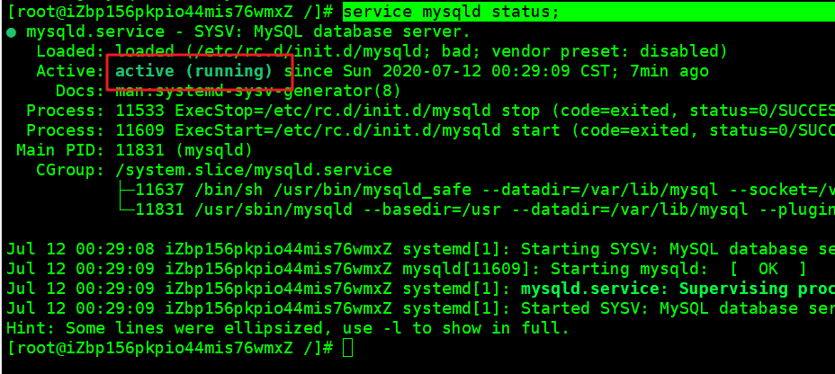

> Error: ER_NOT_SUPPORTED_AUTH_MODE: Client does not support authentication pr

- 错误原因；

  -  原因8.0mysql引入了caching_sha2_password模块作为默认身份验证插件，nodejs还没有跟进 

- 解决；

  -  ALTER USER 'root'@'localhost' IDENTIFIED WITH mysql_native_password BY '自己的密码'; 

- 启动mysql;

  ```bash
  service mysqld start;
  ```

- 关闭mysql

  ```bash
  service mysqld stop 
  ```

- 查看Mysql的运行状态；

  ```bash
service mysqld status;
  ```
  
  

## 基础命令

1. 启动mysql

   ```bash
   service mysqld start;
   # or
   systemctl start mysqld;
   ```

   

2. 关闭mysql

   ```bash
   service mysqld stop;
   # or
   systemctl stop mysqld;
   ```

   

3. 查看Mysql的运行状态；

   ```bash
   service mysqld status;
   # or
   systemctl status mysqld;
   # or 
   systemctl -l status mysqld;
   ```

   

4.  查看错误日志位置 

   ```bash
   cat /etc/my.cnf | grep log-error
   ```

5.  查看错误日志 

   ```bash
   more /var/log/mysqld.log
   ```

   

