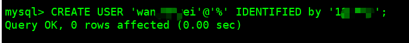
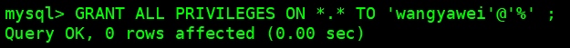
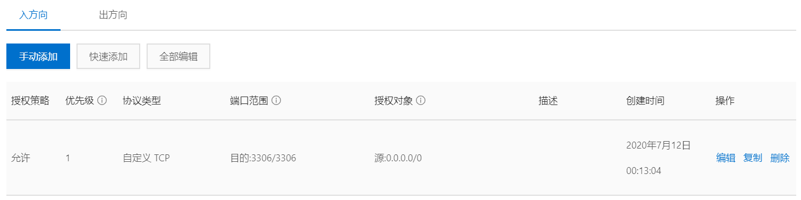
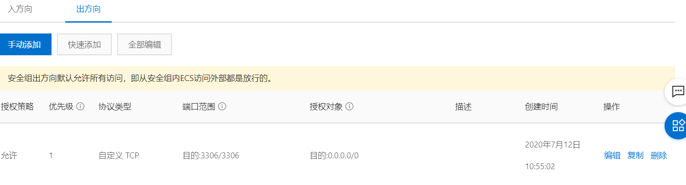
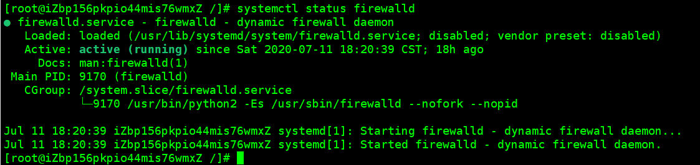
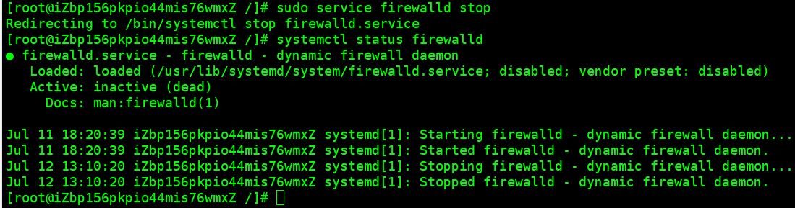
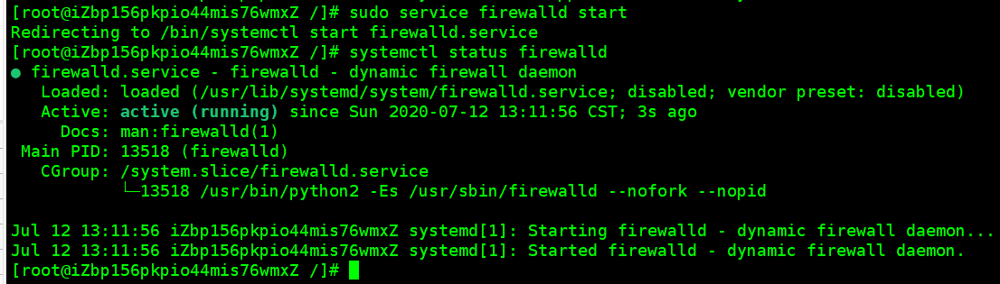
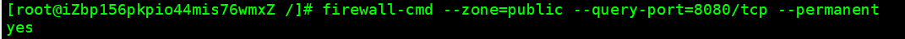
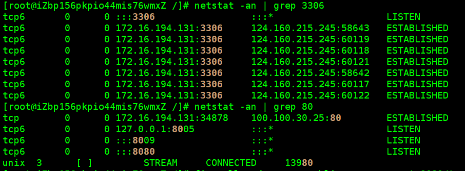
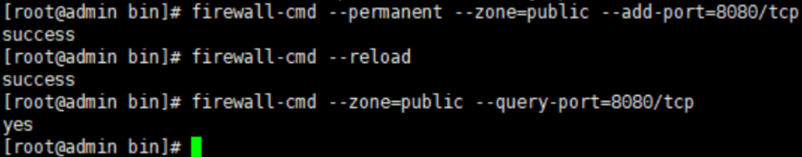

## 1、创建`mysql`用户；

> 说明：
>
> - `userName` : 你将要创建的用户名；
> - `host`：用于指定用户可以在哪台主机上可以登录，如果是本地用户可以用`localhost`，如果想让改用户从任意远程主机登录，则可以用通配符 `%`。
> - `passWord`：改用户的密码，可以为空，为空则可以不用输入密码登录。

```
命令：CREATE USER 'userName'@'host' IDENTIFIED by 'passWord';
```



## 2、授权；

> 说明：
>
> - `privileges`：用户的操作权限，如果要授予所有的权限则可以使用`ALL`。
> - `databasename`：数据库的名字。
> - `tablename`：表名，如果要授予用户所有的数据库和表的权限则可以使用`*`，如：`*.*`。
> - `username`：刚刚创建的用户名，
> - `host`：上面已有概述。

```
命令：GRANT privileges ON databasename.tablename TO 'username'@'host'
```



> 注意：上面创建的用户不能给其他用户授权，如果想授权则可以执行；
>
> ` GRANT privileges ON databasename.tablename TO 'username'@'host' WITH GRANT OPTION; `

## 3、刷新权限；

```
FLUSH PRIVILEGES;
```


## 4、错误处理；

- 创建用户的时候出现错误；


- 解决；

  ```
  命令：set global validate_password_policy=0; 和 set global validate_password_length=1;
  ```

- 在次执行上面的创建用户命令；即可成功；

## 5、配置服务器安全组；





## 6、开启`linux`防火强指定端口号3306；

- 查看防火墙状态；

  ```
  systemctl status firewalld
  ```

  

- 关闭防火墙；

  ```
  sudo service firewalld stop
  ```

  

- 开启防火墙；

  ```
  sudo service firewalld start
  ```

  

- 重启防火Q墙；

  ```
  sudo service firewalld restart
  ```

-  查看3306端口是否开启 ；

  ```
  firewall-cmd --zone=public --query-port=8080/tcp --permanent
  ```

  

- 查看3306端口的使用情况 ；

  ```
  netstat -an | grep 3306
  ```
  
  
- 单独开放3306端口；

  ```
  firewall-cmd --permanent --zone=public --add-port=3306/tcp // 添加3306端口
  firewall-cmd --reload // 更新防火墙规则
  firewall-cmd --zone=public --query-port=3306/tcp // 查看
  ```

  

## 7、远程连接服务器测试；

