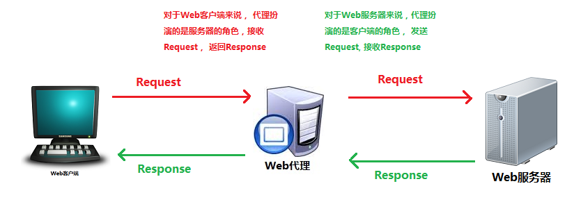
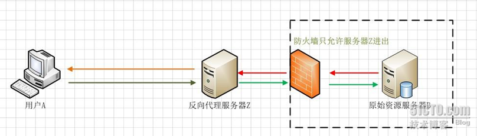
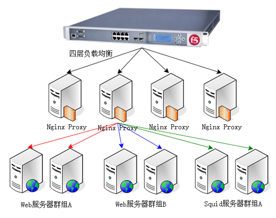

> Nginx(“engine x”) 是俄罗斯人(塞索耶夫)编写的一款高性能的 HTTP 和反向代理服务器。也是一个IMAP/POP3/SMTP代理服务器；也就是说，Nginx本身就可以托管网站，进行HTTP服务处理，也可以作为反向代理服务器使用。

## Nginx的特点

- 跨平台：Nginx 可以在大多数 Unix like OS编译运行，而且也有Windows的移植版本。
- 配置异常简单，非常容易上手。配置风格跟程序开发一样，神一般的配置。
- 非阻塞、高并发连接：数据复制时，磁盘I/O的第一阶段是非阻塞的。官方测试能够支撑5万并发连接，在实际生产环境中跑到2～3万并发连接数.(这得益于Nginx使用了最新的epoll模型)
- 事件驱动：通信机制采用epoll模型，支持更大的并发连接。
- **master/worker结构****：一个master进程，生成一个或多个worker进程**。
- 内存消耗小：处理大并发的请求内存消耗非常小。在3万并发连接下，开启的10个Nginx进程才消耗150M内存（15M\*10=150M）
- 成本低廉：Nginx为开源软件，可以免费使用。而购买F5BIG-IP、NetScaler等硬件负载均衡交换机则需要十多万至几十万人民币。
- 内置的健康检查功能：如果NginxProxy后端的某台Web服务器宕机了，不会影响前端访问。
- 节省带宽：支持GZIP压缩，可以添加浏览器本地缓存的Header头。
- 稳定性高：用于反向代理，宕机的概率微乎其微。
- lnginx代理和后端web服务器间无需长连接；
- l接收用户请求是异步的，即先将用户请求全部接收下来，再一次性发送后后端web服务器，极大的减轻后端web服务器的压力。
- l发送响应报文时，是边接收来自后端web服务器的数据，边发送给客户端的。
- l网络依赖型低。NGINX对网络的依赖程度非常低，理论上讲，只要能够ping通就可以实施负载均衡，而且可以有效区分内网和外网流量。
- l支持服务器检测。NGINX能够根据应用服务器处理页面返回的状态码、超时信息等检测服务器是否出现故障，并及时返回错误的请求重新提交到其它节点上。

nginx通常作为代理服务器使用，代理服务器一般是指局域网内部的机器通过代理服务器发送请求到互联网上的服务器,代理服务器一般作用在客户端。应用比如：翻墙神器。

一个完整的代理请求过程为：客户端首先与代理服务器创建连接，接着根据代理服务器所使用的代理协议，请求对目标服务器创建连接、或者获得目标服务器的指定资源。 Web代理（proxy）服务器是网络的中间实体。 代理位于Web客户端和Web服务器之间，扮演“中间人”的角色。HTTP的代理服务器即是Web服务器又是Web客户端。

代理服务器是介于客户端和Web服务器之间的另一台服务器，有了它之后，浏览器不是直接到Web服务器去取回网页而是向代理服务器发出请求，信号会先送到代理服务器，由代理服务器来取回浏览器所需要的信息并传送给你的浏览器。 

::: info

lNginx已经在俄罗斯最大的门户网站──Rambler Media（[www.rambler.ru](http://www.rambler.ru/)）上运行了3年时间，同时俄罗斯超过20%的虚拟主机平台采用Nginx作为反向代理服务器。

:::

## 正向代理

 正向代理 是一个位于客户端和原始服务器(origin server)之间的服务器，为了从原始服务器取得内容，客户端向代理发送一个请求并指定目标(原始服务器)，然后代理向原始服务器转交请求并将获得的内容返回给客户端。客户端必须要进行一些特别的设置才能使用正向代理。

## 反向代理

在服务器端接受客户端的请求，然后把请求分发给具体的服务器进行处理，然后再将服务器的响应结果反馈给客户端。Nginx就是其中的一种反向代理服务器软件。

## 代理过程

1. 用户**A**始终认为它访问的是原始服务器**B**而不是代理服务器**Z**，但实用际上反向代理服务器接受用户**A**的应答。
2. 从原始资源服务器**B**中取得用户**A**的需求资源，然后发送给用户**A**。由于防火墙的作用，只允许代理服务器**Z**访问原始资源服务器**B**。尽管在这个虚拟的环境下，防火墙和反向代理的共同作用保护了原始资源服务器**B**，但用户**A**并不知情。

## Nginx是如何处理一个请求

首先，nginx在启动时，会解析配置文件，得到需要监听的端口与ip地址，然后在nginx的master进程里面，先初始化好这个监控的socket(创建socket，设置addrreuse等选项，绑定到指定的ip地址端口，再listen)，然后再fork(一个现有进程可以调用fork函数创建一个新进程。由fork创建的新进程被称为子进程 )出多个子进程出来，然后子进程会竞争accept新的连接。此时，客户端就可以向nginx发起连接了。当客户端与nginx进行三次握手，与nginx建立好一个连接后，此时，某一个子进程会accept成功，得到这个建立好的连接的socket，然后创建nginx对连接的封装，即ngx_connection_t结构体。接着，设置读写事件处理函数并添加读写事件来与客户端进行数据的交换。最后，nginx或客户端来主动关掉连接，到此，一个连接就寿终正寝了。 

## 应用场景

负载均衡技术在现有网络结构之上提供了一种廉价、有效、透明的方法，来扩展网络设备和服务器的带宽、增加吞吐量、加强网络数据处理能力、提高网络的灵活性和可用性。它有两方面的含义：首先，大量的并发访问或数据流量分担到多台节点设备上分别处理，减少用户等待响应的时间；其次，单个重负载的运算分担到多台节点设备上做并行处理，每个节点设备处理结束后，将结果汇总，返回给用户，系统处理能力得到大幅度提高。

