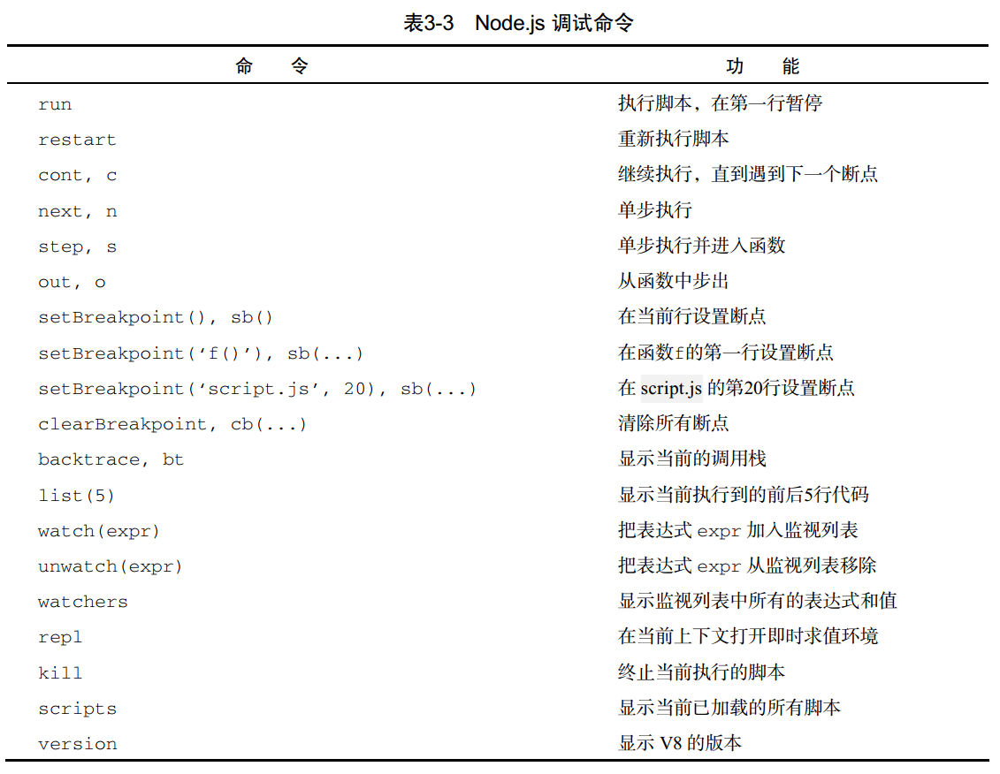

> 写程序时免不了遇到 bug，而当 bug 发生以后，除了抓耳挠腮之外，一个常用的技术是单步调试。  在浏览器中我们可以通过开发者工具进行调试。然而Node.js 的调试功能正是由 V8 提供的，保持了一贯的高效和方便的特性  

### 命令行调试 ；

Node.js 支持命令行下的单步调试。  

```shell
# node inspect module.js

ASUS@yaweidediannao MINGW64 ~/Desktop/test
$ node inspect module.js
< Debugger listening on
<  ws://127.0.0.1:9229/b3996866-2006-4c08-8330-1b5432dd33e8
< For help, see: https://nodejs.org/en/docs/inspector
< Debugger attached.
Break on start in module.js:1
> 1 const a = 1;
  2 const b = 2;
  3 function fn(x) {
debug> n
break in module.js:2
  1 const a = 1;
> 2 const b = 2;
  3 function fn(x) {
  4   console.log(x, a + b);
debug>
```

> 这样就打开了一个 Node.js 的调试终端，我们可以用一些基本的命令进行单步跟踪调试  



::: warning 

这里涉及到一个版本的问题，

1、**Node8.9**版本时 执行`node inspect module.js`会出现报错，

2、**node 12.18.0**版本时，不在报错了，但是出现另一个问题`Timeout (2000) waiting for 127.0.0.1:9229 to be free`;社区提出的解决方案是使用`node --inspect-brk module.js `,它会在你的终端开启一个服务，需要用浏览器打开提供的url，然后利用谷歌的`DevTools`进行可视化调试；

3、**Node15.8**版本时，已经修复了这个问题；直接终端执行`node inspect module.js`;依然可以用浏览器的调试工具进行可视化调试；

:::

node8.9

```bash
PS C:\Users\ASUS\Desktop\test> node inspect module.js
There was an internal error in node-inspect. Please report this bug.
Timeout (2000) waiting for 127.0.0.1:9229 to be free
Error: Timeout (2000) waiting for 127.0.0.1:9229 to be free
    at Timeout.setTimeout [as _onTimeout] (node-inspect/lib/_inspect.js:63:14)
    at ontimeout (timers.js:475:11)
    at tryOnTimeout (timers.js:310:5)
    at Timer.listOnTimeout (timers.js:270:5)
PS C:\Users\ASUS\Desktop\test> node debug
(node:9612) [DEP0068] DeprecationWarning: `node debug` is deprecated. Please use `node inspect` instead.
Usage: C:\Program Files\nodejs\node.exe debug script.js
       C:\Program Files\nodejs\node.exe debug <host>:<port>
       C:\Program Files\nodejs\node.exe debug -p <pid>
PS C:\Users\ASUS\Desktop\test>
```

node12.18.0

```shell
ASUS@yaweidediannao MINGW64 ~/Desktop/test
$ node -v
v12.18.0
ASUS@yaweidediannao MINGW64 ~/Desktop/test
$ node inspect module.js
Timeout (2000) waiting for 127.0.0.1:9229 to be free
ASUS@yaweidediannao MINGW64 ~/Desktop/test
$ node --inspect-brk module.js
Debugger listening on ws://127.0.0.1:9229/8261b94b-a71c-4eaa-a4fe-6f93b06fb221
For help, see: https://nodejs.org/en/docs/inspector
# 需要在浏览器打开这个地址后用devtool调试: 127.0.0.1:9229/8261b94b-a71c-4eaa-a4fe-6f93b06fb221
```

Node15.8

```shell
ASUS@yaweidediannao MINGW64 ~/Desktop/test
$ node -v
v15.8.0
ASUS@yaweidediannao MINGW64 ~/Desktop/test
$ node inspect module.js
< Debugger listening on
< ws://127.0.0.1:9229/0417f239-a689-4372-a68c-412bbd299556
< For help, see: https://nodejs.org/en/docs/inspector
< Debugger attached.
Break on start in module.js:1
> 1 const a = 1;
  2 const b = 2;
  3 function fn(x) {
< Debugger attached.
debug> n
break in module.js:2
  1 const a = 1;
> 2 const b = 2;
  3 function fn(x) {
  4   console.log(x, a + b);
debug>
```

### 远程调试：

> V8 提供的调试功能是基于 TCP 协议的，因此 Node.js 可以轻松地实现远程调试。在命令行下使用以下两个语句之一可以打开调试服务器：  

```javascript
// node --inspect[=port] script.js
// node --inspect-brk[=port] script.js

// module.js
const a = 1;
const b = 2;
debugger;
function fn(x) {
  console.log(x, a + b);
};
fn('计算和值')

ASUS@yaweidediannao MINGW64 ~/Desktop/test
$ node --inspect ./module.js
Debugger listening on ws://127.0.0.1:9229/9d655deb-9123-4054-8515-a7c63abbc09f
For help, see: https://nodejs.org/en/docs/inspector
计算和值 3
```

node --inspect命令选项可以启动调试服务器，默认情况下调试端口是 9229，也可以使用 --inspect=1234 指定调试端口为 1234。使用 --inspect选项运行脚本时，**脚本会正常执行，但不会暂停**，在执行过程中调试客户端可以连接到调试服务器。如果要求脚本暂停执行等待客户端连接，则应该使用 --inspect-brk 选项。这时调试服务器在启动后会立刻暂停执行脚本，等待调试客户端连接。  

```shell
# 使用 --inspect-brk 浏览器打开 127.0.0.1:9229/dab0653a-b13f-48fa-a178-d3ed2939f04b
ASUS@yaweidediannao MINGW64 ~/Desktop/test
$ node --inspect-brk ./module.js
Debugger listening on ws://127.0.0.1:9229/dab0653a-b13f-48fa-a178-d3ed2939f04b
For help, see: https://nodejs.org/en/docs/inspector
Debugger attached.
```

当调试服务器启动以后，可以用命令行调试工具作为调试客户端连接，例如：  

```shell
# 在一个终端中
ASUS@yaweidediannao MINGW64 ~/Desktop/test
$ node --inspect-brk ./module.js
Debugger listening on ws://127.0.0.1:9229/dab0653a-b13f-48fa-a178-d3ed2939f04b
For help, see: https://nodejs.org/en/docs/inspector
Debugger attached.

# 在另一个终端中
ASUS@yaweidediannao MINGW64 ~/Desktop/test
$ node debug 127.0.0.1:9229
(node:12756) [DEP0068] DeprecationWarning: `node debug` is deprecated. Please use `node inspect` instead.
break in module.js:7
  5   console.log(x, a + b);
  6 };
> 7 fn('计算和值')
debug> n
break in module.js:7
  5   console.log(x, a + b);
  6 };
> 7 fn('计算和值')
debug> n
```


