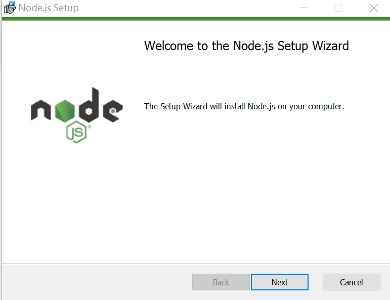

> 在 Windows 上安装 Node.js 十分方便，你只需要访问http://nodejs.org，点击Download链接，然后选择Windows Installer，下载安装包。下载完成后打开安装包，点击Next即可自动完成安装。



Node.js 会被安装到 C:\Program Files\nodejs 或C:\Program Files (x86)\nodejs（64位系统）目录下，并且会在系统的 PATH 环境变量中增加该目录，因此我们可以在 Windows 的命令提示符中直接运行 node。为了测试是否已经安装成功，我们在运行中输入 cmd，打开命令提示符，然后输入 node，将会进入 Node.js 的交互模式。  

```sh
PS C:\Users\wangy\Desktop> node -v
v14.17.3
PS C:\Users\wangy\Desktop> npm -v
6.14.13
PS C:\Users\wangy\Desktop> node
Welcome to Node.js v14.17.3.
Type ".help" for more information.
>
```

::: tip

nodejs安装会附带npm，所以你可以直接使用npm，不必在下载安装；

:::

卸载nodejs直接在程序和功能中点击卸载即可；

