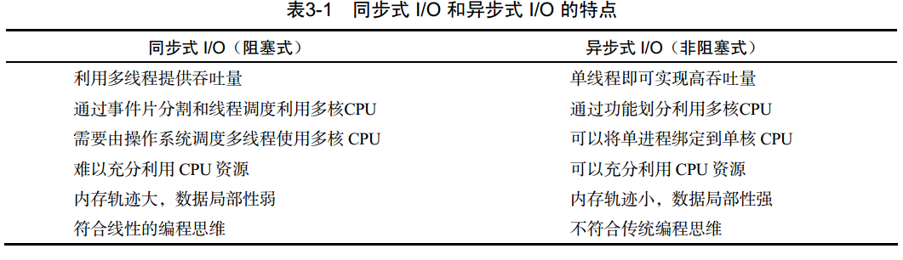
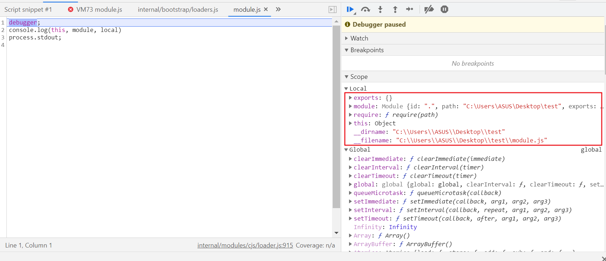
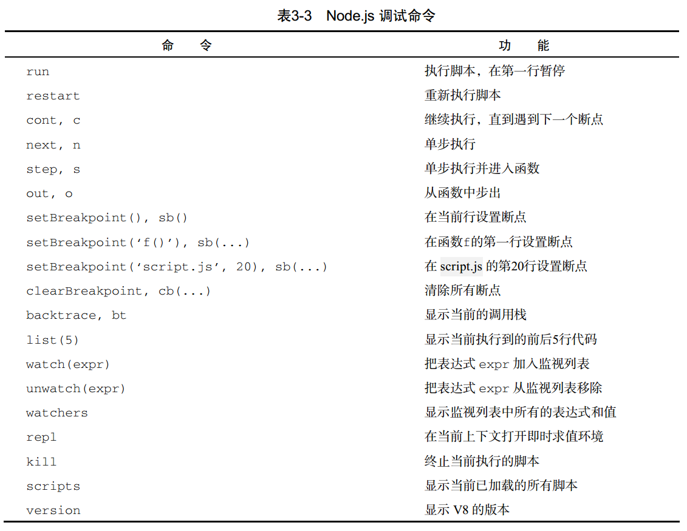
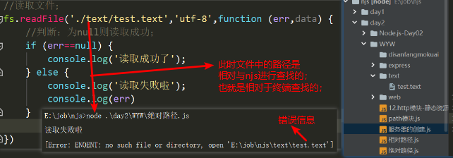

> Node.js 不是一种独立的语言， Node.js 也不是一个 JavaScript 框架，Node.js 更不是浏览器端的库。 Node.js 是一个让 JavaScript 运行在服务端的开发平台，它让 JavaScript 成为脚本语言世界的一等公民，在服务端堪与 PHP、 Python、Perl、 Ruby 平起平坐。它跳过了 Apache、 Nginx 等 HTTP服务器，直接面向前端开发。

## 快速上手；

> 请保证你已经安装了Nodejs；

1. 打印`hello world`;

   - 打开你常用的文本编辑器，在其中输入：console.log('Hello World'); 

     ```javascript
     // helloWorld.js
     console.log('hello world');
     ```

   - 保存后修改文件名为 helloworld.js ；

   - 打开终端，进入 helloworld.js 所在的目录，

   - 执行以下命令：node helloworld.js  

     ```shell
     C:\Users\ASUS\Desktop\test  (test@1.0.0)
     $ node helloWorld.js
     hello world
     ```

     

## Node.js 命令行工具  

> 在前面的 Hello World 示例中，我们用到了命令行中的 node 命令，输入 node --help可以看到详细的帮助信息：  

```shell
C:\Users\ASUS\Desktop\test  (test@1.0.0)                                           
$ node -h                                                                          
Usage: node [options] [ script.js ] [arguments]                                    
       node inspect [options] [ script.js | host:port ] [arguments]                
                                                                                   
Options:                                                                           
  -                                          script read from stdin (default if no 
                                             interactive mode if a tty)            
  --                                         indicate the end of node options      
  --abort-on-uncaught-exception              aborting instead of exiting causes a c
                                             for analysis                          
  -c, --check                                syntax check script without executing 
  --completion-bash                          print source-able bash completion scri
  --cpu-prof                                 Start the V8 CPU profiler on start up,
                                             profile to disk before exit. If --cpu-
                                             specified, write the profile to the cu
  --cpu-prof-dir=...                         Directory where the V8 profiles genera
                                             be placed. Does not affect --prof.    
  --cpu-prof-interval=...                    specified sampling interval in microse
                                             profile generated with --cpu-prof. (de
  --cpu-prof-name=...                        specified file name of the V8 CPU prof
                                             --cpu-prof                            
  --disable-proto=...                        disable Object.prototype.__proto__    
  --disallow-code-generation-from-strings    disallow eval and friends             
  --enable-source-maps                       experimental Source Map V3 support    
  ....
```

> 其中显示了 node 的用法，运行 Node.js 程序的基本方法就是执行 node script.js，其中 script.js是脚本的文件名。  

## REPL 模式 

> REPL （Read-eval-print loop），即输入—求值—输出循环。使用 cmd 打开的 shell，可以进入一个即时求值的运行环境。运行无参数的 node 将会启动一个 JavaScript的交互式 shell：  

```shell
C:\Users\ASUS\Desktop\test  (test@1.0.0)
$ node
Welcome to Node.js v12.18.0.
Type ".help" for more information.
> console.log('Hello World');
Hello World
undefined
> consol.log('Hello World');
Uncaught ReferenceError: consol is not defined
>
```

> 进入 REPL 模式以后，会出现一个“>”提示符提示你输入命令，输入后按回车， Node.js将会解析并执行命令。如果你执行了一个函数，那么 REPL 还会在下面显示这个函数的返回值，上面例子中的 undefined 就是 console.log 的返回值。如果你输入了一个错误的指令， REPL 则会立即显示错误并输出调用栈。在任何时候，连续按两次 Ctrl + C 即可推出Node.js 的 REPL 模式。node 提出的 REPL 在应用开发时会给人带来很大的便利，例如我们可以测试一个包能否正常使用，单独调用应用的某一个模块，执行简单的计算等 ;

## 建立 HTTP 服务器  

> Node.js 将“HTTP服务器”这一层抽离，直接面向浏览器用户,所以我们只需几行代码就可以创建一个http服务器；

```javascript
// app.js
// 引入内置的 http 模块
const http = require('http');
http.createServer((req, res) => {
  // charset=utf-8 识别中文字符
  res.writeHead(200, {
    'Content-Type': 'text/html;charset=utf-8',
  });
  res.write('你好');
  res.write('<h1>Node.js</h1>');
  res.end();
}).listen(3000, (err) => {
  if (!err) {
    console.log('服务启动成功')
  }
})

// 终端：node app.js 你会看到  服务启动成功 
// 打开浏览器访问 http://127.0.0.1:3000  ，你会看到 你好 Node.js
```

> 用 Node.js 实现的最简单的 HTTP 服务器就这样诞生了。这个程序调用了 Node.js 提供的http 模块，对所有 HTTP 请求答复同样的内容并监听 3000 端口。

**小技巧--使用 [nodemon](https://www.npmjs.com/package/nodemon)**

在开发 Node.js 实现的 HTTP 应用时会发现，无论你修改了代码的哪一部份，都必须终止Node.js 再重新运行才会奏效。这是因为 Node.js 只有在第一次引用到某部份时才会去解析脚本文件，以后都会直接访问内存，避免重复载入。 Node.js的这种设计虽然有利于提高性能，却不利于开发调试，因为我们在开发过程中总是希望修改后立即看到效果，而不是每次都要终止进程并重启。
nodemon可以帮助你实现这个功能，它会监视你对代码的改动，并自动重启 Node.js。使用方法很简单，首先使用 npm 安装nodemon：  

```shell
# npm 安装
npm i nodemon

# 查看是否安装成功；
nodemon -v

# 运行app.js
nodemon app.js

ASUS@yaweidediannao MINGW64 ~/Desktop/test
$ nodemon app.js 
[nodemon] 2.0.7
[nodemon] to restart at any time, enter `rs`
[nodemon] watching path(s): *.*
[nodemon] watching extensions: js,mjs,json
[nodemon] starting `node app.js`
服务启动成功
```

> 当你的代码被改动时，它会自动检测并运行；

## 异步式 I/O 与事件式编程  

> Node.js 最大的特点就是异步式 I/O（或者非阻塞 I/O）与事件紧密结合的编程模式。这种模式与传统的同步式 I/O 线性的编程思路有很大的不同，因为控制流很大程度上要靠事件和回调函数来组织，一个逻辑要拆分为若干个单元。  

### 阻塞与线程 ;

1. 阻塞；

   - 线程在执行中如果遇到磁盘读写或网络通信（统称为 I/O 操作），通常要耗费较长的时间，这时操作系统会剥夺这个线程的 CPU 控制权，使其暂停执行，同时将资源让给其他的工作线程，这种线程调度方式称为阻塞。
   - 当 I/O 操作完毕时，操作系统将这个线程的阻塞状态解除，恢复其对CPU的控制权，令其继续执行。这种 I/O 模式就是通
     常的同步式 I/O（Synchronous I/O）或阻塞式 I/O （Blocking I/O）。
2. 线程；
   - [操作系统](https://baike.baidu.com/item/操作系统)能够进行运算[调度](https://baike.baidu.com/item/调度)的最小单位。它被包含在[进程](https://baike.baidu.com/item/进程)之中，是[进程](https://baike.baidu.com/item/进程)中的实际运作单位。一条线程指的是[进程](https://baike.baidu.com/item/进程)中一个单一顺序的控制流，一个进程中可以并发多个线程，每条线程并行执行不同的任务。

### 异步式 I/O

异步式 I/O （Asynchronous I/O）或非阻塞式 I/O （Non-blocking I/O）则针对所有 I/O 操作不采用阻塞的策略。当线程遇到 I/O 操作时，不会以阻塞的方式等待 I/O 操作的完成或数据的返回，而只是将 I/O 请求发送给操作系统，继续执行下一条语句。当操作系统完成 I/O 操作时，以事件的形式通知执行 I/O 操作的线程，线程会在特定时候处理这个事件。为了处理异步 I/O，线程必须有事件循环，不断地检查有没有未处理的事件，依次予以处理。

> 阻塞模式下，一个线程只能处理一项任务，要想提高吞吐量必须通过多线程。而非阻塞模式下，一个线程永远在执行计算操作，这个线程所使用的 CPU 核心利用率永远是 100%，I/O 以事件的方式通知。在阻塞模式下，多线程往往能提高系统吞吐量，因为一个线程阻塞时还有其他线程在工作，多线程可以让 CPU 资源不被阻塞中的线程浪费。而在非阻塞模式下，线程不会被 I/O 阻塞，永远在利用 CPU。多线程带来的好处仅仅是在多核 CPU 的情况下利用更多的核，而Node.js的单线程也能带来同样的好处。这就是为什么 Node.js 使用了单线程、非阻塞的事件编程模式;



### 回调函数；

1. 在 Node.js 中用异步的方式读取一个文件  ；

   ```javascript
   // app.js
   // 引入内置的 fs 模块
   const fs  = require('fs');
   
   // 这里我指定了编码格式 utf-8 ，因为我的文件中包含中文
   fs.readFile('./readFile.js', 'utf-8', (err, data) => {
     if (!err) {
       console.log(data);
     }
   })
   
   // 打印结果
   end
   console.log('中午好');
   ```

2. 在 Node.js 中用同步的方式读取一个文件  ；

   ```javascript
   const fs  = require('fs');
   
   const content = fs.readFileSync('./readFile.js', 'utf-8')
   console.log(content);
   console.log('end')
   
   // 打印结果
   console.log('中午好');
   end
   ```

> 1、 fs.readFileSync 函数同步式读取文件的方式比较容易理解，将文件名作为参数传入，阻塞等待读取完成后，将文件的内容作为函数的返回值赋给变量，接下来控制台输出 值，最后输出 end.。  
>
> 2、fs.readFile 调用时所做的工作只是将异步式 I/O 请求发送给了操作系统，然后立即返回并执行后面的语句，执行完以后进入事件循环监听事件。当 fs 接收到 I/O 请求完成的事件时，事件循环会主动调用回调函数以完成后续工作。因此我们会先看到 end.，再看到readFile.js文件的内容。  

::: warning

Node.js 中，并不是所有的 API 都提供了同步和异步版本。 Node.js 不鼓励使用同步 I/O。  

:::

### 事件

> Node.js 所有的异步 I/O 操作在完成时都会发送一个事件到事件队列。在开发者看来，事件由 EventEmitter 对象提供。前面提到的 fs.readFile 和 http.createServer 的回调函数都是通过 EventEmitter 来实现的。  

```javascript
const eventEmit = require('events').EventEmitter;
const event = new eventEmit();

event.on('some_event', (res) => {
  console.log(res, '----', 'some_event'); // 每秒输出： 我执行了 ---- some_event
})

setInterval(() => {
  event.emit('some_event', '我执行了')
}, 1000);
```

> 运行这段代码， 每过1秒后控制台输出了 `我执行了 ---- some_event`。其原理是 event 对象注册了事件 some_event 的一个监听器，然后我们通过 setInterval在1000毫秒以后向event 对象发送事件 some_event，此时会调用 some_event 的监听器。  

### Node.js 的事件循环机制  

>  Node.js 程序由事件循环开始，到事件循环结束，所有的逻辑都是事件的回调函数，所以 Node.js 始终在事件循环中，程序入口就是事件循环第一个事件的回调函数。事件的回调函数在执行的过程中，可能会发出 I/O 请求或直接发射（emit）事件，执行完毕后再返回事件循环，事件循环会检查事件队列中有没有未处理的事件，直到程序结束。Node.js 没有显式的事件循环，事件循环对开发者不可见，由 libev 库实现。libev支持多种类型的事件，如 ev_io、 ev_timer、 ev_signal、 ev_idle 等，在 Node.js 中均被EventEmitter 封装。 libev 事件循环的每一次迭代，在 Node.js 中就是一次 Tick， libev 不断检查是否有活动的、可供检测的事件监听器，直到检测不到时才退出事件循环，进程结束。  

## 模块和包

### 什么是模块；

> 模块是 Node.js 应用程序的基本组成部分，文件和模块是一一对应的。换言之，一个Node.js 文件就是一个模块，这个文件可能是 JavaScript 代码、 JSON 或者编译过的 C/C++ 扩展。我们用到的 var http = require('http')， 其中 http是 Node.js 的一个核心模块，其内部是用 C++ 实现的，外部用 JavaScript 封装。我们通过require 函数获取了这个模块，然后才能使用其中的对象；  

### 创建模块；

> 创建一个模块非常简单，因为一个文件就是一个模块，我们要关注的问题仅仅在于如何在其他文件中获取这个模块。 Node.js 提供了 exports 和 require 两个对象，其中 exports 是模块公开的接口， require 用于从外部获取一个模块的接口，即所获取模块的 exports 对象。  

```javascript
// module.js
let name = ''
exports.setName = (thyName) => {
  name = thyName
}

exports.sayHello = function() {
  console.log('Hello ' + name); // Hello 小萌
};
// 或
let name = ''
module.exports.setName = (thyName) => {
  name = thyName
}
module.exports.sayHello = function() {
  console.log('Hello ' + name);
};

// getModule.js
const myModule = require('./module.js');
myModule.setName('小萌');
myModule.sayHello();
// 运行node getmodule.js，结果是：Hello 小萌
```

> 在以上示例中， module.js 通过 exports 对象把 setName 和 sayHello 作为模块的访问接口，在 getModule.js 中通过require('./module') 加载这个模块，然后就可以直接访问 module.js 中 exports 对象的成员函数了。  

#### 单次加载；

> require 不会重复加载模块，也就是说无论调用多少次 require， 获得的模块都是同一个。

```javascript
// module.js
let name = ''
module.exports.setName = (thyName) => {
  name = thyName
}
module.exports.sayHello = () => {
  console.log('Hello ' + name);
}

// getModule.js
const myModule1 = require('./module.js');
const myModule2= require('./module.js');
myModule1.setName('小萌');
myModule2.setName('小红');
myModule1.sayHello();

// 这里我们引入了两次 module.js 模块，但是最后的输出的结果为 hello 小红 
```

> 运行后发现输出结果是 `hello 小红` ，这是因为变量 `myModule2` 和 `myModule1`指向的是同一个实例，因此 myModule2.setName 的结果被 myModule1.setName 覆盖，最终输出结果是由后者决定的。  

#### 覆盖 exports ;

```javascript
// module.js
function Hello() {
  var name;
  this.setName = function (thyName) {
    name = thyName;
  };
  this.sayHello = function () {
    console.log('Hello ' + name);
  };
};
// 导出
exports.Hello = Hello;

// getModule.js
const myModule1 = require('./module.js').Hello;
const obj1 = new myModule1();
obj1.setName('小萌');
obj1.sayHello();
```

> 上面的例子我们想要使用`module.js`模块，那么我们需要通过 require('./singleobject').Hello 来获取Hello 对象，这略显冗余，可以用下面方法稍微简化：  

```javascript
// module.js
function Hello() {
  var name;
  this.setName = function (thyName) {
    name = thyName;
  };
  this.sayHello = function () {
    console.log('Hello ' + name);
  };
};
// 这里添加 modeule
modeule.exports = Hello;

// getModule.js
// 这里可以不用.Hello了
const myModule1 = require('./module.js');
const obj1 = new myModule1();
obj1.setName('小萌');
obj1.sayHello();
```

> 注意，模块接口的唯一变化是使用 module.exports = Hello 代替了 exports.Hello=Hello。在外部引用该模块时，其接口对象就是要输出的 Hello 对象本身，而不是原先的exports。事实上， exports 本身仅仅是一个普通的空对象，即 {}，它专门用来声明接口，本质上是通过它为模块闭包的内部建立了一个有限的访问接口。因为它没有任何特殊的地方，所以可以用其他东西来代替，譬如我们上面例子中的 Hello 对象。  

::: warning 

不可以通过对 exports 直接赋值代替对 module.exports 赋值。exports 实际上只是一个和 module.exports 指向同一个对象的变量，
它本身会在模块执行结束后释放，但 module 不会，因此只能通过指定module.exports 来改变访问接口。  

:::

::: tip

一个js文件就是一个模块，然而一些变量是有本地和全局之分的：

本地：可以理解为每个js文件所拥有的变量，是当前模块暴露出来的变量，其中本地变量包含：`exports` `module` `require` `this` `__dirname` `__filename` ；**所以你会发现打印global是找不到这些变量的**

全局：全局变量可以理解为浏览器端的`window`，在nodejs中是：`global`  

**想要查看这些变量可以使用远程调试来查看；**

```javascript
ASUS@yaweidediannao MINGW64 ~/Desktop/test
$ node --inspect-brk module.js
Debugger listening on ws://127.0.0.1:9229/e96bbb47-3ece-45a2-97e2-2376f23825f4
For help, see: https://nodejs.org/en/docs/inspector
Debugger attached.
```



:::

### 创建包；

> 包是在模块基础上更深一步的抽象。它将某个独立的功能封装起来，用于发布、更新、依赖管理和版本控制。 Node.js 根据 CommonJS 规范实现了包机制，开发了 npm来解决包的发布和获取需求。Node.js 的包是一个目录，其中包含一个 JSON 格式的包说明文件 package.json。

1. 严格符合 CommonJS 规范的包应该具备以下特征：  
   - package.json 必须在包的顶层目录下；
   - 二进制文件应该在 bin 目录下；
   - JavaScript 代码应该在 lib 目录下；
   - 文档应该在 doc 目录下；
   - 单元测试应该在 test 目录下。  

> Node.js 对包的要求并没有这么严格，只要顶层目录下有 package.json，并符合一些规范即可。当然为了提高兼容性，我们还是建议你在制作包的时候，严格遵守 CommonJS 规范。  

### Nodejs包管理器；

> Node.js包管理器，即npm是 Node.js 官方提供的包管理工具，它已经成了 Node.js 包的标准发布平台，用于 Node.js 包的发布、传播、依赖控制。 npm 提供了命令行工具，使你可以方便地下载、安装、升级、删除包，也可以让你作为开发者发布并维护包。  

#### 获取一个包

```bash
// 语法
npm [install/i] [package_name]

// 获取express  本地安装
npm install express 
// 或
npm i express
```

#### 全局模式  

>  npm 默认会把包安装到当前目录下。这反映了 npm 不同的设计哲学。如果把包安装到全局，可以提高程序的重复利用程度，避免同样的内容的多份副本，但坏处是难以处理不同的版本依赖。如果把包安装到当前目录，或者说本地，则不会有不同程序依赖不同版本的包的冲突问题，同时还减轻了包作者的 API 兼容性压力，但缺陷则是同一个包可能会被安装许多次。  

```bash
npm i -g express
```

::: tip

使用全局模式安装的包并不能直接在 JavaScript 文件中用 require 获得，因为 require 不会搜索 /usr/local/lib/node_modules/。   

:::

|   模式   | 可通过require使用 | 注册PATH |
| :------: | :---------------: | :------: |
| 本地模式 |        是         |    否    |
| 全局模式 |        否         |    是    |

> 总而言之，当我们要把某个包作为工程运行时的一部分时，通过本地模式获取，如果要在命令行下使用，则使用全局模式安装。  

#### 创建全局链接  

> npm 提供了一个有趣的命令 `npm link`， 它的功能是在本地包和全局包之间创建符号链接。我们说过使用全局模式安装的包不能直接通过 require 使用，但通过 npm link命令可以打破这一限制。  

```bash
# 通过  npm root -g 查找全局包的安装位置
$ npm root -g
C:\Program Files\nodejs\node_modules

# 链接；我这里使用了nvm控制nodejs版本
npm link express
./node_modules/express -> /d/nvm/v12.18.0/node_modules/express/
# 在 node_modules 子目录中可以发现一个指向安装到全局的包的符号链接。通过这种方法，我们就可以把全局包当本地包来使用了
```

## 调试

> 写程序时免不了遇到 bug，而当 bug 发生以后，除了抓耳挠腮之外，一个常用的技术是单步调试。Node.js 的调试功能是由 V8 提供的，保持了一贯的高效和方便的特性。我么可以使用 Node.js 内置的工具和第三方模块来进行单步调试  。

### 命令行调试 ；

Node.js 支持命令行下的单步调试。  

```shell
# node inspect module.js

ASUS@yaweidediannao MINGW64 ~/Desktop/test
$ node inspect module.js
< Debugger listening on
<  ws://127.0.0.1:9229/b3996866-2006-4c08-8330-1b5432dd33e8
< For help, see: https://nodejs.org/en/docs/inspector
< Debugger attached.
Break on start in module.js:1
> 1 const a = 1;
  2 const b = 2;
  3 function fn(x) {
debug> n
break in module.js:2
  1 const a = 1;
> 2 const b = 2;
  3 function fn(x) {
  4   console.log(x, a + b);
debug>
```

> 这样就打开了一个 Node.js 的调试终端，我们可以用一些基本的命令进行单步跟踪调试  



::: warning 

这里涉及到一个版本的问题，

1、**Node8.9**版本时 执行`node inspect module.js`会出现报错，

2、**node 12.18.0**版本时，不在报错了，但是出现另一个问题`Timeout (2000) waiting for 127.0.0.1:9229 to be free`;社区提出的解决方案是使用`node --inspect-brk module.js `,它会在你的终端开启一个服务，需要用浏览器打开提供的url，然后利用谷歌的`DevTools`进行可视化调试；

3、**Node15.8**版本时，已经修复了这个问题；直接终端执行`node inspect module.js`;依然可以用浏览器的调试工具进行可视化调试；

:::

node8.9

```bash
PS C:\Users\ASUS\Desktop\test> node inspect module.js
There was an internal error in node-inspect. Please report this bug.
Timeout (2000) waiting for 127.0.0.1:9229 to be free
Error: Timeout (2000) waiting for 127.0.0.1:9229 to be free
    at Timeout.setTimeout [as _onTimeout] (node-inspect/lib/_inspect.js:63:14)
    at ontimeout (timers.js:475:11)
    at tryOnTimeout (timers.js:310:5)
    at Timer.listOnTimeout (timers.js:270:5)
PS C:\Users\ASUS\Desktop\test> node debug
(node:9612) [DEP0068] DeprecationWarning: `node debug` is deprecated. Please use `node inspect` instead.
Usage: C:\Program Files\nodejs\node.exe debug script.js
       C:\Program Files\nodejs\node.exe debug <host>:<port>
       C:\Program Files\nodejs\node.exe debug -p <pid>
PS C:\Users\ASUS\Desktop\test>
```

node12.18.0

```shell
ASUS@yaweidediannao MINGW64 ~/Desktop/test
$ node -v
v12.18.0
ASUS@yaweidediannao MINGW64 ~/Desktop/test
$ node inspect module.js
Timeout (2000) waiting for 127.0.0.1:9229 to be free
ASUS@yaweidediannao MINGW64 ~/Desktop/test
$ node --inspect-brk module.js
Debugger listening on ws://127.0.0.1:9229/8261b94b-a71c-4eaa-a4fe-6f93b06fb221
For help, see: https://nodejs.org/en/docs/inspector
# 需要在浏览器打开这个地址后用devtool调试: 127.0.0.1:9229/8261b94b-a71c-4eaa-a4fe-6f93b06fb221
```

Node15.8

```shell
ASUS@yaweidediannao MINGW64 ~/Desktop/test
$ node -v
v15.8.0
ASUS@yaweidediannao MINGW64 ~/Desktop/test
$ node inspect module.js
< Debugger listening on
< ws://127.0.0.1:9229/0417f239-a689-4372-a68c-412bbd299556
< For help, see: https://nodejs.org/en/docs/inspector
< Debugger attached.
Break on start in module.js:1
> 1 const a = 1;
  2 const b = 2;
  3 function fn(x) {
< Debugger attached.
debug> n
break in module.js:2
  1 const a = 1;
> 2 const b = 2;
  3 function fn(x) {
  4   console.log(x, a + b);
debug>
```

### 远程调试：

> V8 提供的调试功能是基于 TCP 协议的，因此 Node.js 可以轻松地实现远程调试。在命令行下使用以下两个语句之一可以打开调试服务器：  

```javascript
// node --inspect[=port] script.js
// node --inspect-brk[=port] script.js

// module.js
const a = 1;
const b = 2;
debugger;
function fn(x) {
  console.log(x, a + b);
};
fn('计算和值')

ASUS@yaweidediannao MINGW64 ~/Desktop/test
$ node --inspect ./module.js
Debugger listening on ws://127.0.0.1:9229/9d655deb-9123-4054-8515-a7c63abbc09f
For help, see: https://nodejs.org/en/docs/inspector
计算和值 3
```

node --inspect命令选项可以启动调试服务器，默认情况下调试端口是 9229，也可以使用 --inspect=1234 指定调试端口为 1234。使用 --inspect选项运行脚本时，**脚本会正常执行，但不会暂停**，在执行过程中调试客户端可以连接到调试服务器。如果要求脚本暂停执行等待客户端连接，则应该使用 --inspect-brk 选项。这时调试服务器在启动后会立刻暂停执行脚本，等待调试客户端连接。  

```shell
# 使用 --inspect-brk 浏览器打开 127.0.0.1:9229/dab0653a-b13f-48fa-a178-d3ed2939f04b
ASUS@yaweidediannao MINGW64 ~/Desktop/test
$ node --inspect-brk ./module.js
Debugger listening on ws://127.0.0.1:9229/dab0653a-b13f-48fa-a178-d3ed2939f04b
For help, see: https://nodejs.org/en/docs/inspector
Debugger attached.
```

当调试服务器启动以后，可以用命令行调试工具作为调试客户端连接，例如：  

```shell
# 在一个终端中
ASUS@yaweidediannao MINGW64 ~/Desktop/test
$ node --inspect-brk ./module.js
Debugger listening on ws://127.0.0.1:9229/dab0653a-b13f-48fa-a178-d3ed2939f04b
For help, see: https://nodejs.org/en/docs/inspector
Debugger attached.

# 在另一个终端中
ASUS@yaweidediannao MINGW64 ~/Desktop/test
$ node debug 127.0.0.1:9229
(node:12756) [DEP0068] DeprecationWarning: `node debug` is deprecated. Please use `node inspect` instead.
break in module.js:7
  5   console.log(x, a + b);
  6 };
> 7 fn('计算和值')
debug> n
break in module.js:7
  5   console.log(x, a + b);
  6 };
> 7 fn('计算和值')
debug> n
```


## ES6；

> ECMAScript 的一个颠覆性版本更新  - 面向对象编程（类、对象-- 封装、继承、多态）

###  let；

+  let 声明变量；

+ 特点：

  + 无法变量提升
  + 无法重复声明
  +  有块级作用域  { };

```js
//1、变量无法提升；
console.log(b);//b is not defined
let b='小明';

//2、变量无法重复定义；
 let b = '小红';
 let b = '小霞';
 console.log(b);//Identifier 'b' has already been declared

//3、有块级作用域；；
 {
     let b='郭德纲';
 }
 console.log(b);//b is not defined
```

### const 常量；

> 常量主要用来保存一些初始信息，不允许修改；

+ 特点：
  + 常量声明必须要赋值；
  + 常量无法重新赋值；
  + 无法重复声明；
  + 无法变量提升；
  + 有块级作用域；
+ 常量应用场景；
  + 整个程序的核心配置数据，一般使用常量来保存因为无法修改；
  + 在 nodejs 中加载模块时，一般使用常量来保存模块对象；

```js

// 1. 常量无法重新赋值
 const age1 = 100;
 age1 = 101; // 常量 一旦赋值，不能改变！
 console.log(age1);

// 2. 常量只能也必须在 创建时赋值
 const age2; //报错： Missing initializer in const declaration
 console.log(age2);

// 3. 无法变量提升
 console.log(age3); // 报错： age is not defined
 const age3 = 1;

// 4.有 块级作用域
 if(true){
   const num4 = 100;
 }
 console.log(num4); // 报错：   num is not defined

// 5.无法重复声明
 const num5 = 1;
 const num5 = 2; // Identifier 'num' has already been declared
```

## 解构；

> 概念：一种**方便获取**对象和数组中值的方式；

### 对象解构；

> 概念：使用对象解构自动将对象  同名属性  赋值给  同名变量；

```js
let a={
    name: '小明',
    age: 19,
    eat: function () {
        console.log('我叫'+a.name+'今年'+a.age+'岁了')
        return '下午好';
    }
}
//把对象中的属性值赋值给了 同名 变量；
let {name,age,eat}=a;
let c=name;
console.log(name,age,eat());//小明 19 下午好；
console.log(c);//小明；
//情况1；变量多于对象属性；则多余的那个变量会打印undefined;
let {name,age,eat,key}=a;// key -> undefined
//情况2；若变量少于对象属性，则正常打印属性值；
let {name}=a;//小明；
```

### 数组的解构；

> 相当于创建n个变量，并且从数组中 【按顺序】 取出元素设置给变量；

```js
//声明一个变量；
let a=[1,2,3,4,5,6,7,8];

//将数组解构取出；
let [p,b,c,d,e,f,g,h]=a

console.log(f);// 6；
console.log(b);// 2；
console.log(c);// 3；
```

### 例；

> 问题：有些函数有多个形参，但实际使用时，需要指定传入任意位置的参数，传统语法无法实现；

```js
//一个函数有三个形参，但是有一个需要是默认值，其他两个是用户传入的值；
function fn({a=1,b=2,c=3}) {
    console.log(a,b,c);//1 9 8
}

let obj={b:9,c:8};

fn(obj);
```

## 箭头函数；

> ​	箭头函数（Arrow Function），并且简化了函数定义。
>
> 注：1、**只针对于 匿名函数**，命名函数不能使用；
>
> ​	2、箭头函数的this在创建时就确定了，是上下文中的this；

```js
// const a=function (b) {
//     console.log(89+b);
//     console.log(78);
// }

//简化后；
const a=b=>{
    console.log(89+b);
    console.log(78);
}

a(39) //128  78
```

1. ：function 变为  =>;

2. 参数：

  + 参数只有1个 省略小括号;

  + 参数0个或多个，无法省略小括号;

3. 大括号{ }
  + 如果 函数体代码只有一行可以省略 {}
  + 函数体多行无法省略 {};

4. 返回值 return

  + 函数体一行 有返回值 省略{} 的 同时 【必须省略 return】

    ```js
    const a=function () {
        return 99;
    }
    //简化后；
    const a=()=>99;
    
    console.log(a());//99
    ```

5. this指向改变；

   ```js
      var a = {
           nam: '小明',
           eat: function () {
               console.log(this);
               //使用箭头函数会发生this指向改变；
               setTimeout( () =>{
                   console.log(this);//此时的this不在是window;
               },1000)
           },
       }
   
   console.log(a.eat())
   ```

##  属性赋值简写

```js
let name = '妲己'
let gender = '女'
let skill = '傻笑'

//方式一：手动将同名的变量的值设置给对象中的同名属性；
let hero = {
  name: name,
  gender: gender,
  skill: skill
};
//方式二：对象属性赋值简写；
/注意：属性名和值相同可以简写，否则不要这么做
let hero2 = {
  name,
  gender,
  skill
};
```

+ **对象中的 方法可以省略掉 : function**

```js
const person = {
  //sayHi: function() {
  //  console.log('Hi~~~')
  //}
  // 可以省略  ：function ；
  sayHi() {
    console.log('Hi~~~')
  }
}

person.sayHi();
```

## 展开；

### 对象的展开；

> 概念：将对象中的成员自动添加到 另一个对象中;

- 同名属性会按照书写顺序后面的会把前面的覆盖；
- 可以展开多个对象；

```js
//定义对象；
const a={
    name: '小明',
    age: 18,
    eat: function () {
        console.log("我叫"+a.name+"今年"+a.age)
        return 576;
    }
}

const b={
    name: '小红',
    //对象展开；会把小红覆盖掉；
    ...a,
}

console.log(b);
```

### 数组的展开；

> 概念：将数组中的元素自动添加到另一个数组中;

- **不会覆盖**；
- 可以展开多个；

```js
//定义数组；
const a=[1,2,3,4,5,6,7];
const c=['a','b','c']

const b=['a','b',1,2,3,4,5,...a,...c];

console.log(b);
```

## 模板字符串；

> 本质：就是一个字符串;
>
> 特点：
>
> - 可以换行；
> - 挖坑(占位符) ，用来填充变量值；

```js
const b='hahahha';

const a=`
望庐山瀑布
日照香炉生${b}；
遥看瀑布挂前川；
飞流直下三千尺；
疑似银行落九天
`;

console.log(a);
```

## `node`模块；

> 注：node有很多模块，它在我们安装时就内置在了里面；直接可以使用但是需要我们自己导入；
>
> ​	1、浏览器不能读取计算机的文件；
>
> ​	2、但是node.js可以读取计算机的文件；

```js
//文件的读；
//导包：可以理解为调用了node的内置的方法；
const fs = require('fs');
//查文档找读取文件的使用方式；
fs.readFile('./nav.text','UTF-8' ,((err, data) => {
    console.log(err);
    console.log(data);
}))

//写文件；
const a='晚上好晚上好';
const fs=require('fs');
fs.writeFile('./nav.text',a,err=> {
console.log(err)//Null  表示文件写入成功；
})
```

### 第三方模块

+ 找包 ： [npmjs.com](npmjs.com) 去找 ，如果被墙，就去 淘宝镜像 [npm.taobao.org]()
+ 下载包：
  + 下载包之前务必找到要使用第三方模块的项目文件夹 ；
  + 再执行 npm 的安装包的命令；

+ 导包
  + 使用 require('包名') 导入已经下载的模块包；
  + 使用 const 常量保存导入的对象，常量名 一般保持 和 包名一致
+ 用包
  + 使用 导入的包中提供的方法，完成我们需要的功能；

### node.js模块化；

1. 导入模块使用:`require()`

2. 导出模块使用:`module.exports`;

   1. 暴露多个，用对象方式;
   2. 重复为`module.exports`赋值后面的会把前面的覆盖;

   ```js
   /自己写的模块；
   //写自己的变量；
   const name = '中午好';
   const age = 18;
   
   //暴露出去；module 是关键字，全局变量
   module.exports = {
       name,
       age,
       sayhi() {
           console.log('你好啊')
       }
   }
   
   //导包；注意：要写路径；
   const qw = require('./text/zi');
   
   //调用；
   console.log(
       qw.age,
       qw.name,
       qw.sayhi()
   );
   ```

   

## 同步&异步

### 同步

- 代码中 ：代码从上往下执行
- 现实中 ：排队

### 异步

- 代码中：多段代码一起执行（调用的顺序和预料的不同）
  - 定时器，回调函数
  - Ajax 异步
- 现实中：多件事同时干，互不影响

### 12.3 注意点

1. 绝大多数的代码都是同步的

2. NodeJS中有大量的异步方法，判断依据：如果有回调函数 大部分情况都是异步

3. 判断依据二：跟 网络 、硬盘、内存 打交道的操作 一般 都是 异步的！

   - 定时器

   - fs读写文件

   - ajax （浏览器）

   - jQuery动画回调函数（浏览器）

     `$('div').animte({height:100},function(){})` 

## 相对路径；

> 注：node.js文件中的相对路径，是相对与终端中的路径；



## 两个全局变量；

> 注：直接可以使用；
>
> ​	1.nodeJS 不要使用相对路径，而要使用绝对路径；

- __dirname：获取执行文件所处的文件夹的 **绝对路径**；
- __filename：获取执行文件自己的 **相对路径**；

```js
//引入模块；
const fs=require('fs');

//拼接路径；注：拼接的路径最前面不要加 . ;
const fsfile=__dirname+'/text/test.text';

//读取文件；
 fs.readFile(fsfile,'utf-8',function (err,data) {
     if (err==null) {
         console.log('我读取成功了');
     } else{
         console.log('我读取失败了')
         console.log(err);
     }
 })
```

## Path模块；

> 模块提供用于处理文件路径和目录路径的实用工具；

```js
//使用方法；导入模块；
const path = require('path');
```

- `join`方法；
  - 主要用来拼接路径；

```js
//导包；
const fs=require('fs');
const path=require('path');

//生成绝对路径；
c=path.join(__dirname,'text','test.text');//可以不加`/`不加`.`,可以智能改错；
c=path.join(__dirname,'./text/test.text');

//读取文件；
fs.readFile(c,'utf-8',(err,data) => {
    if (err==null) {
        //返回读取到的文件内容；
        console.log(data)
    }
})
```

## http模块；

> node内置的服务器模块，可以让程序员方便的开发web服务器程序;
>
> http模块。开启的服务是http服务，访问时要带上；`http://`

1. **创建服务器；**

   ```js
   //导入内置模块；
   const http=require('http');
   //创建服务器；
   const server=http.createServer(function (request,response) {
       //返回响应；
       response.end('wo fan hui le');
   });
   //开启服务器开始监听；参数：匿名函数是开启后的回调函数；
   // 参数1 端口号
   // 参数2 监听的地址 省略的话就是本机,
   // 参数3 开启之后的回调函数
   server.listen(8889,function (err) {
       if (err==null) {
           console.log('开启成功了');
       } else {
           console.log('开启失败')
       }
   })
   ```

2. **响应中英文：**

   ```js
   //响应英文；
   //导入内置模块；
   const http=require('http');
   //创建服务器；
   const server=http.createServer(function (request,response) {
       //设置请求头，可以访问 中文 文件；
       response.setHeader('content-type','text/plain;charset=utf-8');
       //返回响应；
       // response.end('wo fan hui le');//若是英文则可以直接访问；
       response.end('我返回了');//若是中文则需设置请求头；
   });
   //开启服务器开始监听；参数：匿名函数是开启后的回调函数；
   server.listen(8889,function (err) {
       if (err==null) {
           console.log('开启成功了');
       } else {
           console.log('开启失败')
       }
   })
   ```

3. **响应网页；**

   - **request：**会把请求的信息都保存在这个对象中；

   ```js
   //导入内置模块；
   const http=require('http');//用于创建服务器；
   const fs = require('fs');//用于读写文件；
   const path=require('path');//用于生成路径；
   
   //创建服务器；
   const server=http.createServer(function (request,response) {
       //接收请求地址并转码；不然会乱码；
       const requestUrl = decodeURI(request.url);
       
       //拼接路径；
       const p_flie=path.join(__dirname,'./web',requestUrl);
       
       //拼接后的路径被写死了，导致可以请求成功但是响应结果依然是hrml结构；
       // const p_flie=path.join(__dirname,'./web/index.html');
   
       //由于请求头的设置，导致虽然读取到了html文件，但是无法解析；plain：表示普通文本；
       // response.setHeader('content-type','text/plain;charset=utf-8');
   
       /*
       * 读取文件；此时的参数中不需要再设置编码格式，因为在html中，已有utf-8了；
       * 如果设置了会由于编码格式的限制导致无法解析图片；*/
       fs.readFile(p_flie,function (err, data) {
           if (err==null) {
               console.log('我读取到文件了');
               
               //读取成功则返回响应；
               response.end(data);
           } else{
               console.log('我没读到文件');
               
               //此处设置请求头，时因为下面的`h1`标签；
               response.setHeader('content-type','text/html;charset=utf-8');
               
         		// 找不到就 提示404
         		response.end(`<h1> 404 你要的页面去火星了</h1>`);
           }
       })
   });
   
   //开启服务器开始监听；参数：匿名函数是开启后的回调函数；
   server.listen(8889,function (err) {
       if (err==null) {
           console.log('开启成功了');
       } else {
           console.log('开启失败')
       }
   })
   ```

4. **获取请求的方式；**

   - request.method获取请求的方式；`GET`或`POST`;

##  `express`模块；

### 注册`get`路由；

- Express 框架核心特性;
  - 用来创建服务器对象；
  - 可以设置中间件来响应 HTTP 请求。
  - 定义了路由表用于执行不同的 HTTP 请求动作。
  - 可以通过向模板传递参数来动态渲染 HTML 页面。
  - 可以实现服务器的功能；

#### 静态资源托管；

```js
//导包；
const express=require('express');

//创建服务器对象；
const app=express();

/*
* 托管静态资源，实现服务器的功能；
* 参数为中间件的处理函数；此处的
* 地址可以用相对路径./或../；*/
app.use(express.static('web'));

//开启服务器；
app.listen(3000,err=>{
    if (!err) {
        console.log('开启成功');
    }
})
```

#### 例；

- `get`请求时；客户端提交的数据，在url后面；可以直接获取；

```js

//导包；导出模块；
const express = require('express');
const fs = require('fs');
const path = require('path');

/*
* 创建服务器对象；创建一个Express应用程序。
* 该express()函数是express模块导出的顶级函数。*/
const app = express();

//注册路由；注意：不要加 .
app.get('/jokes', function (request, response) {
    //创建路径；
    const fsfile = path.join(__dirname, './jokes.json');

    //读取文件；
    fs.readFile(fsfile, function (err, data) {
        //判断；
        if (!err) {
            console.log('我读取到文件了');
            //把读取到的文件进行转换；
            const arr = JSON.parse(data);
            //获取地址的输入信息；
            const num = request.query.num;
            //定义空数组；
            const jokes = [];
            //循环获取一定数量的笑话，并存放到数组中；
            for (let i = 0; i < num; i++) {
                //获取随机数；
                const ram = parseInt(Math.random() * arr.length);
                jokes.push(arr[ram])
            }
            //判断笑话数是否在此范围；
            if (num<arr.length) {
                //返回响应；定义一个对象用于返回；
                response.send({
                    num,
                    msg: '获取成功',
                    jokes,
                });
            } else {
                response.send({
                    num,
                    msg: '获取失败，请重新输入',
                });
            }
        } else {
            console.log('我没有读取到文件')
        }
    })
});

//开启服务器开始监听；
app.listen(8889, function (err) {
    //判断；
    if (!err) {
        console.log('开启服务器成功')
    } else {
        console.log('开启服务器失败了');
    }
})
```

### 注册`post`路由；

#### 例：

```js
/单文件上传；

//导包；
const express = require('express');
//用于生成路径；
const path = require('path');
//中间件；用于处理上传的文件；
const FileUpload = require('express-fileupload');

//创建服务器对象；
const app = express();

//处理中间件；
app.use(FileUpload());

//注册路由；
app.post('/fileupload', function (resquest, response) {
    //获取文件的名字；resquest.files==>获取的是个对象；
    //多文件上传时；icon==>是个数组；
    const filename = resquest.files.icon;
    //生成文件路径；
    const filepath = path.join(__dirname, './files', filename.name);
    //移动到文件夹中；每一个文件对象都有 mv 方法；
    filename.mv(filepath, function (err) {
        //判断；
        if (!err) {
            console.log('文件移入成功了')
        } else {
            console.log('文件移入失败了哦')
        }
    })
})

//开启路由开始监听；
app.listen(8889, function (err) {
    //判断；
    if (!err) {
        console.log('开启成功了')
    } else {
        console.log('开启失败了')
    }
})
```

#### 例：

```js
/验证用户名；

//导包；
const express=require('express');
//导包，中间件；
const bodyParser=require('body-parser');

//创建服务器；
const app=express();

//解析中间件；
app.use(bodyParser.urlencoded({extended: false}))

//注册路由；默认的post请求无法获取到提交的数据；
app.post('/username',function (request,response) {
    //定义一个用户名的数组来模拟；
    const arruser=['孙悟空','猪八戒','唐僧','沙和尚','如来']
    //获取用户提交的数据；
    const username=request.body.username;
    console.log(request.body)
    //判断数组中是否有此用户名；
    const num=arruser.indexOf(username)
     if (num==-1) {
         //返回响应；
         response.send({
             msg: '恭喜你，可以注册',
             code: 200,
         });
     }else{
         response.send({
             msg: '很遗憾，已被注册',
             code: 400,
         })
     }
})

//开启服务器开始监听；
app.listen(8889,function (err) {
    //判断；
    if (!err) {
        console.log('开启成功了')
    } else{
        console.log('开启失败了哦')
    }
})
```


## nodemon；

> node 的一个 `全局模块`
>
> 安装了之后可以自动检测文件修改，自动重新运行
>
> 1. 任意位置执行`npm i nodemon -g`
> 2. 安装完毕之后
>    1. `node xxx`
>    2. 换成;
>    3. `nodemon xxx`

## 跨域；

> 概念：**浏览器使用 `ajax`时**，如果请求了的**接口地址** 和当前**`打开的页面`**地址**`不同源`**称之为跨域；

1. 同源： 两个url`协议`地址`与`端口均一致；
2. 不同源；三个有一个不一同，则为不同源，称之为跨域；

### 跨域的解决方式；

#### **CORS（跨域资源共享）；**

- 目前最主流也是最简单的解决方案；

- 工作原理：

  - 服务器在返回响应报文的时候，在响应头中设置一个允许的header ；

  - `res.setHeader('Access-Control-Allow-Origin', '*');`

  - 让浏览器准许访问来自不同服务器上的指定资源；

    ```js
    // 注册路由；
    app.post('/corsPOST', (request, response) => {
        console.log('请求过来了-post');
        // 设置允许跨域
        response.header('Access-Control-Allow-Origin', '*');
        response.send('/post');
    });
    ```

> **注：**
>
> 1. get请求时：如果第一次请求成功，则由于缓存的存在，那么如果去掉允许跨域的代码片段；依然可以请求成功;
> 2. 虽热有跨域问题的出现，但是依然可以发送请求，但是无法接收响应的结果；

#### **cors中间件；**

- 基层原理；

  ```js
  app.use((req, res, next) => {
    //任何请求都会进入这个use中间件
    res.setHeader('Access-Control-Allow-Origin', '*')//设置响应头
    next()//执行下一个中间件
  })
  ```

- `express`的中间件`cors`，它的作用是自动给每一个res设置默认请求头;**需要下包**  npm i cors

  ```js
   //ajax请求；
  $(".get").click(function () {
              $.ajax({
                  url: "http://192.168.156.26:8889/list",
                  success(backData) {
                      console.log(backData);
                  }
              })
          })
  
  //导包；
  const express=require('express');
  //中间件;
  const cors=require('cors');
  
  //创建服务器对象；
  const app=express();
  //使用中间件来设置默认请求头；
  app.use(cors());
  
  //注册路由；
  app.get('/list',function (request,response) {
      console.log('我被请求了==get');
      response.send('我返回了');
  });
  
  app.post('/add',function (request,response) {
      console.log('我被请求了==post');
      response.send('我返回了')
  })
  
  //开启服务器，开始监听；
  app.listen(8889,function (err) {
      if (!err) {
          console.log('开启成功');
      }
  })
  ```

#### **JSONP;**

> 核心原理：如果script标签的src属性的请求，服务器返回的是一个函数调用。则浏览器会执行这个函数;
>
> 本质：会动态的在页面的顶部创建一个script标签，并进行解析为js一个函数的调用，并传入有个形参，之后会自动移出；

```JS
//用JSONP来解决跨域；必须是GET请求；
<input type="button" value="jsonp跨域方案" class="jsonp">

$('.jsonp').click(function () {
            $.ajax({
                url: 'http://192.168.156.26:3000/jsonpApi',
                data:{
                    name:'rose',
                    friend:'jack',
                    skill:'抗冻'
                },
                dataType:'jsonp',//响应内容为jsonp格式的；
                success(backData) {
                    console.log(backData);
                }
            })
        })


// 导包
const express = require('express')
// 创建服务器
const app = express()

// 注册路由
app.get('/jsonpApi',(request,response)=>{
    
    // 响应内容 jsonp的接口 返回数据用`jsonp`
    response.jsonp({
        msg:"请求成功",
        code:200,
        info:"欢迎再来"
    })
})

// 开启服务器
app.listen(3000,(err)=>{
    if(!err){
        console.log('success');
    }
})
```

1. 原理：

   - 设置script标签的src属性，向一个不同源的接口发送一个get请求；
     - **JSONP只支持get请求，不支持post**
   - src属性发送请求时，在参数中额外携带一个callback的参数，参数值是一个在页面中预先定于好的函数名
     - callback : 这是发明jsonp技术的人提出的一个`君子之约`，只要是jsonp前端程序员都统一将参数名定义为callback
     - callback属性值：预先定义的函数名，这个函数必须要在script标签之前定义
   - 服务器接收到请求之后，获取callback的参数值
   - 服务器将要响应的数据拼接成  `函数调用格式`，通过传参的方式将响应数据返回给浏览器

   ```js
   <script>
       function doSomething(backData){
           console.log("调用了");
           console.log(backData);
       }
   </script>
   //去请求3000端口，jsonpApi接口时，函数会被调用；
   <script src="http://192.168.156.26:3000/jsonpApi?callback=doSomething">
   </script>
   ```

#### **JSONP与CORS区别**

- CORS：
  - 服务器返回响应头，前端无需任何处理
  - 简单快捷，支持所有请求方式
- JSONP
  - 浏览器：自定义响应回调函数，使用script标签的src请求
    - 利用浏览器的src属性没有跨域这一限制特点
  - 服务器：接收callback参数，返回函数调用
  - 处理复杂，并且只支持get请求
    - **原因：get请求参数直接在url后面拼接，而post请求参数是放在请求体中；**