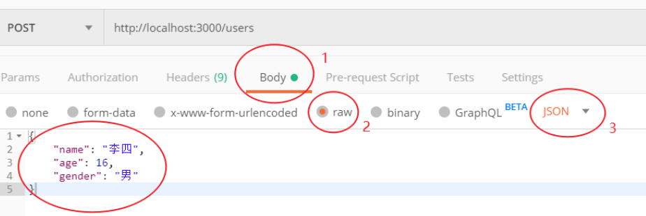
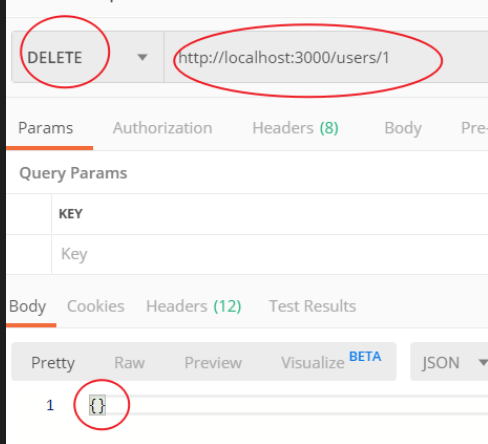

## `JSON Server`;

> - 概述：`JSON Server` 是一个提供测试环境接口的工具，它可以帮我们快速生成一套接口服务;
> - 它是免费开源的命令行工具;

1. **安装：**

   ```bash
   npm install -g json-server  # -g 安装的东西只需安装一次即可；后续无需再安装；
   
   # 该命令用于测试是否安装成功，如果看到一个版本输出，就证明OK了
   json-server --version
   ```

2. **创建文件目录；**

   - 创建文件名为 `json-server-demo`的文件夹，然后在该文件夹中创建一个文件 `db.json` 并写入以下内容：

   ```json
   {
     "posts": [
       { "id": 1, "title": "json-server", "author": "typicode" }
     ],
     "comments": [
       { "id": 1, "body": "some comment", "postId": 1 }
     ],
     "profile": { "name": "typicode" },
     "users": [
       {
         "id": 1,
         "name": "张三",
         "age": 18,
         "gender": "男"
       }
     ]
   }
   
   ```

3. **执行 `db.json`文件；**

   ```bash
   json-server --watch db.json
   ```


> 注：接口服务默认占用 3000 端口;

## 发送请求；

1. **`GET`请求；**

   1. 获取所有数据信息；
      - 请求过程和之前一样；
   2. 根据条件查询数据信息；
      - 请求过程和之前一样；

2. **`POST`请求；**

   1. 添加数据；
      - 响应结果为修改后的数据；
      - 注：请求参数必须是`JSON`格式的；

   

3. **`DELETE`请求方式；**

   - 删除`id`为 1 的数据； 

   

4. **`PATCH`请求方式；**

   - 修改`id`为2的数据；
   - 注：请求体为`JSON`格式；
   - 响应结果为：修改后的数据；