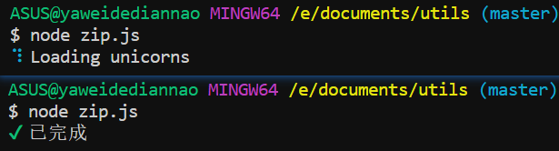

> 使用Node做开发已经是必备的一项技能，然后有时终端中的一些耗时操作的输出对我们不太友好，希望可以提供一个进度loading使用；

### 安装；

[传送门](https://www.npmjs.com/package/ora)

```shell
npm i ora -D
```

### 使用：

```javascript
const ora = require('ora');

// 开启loading
const spinner = ora('Loading unicorns').start();
 
setTimeout(() => {
  // 更改loading的文字与颜色；
	spinner.color = 'yellow';
	spinner.text = 'Loading rainbows';
}, 2000);

setTimeout(() => {
	spinner.succeed(‘已完成’);
}, 6000);

```



### 参数说明：

```javascript
// 快捷方式；ora(string)
const spinner = ora('Loading unicorns').start();

// 选项对象
const spinner = ora({
  text: '压缩中...',
  color: 'red',
  prefixText: '开始压缩',
  spinner: 'bouncingBar'
  // spinner: {
  //   interval: 80,
  //   frames: ['-', '+', '-']
  // }
});
spinner.start();
setTimeout(() => {
	spinner.succeed('压缩文件已保存 路径：xxx');
}, 8000);

// $ node zip.js 
// 开始压缩 [==  ] 压缩中...
// ✔ 压缩文件已保存 路径：xxx
```

### 官方文档；

https://github.com/sindresorhus/ora#readme

