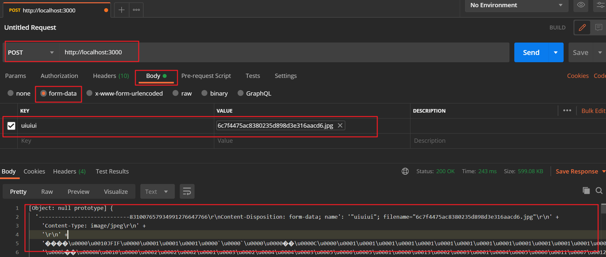

> Node.js 标准库提供了 http 模块，其中封装了一个高效的 HTTP 服务器和一个简易的HTTP客户端。http.Server 是一个基于事件的 HTTP服务器，它的核心由 Node.js 下层 C++部分实现，而接口由 JavaScript 封装，兼顾了高性能与简易性。 http.request 则是一个HTTP 客户端工具，用于向 HTTP 服务器发起请求，  

## HTTP 服务器  

> http.Server 是 http 模块中的 HTTP 服务器对象，  

**实现了一个服务器**  

```javascript
//app.js
const http = require('http')

const app = http.createServer(function(req, res) {
    res.writeHead(200, { 'Content-Type': 'text/html' })
    res.write('<h1>Node.js</h1>')
    res.end('<p>Hello World</p>')
  })

app.listen(3000, (err) => {
  if (!err) {
    console.log('HTTP server is listening at port 3000.')
  }
})
```

```shell
ASUS@yaweidediannao MINGW64 ~/Desktop/test
$ node app.js
HTTP server is listening at port 3000.
```

> http.createServer 创建了一个 http.Server 的实例，将一个函数作为 HTTP 请求处理函数。这个函数接受两个参数，分别是请求对象（ req ）和响应对象（ res ）。在函数体内， res 显式地写回了响应代码 200 （表示请求成功），指定响应头为'Content-Type': 'text/html'，然后写入响应体 '<h1>Node.js</h1>'，通过 res.end结束并发送。最后该实例还调用了 listen 函数，启动服务器并监听 3000 端口。  

### http.Server

> http.Server 是一个基于事件的 HTTP 服务器，所有的请求都被封装为独立的事件，开发者只需要对它的事件编写响应函数即可实现 HTTP 服务器的所有功能。它继承自EventEmitter。

- request：当客户端请求到来时，该事件被触发，提供两个参数 req 和res，分别是http.ServerRequest 和 http.ServerResponse 的实例，表示请求和响应信息。  
- connection：当 TCP 连接建立时，该事件被触发，提供一个参数 socket，为net.Socket 的实例。 connection 事件的粒度要大于 request，因为客户端在Keep-Alive 模式下可能会在同一个连接内发送多次请求。  
- close：当服务器关闭时，该事件被触发。注意不是在用户连接断开时。  

**在 这 些 事 件 中 ， 最 常 用 的 就 是 request 了 ， 因 此 http 提 供 了 一 个 捷 径 ：http.createServer([requestListener]) ， 功 能 是 创 建 一 个 HTTP 服 务 器 并 将requestListener 作为 request 事件的监听函数，这也是我们前面例子中使用的方法。**  事实上它显式的实现方法是：

```javascript
const http = require('http')
const server = new http.Server()

server.on('request', function(req, res) {
  res.writeHead(200, { 'Content-Type': 'text/html' })
  res.write('<h1>Node.js</h1>')
  res.end('<p>Hello World</p>')
})

server.listen(3000, err => {
  if (!err) {
    console.log('HTTP server is listening at port 3000.')
  }
})
```

```shell
ASUS@yaweidediannao MINGW64 ~/Desktop/test
$ node module.js 
HTTP server is listening at port 3000.
```

### http.ServerRequest  

> http.ServerRequest 是 HTTP 请求的信息，是后端开发者最关注的内容。它一般由http.Server 的 request 事件发送，作为第一个参数传递，通常简称 request 或 req。  HTTP 请求一般可以分为两部分： 请求头（Request Header）和请求体（Requset Body）。而请求体可能相对较长，需要一定的时间传输，因此 http.ServerRequest 提供了以下3个事件用于控制请求体
> 传输。  

- data：当请求体数据到来时，该事件被触发。该事件提供一个参数 chunk，表示接收到的数据。如果该事件没有被监听，那么请求体将会被抛弃。该事件可能会被调用多次。  
- end：当请求体数据传输完成时，该事件被触发，此后将不会再有数据到来。
- close：用户当前请求结束时，该事件被触发。不同于 end，如果用户强制终止了传输，也还是调用close。  

#### 获取 GET 请求内容

> 由于 GET 请求直接被嵌入在路径中，URL是完整的请求路径，包括了 ? 后面的部分，因此你可以手动解析后面的内容作为 GET请求的参数。 Node.js 的 url 模块中的 parse 函数提供了这个功能。

```javascript
const http = require('http')
const url = require('url')
const util = require('util')

const app = http.createServer(function(req, res) {
  res.writeHead(200, { 'Content-Type': 'text/plain' })
  res.end(util.inspect(url.parse(req.url, true)))
})

app.listen(3000, (err) => {
  if (!err) {
    console.log('服务启动成功')
  }
})
```

```shell
ASUS@yaweidediannao MINGW64 ~/Desktop/test
$ node module.js 
服务启动成功
```

```javascript
// 打开浏览器输入地址：http://127.0.0.1:3000/user?name=byvoid&email=byvoid@byvoid.com
Url {
  protocol: null,
  slashes: null,
  auth: null,
  host: null,
  port: null,
  hostname: null,
  hash: null,
  search: '?name=byvoid&email=byvoid@byvoid.com',
  query: [Object: null prototype] {
    name: 'byvoid',
    email: 'byvoid@byvoid.com'
  },
  pathname: '/user',
  path: '/user?name=byvoid&email=byvoid@byvoid.com',
  href: '/user?name=byvoid&email=byvoid@byvoid.com'
}
```

> 通过 url.parse，原始的 path 被解析为一个对象，其中 query 就是我们所谓的 GET请求的内容，而路径则是 pathname  

#### 获取 POST 请求内容

> 相比GET 请求把所有的内容编码到访问路径中， POST 请求的内容全部都在请求体中。然而http.ServerRequest 并没有一个属性内容为请求体，原因是等待请求体传输可能是一件耗时的工作，譬如上传文件。而很多时候我们可能并不需要理会请求体的内容，恶意的 POST请求会大大消耗服务器的资源。所以 Node.js 默认是不会解析请求体的，当你需要的时候，需要手动来做。  

```javascript
const http = require('http')
const querystring = require('querystring');
const util = require('util')

const app = http.createServer(function(req, res) {
  var post = ''
  req.on('data', function(chunk) {
    post += chunk
  })
  req.on('end', function() {
    post = querystring.parse(post)
    res.end(util.inspect(post))
  })
})

app.listen(3000, err => {
  if (!err) {
    console.log('服务启动成功')
  }
})
```

**用postman请求的结果如下**



> 上面代码中我们定义了一个 post 变量，用于在闭包中暂存请求体的信息。通过 req 的 data 事件监听函数，每当接受到请求体的数据，就累加到 post 变量中。在 end 事件触发后，通过 querystring.parse 将 post 解析为真正的 POST 请求格式，然后向客户端返回。  

### http.ServerResponse  

> http.ServerResponse 是返回给客户端的信息，决定了用户最终能看到的结果。它也是由 http.Server 的 request 事件发送的，作为第二个参数传递，一般简称为response 或 res。  

- response.writeHead(statusCode, [headers])：向请求的客户端发送响应头。  
- response.write(data, [encoding])：向请求的客户端发送响应内容。  如果 data 是字符串，那么需要指定encoding 来说明它的编码方式，默认是 utf-8。在 response.end 调用之前，response.write 可以被多次调用。  
- response.end([data], [encoding])：  结束响应，告知客户端所有发送已经完成。当所有要返回的内容发送完毕的时候，**该函数 必须 被调用一次。它接受两个可选参数，意义和 response.write 相同**。如果不调用该函数，客户端将永远处于等待状态  

## HTTP 客户端  

> http 模块提供了两个函数 http.request 和 http.get，功能是作为客户端向 HTTP服务器发起请求。  

**http.request(options, callback)  发起 HTTP请求。**

- options：表示请求的参数。
  - host ：请求网站的域名或 IP 地址。
  - port ：请求网站的端口，默认 80。
  - method ：请求方法，默认是 GET。
  - path ：请求的相对于根的路径，默认是“/”。 
  - headers ：请求头的内容；
- callback：请求的回调函数。
  - 传递一个参数，为 http.ClientResponse 的实例。  
- http.request 返回一个 http.ClientRequest 的实例。  

