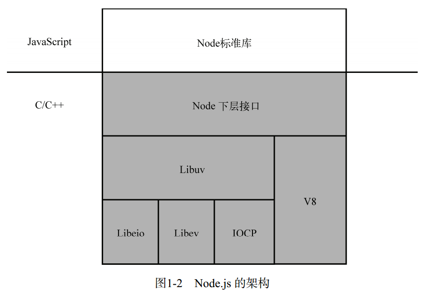

> Node.js 用异步式 I/O 和事件驱动代替多线程，带来了可观的性能提升。 Node.js 除了使用 V8 作为JavaScript引擎以外，还使用了高效的 libev 和 libeio 库支持事件驱动和异步式 I/O。  

Node.js 的开发者在 libev 和 libeio 的基础上还抽象出了层 libuv。对于 POSIX操作系统，libuv 通过封装 libev 和 libeio 来利用 epoll 或 kqueue。  而在 Windows 下， libuv 使用了 Windows  的 IOCP（Input/Output Completion Port，输入输出完成端口）机制，以在不同平台下实现同样的高性能。  

