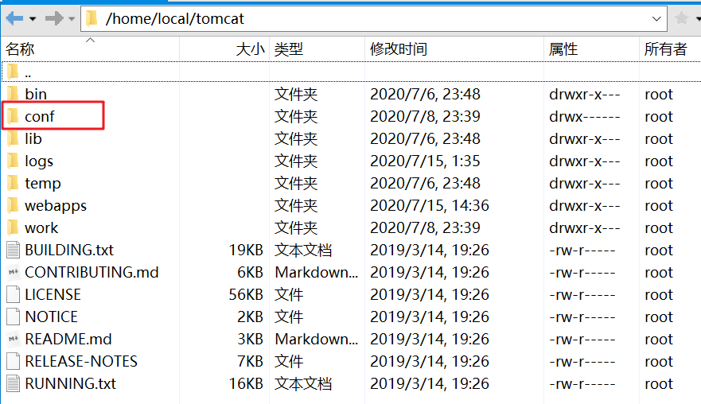
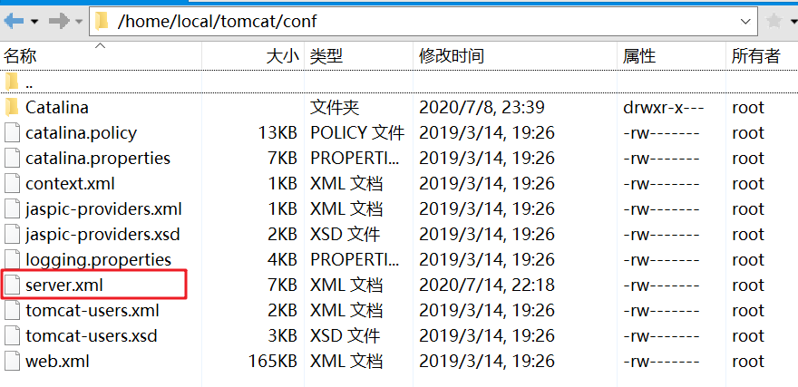
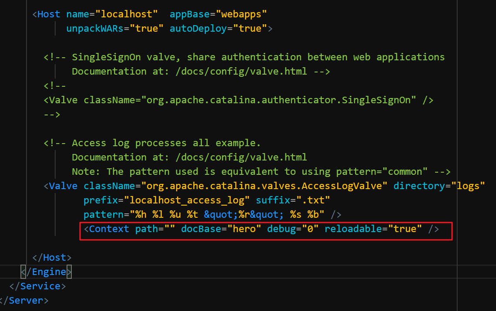

## 解决方案；

- 进入你的tomcat的安装文件夹，找到`conf`文件夹；

  

- 在`conf`里找到`server.xml`文件；

  

- 打开找到`<Host></Host>`标签；添加以下代码；

  ```html
  <Context path="" docBase="hero" debug="0" reloadable="true" />
  ```

  > 说明：hero是我自己的项目文件名，也就是`tomcat`的默认文件夹，可根据自己的项目情况来命名；

  

> **重启；测试；** 直接`ip`地址端口号然后回车；

