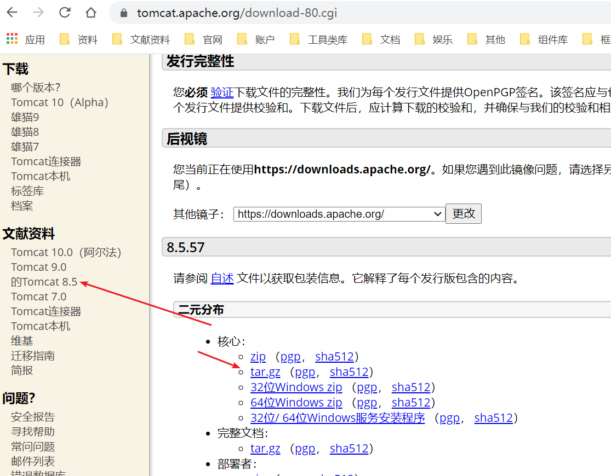
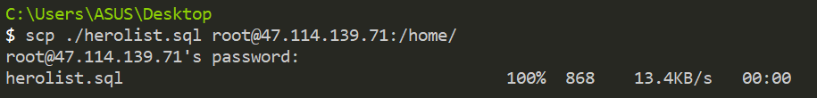
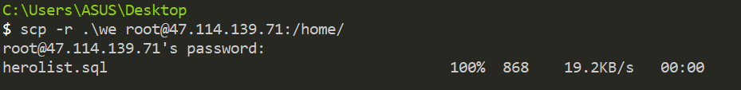
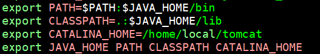
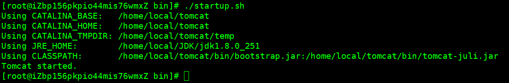
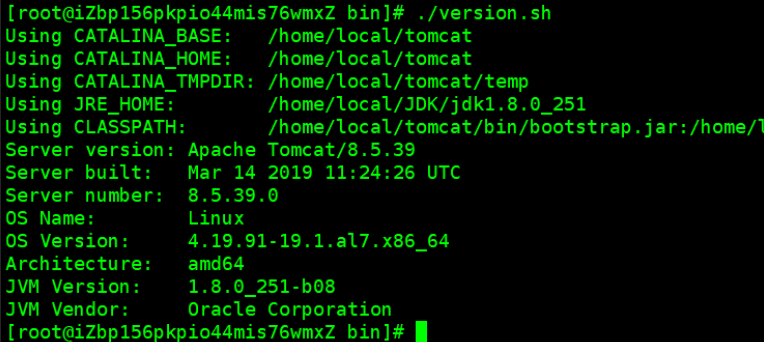
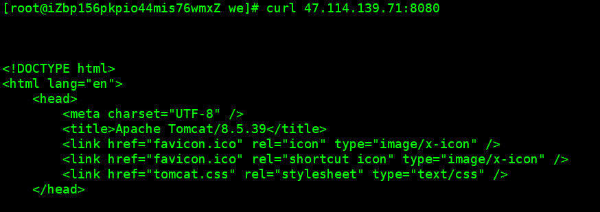
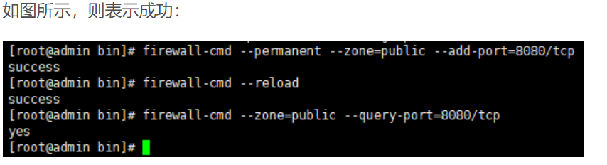
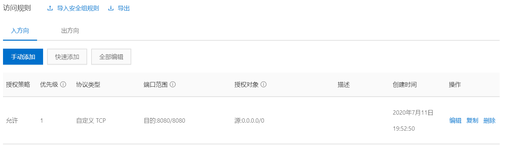
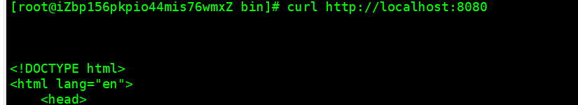

## 1、下载安装包；

[安装包]( https://tomcat.apache.org/download-80.cgi )



- 把下载的安装包，传到服务器；

  - **我已安装完成，所以下面的文件上传我只是举例**；

  >  `scp`命令是用于`linux`机器之间复制文件夹或目录。`scp`是`source copy`的缩写，`scp`是基于`ssh`登录进行安全的远程文件的拷贝命令，`scp`是加密的，`rcp`是不加密的，`scp`是`rcp`的加强版。 

  ```
  命令：scp [可选参数] file_source file_target
  ```

  

  ```
  表示将当前目录下的`./herolist.sql`文件，传送到ip为47.114.139.71的home目录中； 
  ```

-  如果上传的是一个文件夹，那么需要使用`-r`参数，标记这次命令需要递归目录拷贝： 

  ```
  命令：scp -r .\we root@47.114.139.71:/home/
  ```

  

- 解压；

  ```
  tar -xvf fileName
  ```

## 2、配置环境变量；

- 编辑文件；

  ```
  vim /etc/profile
  ```

  

  > 在打开的文件中添加图中所示内容；编辑完成后按  ESC  退出编辑模式； :wq 保存退出；
  >
  >  然后执行命令：source /etc/profile  (目的是使修改的文件生效) 

## 3、 启动tomcat 

- 启动；

  ```
  命令：cd /home/local/tomcat/apache-tomcat-8.5.39/bin
  ```

  

- 查看版本号；

  ```
  命令：./version.sh
  ```

  

- 关闭服务；

  ```
  命令：./shutdown.sh
  ```


> 命令：`curl 47.114.139.71:8080`
>
> 也可以直接查看是否启动成功；



> `tomcat`的启动需要`jdk`的支持，所以请确保你已安装 `jdk`

## 4、关闭防火墙；

> 不推荐关闭防火墙，而是开放一个8080端口；

```shell
# 关闭防火墙
service iptables stop
或
systemctl stop firewalld.service
```

##   5、开启或重启防火墙

```
systemctl start firewalld.service

systemctl restart firewalld.service
```

- 单独开放8080端口 ；

  - ```
    firewall-cmd --permanent --zone=public --add-port=8080/tcp
    firewall-cmd --reload
    firewall-cmd --zone=public --query-port=8080/tcp
    ```

    

## 6、添加安全组；



## 7、启动tomcat测试

- 打开浏览器访问

## 8、直接命令访问`WEB`页面；

```
curl http://localhost:8080
```



