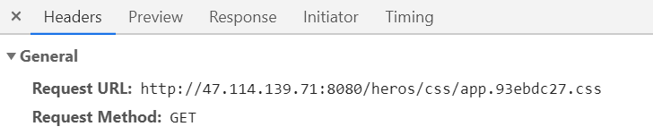

## 问题描述；

> 本人使用的阿里云服务器，经过几天的折腾，我怀着无比激动的心情打开浏览器访问我几天的劳动成果，然而呈现我眼前的却是空白页**what？**

##  解决方案；

1. 在 `vue.config.js`中配置`publicPath`属性；

   > **据`vue`官方介绍：**`Vue CLI` 会假设你的应用是被部署在一个域名的根路径上，例如 `https://www.my-app.com/`。**如果应用被部署在一个子路径上**，你就需要用这个选项指定这个子路径。例如，如果你的应用被部署在 `https://www.my-app.com/my-app/`，则设置 `publicPath` 为 `/my-app/`。
   >
   > 这个值也可以被设置为空字符串 (`''`) 或是相对路径 (`'./'`)，这样所有的资源都会被链接为相对路径，这样打出来的包可以被部署在任意路径

   ```js
   module.exports = {
     // 解决部署后访问空白页的问题；
     publicPath: './',
   }
   // 我的项目部署在 http://47.114.139.71:8080/heros/#heroList 上；
   ```

   ```
   相对路径：‘./’  会把项目名默认添加到请求的资源路径中；
   ```

   

   ```
   如果是 绝对路径 ‘/’ 则请求的资源路径为 http://47.114.139.71:8080/css/app.93ebc27.css
   ```

   > 以相对路径`./`设置的效果和`/heros/`或`heros`的效果一样；都会在请求的资源路径添加项目名或你设置的路径名(hero)；


