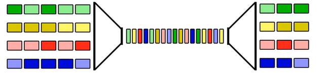
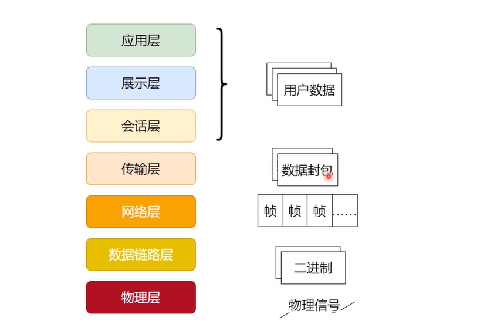

## OSI模型简介

- 开放式系统互联网模型(Open System Interconnection Model)
- 世界范围内的网络标准概念模型；
- OSI的努力让互联网协议逐渐走向标准化

## 七层模型

> 由国际化标准化组织(ISO)制定

1. 应用层；

   - 提供高级API。
   - 定义了网络主机提供的方法和接口(业务协议、高级协议等)。
   - 往往直接对应用户行为。
     - 例如：HTTP、FTP、SMTP等。

2. 展示层

   - 也被称作语法层。
   - 将应用层中的数据转化为传输格式，保留语义(如：序列化、加密解密、字符串编码解码等)
   - 确保数据发送取出后可以被接收者理解。

3. 会话层

   - 提供管理会话的方法(Open/Clone/ReOpen/检查状态)；
   - 提供对底层连接断断续续的隐藏；甚至对多种底层流的隐藏(提供数据同步点)；

4. 传输层

   - 提供主机到主机的数据通信能力。

   - 建立连接保证数据包发送、接受到的顺序一致。

   - 提供可靠性(发送者知道数据有没有被完整送达)；

   - 提供流控制(发送者和接受者同步速率)；

   - 提供多路服用(多种信号服用一个信道)；

     

5. 网络层；

   - 提供数据在逻辑单元(例如IP地址)之间的传递能力；
   - 路由：决定数据的下一站在哪里；
   - 寻址：为数据封包增加头信息(地址等)；

6. 数据链路层；

   - 提供数据在设备和设备间的传输能力；
   - 流控制：发送者接收者之间同步数据收发速度和数据量；
   - 错误控制：检测数据有没有出错，并重发错误的数据；

7. 物理层；

   - 定义底层一个个位(bit)的数据如何变成物理信号；
   - 将数据链路层发生的数据传递行为转化成为物理设备识别的信号；
   - 封装了大量底层物理设备的能力；

## 实际应用

> 当Alice向Bob发微信

- Alice提交的输入被微信存储成某种内部协议格式 - 应用层；
- 数据被转化成为传输用的格式(如加密、压缩等) - 表示层；
- 微信客户端向服务器传输数据 - 传输层；
- 一个个数据封包从主机传输到服务器 - 网络层；
- 数据帧在一个个设备之间传输 - 数据链路层；
- 数据最终以光电信号的形式在物理设备间传输 - 物理层；

## OSI分层架构

分层架构的优点：

- 把应用分成N层，替换其中一层不影响其他层的工作，不需要重构整个应用；
- 设计要点：
  - 必要性/独立性/可替换性；
  - 层的颗粒度；
  - 数据可追踪性；

