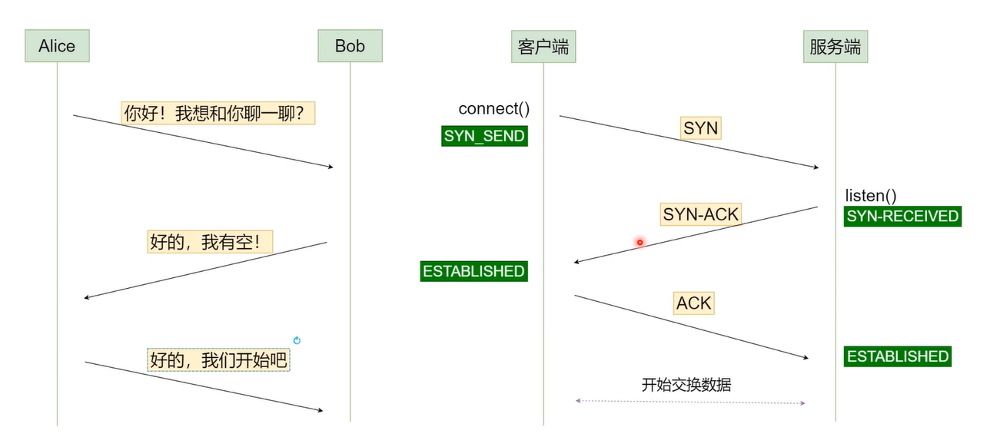
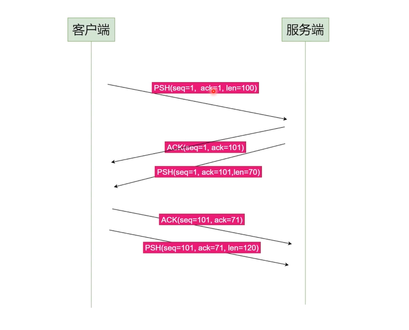

>也称为互联网协议群，类似OSI模型，一种网络协议的概念模型，但是它简化的OSI模型。

## 互联网协议群

- 应用层（Application）
- 传输层（Transport）
- 网络层（Internet）
- 链路层（Link）
- 物理层（Pysical）

### IP封包：

### TCP协议封包

- 每个封包称作一个TCP信息段(TCP Segment);

- Header用于描述传输行为(如源端口、目标端口等)；

- Header后面跟若干个byte数据，没个byte拥有自己的序列号；

- 一个完整的封包：

  

## 三次握手

> 场景alice想和bob聊天。

以上图中的情况，如果是人与人之间的聊天，那么这个对话就可以进行了，但是会有一个异常的情况，如果Bob回复的消息比较慢而这期间 Alice 也正好离开了，那么后面的对话便无法在继续进行。以上的场景如果作为两个机器人的对话，当Bob发送的消息得不到Alice的回复时，这个连接便无法建立，所有需要3次握手才能建立连接。

## 处理数据顺序

我们先看以下的对话场景；

在上面的对话中，会存在一个问题，就是Bob回复的两句中，哪一句是对应alice中的第一句，你是不知道的。同时由于网络中的各种原因，"你们班有多少同学？"可能会比"你今年多大了?"先到，这个时候就更加无法确定语句的先后顺序了。

### 解决方式一：

给发送的消息添加序号：

但是这样也会产生问题，当Bob发送序号为 3 的消息时，又如何知道 Alice 不会在发送一条序号为 3 的消息呢？这样以来序号又冲突了。

### 解决方式二：

给发送的消息添加发送时间：

但是这样也会产生一个问题，Alice和Bob的时间不一定就是一样的，有可能Bob的时间会比Alice快。

### 解决方式三：

消息的绝对顺序用(SEQ,ACK)这一对元组描述

- SEQ(Sequence)：这个消息发送前一共发送了多少字节；
- ACK(Acknowledge)：这个消息发送前一共收到了多少字节；

#### 三次握手

#### 数据传送

#### 顺序解决

::: info

发送到服务端的数据并不是立即响应式的，而是有一个时间窗口，在这个窗口内，都会实时的接受消息，最后响应。因为如果是立即响应时的话，那么在服务端收到第一条消息时，第二条消息还没到达，但是服务器就已经回复了，那么回复的内容就可能是错的。另外这个窗口期也不会太短，因为你总不能等待一年后在收到消息然后回复吧。

:::

## 挥手(中断连接)

### 场景一

Alice发送Bye的时候，Bob在没有收到Alice的消息之前，也可能发送消息给Alice，所以仅以这种方式结束会话是不行的。

### 场景二

Alice发送完Bye后，Bob接收到消息，但是Bob会等待所有对话完成后，发送Bye给Alice同时Alice也会等待所有对话完成，然后回复消息给Bob，最后中断连接。

