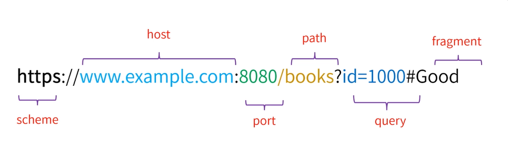
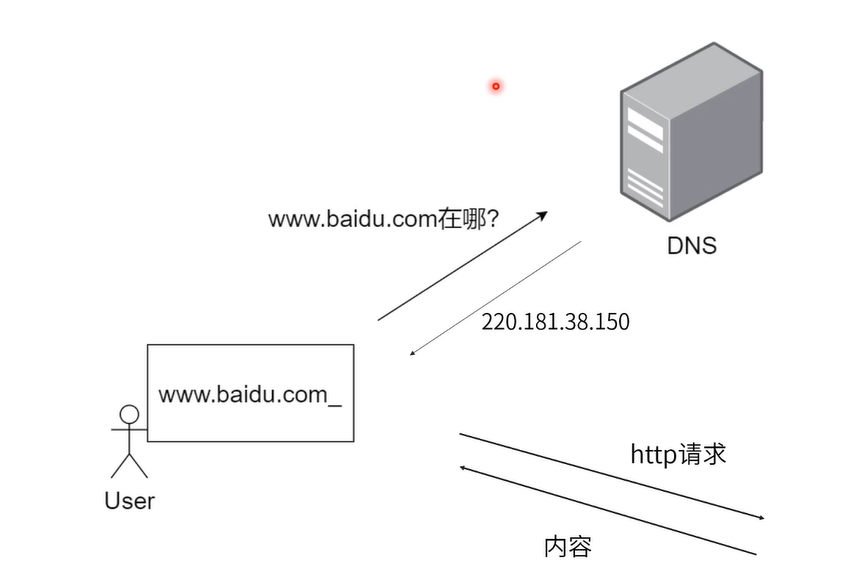
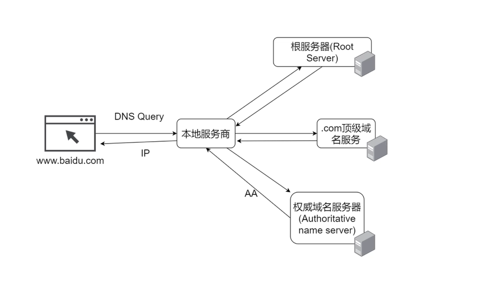
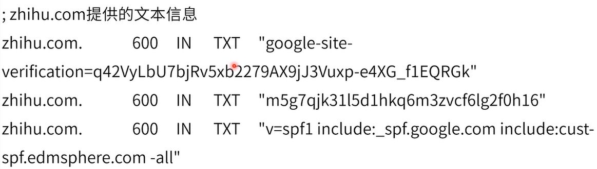
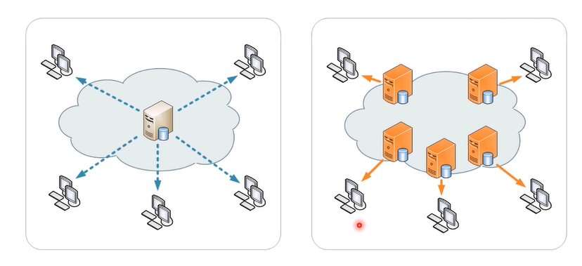
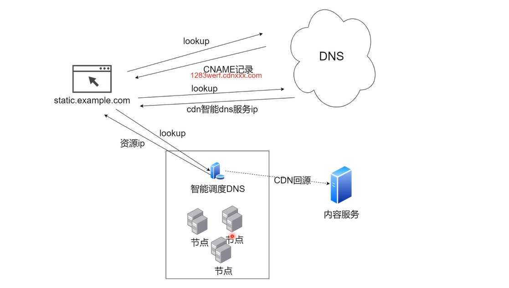

## DNS的基础知识

### 统一资源定位符（URL）

> 也被称作[网址]，用于定位互联网上的资源。



### DNS(Domain Name System)

用户用浏览器查询`www.baidu.com`首先会去DNS服务查询，如果有则DNS服务会返回IP地址，然后浏览器根据IP地址请求百度的内容。



**DNS服务查询的过程**

上图只是一个简单的查询过程，实际上DNS服务的查询要复杂一些，以下是一个具体的查询过程。当用户输入`www.baidu.com`的时候，首先会查询计算机本地的DNS服务，如果找到了就返回具体Ip，如果没有就查询本地服务商，如果找到就返回，如果没有就去根服务器查询，查询不到就去`.com`顶级域名服务器查询，在查询不到就去权威域名服务器查询，如果有就返回。



### DNS记录

1. A记录

   - 定义主机的`IP`地址；

     ```html
     定义www.example.com 的ip地址。
     
     www.example.com. IN A 139.18.28.5
     ```

2. AAAA记录

   - 定义主机的Pv6地址

     ```html
     定义 www.zhihu.com 的ipv6地址
     
     1251625956.s2txipv6.cdntip.com. 103 IN AAAA
     
     240e:940:401:1:1a
     ```

3. CNAME记录

   - 定义域名的别名

     ```html
     例：定义example.com 的别名 www.example.com。
     
     www.example.com. IN CNAME example.com
     a.example.com. IN CNAME b.example.com
     www.foo.com. IN CNAME example.com
     ```

4. MX记录

   - 定为邮件服务器

     ```html
     happy.example.com 作为邮件服务域名；
     
     IN MX happy.example.com
     
     A记录描述邮件服务器IP
     
     happy.example.com IN A123.123.123.123；
     ```

5. NS记录

   - 定义提供dns信息的服务器

     ```html
     定义为zhihu.com提供dns信息的服务器
     
     zhihu.com.  52908 IN NS ns4.dnsv5.com
     
     zhihu.com.  52908 IN NS ns3.dnsv5.com
     ```

6. SOA记录(Start of Authority Record)

   - 定义在多个ns服务器种哪个是主服务器

     ```
     ns3.dnsv5.com.主服务器 IN SOA ns3.dnsv5.com.enterprise3dnsadmin.dnspod.com.1594718785 3600180 1209600 180
     ```

7. TXT记录

   - 提供文本信息

     

## DNS查询工具

1. dig(DNS lookup utility)
   - 用来查询dns的小工具
2. nslookup
   - 交互式查询域名服务工具
3. host(DNS lookup utility)

## 本地host修改

- Swichhost工具

## CDN

> 内容分发网络(Content Delivery Network)

### 介绍

基于地理位置的分布式代理服务器/数据中心；

- 提供高可用；
- 提升性能；
- 提升体验；



### 运行原理



### CDN测试工具

- https://17ce.com/site