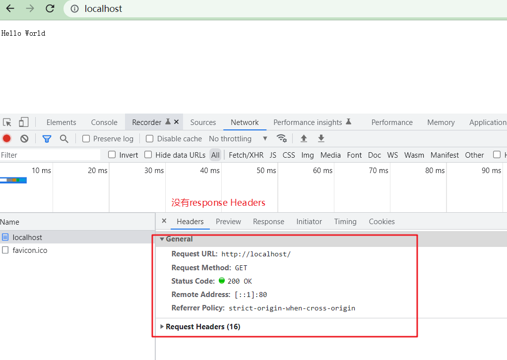
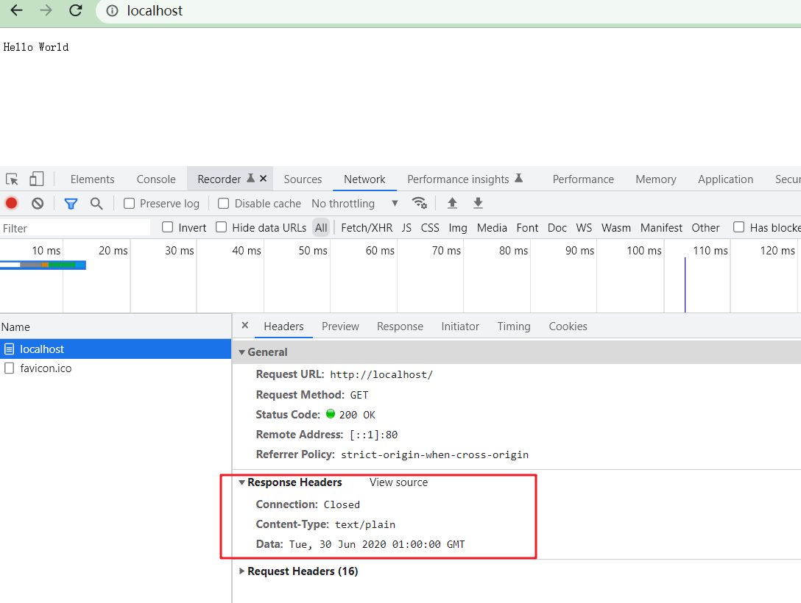

## Http协议介绍

http的发明者：蒂姆.伯纳斯-李(英国计算机科学家)

- 万维网(1990 HTTP协议)的发明者；
- 第一个浏览器的发明者；
- 创办MIT人工只能实验室；


### http协议

- 超文本传输协议(Hyper Text Transfer Protocol)
- 处理客户端和服务端之间的通信；
- http请求/http返回；
- 网页/json/xml/提交表单；

### 设计理念

纯文本 + 无状态

- 应用层协议(下面可以是TCP/IP)；
- 信息纯文本传输；
- 无状态
  - 每次请求独立；
  - 请求间互不影响；
- 浏览器提供了手段维护状态(Cookie, Session, Storage等)

### http历史

- 1991 HTTP 0.9
- 1996 HTTP 1.0
- 1999 HTTP 1.1
- 2015 HTTP 2.0

### 缓存

- http1.0 提供缓存机制如：IF-Modified-Since等基础缓存控制策略；
- http1.1 提供E-Tag等高级缓存策略；

### 带宽优化

- http1.1 利用Range头获取文件的某个部分；
- http1.1利用长连接让多个请求在一个TCP连接上排队；
- http2.0 利用多路服用技术同时传输多个请求；

### 压缩

- 主流web服务器如nginx、express等都提供gzip压缩功能；
- http2.0 采用二进制传输，头部使用HPACK算法压缩；

## Node.js实战http请求

1. 创建`http`服务；

   ```javascript
   // 引入net包
   const net = require('net');
   
   const response = `Hello World`;
   
   // 创建一个http服务
   const server = net.createServer((socket) => {
     socket.end(response);
   })
   
   // 监听 80 端口
   server.listen(80);
   ```

   

2. 写入 `response Headers`

   ```javascript
   const response =
   `HTTP/1.1 200 OK
   Data: Tue, 30 Jun 2020 01:00:00 GMT
   Content-Type: text/plain
   Connection: Closed
   
   Hello World
   `;
   ```

   

## whistle工具

```bash
npm install whistle -g
```

