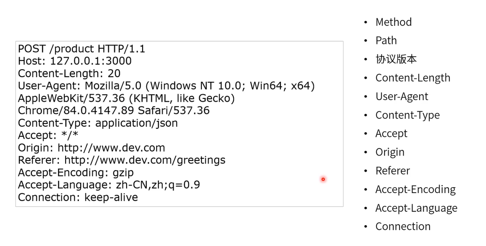
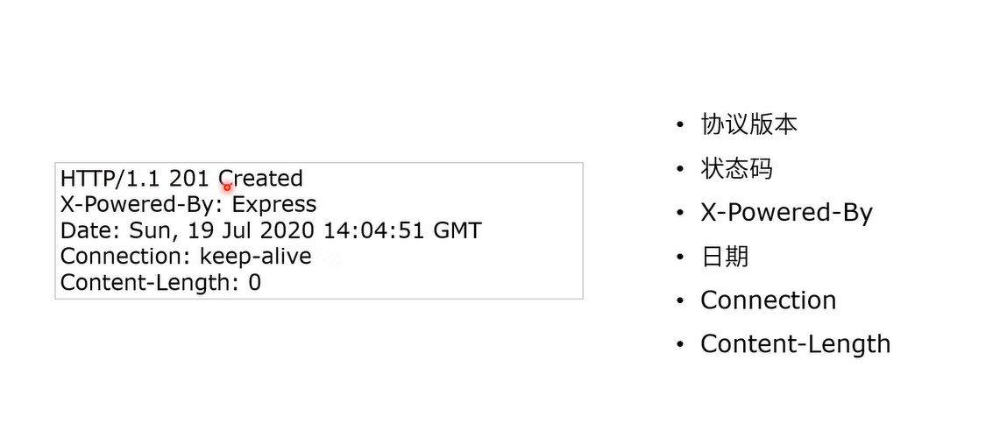

## HTTP协议内容和方法

### HTTP请求常见请求头

- Content-Length
  - 发送给接受者的Body内容长度；
  - 一个Byte是8bit；
  - Utf-8编码的字符1-4个字节；
- User-Agent
  - 帮助区分客户端特性的字符串
    - 操作系统
    - 浏览器
    - 制造商(手机类型等)
    - 内核类型
    - 版本号...
- Content-Type
  - 帮助区分资源的媒体类型
    - text/html
    - text/css
    - application/json
    - image/jpeg
- Origin
  - 描述请求来源地址
    - scheme://host:port
    - 不含路径
    - 可以是null
- Accept
  - 建议服务端返回何种媒体类型（MIME Type）
    - `*/*`代表所有类型(默认)；
    - 多个类型用逗号隔开例如：text/html，application/json
  - Accept-Encoding：建议服务端发送哪种编码（压缩算法）
    - deflate,gzip;q=1.0,*;q=0.5
  - Accept-Language:建议服务端传递哪种语言
    - Accept-Language：fr-CH,fr;q=0.9,en;q=0.8,de;q=0.7,*;q=0.5
- Referer
  - 告诉服务端打开当前页面的上一张页面的URL；如果是ajax请求那么就告诉服务端发送请求的URL是什么
    - 非浏览器环境有时候不发送Referer（或者虚拟Referfer，通常是爬虫）
    - 常常用户行为分析
- Connection
  - 决定连接是否在当前事务完成后关闭
    - Http1.0 默认是close
    - Http1.1 后默认是keep-alive



### HTTP常见返回头



### HTTP常见请求方法

1. GET
   - 从服务器获取资源
2. POST
   - 在服务器创建资源
3. PUT
   - 在服务器修改资源(幂等性)
4. DELETE
   - 在服务区器删除资源
5. OPTION
6. TRACE
   - 用于显示调试信息
   - 多数网站不支持
7. CONNECT
8. PATCH
   - 对资源进行部分更新

## 常见HTTP状态码

### 1xx：提供信息

- 100 continue

- 101 切换协议(Switch protocol)

  ```html
  HTTP/1.1 101 Switching Protocols
  Upgrade: websocket
  Connection: Upgrade
  ```

### 2xx：成功

- 200：OK
- 201：Created 已创建；
- 202：Accopted已接受；
- 203：Non-Authoritative Information 非权威内容；
- 204：No Content 没有内容；
- 205：Reset Content 重置内容；
- 206：Partial Content 服务器下发了部分内容(range header);
- **注：多数服务端开发已经不遵循状态码；**

### 3xx：重定向

- 300 - Multiple Choices 用户请求了多个选项的资源(返回选项列表)
- 301  - Moved Permanently 永久转移
- 302 - Found 资源被找到(以前是临时转移)
- 303 - See Other 可以使用GET方法在另一个URL找到资源
- 304 - Not Modified 没有修改
- 305 - Use Proxy 需要代理
- 307 - Temporary Redirect 临时重定向
- 308 - Permanent Redirect 永久重定向

### 4xx：客户端错误

- 400 - Bad Request 请求格式错误
- 401 - Unauthorized 没有授权
- 402 - Payment Required 请先付费
- 403 - Forbidden 禁止访问
- 404 - Not Found 没有找到
- 405 - Method Not Allowed 方法不被允许
- 406 - Not Acceptable 服务端可以提供的内容和客户端期待的不一样

### 5xx：服务端错误

- 500 - Internal Server Error (内部服务错误)；
- 501 - Not Implemented （没有实现）
- 502 - Bad Gateway（网关错误）
- 503 - Service Unavailable（服务不可用）
- 504 - Geteway Timeout（网关超时）
- 505 - HTTP Version Not Supported（版本不支持）

## 301 vs 308

- 共同点
  - 资源被永久移动到新的地址；
- 差异
  - 客户端收到308请求后，之前是什么method，那么之后也会延用这个method(POST/GET/PUT)到新地址；
  - 客户端收到301请求后，通常用户会向新地址发起GET请求；

## 302 vs 303 vs 307

- 共同点
  - 资源临时放到新地址(请不要缓存)
- 差异
  - 302是http1.0提出的，最早叫做Moved Temporarily；很多浏览器实现的时候没有遵循标准，把所有请求都重定向为 GET
  - 1999年标准委员会增加了303和307，并将302重新定义为Found；
  - 303告诉客户端使用GET方法重定向资源；
  - 307告诉客户端使用原请求的method重定向资源；

## 不同重定向行为的区别

### 301

### 302

### 303

### 307

### 308