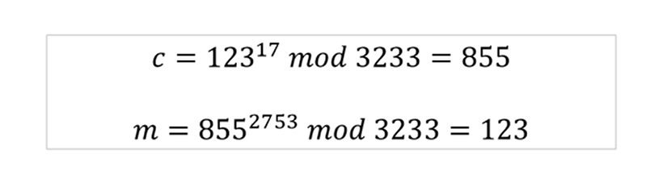

## HTTP 为什么不安全

> HTTP 由于是明文传输，主要存在三大风险：**窃听风险、篡改风险、冒充风险**。

### 窃听风险

中间人可以获取到通信内容，由于内容是明文，所以获取明文后有安全风险。

### 篡改风险

中间人可以篡改报文内容后再发送给对方，风险极大。

### 冒充风险

比如你以为是在和某宝通信，但实际上是在和一个钓鱼网站通信。

## 明文传输

场景再现：`Alice`和`Bob`说我今天9点飞重庆，但是他们之间的对话被`Tommy`劫持了，因为是**明文传输**的，所以`黑客`直接就可以知道谈话内容。

## 密文传输

> 把`Alice`和`Bob`之间的对话进行一次加密，这样以来即便被第三者劫持了，也不知道他们之间的谈话内容。

::: into

1. `Alice`和`Bob`之间的对话虽然被加密了，但是`Bob`是需要解密的(当然如果一个人非常的聪明，依然可以破解的)。
2. 加密的主要目的是让破解的代价足够高。

:::

::: info

什么是加密：将明文信息变成不可读的密文内容，只有拥有解密方法的对象才能够将密文还原成加密前的内容。

:::

**把一串字母按照一定的规则书写，就可以理解为一个简单的加密过程。**`KILLKING`为原文意思。

## 对称加密

> 加密和解密的暗号(密钥)相同，我们称为对称加密。

## 非对称加密

> 加密和解密的暗号(密钥)不同，我们称为非对称加密。

- 创建者创建一个密钥对（分成公钥和私钥）；
- 公钥加密必须私钥解密。
- 私钥加密必须公钥解密。
- 创建者保留个私钥，公钥向外界公开。

::: info

1. 为什么加密解密可以不用一把钥匙？我们优秀的数学家发明的一种算法。
2. 什么场景需要非对称加密？不放心对方保管密钥的情况。场景：登录

:::

::: info

计算机中，加密和解密方法可以描述为一段程序，我们称作加密/解密算法。加密有时候会对暗号，比如上面的例子中每隔3个字符，【3】就是一个暗号，这个我们称作密钥

:::

## 解决信任问题

> 场景：Bob在浏览淘宝的网页，但是不知道这个网页是不是真的淘宝(第三者可以通过DNS等手段劫持后返回给你一个类似的淘宝页)，这个时候如果你购买了东西，肯定是不会发货的，因为这是个假的淘宝。所以这里要解决信任问题，不然就没有人敢上网了。

::: info

公钥是随着浏览器访问网页而返回来的，但是你依然不能确定这个公钥是否是alibaba的，有可能是伪造的。所以我们只要解决了这个问题，那么就ok了。

:::

## 证书体系

> **数字证书：**网站在使用HTTPS前，需要向“CA机构”申请颁发一份数字证书，数字证书里有证书持有者、证书持有者的公钥等信息，服务器把证书传输给浏览器，浏览器从证书里取公钥就行了，证书就如身份证一样，可以证明“该公钥对应该网站”。

### 如何放防止数字证书被篡改?

> 把证书内容生成一份“签名”，比对证书内容和签名是否一致就能察觉是否被篡改。这种技术就叫**数字签名**

**签名过程（数字签名）**

- CA使用摘要算法计算服务器提交的明文信息并得出信息摘要。
- 然后CA再用它的私钥和特定的算法对信息摘要加密，生成签名。
- 把签名、服务器公钥等信息打包放入数字证书，并返回给服务器。
- 服务器配置好证书，以后浏览器连接服务器，都先把证书发给客户端验证。

::: info

摘要算法：主要用于保证信息的完整性。常见的MD5算法、散列函数、hash函数都属于这类算法，其特点就是单向性、无法反推原文

:::

### 浏览器如何验证数字证书？

server 将证书传给 client 后，client 的验签过程如下：

这样的话，由于只有 CA 的公钥才能解密签名，如果客户端收到一个假的证书，使用 CA 的公钥是无法解密的，如果客户端收到了真的证书，但证书上的内容被篡改了，摘要比对不成功的话，客户端也会认定此证书非法。

::: info

浏览器本身会预装一些它们信任的根证书，其中会有CA机构的根证书，实际上证书之间的认证也可以不止一层，可以A信任B，B信任C，以此类推，我们把它叫做`信任链`或`数字证书链`。也就是一连串的数字证书，由根证书为起点，透过层层信任，使终端实体证书的持有者可以获得转授的信任，以证明身份。

:::

### 为什么这样可以证明证书可信呢?

- 假设中间人篡改了证书的原文，由于他没有CA机构的私钥，所以无法得到此时加密后签名，无法相应地篡改签名。浏览器收到该证书后会发现原文和签名解密后的值不一致，则说明证书已被篡改，证书不可信，从而终止向服务器传输信息，防止信息泄露给中间人。	
- 假设有另一个网站B也拿到了CA机构认证的证书，它想搞垮网站A，想劫持网站A的信息。于是它成为中间人拦截到了A传给浏览器的证书，然后替换成自己的证书，传给浏览器，之后浏览器就会错误地拿到B的证书里的公钥了，又会导致上文提到的混合加密的漏洞。其实这并不会发生，因为证书里包含了网站A的信息，包括域名，浏览器把证书里的域名与自己请求的域名比对一下就知道有没有被掉包了。

### 制作数字签名时需要hash一次？

最显然的是性能问题，前面我们已经说了非对称加密效率较差，证书信息一般较长，比较耗时。而hash后得到的是固定长度的信息（比如用md5算法hash后可以得到固定的128位的值），这样加密解密就会快很多。

### 为啥要用 CA的私钥对摘要加密呢？

假设中间人篡改了证书的原文，由于他没有CA机构的私钥，所以无法得到此时加密后签名，无法相应地篡改签名。浏览器收到该证书后会发现原文和签名解密后的值不一致，则说明证书已被篡改，证书不可信，从而终止向服务器传输信息，防止信息泄露给中间人。	

## 常见算法介绍

### DES(Data Encrption Standard)

- 1970 IBM提出的对称加密算法。
- 可暴力破解。

### AES（Advanced Encryption Standanrd）

- 2001 年美国国家标准与技术研究院发布的对称加密算法
- 可旁道攻击。

### RSA(Rivest-Shamir-Adleman)

- 1977年发布的非对称加密算法。

## 对称vs非对称

- 非对称加密安全性更好。
- 对称加密计算速度更快。
- 通常混合使用（利用非对称加密协商密钥，然后进行对称加密）。

## HTTPS建立连接的过程

> 先3次握手，然后是协商密钥，最后才是传输数据。

## 扩展

### 为什么根证书是可信的

数字证书认证机构（Certificate Authority, CA）签署和管理的 **CA 根证书**，会被纳入到你的浏览器和操作系统的可信证书列表中，并由这个列表判断根证书是否可信。所以不要随便导入奇奇怪怪的根证书到你的操作系统中。

### 公钥如何安全地传输到 client

如果还是从 server 传输到 client，依然无法解决公钥被调包的风险。实际上公钥是存在于 CA 证书上，而此证书（也称 Root CA 证书）被操作系统信任，内置在操作系统上的，无需传输。