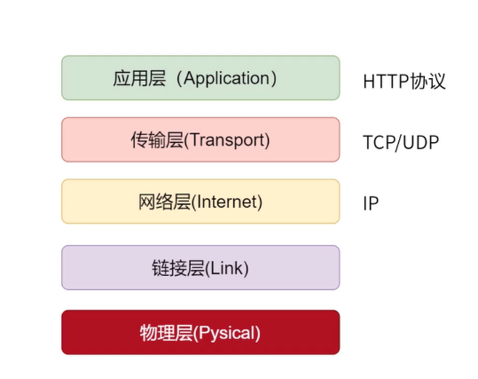
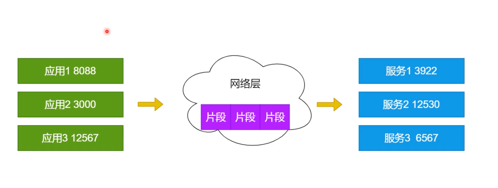
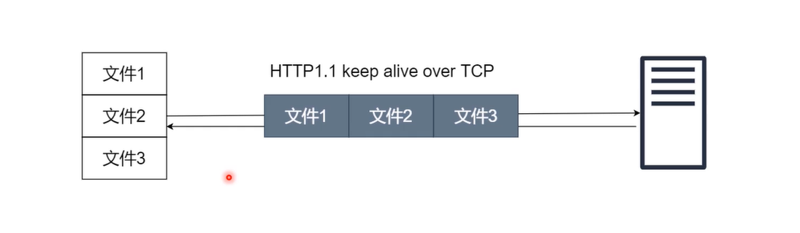
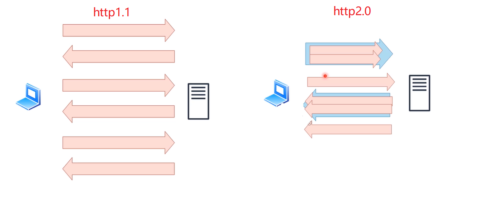
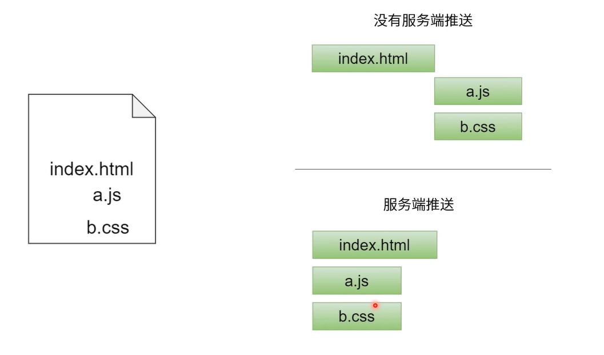
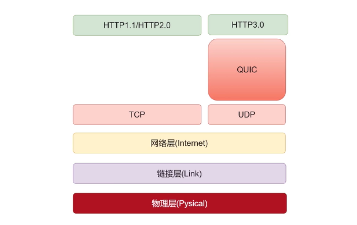

## TCP/UDP

### Internet协议群（TCP/IP协议群）

### 传输层和网络层

### UDP(User Data Diagram)

- 比TCP节省网络资源和速度。
- 不需要建立连接（延迟更低）。
- 封包体积更小（传输速度快）。
- 不关心数据顺序（不需要序号和ACK，传输快速）。
- 不保证数据不丢失。
  - 没有3次握手。
  - 没有重发校验。

## HTTP2.0

### 多路复用

> 下一次的请求不需要等待上一个响应来之后再发送。但响应的顺序是不变的，FIFO（先进先出）

在http1.1中，如果你同时请求了多个文件，那么这几个文件会共用一个TCP链接，但是这样就产生了一个问题后面的文件会进行等待。又由于浏览器最大允许同时打开6个TCP链接，所以当请求的文件足够多时，需要排队的文件就越多。

在http2.0中，文件的传输是这样的：

::: info

浏览器发送的 http 请求是复用一个 tcp 连接么:

- 发的不同域名，肯定不复用。
- 发的同域名。若第一个请求与第二个请求并行发送，不复用。
- 发的同域名，并且是第一个请求完事了才发第二个请求。则看是否有 connection: keep-alive 请求头，没有则不复用。
- 发的同域名，第一个请求完了后发第二个请求，有 connection: keep-alive 请求头。则复用同一个 TCP 连接。

:::

### 压缩HTTP头部

> 在http中请求和响应都是由【状态行、请求/响应头部、消息主题】三部分组成的。 一般而言，**消息主体都会经过gzip压缩**，或者**本身传输的就是压缩过后的二进制文件**（如图片、音频等），但是**状态行和头部多是没有经过任何压缩，而是直接以纯文本的方式进行传输的。**http2提出了对请求和响应的头部进行压缩，即不再只是压缩主题部分，这种**压缩方式就是HAPCK --- 其设计简单而灵活。**

### 服务端推送

如果浏览器请求了一个html文件，这个文件中包含a.js/b.js等js文件，在http1.1中浏览器会再次请求a.js和b.js文件。但是在http2.0中，会自动返回a.js和b.js文件。可以有效的减少http请求。

::: info

服务端推送(悖论)

如果一个`html`文件包含几十个js文件和上百个图片，那么服务端是不知道那一个js文件先返回那一个后返回的，如果最关键的一个js文件在最后才返回来那么这个页面就会一直无法显示。所以实际使用中需要根据需要来决定是否开启服务端推送。

:::

## HTTP3.0

