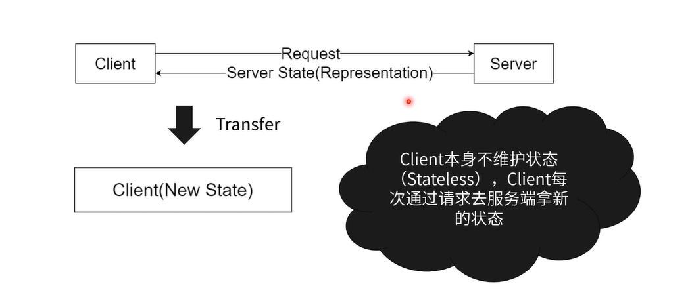

> REST全称是Representational State Transfer，中文意思是表述（编者注：通常译为表征）性状态转移。

**优点：**

- 客户端无状态（简化开发）。
- 资源独立、接口间独立。
- 对协议依赖不严重（可迁移）。

## 概念

> 在RESTFUL中有以下几个概念：

1. 资源
   - 服务端的一个资源。
   - 拥有URL。
2. 表示
   - 服务端的资源在客户端的表示。
   - 客户端拥有操作服务端资源的方法。
3. 转化
   - 客户端收到新的表示，从而向用户展示新的内容。

## 约定

1. 资源命名
   - 名词性词组
   - 下单：/makeOrder -> POST /order
   - 用户登录：/user/login -> /token
2. 状态
   - 客户端无状态（资源表示 -> 展示）。
   - 产品列表：GIT /Products -> 产品列表组件
3. 统一
   - 资源ID /product/123
   - 描述性强：HTTP状态码、规范的协议。