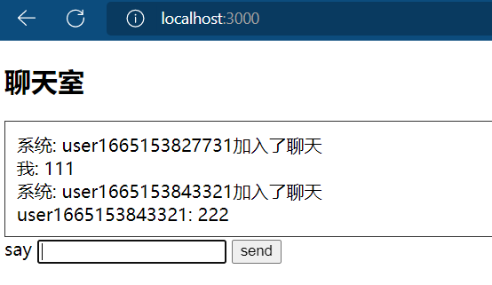

> WebSocket 是 HTML5 开始提供的一种在单个 TCP 连接上进行全双工通讯的协议。
WebSocket 使得客户端和服务器之间的数据交换变得更加简单，允许服务端主动向客户端推送数据。在 WebSocket API 中，浏览器和服务器只需要完成一次握手，两者之间就直接可以创建持久性的连接，并进行双向数据传输。

- 一个基于TCP的通信协议
  - 复用HTTP的握手；
  - 基于TCP传输协议；

## 使用方式

> 客户端可以通过 `WebSorket` 创建一个Websoket对象。

语法：

```text
var Socket = new WebSocket(url, [protocol] );
```

参数：

- url：指定连接的 URL。
- protocol：是可选的，指定了可接受的子协议。

属性：

- readyState：表示连接状态，可以是以下值：
  - 0 - 表示连接尚未建立。
  - 1 - 表示连接已建立，可以进行通信。
  - 2 - 表示连接正在进行关闭。
  - 3 - 表示连接已经关闭或者连接不能打开。
- bufferedAmount：已被 send() 放入正在队列中等待传输，但是还没有发出的 UTF-8 文本字节数。

事件：

| 事件    | 事件处理程序     | 描述                       |
| :------ | :--------------- | :------------------------- |
| open    | Socket.onopen    | 连接建立时触发             |
| message | Socket.onmessage | 客户端接收服务端数据时触发 |
| error   | Socket.onerror   | 通信发生错误时触发         |
| close   | Socket.onclose   | 连接关闭时触发             |

方法：

| 方法           | 描述             |
| :------------- | :--------------- |
| Socket.send()  | 使用连接发送数据 |
| Socket.close() | 关闭连接         |

::: info
WebSocket 协议本质上是一个基于 TCP 的协议。

为了建立一个 WebSocket 连接，客户端浏览器首先要向服务器发起一个 HTTP 请求，这个请求和通常的 HTTP 请求不同，包含了一些附加头信息，其中附加头信息"Upgrade: WebSocket"表明这是一个申请协议升级的 HTTP 请求，服务器端解析这些附加的头信息然后产生应答信息返回给客户端，客户端和服务器端的 WebSocket 连接就建立起来了，双方就可以通过这个连接通道自由的传递信息，并且这个连接会持续存在直到客户端或者服务器端的某一方主动的关闭连接。

Websocket 使用 ws 或 wss 的统一资源标志符，类似于 HTTPS，其中 wss 表示在 TLS 之上的 Websocket。如：

```text
ws://example.com/wsapi
wss://secure.example.com/
```
:::

下面就简单实现下 `websocket` 的前后端代码；

## 前端

```html
<!DOCTYPE html>
<html>
<body>
<div></div>
<label>say</label>
<input />
<button>send</button>
<script>
// 创建 WebSocket 对象
const client = new WebSocket('ws://127.0.0.1:8080');
// 连接建立时触发
client.onopen = () => {
  console.log('connection open')
}
</script>
</body>
</html>
```

## 后端

```js
// web server
const express = require('express')
const app = express()
const path = require('path')
const parseHeader = require('parse-headers')
const crypto = require('crypto')

app.get('/', (req, res) => {
  res.sendFile(path.resolve(__dirname, 'handshake.html'));
});

app.listen(3000)
```

```js
/* -- websocket server -- */
const net = require('net')
const server = net.createServer()

server.on('connection', socket => {
  socket.on('data', (buffer) => {
    const str = buffer.toString()
    const headers = parseHeader(str)
    const sha1 = crypto.createHash('sha1')
    sha1.update(headers['sec-websocket-key'] + '258EAFA5-E914-47DA-95CA-C5AB0DC85B11')
    const acceptKey = sha1.digest('base64')

    // 协议不能包含空格，且最后一行必须有换行符 ！！！！
    const response = `HTTP/1.1 101 Switching Protocols
Upgrade: websocket
Connection: Upgrade
Sec-Websocket-Accept: ${acceptKey}


    `
    socket.write(response)
  })
})

server.listen(8080)
```

以上代码只是建立连接的一个过程

::: info
`101 Switching Protocols` 表示切换协议
:::

## 聊天室

> 利用socket实现一个简单的聊天室。

### 客户端代码

```html
<!-- chatroom.html -->
<!DOCTYPE html>
<html>
<head>
  <style>
    #content {

      padding :10px;
      border : 1px solid #343434;
    }
  </style>
</head>
<body>

<h2>网络聊天室</h2>

<div id='content'></div>
<label>say</label>
<input id='ipt' />
<button onclick="send()">send</button>

<script src="/socket.io.js"></script>
<script>

  const socket = io('ws://127.0.0.1:8080')
  const name = "user" + new Date().getTime()
  socket.send({
    type : 'LOGIN',
    name
  })

  const contentDiv = document.getElementByI('content')
  socket.on('message', data => {
    const {message, sender} = data

    let senderName = sender

    if(!sender) {
      senderName = "系统"
    } else if(sender === name) {
      senderName = "我"
    }

    const div = document.createElement('div')
    div.className = data.type.toLowerCase()
    div.innerHTML = `${senderName}: ${message}`
    contentDiv.append(div)
  })

  const ipt = document.getElementById('ipt')
  ipt.addEventListener('keyup', e => {
    if(e.key === 'Enter') {
      send()
    }
  })
  function send(){
    const val = ipt.value
    if(val === '') {
      return
    }

    console.log(val)
    socket.send({
      type : "CHAT",
      message : val
    })

    ipt.value = ""
    ipt.focus()
  }
</script>
</body>
</html>
```

### 服务端代码

```js
const express = require('express')
const app = express()
const path = require('path')
app.use(express.static('static'))
app.get('/', (req, res) => {
  res.sendFile(path.resolve(__dirname, "chatroom.html"))
})
app.listen(3000)

const io = require('socket.io')(8080)
const users = new Map() 

function broadcast(type, message, sender) {
  for(let socket of users.keys()) {
    socket.send({type, message, sender})
  }
}

io.on('connect', socket => {
  socket.on('message', data => {
    console.log('here123', data)
    switch(data.type) {
      case 'LOGIN':
        users.set(socket, {name : data.name})
        broadcast('LOGIN', `${data.name}加入了聊天`)
        break
      case 'CHAT':
        const user = users.get(socket)
        broadcast('CHAT', data.message, user.name)
        break
    }
  })
})
```

> 启动该服务并打开浏览器输入 `localhost:3000` 即可聊天啦；



## 扩展

在WebSocket通信协议中服务端为了证实已经接收了握手，它需要把两部分的数据合并成一个响应。一部分信息来自客户端握手的Sec-WebSocket-Keyt头字段：Sec-WebSocket-Key: dGhlIHNhbXBsZSBub25jZQ==。对于这个字段，服务端必须得到这个值（头字段中经过base64编码的值减去前后的空格）并与GUID"258EAFA5-E914-47DA-95CA-C5AB0DC85B11"(一个公开的用于对协议用的UID)组合成一个字符串，这个字符串对于不懂WebSocket协议的网络终端来说是不能使用的。这个组合经过SHA-1掩码，base64编码后在服务端的握手中返回。

实际的例子：
`Sec-WebSocket-Key` 头字段的值是"dGhlIHNhbXBsZSBub25jZQ=="，服务端组合"258EAFA5-E914-47DA-95CA-C5AB0DC85B11"形成"dGhlIHNhbXBsZSBub25jZQ==258EAFA5-E914-47DA-95CA-C5AB0DC85B11"。服务端对这个字符串进行SHA-1掩码，得到值：0xb3 0x7a 0x4f 0x2c 0xc0 0x62 0x4f 0x16 0x90 0xf6 0x46 0x06 0xcf 0x38 0x59 0x45 0xb2 0xbe 0xc4 0xea。这个值经过base64编码后得到："s3pPLMBiTxaQ9kYGzzhZRbK+xOo="。这个值将会在 `Sec-WebSocket-Accept` 头字段中回应。
就是一个魔数 (Magic Number), 很多网络协议都会设置一个随机魔数来过滤掉不支持这个协议的数据包。